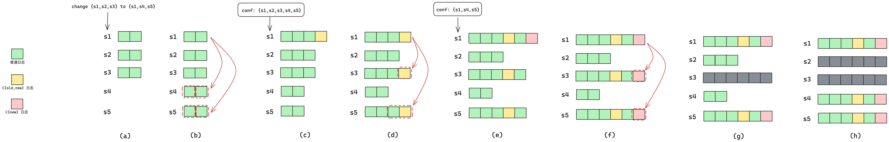

```
├── copysets
│   ├── 4294967299
│   │   ├── raft_log
│   │   │   ├── log_inprogress_00000000000626960091
│   │   │   └── log_meta
│   │   ├── raft_meta
│   │   │   └── raft_meta
│   │   ├── raft_snapshot
│   │   │   └── snapshot_00000000000626994427
│   │   │       ├── conf.epoch
│   │   │       ├── metadata
│   │   │       ├── __raft_snapshot_meta
│   │   │       └── rocksdb_checkpoint
│   │   │           ├── CURRENT
│   │   │           ├── MANIFEST-134121
│   │   │           └── OPTIONS-134131
│   │   └── storage_data
│   │       ├── 134122.log
│   │       ├── CURRENT
│   │       ├── IDENTITY
│   │       ├── LOCK
│   │       ├── LOG
│   │       ├── MANIFEST-134121
│   │       ├── OPTIONS-134127
│   │       └── OPTIONS-134131
│   ├── 4294967301
│   │   ├── raft_log
│   │   │   ├── log_inprogress_00000000000645260471
│   │   │   └── log_meta
│   │   ├── raft_meta
│   │   │   └── raft_meta
│   │   ├── raft_snapshot
│   │   │   └── snapshot_00000000000645296735
```





* 打快照后，怎么进行日志对比和截断啊？
* 日志里包含配置项？
* 打快照是阻塞的吗？// 这时候还有日志过来怎么办？关于 apply

* SST 怎么发送?
* 保存 2 次快照：这个是配置还是要在业务层实现。
