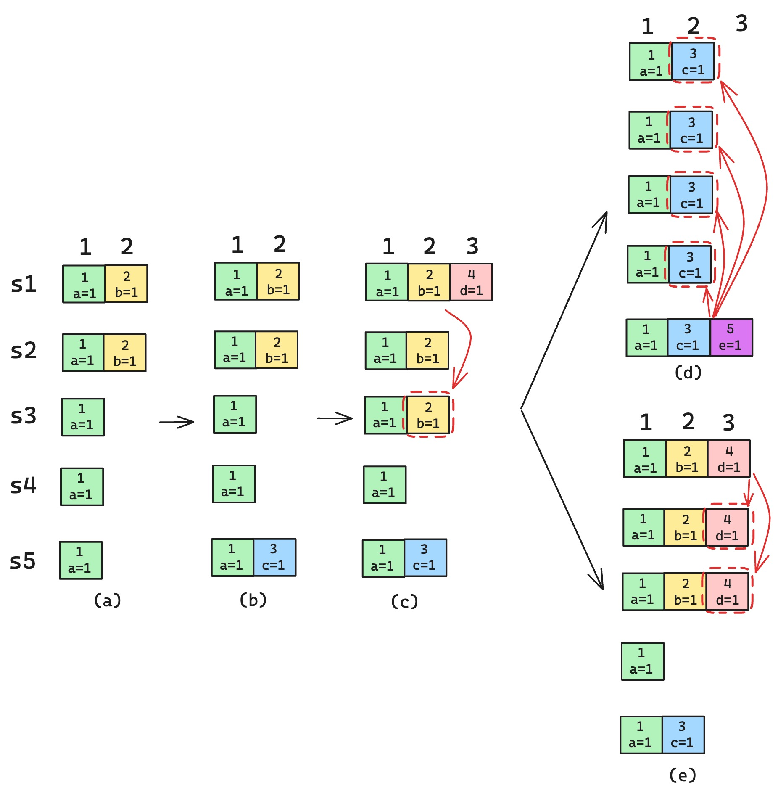
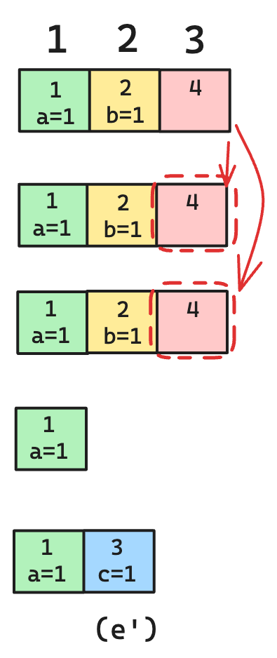

```

```

选主
---


这里的示例说明即使被提交的日志也有可能丢失，从业务层来说这会导致数据不一致

对于上一任期的日志，不依赖于已复制副本的数量作为提交的条件，也就是说对于上一任期的日志，即使它复制到了大多数节点，也不能提交它，让应用层执行 apply 操作。因为就是上图示例展示的那样，即使复制到了大多数节点，也有可能丢失，这样就会导致数据不一致。

`no-op`

而是依赖于一个新的条件：已提交的日志的任期必须大于当前节点的当前任期




配置变更
---

`joint consensus`

> 联合共识其实是 2 个配置（新、老配置）的并集

e.g.:
```
{1,2,3} -> {1,2,3,4,5} => {1,2,3,4,5}
{1,2,3,4,5} -> {1,2,3} => {1,2,3,4,5}
{1,2,3} -> {1,4,5} => {1,2,3,4,5}
```


参考
---

* [重读Raft论文中的集群成员变更算法（一）：理论篇](https://www.codedump.info/post/20220417-weekly-13/)
* [重读Raft论文中的集群成员变更算法（二）：实践篇](https://www.codedump.info/post/20220507-weekly-14/)

* [Raft 算法在分布式存储系统 Curve 中的实践](https://www.infoq.cn/article/qe5jidrfscczs9vwqea0)
* [braft: RAFT 介绍](https://github.com/baidu/braft/blob/master/docs/cn/raft_protocol.md)
* [读Paper -- Raft算法解读](https://liuyangming.tech/05-2019/raft.html)

* [braft 非官方实践指南](https://yriuns.github.io/2022/01/08/braft-in-action/)


* [TiDB 在 Raft 成员变更上踩的坑](https://zhuanlan.zhihu.com/p/342319702)

* [共识协议：raft 成员变更算法的关键细节](https://zhuanlan.zhihu.com/p/662410645)

* [Raft成员变更的工程实践](https://zhuanlan.zhihu.com/p/359206808)


* [Raft 必备的优化手段（一）：Leader Election 篇](https://zhuanlan.zhihu.com/p/639480562)
