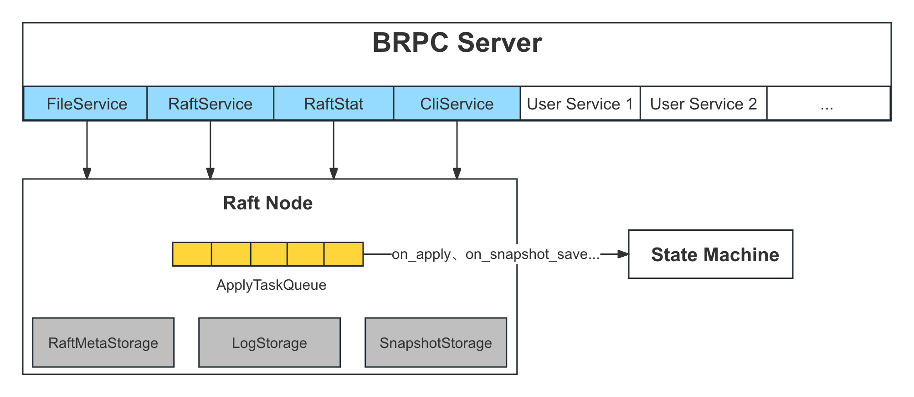

流程详解
===

流程概览
---

1. 在初始化节点前，用户需要创建 BRPC Server，并调用 `braft::add_service` 将 Raft 相关的 Service 加入到 BRPC Server 中，以及启动 BRPC Server
2. 用户创建 `braft::Node`，并调用 `Node::init` 接口进行初始化，此后初始化流程将由 braft 接管
3. 启动任务队列 `ApplyTaskQueue`
4. 遍历一遍日志，读取每条日志的 `Header` (24 字节)：
    * 4.1 若 `Header` 中的类型显示其为配置，则读取完整日志以获取配置
    * 4.2 构建索引（`logIndex` 到文件 `offset`），便于读取时快速定位
    * 4.3 获得当前节点的 `firstLogIndex` 和 `lastLogIndex`
    * 4.4 删除 `firstLogIndex` 之前的日志文件（快照遗留）
5. 加载快照：
    * 5.1 打开本地快照，并返回 `SnapshotReader`
    * 5.2 以 `SnapshotReader` 作为参数回调用户状态机 `on_snapshot_load` 来加载快照
    * 5.3 等待快照加载完成，将快照元数据中的节点配置设为当前节点配置
6. 将日志中的配置（步骤 4.1）或用户指定配置（`initial_conf`）设为当前节点配置
7. 读取 Raft 元数据文件，即 `term` 与 `votedFor`：
    * 7.1 将节点 `currentTerm` 设置为 `term`
    * 7.2 恢复投票状态 `votedFor`
8. 启动快照定时器
9. 将自身角色变为 `Follower`，并启动选举定时器
10. 将节点加入 Raft Group
11. 至此，初始化完成，节点将等待选举超时后发起选举

从上述流程可以看出，初始化工作可以大致分为以下 2 类：加载持久化存储来恢复节点状态（步骤 4、5、6、7），以及启动算法（步骤 8、9）。



Raft Service
---

当用户调用 `braft::add_service` 时，braft 会增加以下 4 个 Raft 相关的 Service 至 BRPC Server：

* `FileService`：用于 Follower 安装快照时，向 Leader 下载快照中的文件。
* `RaftService`：核心服务，用于处理 Raft 算法，如选举投票、复制日志、下发安装快照指令等。
* `RaftStat`：可观测性的一部分，用户可通过访问 `http://${your_server_endpoint}/raft_stat` 查看当前这个进程上 Node 的列表，以及每个 Node 的内部状态，详见[查看节点状态][节点状态]。
* `CliService`：允许用户通过发送 RPC 请求来控制节点，如配置变更、重置节点列表、转移 Leader；当然用户也可以通过 API 来控制节点。

[节点状态]: https://github.com/baidu/braft/blob/master/docs/cn/server.md#%E6%9F%A5%E7%9C%8B%E8%8A%82%E7%82%B9%E7%8A%B6%E6%80%81

ApplyTaskQueue
---

这是一个串行执行的任务队列，所有需要回调用户状态机的任务都会进入该队列，并被依次串行回调：

| 任务类型          | 说明                                                                                  | 回调函数                                                                       |
|:------------------|:--------------------------------------------------------------------------------------|:-------------------------------------------------------------------------------|
| `COMMITTED`       | 当已被提交的日志，需被应用到状态机时                                                  | 若日志类型为节点配置，则回调 `on_configuration_committed`，否则回调 `on_apply` |
| `SNAPSHOT_SAVE`   | 创建快照                                                                              | `on_snapshot_save`                                                             |
| `SNAPSHOT_LOAD`   | 加载快照                                                                              | `on_snapshot_load`                                                             |
| `LEADER_START`    | 当节点成为 Leader 时                                                                  | `on_leader_start`                                                              |
| `LEADER_STOP`     | 当节点不再是 Leader 时                                                                | `on_leader_stop`                                                               |
| `START_FOLLOWING` | 当 Follower 或 Candidate 开始跟随 Leader 时；此时其 `leader_id` 为 Leader 的 `PeerId` | `on_start_following`                                                           |
| `STOP_FOLLOWING`  | 当节点不再跟随 Leader；此时其 `leader_id` 将变为空                                    | `on_stop_following`                                                            |
| `ERROR`           | 当节点出现出错，此时任何 `apply` 任务都将失败                                         | `on_error`                                                                     |

持久化存储
---

Raft 拥有以下 3 个持久化存储，这些都需要在节点重启时进行重建：

* RaftMetaStorage：保存 Raft 算法自身的状态数据（即 `term` 与 `votedFor`）
* LogStorage：存储用户日志以及日志元数据（即 `firstLogIndex`）
* SnapshotStorage：存储用户快照以及元数据

比较容易忽略的是，其实节点的配置也是持久化的，其会保存在快照元数据（`SnapshotStorage`）和日志（`LogStorage`）中。

Raft 元数据 `StablePBMeta`：
```proto
message StablePBMeta {
    required int64 term = 1;
    required string votedfor = 2;
};
```

日志元数据 `LogPBMeta`：
```proto
message LogPBMeta {
    required int64 first_log_index = 1;
};
```

快照元数据 `LocalSnapshotPbMeta`：
```proto
message SnapshotMeta {
    required int64 last_included_index = 1;
    required int64 last_included_term = 2;
    repeated string peers = 3;
    repeated string old_peers = 4;
}

message LocalFileMeta {
    optional bytes user_meta   = 1;
    optional FileSource source = 2;
    optional string checksum   = 3;
}

message LocalSnapshotPbMeta {
    message File {
        required string name = 1;
        optional LocalFileMeta meta = 2;
    };
    optional SnapshotMeta meta = 1;
    repeated File files = 2;
}
```

日志回放
---

当节点刚启动时，其不会回放日志，因为 `commitIndex` 并没有持久化，所以节点在启动时并不知道自己的 `commitIndex`，也就不知道该 `apply` 哪些日志。只有当集群产生 Leader 后集群中的节点才开始回放日志，Leader 的 `commitIndex` 由其当选 Leader 后，提交一条本任期 `no-op` 日志后确定，其 `commitIndex` 就等于该 `no-op` 日志的 `index`，而 Follower 的 `commitIndex` 由 Leader 在之后的心跳或 `AppendEntries` 请求中告知，详见 [3.1 选主流程](/ch03/3.1/election.md)。

而对于快照来说，其代表的都是 `applied` 的数据，所以可以安全的加载。

节点配置
---

节点在启动时，其配置取决如下：

* 优先读取日志中的配置
* 若当前节点不存在日志或日志中没有配置，则读取快照元数据中保存的配置
* 若当前节点为新节点，既没有日志，也没有快照，则使用用户指定的 `initial_conf`
* 若用户没有指定配置，则该节点配置为空

从以上流程可以看出，只有当节点以空节点启动时，用户指定的配置才会生效。

<!--
TODO:
初始值
---

当一个节点启动时，其相关的初始值如下：

* `state`：FOLLOWER
* `currentTerm`：若有持久化，则为；否则为 1
* `votedFor`: null
* `firstLogIndex`：若有快照，则为快照；1
* `lastLogIndex`： 0
* `commitIndex`： 0
* `applyIndex`：若有快照，则为快照元数据中的 `lastIncludedIndex`；否则为 0
-->

具体实现
===

braft:add_service
---

用户需调用 `braft::add_service` 将 braft 相关 Service 加入到 BRPC Server 中：
```cpp
namespace braft {

// 全局共享的 NodeManager
#define global_node_manager NodeManager::GetInstance()

int add_service(brpc::Server* server,
                const butil::EndPoint& listen_addr) {
    ...
    return global_node_manager->add_service(server, listen_addr);
}

}  // namespace braft
```

`braft::add_service` 会调用 `NodeManager::add_service` 来增加以下 4 个 Service：
```cpp
int NodeManager::add_service(brpc::Server* server, const butil::EndPoint& listen_address) {
    ...

    // 1. FileService
    server->AddService(file_service(), brpc::SERVER_DOESNT_OWN_SERVICE);

    // 2. RaftService
    server->AddService(new RaftServiceImpl(listen_address), brpc::SERVER_OWNS_SERVICE);

    // 3. RaftStat
    server->AddService(new RaftStatImpl, brpc::SERVER_OWNS_SERVICE);

    // 4. CliService
    server->AddService(new CliServiceImpl, brpc::SERVER_OWNS_SERVICE);

    ...
}
```

braft::Node
---

此外，用户在启动节点前，需要构建一个 `braft::Node`：
* GroupId：一个字符串, 表示这个复制组的 `ID`
* PeerId：结构是一个 [EndPoint][EndPoint]，表示对外服务的端口，外加一个 Index (默认为 0）用于区分同一进程内的不同副本

[EndPoint]: https://github.com/brpc/brpc/blob/master/src/butil/endpoint.h

```cpp
Node(const GroupId& group_id, const PeerId& peer_id);
```

Node::init
---

最后，用户需调用 `Node::init` 来启动节点，在 `init` 函数中主要完成以下几项工作：

```cpp
int NodeImpl::init(const NodeOptions& options) {
    ...
    // (1) 初始化以下 4 个定时器（注意：此时并未启动定时器）
    //    `_election_timer`: 用于发起选举
    //    `_vote_timer`: 用于选举的投票计时，在该时间内未获得足够选票则宣告选举失败
    //    `_stepdown_timer`: 用于实现 Check Quorum，详见 <3.2 选主优化>
    //    `_snapshot_timer`: 用于创建快照
    CHECK_EQ(0, _election_timer.init(this, options.election_timeout_ms));
    CHECK_EQ(0, _vote_timer.init(this, options.election_timeout_ms + options.max_clock_drift_ms));
    CHECK_EQ(0, _stepdown_timer.init(this, options.election_timeout_ms));
    CHECK_EQ(0, _snapshot_timer.init(this, options.snapshot_interval_s * 1000));

    // (2) 启动 ApplyTaskQueue，该队列消费函数为 execute_applying_tasks
    if (bthread::execution_queue_start(&_apply_queue_id, NULL,
                                       execute_applying_tasks, this) != 0) {
        ...
        return -1;
    }

    _apply_queue = execution_queue_address(_apply_queue_id);


    // Create _fsm_caller first as log_manager needs it to report error
    _fsm_caller = new FSMCaller();

    // (3) 初始化 Leader Lease 与 Follower Lease，其用于实现 Lease Read
    // 详见 <3.2 选主优化>
    _leader_lease.init(options.election_timeout_ms);
    _follower_lease.init(options.election_timeout_ms, options.max_clock_drift_ms);

    // (4) 初始化日志存储，若有日志则开始遍历并读取日志的 Header 来构建索引
    //     详见 <4.3 日志存储>
    // log storage and log manager init
    if (init_log_storage() != 0) {
        ...
        return -1;
    }

    // (5) 初始化 FSMCaller，该类用于回调用户状态机，其管理着 applyIndex
    if (init_fsm_caller(LogId(0, 0)) != 0) {
        ...
        return -1;
    }

    // (6) 初始化 BallotBox，该类用于日志复制时的 Quorum 计数，其管理着 commitIndex
    // commitment manager init
    _ballot_box = new BallotBox();
    ...
    if (_ballot_box->init(ballot_box_options) != 0) {
        ...
        return -1;
    }

    // (7) 初始化快照存储，若有快照则开始加载快照，
    //     并在快照加载完成后，将快照元数据中的配置设为当前节点配置
    // snapshot storage init and load
    // NOTE: snapshot maybe discard entries when snapshot saved but not discard entries.
    //      init log storage before snapshot storage, snapshot storage will update configration
    if (init_snapshot_storage() != 0) {
        LOG(ERROR) << "node " << _group_id << ":" << _server_id
                   << " init_snapshot_storage failed";
        return -1;
    }

    // (8) 检查日志是否有丢失
    butil::Status st = _log_manager->check_consistency();
    if (!st.ok()) {
        ...
        return -1;
    }

    // (9) 若日志中有配置，则将其设为当前节点配置；否则使用用户指定的配置
    _conf.id = LogId();
    // if have log using conf in log, else using conf in options
    if (_log_manager->last_log_index() > 0) {
        _log_manager->check_and_set_configuration(&_conf);
    } else {
        _conf.conf = _options.initial_conf;
    }

    // (10) 初始化 RaftMetaStorage，若有数据则用来恢复当前节点状态，包括 `currentTerm` 与 `votedFor`
    // init meta and check term
    if (init_meta_storage() != 0) {
        ...
        return -1;
    }

    // first start, we can vote directly
    if (_current_term == 1 && _voted_id.is_empty()) {
        _follower_lease.reset();
    }

    // (11) 初始化 Replicator Group，Replicator 负责向 Follower 发送心跳、日志等
    // init replicator
    ReplicatorGroupOptions rg_options;
    rg_options.heartbeat_timeout_ms = heartbeat_timeout(_options.election_timeout_ms);
    ...
    rg_options.ballot_box = _ballot_box;
    rg_options.node = this;
    rg_options.snapshot_storage = _snapshot_executor
        ? _snapshot_executor->snapshot_storage()
        : NULL;
    _replicator_group.init(NodeId(_group_id, _server_id), rg_options);

    // (12) 将自身角色转变为 Follower
    // set state to follower
    _state = STATE_FOLLOWER;

    // (13) 启动快照定时器
    // start snapshot timer
    if (_snapshot_executor && _options.snapshot_interval_s > 0) {
        ...
        _snapshot_timer.start();
    }

    // (14) 若当前节点配置不为空，则：
    //      (1) 将自己变为 Follower
    //      (2) 启动选举定时器，即 _election_timer
    if (!_conf.empty()) {
        step_down(_current_term, false, butil::Status::OK());
    }

    // (15) 将当前 Node 加入到对应的 Raft Group 中
    // add node to NodeManager
    if (!global_node_manager->add(this)) {
        ...
        return -1;
    }

    // (16) 如果当前不存在节点变更（即 _conf.stable）并且当前配置中只有自己，则直接发起选举（跳过 PreVote）
    // Now the raft node is started , have to acquire the lock to avoid race
    // conditions
    std::unique_lock<raft_mutex_t> lck(_mutex);
    if (_conf.stable() && _conf.conf.size() == 1u
            && _conf.conf.contains(_server_id)) {
        // The group contains only this server which must be the LEADER, trigger
        // the timer immediately.
        elect_self(&lck);
    }

    return 0;
}
```