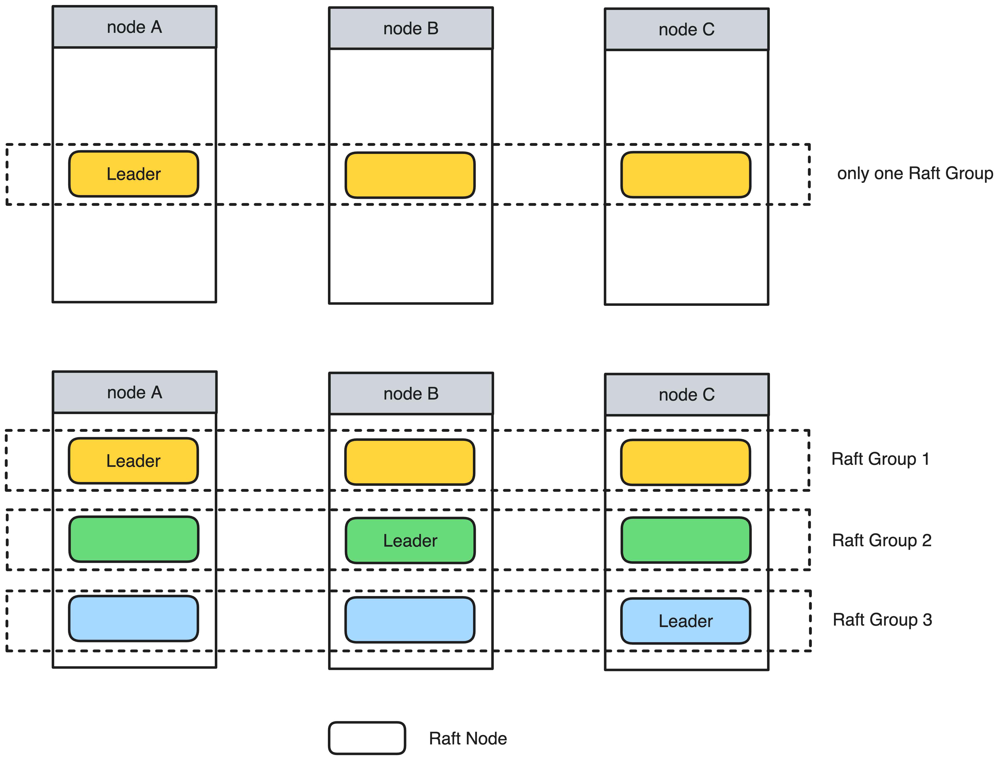

关于 Multi-Raft
===

考虑到单机的容量有限，一些追求扩展性的系统，往往会将数据进行分片（*sharding*），并将分片放置在不同的 *raft group*（复制组） 中，以达到高可用的目的。*sharding* + *multi-raft* 的架构比集中式数据存储 + 单 *raft group* 的架构在以下几个方面更具优势：

* **扩展性**：系统可以在需要的时候新增 *raft group*（每个 *group* 存放一定数量的分片），并将其运行在不同的磁盘或机器上，这样就具有很好的扩展性，理论上没有容量上限。
* **性能**：系统可以将 *Leader* 打散到各个节点，从而充分利用各机器的资源，以提升系统整体的吞吐。



> **各架构相关系统**
>
> *single-raft*: [etcd][etcd], [consul][consul]
>
> *multi-raft*: [CockroachDB][cockroachdb], [TiKV][tikv], [Curve][curve]

braft 中的 Multi-Raft
===

> 大概架构

心跳
--

随机写
---

[cockroachdb]: www.
[etcd]: www.
[consul]: www.
[tikv]: www
[curve]: www.baidu.com

具体实现
===

*braft* 允许一个进程内运行多个 *raft group*，多个 *group* 在逻辑上和物理上都是完全独立的。
* 当用户创建 *raft node* 需要指定 `GroupId` 和 `PeerId`，
* 并在调用 `node->init(...)` 时会加入到
* *raft node* 之间的所有 *RPC* 请求都会带上目标 `raft node` 的 `GroupId` 和 `PeerId`，*raft* 相关的 *service* 在收到这些请求会，会根据 `GroupId` 和 `PeerId` 找到对应的 *Node*，然后再调用 *Node* 的相关方法。

### (1) 指定
```cpp
Node(const GroupId& group_id, const PeerId& peer_id);
```

peerId 和 GroupId
如果要将三副本放在同一个进程内，需要将 index 作为 PeerId 的一部分，这样才能保证每个副本的唯一性。

### (2) 指定
```cpp
int NodeImpl::init(const NodeOptions& options)
    ...
    if (!global_node_manager->add(this)) {
        ...
        return -1;
    }
    ...
}

bool NodeManager::add(NodeImpl* node) {
}
```

### (3) *RPC* 请求

例子：追加日志请求

*proto*:
```proto
message AppendEntriesRequest {
    required string group_id = 1;  // GroupId
    required string server_id = 2;  // 源 node 的 PeerId
    required string peer_id = 3;  // 目标 node 的 PeerId
    required int64 term = 4;
    required int64 prev_log_term = 5;
    required int64 prev_log_index = 6;
    repeated EntryMeta entries = 7;
    required int64 committed_index = 8;
};

message AppendEntriesResponse {
    required int64 term = 1;
    required bool success = 2;
    optional int64 last_log_index = 3;
    optional bool readonly = 4;
};

service RaftService {
    ...
    rpc append_entries(AppendEntriesRequest) returns (AppendEntriesResponse);
    ...
};

```
*handler*:
```cpp
void RaftServiceImpl::append_entries(google::protobuf::RpcController* cntl_base,
                            const AppendEntriesRequest* request,
                            AppendEntriesResponse* response,
                            google::protobuf::Closure* done) {
    ...
    PeerId peer_id;
    if (0 != peer_id.parse(request->peer_id())) {
        cntl->SetFailed(EINVAL, "peer_id invalid");
        return;
    }

    scoped_refptr<NodeImpl> node_ptr =
                        global_node_manager->get(request->group_id(), peer_id);
    NodeImpl* node = node_ptr.get();
    if (!node) {
        cntl->SetFailed(ENOENT, "peer_id not exist");
        return;
    }

    return node->handle_append_entries_request(cntl, request, response,
                                               done_guard.release());
}
```

参考
===
* [Scaling Raft](https://www.cockroachlabs.com/blog/scaling-raft/)
* [基于 Raft 构建弹性伸缩的存储系统的一些实践](https://cn.pingcap.com/blog/building-distributed-db-with-raft/)