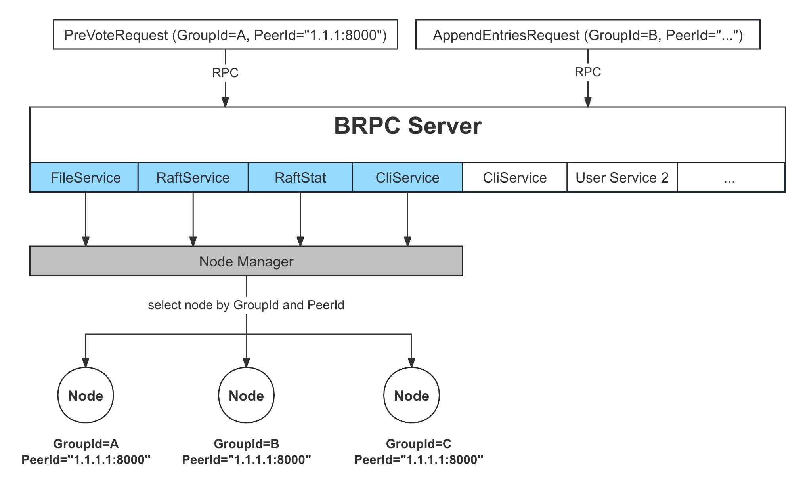

关于 Multi-Raft
===

考虑到单机的容量有限，一些追求扩展性的系统，往往会将数据进行分片（Sharding），并将分片放置在不同的 Raft Group（复制组） 中，以达到每个分片都高可用的目的。Sharding + Multi-Raft 的架构比 Single-Raft 的架构在以下几个方面更具优势：

* 扩展性：系统可以在需要的时候新增 Raft Group 用来存放分片，并将其运行在不同的磁盘或机器上，这样就具有很好的扩展性，理论上没有容量上限。
* 性能：由于日志在 Leader 上都是被串行 apply，而 Multi-Raft 提供多个 Leader，可以提升整体的并发；此外，系统可以将 Leader 打散到各个节点，充分利用各机器的资源，提升整体吞吐。

> **各架构相关系统**
>
> single-raft: [etcd][etcd], [consul][consul]
>
> multi-raft: [CockroachDB][cockroachdb], [TiKV][tikv], [Curve][curve]


[cockroachdb]: https://github.com/cockroachdb/cockroach
[etcd]: https://github.com/etcd-io/etcd
[consul]: https://github.com/hashicorp/consul
[tikv]: https://github.com/tikv/tikv
[curve]: https://github.com/opencurve/curve

braft 中的 Multi-Raft
===

braft 允许一个进程管理多个 Raft Group，每个 Group 在逻辑上和物理上都是完全独立的，其实现如下：

* 用户创建 `braft::Node` 时需要指定 Node 的 `GroupId` 和 `PeerId`
* 在调用 `Node::init` 进行初始化时会将该 `Node` 加到全局的 `NodeManager` 中
* 所有的 RPC 请求中都会携带目标 Node 的 `GroupId` 和 `PeerId`
* `NodeManager` 根据请求中的 `GroupId` 和 `PeerId` 找到对应的 Node，然后再调用 Node 的相关方法处理请求。



心跳
--

由于每个 Group 的 Leader 都需要给其 Follower 发送心跳，而心跳间隔一般都比较小（默认为 100 毫秒），所以如果单台机器上运行大量的 Group，会产生大量的心跳请求。

我们计算 3 副本构成的个 Group 在 1 秒内产生的心跳数：

```cpp
2 * 1 * (1000 / 100) = 20
Follower 数 * Group 数 * 1 秒内心跳次数
```

随着 Group 和副本数的增加，心跳数会呈指倍数增长，比如运行 1 万个 3 副本的 Group，1 秒内将会产生 20 万个心跳。为此，像 [CockroachDB][cockroachdb] 中 MultiRaft 实现会将每个节点之间的心跳进行合并，详见 [Scaling Raft][scaling-raft]。

> 需要注意的是，braft 开源版本还未实现心跳合并以及文档中提到的[静默模式](https://github.com/baidu/braft/blob/master/docs/cn/raft_protocol.md#%E5%8A%9F%E8%83%BD%E5%AE%8C%E5%96%84)。


[scaling-raft]: https://www.cockroachlabs.com/blog/scaling-raft/

随机写
---
虽然每个 Node 的日志都是顺序追加写，但是由于其都是独立的存储目录，所以当多个 Node 配置的存储目录位于同一块盘时，其对于该盘来说就相当于随机写。当然，braft 允许用户接管日志存储，用户可以自己实现顺序写逻辑。


具体实现
===

用户指定 Node 信息
---

```cpp
Node(const GroupId& group_id, const PeerId& peer_id);
```

```cpp
typedef std::string GroupId;

struct PeerId {
    butil::EndPoint addr; // ip+port.
    int idx; // idx in same addr, default 0
    Role role = REPLICA;
    ...
    explicit PeerId(butil::EndPoint addr_) : addr(addr_), idx(0), role(REPLICA)  {}
    PeerId(butil::EndPoint addr_, int idx_) : addr(addr_), idx(idx_), role(REPLICA) {}
    ...
}
```

* GroupId: 一个字符串, 表示这个复制组的 `ID`
* PeerId：结构是一个 [EndPoint][EndPoint]，表示对外服务的端口，外加一个 Index (默认为 0）用于区分同一进程内的不同副本

[EndPoint]: https://github.com/brpc/brpc/blob/master/src/butil/endpoint.h

<!--
TODO:
> PeerId 中 Index 的作用是让同一 Raft Group 中不同的副本能运行在同一个进程内。通常我们出于故障域考虑是会将不同的副本运行在不同的机器上，所以不用考虑这个 Index，使用默认值 0 即可。但是如果特别场景下需要运行在一个进程下，由于各副本的 `GroupId` 和 `Endpoint` 都相同，所以需要通过 Index 来区分。 // 存疑：https://github.com/baidu/braft/issues/205
-->

添加至 NodeManager
---

用户在调用 `Node::init` 初始化节点时，会将该节点加入全局的 `NodeManager` 中：

```cpp
int Node::init(const NodeOptions& options) {
    return _impl->init(options);
}

#define global_node_manager NodeManager::GetInstance()
int NodeImpl::init(const NodeOptions& options)
    ...
    if (!global_node_manager->add(this)) {
        ...
        return -1;
    }
    ...
}

// 将当前节点加入到全局的 map 中，key 为 Node 的 <GroupId, PeerId>，value 为 Node
bool NodeManager::add(NodeImpl* node) {
    // 将 node 将入到 _nodes 的 map 中
}
```

RPC 指定 Node 信息
---

braft 中的 RPC 请求中都会携带目标 Node 的 `GroupId` 和 `PeerId`：

```proto
//  PreVote、RequestVote
message RequestVoteRequest {
    required string group_id = 1;   // GroupId
    required string server_id = 2;  // 源 node 的 PeerId
    required string peer_id = 3;    // 目标 node 的 PeerId
    ...
};

// 探测 nextIndex、心跳、复制日志
message AppendEntriesRequest {
    required string group_id = 1;
    required string server_id = 2;
    required string peer_id = 3;
    ...
};

// 安装快照
message InstallSnapshotRequest {
    required string group_id = 1;
    required string server_id = 2;
    required string peer_id = 3;
    ...
};

// 唤醒节点进行立马选举，用于转移 Leader
message TimeoutNowRequest {
    required string group_id = 1;
    required string server_id = 2;
    required string peer_id = 3;
    ...
}

service RaftService {
    rpc pre_vote(RequestVoteRequest) returns (RequestVoteResponse);
    rpc request_vote(RequestVoteRequest) returns (RequestVoteResponse);
    rpc append_entries(AppendEntriesRequest) returns (AppendEntriesResponse);
    rpc install_snapshot(InstallSnapshotRequest) returns (InstallSnapshotResponse);
    rpc timeout_now(TimeoutNowRequest) returns (TimeoutNowResponse);
};
```

选择对应 Node
---

`RaftService` 在收到 RPC 请求后，会让 `NodeManager` 根据请求中的 `GroupId` 和 `PeerId` 找到对应的 Node，然后再调用 Node 的相关方法处理请求：

```cpp
void RaftServiceImpl::append_entries(google::protobuf::RpcController* cntl_base,
                            const AppendEntriesRequest* request,
                            AppendEntriesResponse* response,
                            google::protobuf::Closure* done) {
    ...
    // (1) 校验 PeerId 是否合法
    PeerId peer_id;
    if (0 != peer_id.parse(request->peer_id())) {
        cntl->SetFailed(EINVAL, "peer_id invalid");
        return;
    }

    // (2) 根据请求中的 GroupId 和 PeerId 找到对应的 Node
    scoped_refptr<NodeImpl> node_ptr =
                        global_node_manager->get(request->group_id(), peer_id);
    NodeImpl* node = node_ptr.get();
    if (!node) {
        cntl->SetFailed(ENOENT, "peer_id not exist");
        return;
    }

    // (3) 调用 Node 的相关方法
    return node->handle_append_entries_request(cntl, request, response,
                                               done_guard.release());
}
```

参考
===
* [Scaling Raft](https://www.cockroachlabs.com/blog/scaling-raft/)
* [TiKV 源码解析系列 – multi-raft 设计与实现](https://cn.pingcap.com/blog/the-design-and-implementation-of-multi-raft/)
* [基于 Raft 构建弹性伸缩的存储系统的一些实践](https://cn.pingcap.com/blog/building-distributed-db-with-raft/)