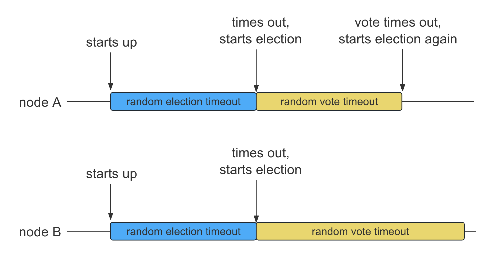
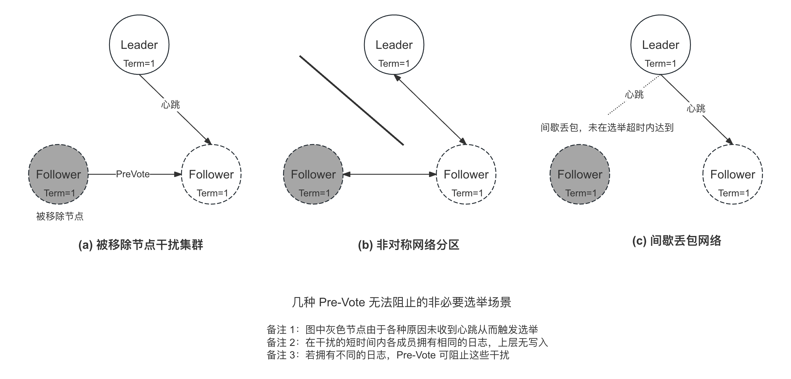
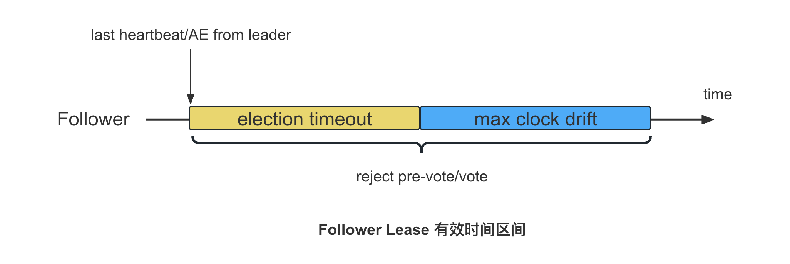
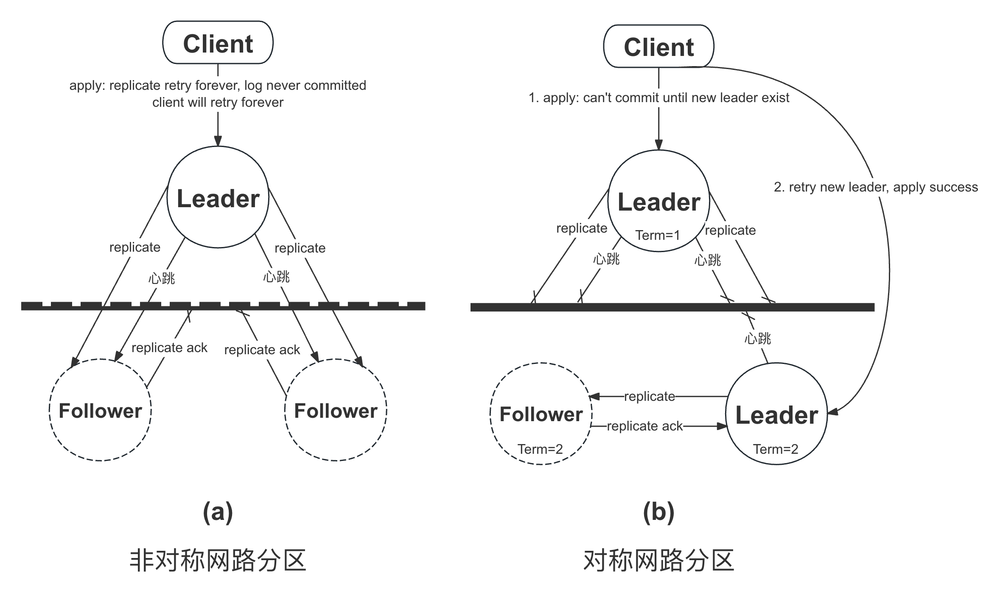
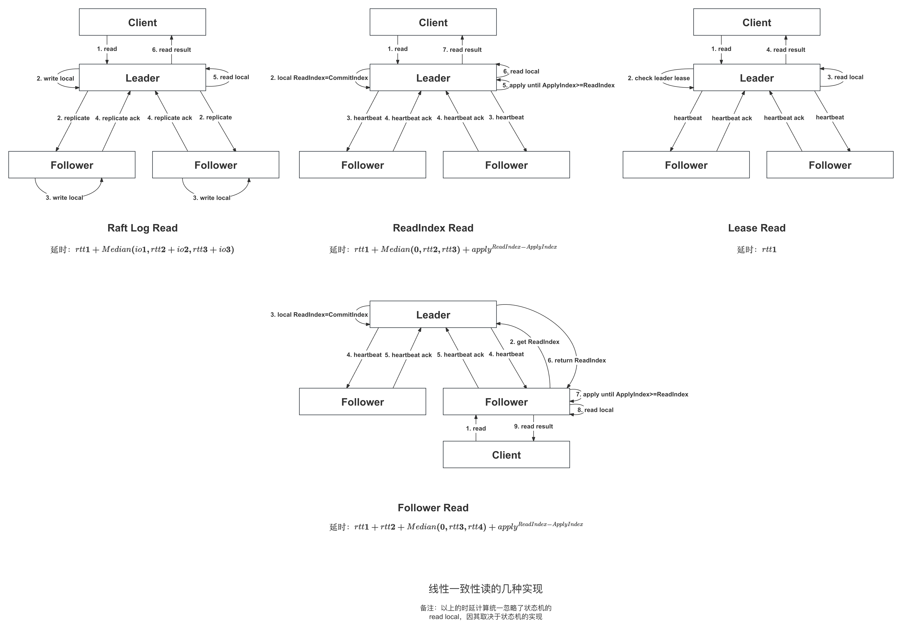
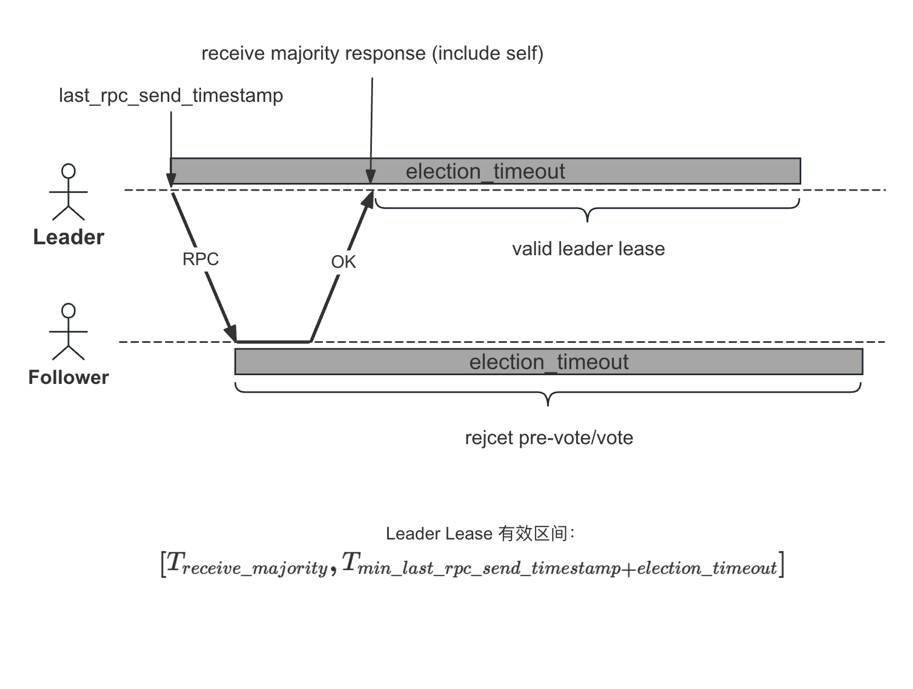

概览
===

*braft* 在实现选举的时候做了一些优化，这些优化点归纳起来主要为了实现以下几个目的：
* **快**: 减少选举时间，让集群尽快产生 *Leader*（e.g. 选举时间随机化、*Wakeup Candidate*）
* **稳定**：当集群中有 *Leader* 时，尽可能保持稳定，减少没必要的选主（e.g. Pre-Vote、Follower Lease）
* **分区容忍**：（e.g. Check Quorum、Leader Lease）

> 具体来说，Follower 处于分区一侧

对于基于 *braft* 实现的系统来说，拥有这些优化可以提升系统整体的可用性。

| 优化项         | 说明                    |
|:---------------|:------------------------|
| 选举超时随机化 | 避免选举风暴            |
| 检查 qurom     | 避免脑裂                |
| leader lease   | 避免 leader 还是 leader |


优化 1：超时时间随机化
===

瓜分选票
---

如果多个成员在等待 `election_timeout` 后同时触发选举，可能会造成选票被瓜分，导致无法选出 Leader，从而需要触发下一轮选举。为此，可以将 `election_timeout` 随机化，减少选票被瓜分的可能性。但是在极端情况下，多个成员可能拥有相同的 `election_timeout`，仍会造成选票被瓜分，为此 braft 将 `vote_timeout` 也进行了随机化。双层的随机化可以很大程度降低选票被瓜分的可能性。

> **vote_timeout:**
>
> 如果成员在该超时时间内没有得到足够多的选票，将变为 Follower 并重新发起选举，无需等待 `election_timeout`



具体实现
---

随机函数：
```cpp
// FLAGS_raft_max_election_delay_ms 默认为 1000
inline int random_timeout(int timeout_ms) {
    int32_t delta = std::min(timeout_ms, FLAGS_raft_max_election_delay_ms);
    return butil::fast_rand_in(timeout_ms, timeout_ms + delta);
}
```

`ElectionTimer` 相关逻辑:

```cpp
// timeout_ms: 1000
// 产生的随机时间为：[1000,2000]
int ElectionTimer::adjust_timeout_ms(int timeout_ms) {
    return random_timeout(timeout_ms);
}

void ElectionTimer::run() {
    _node->handle_election_timeout();
}

// Timer 超时后的处理函数
void NodeImpl::handle_election_timeout() {
    ...
    return pre_vote(&lck, triggered);
}
```

`VoteTimer` 相关逻辑:
```cpp
// timeout_ms: 2000
// 产生的随机时间为：[2000,3000]
int VoteTimer::adjust_timeout_ms(int timeout_ms) {
    return random_timeout(timeout_ms);
}

void VoteTimer::run() {
    _node->handle_vote_timeout();
}

// Timer 超时后的处理函数
void NodeImpl::handle_vote_timeout() {
    ...
    // 该参数作用可参见 issue: https://github.com/baidu/braft/issues/86
    if (FLAGS_raft_step_down_when_vote_timedout) {  // 默认为 true
        ...
        step_down(_current_term, false, status);  // 先降为 Follower
        pre_vote(&lck, false);  // 再进行 Pre-Vote
    }
    ...
}
```

优化 2：Wakeup Candidate
===

Leader 正常退出
---

当一个 Leader 正常退出时，它会选择一个日志最长的 Follower，向其发送 `TimeoutNowRequest`，而收到该请求的 Follower 无需等待超时，会立马变为 Candidate 进行选举（无需 `Pre-Vote`）。这样可以缩短集群中没有 Leader 的时间，增加系统的可用性。特别地，在日常运维中，升级服务版本需要暂停 Leader 所在服务时，该优化可以在无形中帮助我们。

具体实现
---

Leader 服务正常退出：

```cpp
void NodeImpl::shutdown(Closure* done) {  // 服务正常退出会调用 shutdown
    ...
    step_down(_current_term, _state == STATE_LEADER, status);
    ...
}

void NodeImpl::step_down(const int64_t term, bool wakeup_a_candidate,
                         const butil::Status& status) {
    ...
    // (1) 先转变为 Follower
    _state = STATE_FOLLOWER;
    ...
    // (2) 再选择一个日志最长的 Follower 作为 Candidate，向其发送 TimeoutNowRequest
    if (wakeup_a_candidate) {
        _replicator_group.stop_all_and_find_the_next_candidate(
                                            &_waking_candidate, _conf);
        Replicator::send_timeout_now_and_stop(
                _waking_candidate, _options.election_timeout_ms);
    }
    ...
}
```

Follower 处理 `TimeoutNowRequest`：

```cpp
void NodeImpl::handle_timeout_now_request(brpc::Controller* controller,
                                          const TimeoutNowRequest* request,
                                          TimeoutNowResponse* response,
                                          google::protobuf::Closure* done) {
    ...
    response->set_success(true);
    elect_self(...);  // 调用 elect_self 函数转变为 Candidate，并发起选举
    ...
}
```

优化 3：Pre-Vote
===

Follower 位于对称网络分区
---


我们考虑上图中在网络分区中发生的一种现象：

* **(a)**: 正常的集群：各节点都能收到 Leader 的心跳
* **(b)**: 发生网络分区后，由于有一个节点收不到 Leader 的心跳，在等待 `election_timeout` 后触发选举，进行选举时会将角色转变为 Candidate，并将自身的 Term 加一广播 `RequestVoteRequest`；然而由于收不到足够的选票，在 `vote_timeout` 后宣布选举失败从而触发新一轮的选举；不断的选举致使该节点的 Term 不断增大
* **(c)**: 当网络恢复后，Leader 得知该节点的 Term 比其大，将会自动降为 Follower，从而触发了重新选主。值得一提的是，Leader 有多种渠道得知该节点的 Term 比其大，因为节点之间所有的 RPC 请求与响应都会带上自身的 Term，所以可能是该节点选举发出的 `RequestVoteRequest`，也可能是其心跳的响应，这取决于第一个发往 Leader 的 RPC 包。

从上面可以看到，当节点重新回归到集群时，由于其 Term 比 Leader 大，致使 Leader 降为 Follower，从而触发重新选主。而本质原因是，一个不可能赢得选举的节点不断增加了 Term，
其实这次选举时没必要的，

为了解决这一问题，raft 在正式请求投票前引入了 `Pre-Vote` 阶段，Term 不会增加，节点需要在 `Pre-Vote` 获得足够多的选票才能正式进入 `Vote` 阶段。
e
节点在收到 *Pre-Vote* 和 *Vote* 请求后，判断是否要投赞成票的逻辑是一样的，需要同时满足以下 2 个条件：

* **Term**: `request.term >= currentTerm`
* **Log**: `request.lastLogTerm > lastLogTerm` 或者 `request.lastLogTerm == lastLogTerm && request.lastLogIndex >= lastLogIndex`

唯一的区别在于：

* *Vote* 会记录当前任期，确保在同一个任期内只会给一个候选人投票，而 `Pre-Vote` 则可以同时投票给多个候选人，只要其满足以上 2 个条件
* `step_down`

从差异可以看出，*Pre-Vote* 更像是一次预检，检测其连通性和合法性，并没有实际的动作。

具体实现
---

```cpp
```


优化 4：Follower Lease
===

Follower 位于非对称网络分区
---

这里讲一下 3 种情况





实现
---

```cpp
```

优化 5：Check Quorum
===

Leader 位于网络分区
---



具体实现
---

```cpp
void NodeImpl::become_leader() {
}
```

```cpp
void StepdownTimer::run() {
    _node->handle_stepdown_timeout();
}

void NodeImpl::handle_stepdown_timeout() {
    BAIDU_SCOPED_LOCK(_mutex);

    // check state
    if (_state > STATE_TRANSFERRING) {
        BRAFT_VLOG << "node " << _group_id << ":" << _server_id
            << " term " << _current_term << " stop stepdown_timer"
            << " state is " << state2str(_state);
        return;
    }
    check_witness(_conf.conf);
    int64_t now = butil::monotonic_time_ms();
    check_dead_nodes(_conf.conf, now);
    if (!_conf.old_conf.empty()) {
        check_dead_nodes(_conf.old_conf, now);
    }
}
```

```cpp
void NodeImpl::check_dead_nodes(const Configuration& conf, int64_t now_ms) {
    std::vector<PeerId> peers;
    conf.list_peers(&peers);
    size_t alive_count = 0;
    Configuration dead_nodes;  // for easily print
    for (size_t i = 0; i < peers.size(); i++) {
        if (peers[i] == _server_id) {
            ++alive_count;
            continue;
        }

        if (now_ms - _replicator_group.last_rpc_send_timestamp(peers[i])
                <= _options.election_timeout_ms) {
            ++alive_count;
            continue;
        }
        dead_nodes.add_peer(peers[i]);
    }
    if (alive_count >= peers.size() / 2 + 1) {
        return;
    }
    LOG(WARNING) << "node " << node_id()
                 << " term " << _current_term
                 << " steps down when alive nodes don't satisfy quorum"
                    " dead_nodes: " << dead_nodes
                 << " conf: " << conf;
    butil::Status status;
    status.set_error(ERAFTTIMEDOUT, "Majority of the group dies");
    step_down(_current_term, false, status);
}

```

优化 6：Leader Lease
===

线性一致性读
---



为了实现线性一致性读，

| 方案 | 时延 | 优点 | braft 是否实现 |
| :--- | :--- | :--- | :--- |
| Raft Log Read | | | |

> 补充下各种读的区别和时延

取最早违背承诺的节点

Lease Read
---



Leader Lease 的实现原理是基于一个共同承诺，超半数节点共同承诺在收到 Leader RPC 之后的 `election_timeout` 时间内不再参与投票，这保证了在这段时间内集群内不会产生新的 Leader。

时钟漂移

具体实现
---

```cpp
```


其他未实现优化点
===

优先级选举
---

总结
===

参考
===

* [分布式一致性 Raft 与 JRaft](https://www.sofastack.tech/projects/sofa-jraft/consistency-raft-jraft/)
* [关于 DDIA 上对 Raft 协议的这种极端场景的描述，要如何理解？](https://www.zhihu.com/question/483967518)
* [Symmetric network partitioning](https://github.com/baidu/braft/blob/master/docs/cn/raft_protocol.md#symmetric-network-partitioning)
* [Raft在网络分区时leader选举的一个疑问？](https://www.zhihu.com/question/302761390)
* [Raft 必备的优化手段（一）：Leader Election 篇](https://zhuanlan.zhihu.com/p/639480562)
* [Raft 笔记(四) – Leader election](https://youjiali1995.github.io/raft/etcd-raft-leader-election/)
* [raft: implement leader steps down #3866](https://github.com/etcd-io/etcd/issues/3866)
* [共识协议优质资料汇总（paxos，raft）](https://zhuanlan.zhihu.com/p/628681520)
* [关于leader_lease续租时机](https://github.com/baidu/braft/issues/202)
* [TiKV 功能介绍 – Lease Read](https://cn.pingcap.com/blog//lease-read/)
* [CAP理论中的P到底是个什么意思？](https://www.zhihu.com/question/54105974)