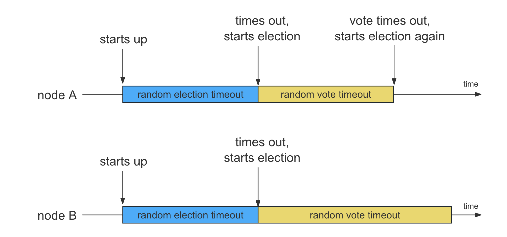
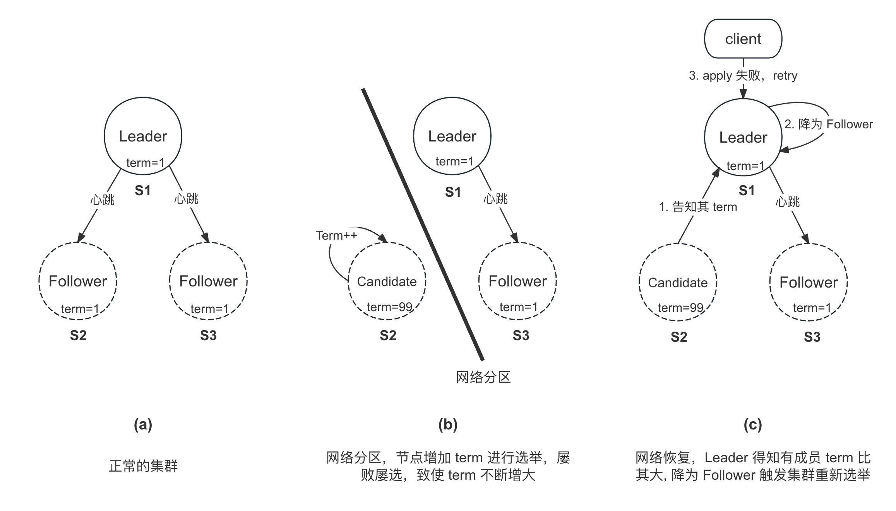
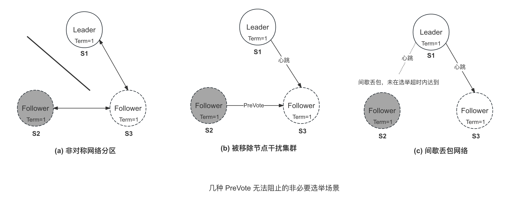
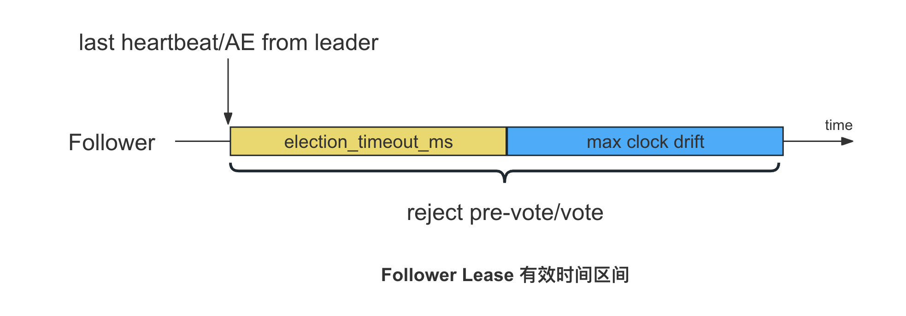
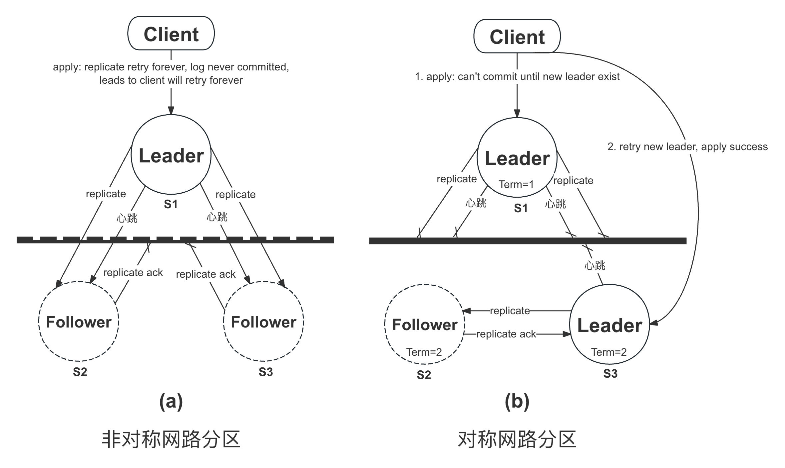
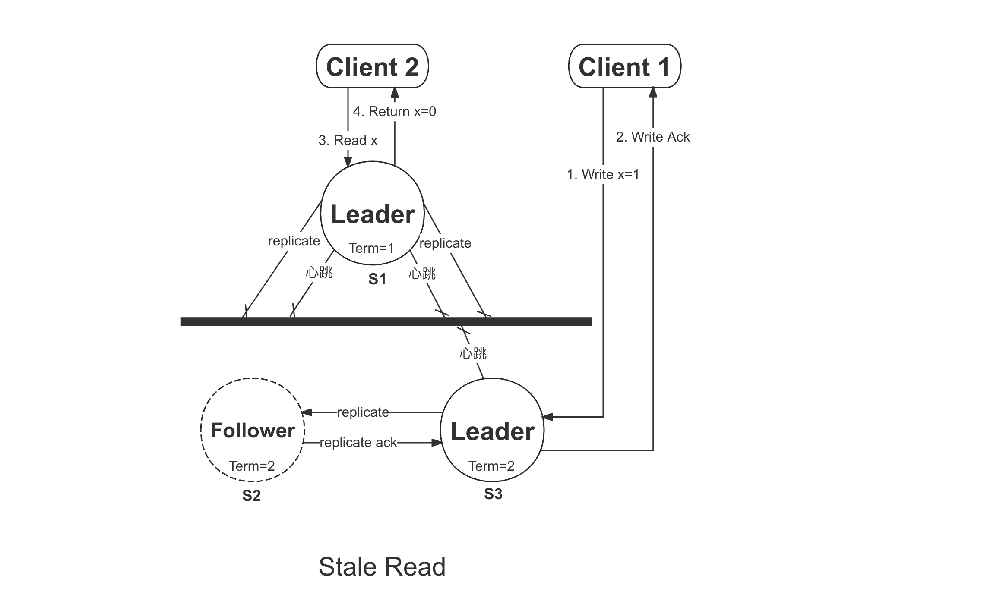
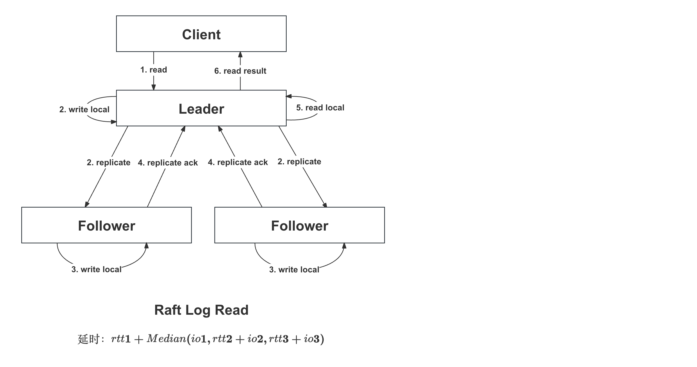
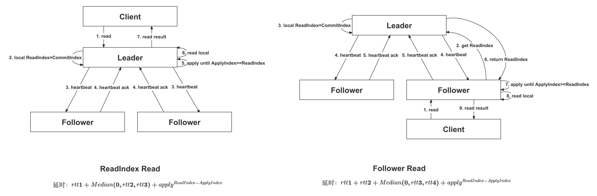
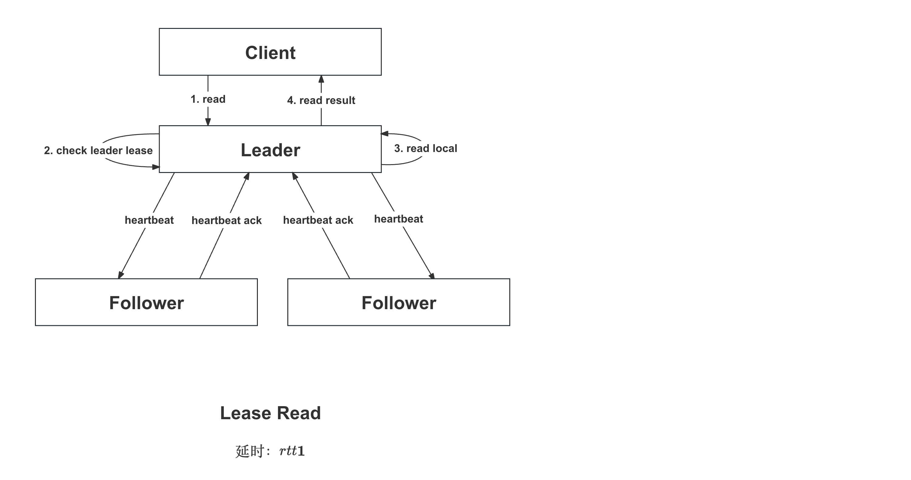
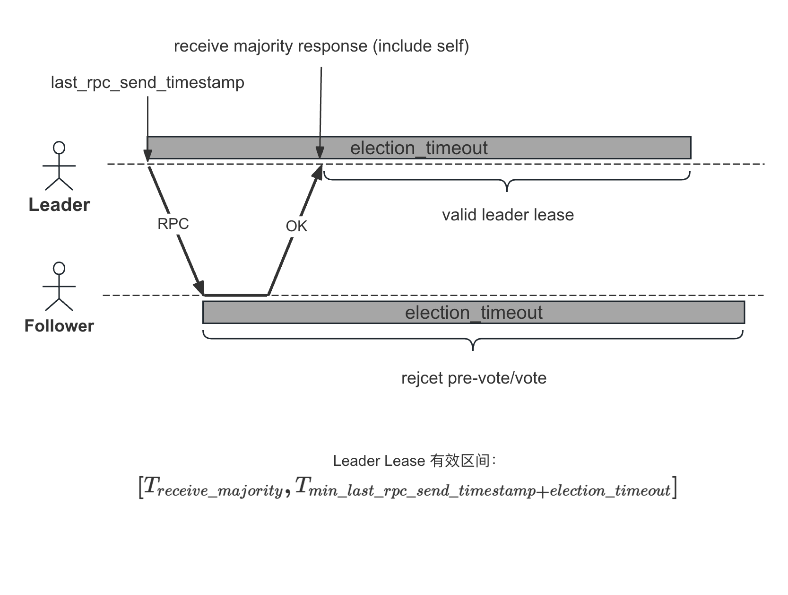

概览
===

braft 在实现 Leader 选举的时候做了一些优化，这些优化点归纳起来主要为了实现以下几个目的：

* **快速**：减少选举时间，让集群尽快产生 Leader（如超时时间随机化、Wakeup Candidate）
* **稳定**：当集群中有 Leader 时，尽可能保持稳定，减少没必要的选主（如 PreVote、Follower Lease）
* **分区问题**：解决出现分区时造成的各种问题（如 PreVote、Follower Lease、Check Quorum、Leader Lease）

具体来说，braft 对于分区场景做了很详细的优化：

| 分区场景                        | 造成问题                                                                       | 优化方案                   |
|:--------------------------------|:-------------------------------------------------------------------------------|:---------------------------|
| Follower 被隔离于对称网络分区   | `term` 增加，重新加入集群会打断 Leader，造成没必要的选举                       | PreVote                    |
| Follower 被隔离于非对称网络分区 | Follower 选举成功，推高集群其他成员的 `term`，间接打断 Leader，造成没必要选举  | Follower Lease             |
| Leader 被隔离于对称网络分区     | 集群会产生多个 Leader，客户端需要重试；可能会产生 `Stale Read`，破坏线性一致性 | Check Quorum、Leader Lease |
| Leader 被隔离于非对称网络分区   | Leader 永远无法写入，也不会产生新 Leader，客户端会不断重试                     | Check Quorum               |

优化 1：超时时间随机化
===

瓜分选票
---

如果多个成员在等待 `election_timeout_ms` 后同时触发选举，可能会造成选票被瓜分，导致无法选出 Leader，从而需要触发下一轮选举。为此，可以将 `election_timeout_ms` 随机化，减少选票被瓜分的可能性。但是在极端情况下，多个成员可能拥有相同的 `election_timeout_ms`，仍会造成选票被瓜分，为此 braft 将 `vote_timeout_ms` 也进行了随机化。双层的随机化可以很大程度降低选票被瓜分的可能性。

> **vote_timeout_ms:**
>
> 如果成员在该超时时间内没有得到足够多的选票，将变为 Follower 并重新发起选举，无需等待 `election_timeout_ms`



具体实现
---

随机函数：
```cpp
// FLAGS_raft_max_election_delay_ms 默认为 1000
inline int random_timeout(int timeout_ms) {
    int32_t delta = std::min(timeout_ms, FLAGS_raft_max_election_delay_ms);
    return butil::fast_rand_in(timeout_ms, timeout_ms + delta);
}
```

`ElectionTimer` 相关逻辑:

```cpp
// timeout_ms：1000
// 产生的随机时间为：[1000,2000]
int ElectionTimer::adjust_timeout_ms(int timeout_ms) {
    return random_timeout(timeout_ms);
}

void ElectionTimer::run() {
    _node->handle_election_timeout();
}

// Timer 超时后的处理函数
void NodeImpl::handle_election_timeout() {
    ...
    return pre_vote(&lck, triggered);
}
```

`VoteTimer` 相关逻辑:
```cpp
// timeout_ms：2000
// 产生的随机时间为：[2000,3000]
int VoteTimer::adjust_timeout_ms(int timeout_ms) {
    return random_timeout(timeout_ms);
}

void VoteTimer::run() {
    _node->handle_vote_timeout();
}

// Timer 超时后的处理函数
void NodeImpl::handle_vote_timeout() {
    ...
    // 该参数作用可参见 issue: https://github.com/baidu/braft/issues/86
    if (FLAGS_raft_step_down_when_vote_timedout) {  // 默认为 true
        ...
        step_down(_current_term, false, status);  // 先降为 Follower
        pre_vote(&lck, false);  // 再进行 PreVote
    }
    ...
}
```

优化 2：Wakeup Candidate
===

Leader 正常退出
---

当一个 Leader 正常退出时，它会选择一个日志最长的 Follower，向其发送 `TimeoutNow` 请求，而收到该请求的 Follower 无需等待超时，会立马变为 Candidate 进行选举（无需 `PreVote`）。这样可以缩短集群中没有 Leader 的时间，增加系统的可用性。特别地，在日常运维中，升级服务版本需要暂停 Leader 所在服务时，该优化可以在无形中帮助我们。

具体实现
---

Leader 服务正常退出，会向 Follower 发送 `TimeoutNow` 请求：

```cpp
void NodeImpl::shutdown(Closure* done) {  // 服务正常退出会调用 shutdown
    ...
    step_down(_current_term, _state == STATE_LEADER, status);
    ...
}

void NodeImpl::step_down(const int64_t term, bool wakeup_a_candidate,
                         const butil::Status& status) {
    ...
    // (1) 调用状态机的 `on_leader_stop`
    if (_state == STATE_LEADER) {
        _fsm_caller->on_leader_stop(status);
    }
    ...
    // (2) 转变为 Follower
    _state = STATE_FOLLOWER;
    ...
    // (3) 选择一个日志最长的 Follower 作为 Candidate，向其发送 TimeoutNowRequest
    if (wakeup_a_candidate) {
        _replicator_group.stop_all_and_find_the_next_candidate(
                                            &_waking_candidate, _conf);
        Replicator::send_timeout_now_and_stop(
                _waking_candidate, _options.election_timeout_ms);
    }
    ...
}
```

Follower 收到 `TimeoutNow` 请求，会调用 `handle_timeout_now_request` 进行处理：

```cpp
void NodeImpl::handle_timeout_now_request(brpc::Controller* controller,
                                          const TimeoutNowRequest* request,
                                          TimeoutNowResponse* response,
                                          google::protobuf::Closure* done) {
    ...
    response->set_success(true);
    elect_self(...);  // 调用 elect_self 函数转变为 Candidate，并发起选举
    ...
}
```

优化 3：PreVote
===

对称网络分区
---



我们考虑上图中在网络分区中发生的一种现象：

* (a)：节点 `S1` 被选为 `term 1` 的 Leader，正常向 `S2,S3` 发送心跳
* (b)：发生网络分区后，节点 `S2` 收不到 Leader `S1` 的心跳，在等待 `election_timeout_ms` 后触发选举，进行选举时会将角色转变为 Candidate，并将自身的 `term` 加一后广播 `RequestVote` 请求；然而由于分区收不到足够的选票，在 `vote_timeout_ms` 后宣布选举失败从而触发新一轮的选举；不断的选举致使 `S2` 的 `term` 不断增大
* (c)：当网络恢复后，Leader `S1` 得知 `S2` 的 `term` 比其大，将会自动降为 Follower，从而触发了重新选主。值得一提的是，Leader `S1` 有多种渠道得知 `S2` 的 `term` 比其大，因为节点之间所有的 RPC 请求与响应都会带上自身的 `term`，所以可能是 `S2` 选举发出的 `RequestVote` 请求，也可能是 `S2` 响应 `S1` 的心跳请求，这取决于第一个发往 Leader `S1` 的 RPC 包。

从上面可以看到，当节点 `S2` 重新回归到集群时，由于其 `term` 比 Leader 大，致使 Leader 降为 Follower，从而触发重新选主。而 `S2` 大概率不会赢得选举，最终的 Leader 可能还是 `S1`，因为在节点 `S2` 被隔离的这段时间，`S1,S3` 有新的日志写入，导致 `S1,S3` 的日志都要比 `S2` 新，所以这么看，这是一次没有必要的选举。

为了解决这一问题，Raft 在正式请求投票前引入了 `PreVote` 阶段，该阶段不会增加自身 `term`，并且节点需要在 `PreVote` 获得足够多的选票才能正式进入 `RequestVote` 阶段。

PreVote
---
在同一任期内，节点发出的 `PreVote` 请求和 `RequestVote` 请求的内容是一样的，区别在于：
  * `PreVote` 请求中的 `term` 为自身的 `term` 加上 1
  * 而发送 `RequestVote` 请求前会先将自身的 `term` 加 1，再将其作为请求中的 `term`

节点对于 `RequestVote` 请求投赞成票需要同时满足以下 3 个条件，而 `PreVote` 只需满足前 2 个条件：

* term：候选人的 `term` 要大于等于自己的 `term`
* lastLog：候选人的最后一条日志要和自己的一样新或者新于自己
* votedFor：自己的 `votedFor` 为空或者等于候选人的 ID

`PreVote` 与 `RequestVote` 的差异：

* 处理 `RequestVote` 请求时会记录 `votedFor`，确保在同一个任期内只会给一个候选人投票；而 `PreVote` 则可以同时投票给多个候选人，只要其满足上述的 2 个条件
* 处理 `RequestVote` 请求时若发现请求中的 `term` 比自身的大，会 `step_down` 成 Follower，而 `PreVote` 则不会，这点可以确保不会在 `PreVote` 阶段打断当前 Leader

从以上差异可以看出，`PreVote` 更像是一次预检，检测其连通性和合法性，并没有实际的动作。

> **日志新旧比较**
>
> 日志由 `term` 和 `index` 组成，对于 2 条日志 `a` 和 `b` 来说：
> * 若其 `term` 和 `index` 都一样，则 2 条日志一样新
> * 若 `(a.term > b.term) || (a.term == b.term && a.index > b.index)`，则日志 `a` 新于日志 `b`

具体实现
---

具体实现我们在 [3.1 选举流程](/ch03/3.1/election.md)中已经详细解析过了，详见：

* [第一阶段：PreVote](/ch03/3.1/election.md#jie-duan-yi-prevote)
* [第二阶段：RequestVote](/ch03/3.1/election.md#jie-duan-er-requestvote)

优化 4：Follower Lease
===

上面我们提到了 `PreVote` 优化可以阻止在对称网络分区情况下，节点重新加入集群干扰集群的场景，下面会描述在非对称网络下，`PreVote` 无法阻止的一些场景。

非对称网络分区
---

下图描述这些场景都有一些前提：

* 图中灰色节点因分区或其他原因收不到心跳而发起选举
* 在发起选举的短时间内，各成员拥有相同的日志，此时上层无写入



* (a) 集群出现非对称网络分区，只有节点 `S1` 与 `S2` 之间无法通信；`S2` 因分区收不到 Leader 的心跳而触发选举；S2 的 PreVote 获得 S2、S3 的同意；S2 将 Term 变为 2 并被 S2、S3 选为 Leader；S2 向 S3 发送心跳，致使 S3 将自身 Term 变为 2；S1 发现 S2 的 Term 比自己高，遂降为 Follower

Follower Lease
---

为了解决这个问题，braft 引入了 `Follower Lease` 的特性。当 Follower 认为 Leader 还存活的时候，在 `election_timeout_ms` 时间内就不会投票给别的成员。
Follower 每次收到 Leader 的心跳或 `AppendEntries` 请求就会更新 Lease，该 Lease 有效时间区间如下：



> **关于 max_clock_drift**
>
> 需要注意的是，Follower Lease 其实是下面提到的 Leader Lease 的一部分，之所以引入 `max_clock_drift`，主要是考虑时钟漂移的问题，各节点时钟跑的快慢不一样，这在下面也会讲到。

具体实现
---

初始化 Lease：

```cpp
void FollowerLease::init(int64_t election_timeout_ms, int64_t max_clock_drift_ms) {
    _election_timeout_ms = election_timeout_ms;
    _max_clock_drift_ms = max_clock_drift_ms;
    // When the node restart, we are not sure when the lease will be expired actually,
    // so just be conservative.
    _last_leader_timestamp = butil::monotonic_time_ms();
}

void FollowerLease::reset() {
    _last_leader = PeerId();
    _last_leader_timestamp = 0;
}

// 在节点初始化的时候初始化 Lease：
int NodeImpl::init(const NodeOptions& options) {
    ...
    _follower_lease.init(options.election_timeout_ms, options.max_clock_drift_ms);
   ...
}

// 在节点成为 Leader 时重置 Lease：
void NodeImpl::become_leader() {
    ...
    _follower_lease.reset();
    ...
}
```

更新 Lease：

```cpp
// 更新 last_leader_timestamp
void FollowerLease::renew(const PeerId& leader_id) {
    _last_leader = leader_id;
    _last_leader_timestamp = butil::monotonic_time_ms();
}

// 节点收到 Leader 的心跳或者复制日志请求：
void NodeImpl::handle_append_entries_request(brpc::Controller* cntl,
                                             const AppendEntriesRequest* request,
                                             AppendEntriesResponse* response,
                                             google::protobuf::Closure* done,
                                             bool from_append_entries_cache) {
    ...
    if (!from_append_entries_cache) {
        // Requests from cache already updated timestamp
        _follower_lease.renew(_leader_id);
    }
    ...
}
```

若在 Lease 内则拒绝投票：

```cpp
// Lease 剩余的时间
//   0: 不在 Lease 内，可以投票
//   >0: 还在 Lease 内，不允许投票
int64_t FollowerLease::votable_time_from_now() {
    ...
    // votable_timestamp: 超过这个时间点可以进行投票
    int64_t now = butil::monotonic_time_ms();
    int64_t votable_timestamp = _last_leader_timestamp + _election_timeout_ms +
                                _max_clock_drift_ms;
    if (now >= votable_timestamp) {
        return 0;
    }
    return votable_timestamp - now;
}

// 处理 PreVote 请求
int NodeImpl::handle_pre_vote_request(const RequestVoteRequest* request,
                                      RequestVoteResponse* response) {
    ...
    bool granted = false;
    bool rejected_by_lease = false;
    do {
        ...
        int64_t votable_time = _follower_lease.votable_time_from_now();
        ...
        if (grantable) {
            granted = (votable_time == 0);
            rejected_by_lease = (votable_time > 0);
        }
        ...

    } while (0);

    ...
    response->set_rejected_by_lease(rejected_by_lease);
    ...
}

// 处理 RequestVote 请求：
int NodeImpl::handle_request_vote_request(const RequestVoteRequest* request,
                                          RequestVoteResponse* response) {
    //
    bool rejected_by_lease = false;
    ...
    bool log_is_ok = (LogId(request->last_log_index(), request->last_log_term())
                          >= last_log_id);
    int64_t votable_time = _follower_lease.votable_time_from_now();
    // if the vote is rejected by lease, tell the candidate
    if (votable_time > 0) {  // 大于 0 代表还不可以投票
        rejected_by_lease = log_is_ok;
        break;
    }

    ...
    response->set_rejected_by_lease(rejected_by_lease);
    ...
}
```

优化 5：Check Quorum
===

前面我们讨论了 Follower 位于网络分区时出现的问题以及相关的优化，现在我们讨论下 Leader 位于网络分区下的场景。

网络分区
---



**场景 (a)：**

* 集群出现非对称网络分区：Leader 可以向 Follower 发送请求，但是却接受不到 Follower 的响应；
* Follower 可以一直接收到心跳，所以不会发起选举；
* 由于 Leader 向 Follower 发送的复制日志请求，一直收不到 `ACK`，导致日志永远无法被 commit；从而导致 Leader 一直不断的重试复制（需要注意的是，日志复制是没有超时的）；
* 客户端因写入操作超时，不断发起重试；

从上面可以看出，这种场景下，集群将永远无法写入数据，这是比较危险的。

**场景 (b)：**

* S1 为 Term 1 的 Leader，S2, S3 为 Follower；
* 集群出现对称网络分区，Leader 与 Follower 之间的网络不通；
* S3 因收不到 Leader 的心跳发起选举，被 S2,S3 选为 Term 2 的 Leader；
* 客户端在 S1 写入操作超时；刷新 Leader，向 S3 发起重试，写入成功；

从以上流程可以看出，该场景会导致客户端的重试；如果客户端比较多的话，需要全部都刷新一遍 Leader；另外，该场景可能也会导致 `Stale Read`

Check Quorum
---

为了解决上述的提到的问题，Raft 引入了 `Check Quorum` 的机制，当节点成为 Leader 后，每隔 `election_timeout_ms` 时间内检查 Follower 的存活情况，如果发现少于 `Quorum` 节点存活，Leader 将主动降为 Follower。

具体实现
---

当节点成为 Leader 时，会启动 `StepdownTimer`，该 Timer 每个 `election_timeout_ms` 运行运行一次：
```cpp
void NodeImpl::become_leader() {
    ...
    _stepdown_timer.start();
}

// Timer 的超时时间是在 init 函数中初始化的
int NodeImpl::init(const NodeOptions& options) {
    ...
    CHECK_EQ(0, _stepdown_timer.init(this, options.election_timeout_ms));
    ...
}
```

Timer 超时后，会调用 `check_dead_nodes` 检测节点的存活情况：

```cpp
void StepdownTimer::run() {
    _node->handle_stepdown_timeout();
}

void NodeImpl::handle_stepdown_timeout() {
    ...
    int64_t now = butil::monotonic_time_ms();
    check_dead_nodes(_conf.conf, now);
    ...
}

void NodeImpl::check_dead_nodes(const Configuration& conf, int64_t now_ms) {
    std::vector<PeerId> peers;
    conf.list_peers(&peers);
    size_t alive_count = 0;
    Configuration dead_nodes;  // for easily print

    // (1) 统计存活的节点
    for (size_t i = 0; i < peers.size(); i++) {
        if (peers[i] == _server_id) {
            ++alive_count;
            continue;
        }

        // 获取每个节点最后一次发送 RPC 的时间戳，进行对比
        // 注意 last_rpc_send_timestamp 是 Leader 发出去的时间戳，
        // 但只有当节点返回响应时才会更新，见下面代码片段
        if (now_ms - _replicator_group.last_rpc_send_timestamp(peers[i])
                <= _options.election_timeout_ms) {
            ++alive_count;
            continue;
        }
        dead_nodes.add_peer(peers[i]);
    }

    // (2) 若存活的节点超过一半，则通过检测
    if (alive_count >= peers.size() / 2 + 1) {
        return;
    }

    // (3) 否则 step_down 成 Follower
    butil::Status status;
    status.set_error(ERAFTTIMEDOUT, "Majority of the group dies");
    step_down(_current_term, false, status);
}
```

更新节点的 `last_rpc_send_timestamp`:
```cpp
// 发送心跳：
void Replicator::_send_empty_entries(bool is_heartbeat) {
    ...
    // 发送的时候保存当时的时间戳： butil::monotonic_time_ms()
    // 返回响应的时候回调 _on_heartbeat_returned 才更新
    google::protobuf::Closure* done = brpc::NewCallback(
                is_heartbeat ? _on_heartbeat_returned : _on_rpc_returned,
                _id.value, cntl.get(), request.get(), response.get(),
                butil::monotonic_time_ms());
    ...
    RaftService_Stub stub(&_sending_channel);
    stub.append_entries(cntl.release(), request.release(),
                        response.release(), done);
}

// 心跳响应：
void Replicator::_on_heartbeat_returned(
        ReplicatorId id, brpc::Controller* cntl,
        AppendEntriesRequest* request,
        AppendEntriesResponse* response,
        int64_t rpc_send_time) {
    ...
    // 更新 last_rpc_send_timestamp
    r->_update_last_rpc_send_timestamp(rpc_send_time);
    ...
}
```

优化 6：Leader Lease
===

违背线性一致性
---



我们考虑上图所示的场景：

* `S1` 被 `S2,S3` 选为 `term 1` 的 `Leader`
* 由于集群发生网络分区，`S3` 收不到 `S1` 的心跳，发起选举，被 S2,S3 选为 Term 2 的 Leader
* 此时 Client 1 往 S3 写入数据（x=1），并返回成功
* 在此之后，Client 2 从 S1 读取 x 的值，将得到 0

从上面可以看到，Client 1 在 Client 2 写入后读到的依旧是老数据，这违背了线性一致性。当然，上面提到的 Check Quorum 机制可以减少其（S1）存在的时间，但是不能完全避免。

> 值得一提的是，对于某些数据不共享的系统，即对某块数据的读写只由单个客户端负责的模型，可以不用考虑该场景；因为其读写都会在同一个 Leader，不会违背线性一致性。

线性一致性读
---

产生 `Stale Read` 的本质原因是负责读取的 Leader 已经不是最新的 Leader 了。 为了解决上面提到的 `Stale Read`，Raft 提出了以下 3 种读取方式：

**方案一：Raft Log Read**



Leader 接收到读取请求后，将读请求的 Log 走一遍日志的复制，待其被提交后，apply 的时候读取状态机的数据返回给客户端。显然，这种读取方式非常的低效。

**方案二：ReadIndex Read**



Leader 接收到读取请求后：

1. 将当前的 `CommitIndex` 记为 `ReadIndex`；
2. 向 Follower 发送心跳，收到 `Quorum` 成功响应可以确定自己依旧是 Leader；
3. Leader 等待自己的状态机执行，直到 `ApplyIndex>=ReadIndex`；
4. Leader 执行读取请求，将结果返回给客户端；

当然，基于 `ReadIndex Read` 可以实现 Follower Read：

1. Follower 收到读取请求后，向 Leader 发送请求获取 Leader 的 `ReadIndex`
2. Leader 从走上面的步骤 12，并将 ReadIndex 返回给 Follower
3. Follower 等待自己的状态机执行，直到 `ApplyIndex>=ReadIndex`；
4. Follower 执行读取请求，将结果返回给客户端；

可以看到 ReadIndex Read 比 Raft Log Read 拥有更好的时延。

**方案三：Lease Read**



我们上面提到，违背线性一致性的原因是集群产生了多主，当前 Leader 已不是最新的 Leader。而 braft 提供的 Leader Lease 可以确保在租约内，集群中只有当前一个主。基于其实现的读取方式，称为 Lease Read。

只要 Leader 判断其还在租约内，可以直接读取状态机向客户端返回结果。

我们总结以下上述提到的 3 种方案：

| 方案           | 时延                     | braft 是否实现 |
|:---------------|:-------------------------|:---------------|
| Raft Log Read  | 高时延                   | 是             |
| ReadIndex Read | 低时延                   | 否             |
| Lease Read     | 时延最低（非 100% 可靠） | 是             |

Leader Lease
---



Leader Lease 的实现原理是基于一个共同承诺，超半数节点共同承诺在收到 Leader RPC 之后的 `election_timeout_ms` 时间内不再参与投票，这保证了在这段时间内集群内不会产生新的 Leader，正如上图所示。

虽然 Leader 和 Follower 计算超时时间都是用的本地时钟，但是由于时钟漂移问题的存在，即各个节点时钟跑的快慢（振幅）不一样，导致 Follower 提前跑完了 `election_timeout_ms`，从而投票给了别人，让集群产生了多个 Leader。为了防止这种现象，Follower Lease 的时间加了一个 `max_clock_drift`，其等于 `election_timeout_ms`，默认是 1 秒，这样即使 Follower 时钟跑得稍微快了些也没有关系。但是针对机器之间时钟振幅相差很大的情况，仍然无法解决。

Leader Lease 的实现必须依赖我们上述提到的 [Follower Lease](#follower-lease)，其实在 braft 中，Follower Lease 正是属于 Leader Lease 功能的一部分。

具体实现
---

```cpp
void NodeImpl::get_leader_lease_status(LeaderLeaseStatus* lease_status) {
    // Fast path for leader to lease check
    LeaderLease::LeaseInfo internal_info;
    _leader_lease.get_lease_info(&internal_info);
    switch (internal_info.state) {
        case LeaderLease::DISABLED:
            lease_status->state = LEASE_DISABLED;
            return;
        case LeaderLease::EXPIRED:
            lease_status->state = LEASE_EXPIRED;
            return;
        case LeaderLease::NOT_READY:
            lease_status->state = LEASE_NOT_READY;
            return;
        case LeaderLease::VALID:
            lease_status->term = internal_info.term;
            lease_status->lease_epoch = internal_info.lease_epoch;
            lease_status->state = LEASE_VALID;
            return;
        case LeaderLease::SUSPECT:
            // Need do heavy check to judge if a lease still valid.
            break;
    }

    BAIDU_SCOPED_LOCK(_mutex);
    if (_state != STATE_LEADER) {
        lease_status->state = LEASE_EXPIRED;
        return;
    }
    int64_t last_active_timestamp = last_leader_active_timestamp();
    _leader_lease.renew(last_active_timestamp);
    _leader_lease.get_lease_info(&internal_info);
    if (internal_info.state != LeaderLease::VALID && internal_info.state != LeaderLease::DISABLED) {
        butil::Status status;
        status.set_error(ERAFTTIMEDOUT, "Leader lease expired");
        step_down(_current_term, false, status);
        lease_status->state = LEASE_EXPIRED;
    } else if (internal_info.state == LeaderLease::VALID) {
        lease_status->term = internal_info.term;
        lease_status->lease_epoch = internal_info.lease_epoch;
        lease_status->state = LEASE_VALID;
    } else {
        lease_status->state = LEASE_DISABLED;
    }
}
```

```cpp
int64_t NodeImpl::last_leader_active_timestamp(const Configuration& conf) {
    std::vector<PeerId> peers;
    conf.list_peers(&peers);
    std::vector<int64_t> last_rpc_send_timestamps;
    LastActiveTimestampCompare compare;
    for (size_t i = 0; i < peers.size(); i++) {
        if (peers[i] == _server_id) {
            continue;
        }

        int64_t timestamp = _replicator_group.last_rpc_send_timestamp(peers[i]);
        last_rpc_send_timestamps.push_back(timestamp);
        // 构建最大堆
        std::push_heap(last_rpc_send_timestamps.begin(), last_rpc_send_timestamps.end(), compare);
        if (last_rpc_send_timestamps.size() > peers.size() / 2) {
            // 每次扔掉一个最大的，
            std::pop_heap(last_rpc_send_timestamps.begin(), last_rpc_send_timestamps.end(), compare);
            last_rpc_send_timestamps.pop_back();
        }
    }
    // Only one peer in the group.
    if (last_rpc_send_timestamps.empty()) {
        return butil::monotonic_time_ms();
    }
    std::pop_heap(last_rpc_send_timestamps.begin(), last_rpc_send_timestamps.end(), compare);
    return last_rpc_send_timestamps.back();
}
```

<!---
TODO：
其他: 未实现优化点
===

优先级选举
---

-->

参考
===

* [分布式一致性 Raft 与 JRaft](https://www.sofastack.tech/projects/sofa-jraft/consistency-raft-jraft/)
* [关于 DDIA 上对 Raft 协议的这种极端场景的描述，要如何理解？](https://www.zhihu.com/question/483967518)
* [Symmetric network partitioning](https://github.com/baidu/braft/blob/master/docs/cn/raft_protocol.md#symmetric-network-partitioning)
* [Raft在网络分区时leader选举的一个疑问？](https://www.zhihu.com/question/302761390)
* [Raft 必备的优化手段（一）：Leader Election 篇](https://zhuanlan.zhihu.com/p/639480562)
* [Raft 笔记(四) – Leader election](https://youjiali1995.github.io/raft/etcd-raft-leader-election/)
* [raft: implement leader steps down #3866](https://github.com/etcd-io/etcd/issues/3866)
* [共识协议优质资料汇总（paxos，raft）](https://zhuanlan.zhihu.com/p/628681520)
* [关于leader_lease续租时机](https://github.com/baidu/braft/issues/202)
* [TiKV 功能介绍 – Lease Read](https://cn.pingcap.com/blog//lease-read/)
* [CAP理论中的P到底是个什么意思？](https://www.zhihu.com/question/54105974)
* [TiDB 新特性漫谈：从 Follower Read 说起](https://cn.pingcap.com/blog/follower-read-the-new-features-of-tidb/#Follower_Read)