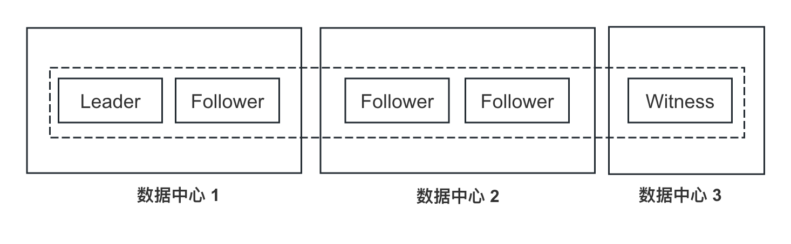
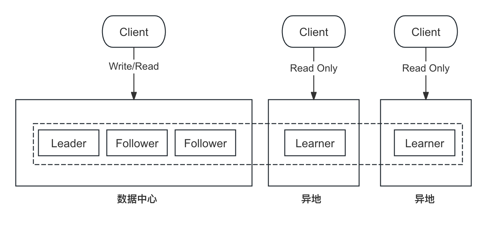

概览
===

Raft 除了 `Follower`、`Candidate`、`Leader` 这 3 个角色外，还引入了 `Witness` 与 `Learner`：

* Witness：只投票不存储数据，在不降低可用性的同时降低成本。
* Learner：只复制数据不参与投票，在不降低性能的情况下提供多余的副本。

Witness
===

`Witness` 具有以下特征：

* 参与选举投票，但不能成为 Leader（有些实现允许其短暂成为 Leader，再转移给其他节点）
* 参与日志投票，但不存储日志，不安装快照

更多介绍详见 [braft 文档](https://github.com/baidu/braft/blob/master/docs/cn/witness.md)。

应用场景
---

**三中心五副本**

有些追求可用性的业务会采用三中心五副本的部署方式，相对于双中心来说，其可用性会更强：
* 双中心：一个中心不可用，服务可能就不可用（取决于是否为多数集群）
* 三中心：只有当两个中心同时不可用时，服务才不可用

但是三中心意味着需要更多的资源，这时候可以将一个副本设置成 `Witness`，而部署 `Witness` 的节点不需要好的硬件资源。



具体实现
---

相关接口体：
```proto
message EntryMeta {
    required int64 term = 1;
    required EntryType type = 2;
    repeated string peers = 3;
    optional int64 data_len = 4;
    // Don't change field id of `old_peers' in the consideration of backward
    // compatibility
    repeated string old_peers = 5;
};
```

```cpp
struct LogEntry : public butil::RefCountedThreadSafe<LogEntry> {
public:
    EntryType type; // log type
    LogId id;
    std::vector<PeerId>* peers; // peers
    std::vector<PeerId>* old_peers; // peers
    butil::IOBuf data;
    ...
};
```

发送日志时，将日志的 data 置为空，其余不变：

```cpp
void Replicator::_send_entries() {
    ...
    for (int i = 0; i < max_entries_size; ++i) {
        // 生成每一个 LogEntry，在 _prepare_entry 中通过判断 Log Index 对应的 Term 在没在
        // 从而找到最后的 Log
        prepare_entry_rc = _prepare_entry(i, &em, &cntl->request_attachment());
        if (prepare_entry_rc != 0) {
            break;
        }
        request->add_entries()->Swap(&em);
    }
    ...
}

// 如果是 Witness，则 data 为空
int Replicator::_prepare_entry(int offset, EntryMeta* em, butil::IOBuf *data) {
    ...
    if (!is_witness() || FLAGS_raft_enable_witness_to_leader) {
        em->set_data_len(entry->data.length());
        data->append(entry->data);
    }
    entry->Release();
    return 0;
}
```

Learner 处理 `AppendEntries` 请求时，依然是原来的逻辑，只不过 `LogEntry` 的 data 是空的：
```cpp
void NodeImpl::handle_append_entries_request(brpc::Controller* cntl,
                                             const AppendEntriesRequest* request,
                                             AppendEntriesResponse* response,
                                             google::protobuf::Closure* done,
                                             bool from_append_entries_cache) {
    std::vector<LogEntry*> entries;

    // Parse request
    butil::IOBuf data_buf;
    data_buf.swap(cntl->request_attachment());
    ...
    for (int i = 0; i < request->entries_size(); i++) {
        index++;
        const EntryMeta& entry = request->entries(i);
        if (entry.type() != ENTRY_TYPE_UNKNOWN) {
            // (1) 生成 LogEntry
            LogEntry* log_entry = new LogEntry();
            log_entry->AddRef();
            log_entry->id.term = entry.term();
            log_entry->id.index = index;
            log_entry->type = (EntryType)entry.type();
            ...
            // (2) LogEntry 的 data 为空
            if (entry.has_data_len()) {
                int len = entry.data_len();
                data_buf.cutn(&log_entry->data, len);
            }
            // (3) 加入 entries
            entries.push_back(log_entry);
        }
    }

    ...
    // (4) 持久化到本地
    _log_manager->append_entries(&entries, c);
    ...
}
```

详见 [PR#398](https://github.com/baidu/braft/pull/398)。

Learner
===

Learner 具有以下特征：

* 不参与选举投票
* 只复制数据，不参与日志投票

使用场景
---

**提供跨区域只读集群**

* 对于一些一致性要求并不是很高的业务，需要提供跨区域读取时，可以使用 `Learner`；
* 如果使用 `Follower` 的话，其会参与日志的 `Quorum` 计算，从而大幅增加写入的时延；
* 主集群负责写入，异地提供只读服务；

> 当然，Learner 也可以支持读到最新的数据；如果 Raft 库支持 ReadIndex 的话，那可以在 Learner 上实现类似 Follower Read 的功能，详见 [ReadIndex Read](/ch03/3.2/optimization.md#线性一致性读)。



具体实现
---
目前 braft Learner 并未开源，详见[issue#198](https://github.com/baidu/braft/issues/198)。

参考
===

* [Practical Fast Replication](https://zhuanlan.zhihu.com/p/59991142)
* [字节跳动自研强一致在线 KV &表格存储实践 - 上篇](https://cloud.tencent.com/developer/news/654234)
* [对强一致存储系统的思考](https://zhuanlan.zhihu.com/p/664750172)
* [4.2 两中心同步复制方案（三副本）](https://book.tidb.io/session4/chapter4/two-dc-raft.html)
* [分布式数据库，基于Paxos多副本的两地三中心架构](https://zhuanlan.zhihu.com/p/664750172)

<!---
* https://wanghenshui.github.io/resume/docs/resume.html
--->