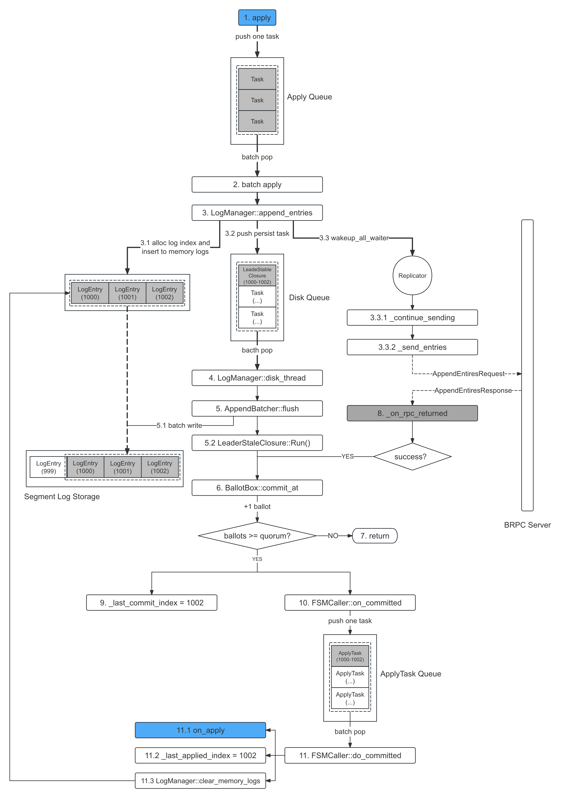

流程详解
===

流程概览
---

1. 前情回顾：当节点成为 Leader 时会为每个 Follower 创建 `Replicator`，并通过发送空的 `AppendEntries` 请求确认各 Follower 的 `nextIndex`
2. 客户端通过 `Node::apply` 接口向 Leader 提交操作日志
3. Leader 向本地追加日志：
   * 3.1 为日志分配 `index`，并将其追加到内存存储中
   * 3.2 异步将内存中的日志持久化到磁盘
4. Leader 将内存中的日志通过 `AppendEntries` 请求并行地复制给所有 Follower
5. Follower 收到 `AppenEntries` 请求，将日志持久化到本地后返回成功响应
6. Leader 若收到大多数确定，则提交日志，更新 `commitIndex` 并应用日志
7. Leader 调用用户状态机的 `on_apply` 应用日志
8. 待 `on_apply` 返回后，更新 `applyIndex`，并删除内存中的日志

> 备注：文章的结尾有一张整体流程图

<!--
TODO(Wine93)：
流程注解
---

* 整个流程是流水线式的异步实现，非常高效，日志从 `apply` 提交到最后 `on_apply` 被应用，依次经过 `ApplyQueue`、`DiskQueue`、`ApplyTaskQueue` 这 3 个异步队列，详情见以下具体实现
* 前置步骤：`nextIndex` 是下一条要发往 Follower 的日志 `Index`，只有确定了才能往 Follower 发送日志，不然不知道要往 Follower 发送哪些日志
* 1：
* 2.1 日志的 Term 由 Leader 设置为当前的 `Term`；节点刚成为 Leader 时本身拥有的最后一条日志的 `Index` 作为 `LastLogIndex`，往后 Leader 每追加一条日志都将 `++LastLogIndex` 作为该日志的 `Index`
* 2.2 日志的持久化是由管理磁盘的 `bthread` 负责，
* 2.2 和 3 是并行进行的
* 3 日志的发送由单独的 `bthread` 负责，不会阻塞 Leader 处理其他事务
* 4 Follower 端的日志持久化也是异步的
* 5 Leader 的 `CommitIndex` 由 Quorum 机制决定，Follower 的 `CommitIndex` 由 Leader 在下一次的心跳或 `AppendEntries` 请求中携带的 `committed_index` 告知
* 6 通常用户的状态机 `on_apply` 实现需要做 2 件事：(1) 将日志应用到状态机；(2) 将 RPC 响应返回给客户端
* 6 braft 是以串行的方式回调 `on_apply`，所以为了性能，可以
-->

复制模型
---


日志复制是树形复制的模型，采用本地写入和复制同时进行的方式，并且只要大多数写入成功就可以应用日志，不必等待 Leader 本地写入成功。

实现利用异步+并行，全程流水线式处理，并且全链路采用了 Batch，整体十分高效：

* Batch：全链路 Batch，包括持久化、复制以及应用
* 异步：Leader 和 Follower 的日志持久化都是异步的
* 并行：Leader 本地持久化和复制是并行的，并且开启 `pipeline` 后可以保证复制和复制之间也是并行的

关于性能优化的详情，可参考[<4.2 复制优化>](/ch04/4.2/optimization.md)。

Replicator
---

节点在刚成为 Leader 时会为每个 Follower 创建一个 `Replicator`，其运行在单独的 `bthread` 上，主要有以下几个作用：

* 记录 Follower 的一些状态，如 `nextIndex`、`flyingAppendEntriesSize` 等
* 作为 RPC Client，所有从 Leader 发往 Follower 的 RPC 请求都由它发送，包括心跳、`AppendEntriesRequest`、`InstallSnapshotRequest`
* 同步日志：`Replicator` 会不断地向 Follower 同步日志，直到 Follower 成功复制了 Leader 的所有日志，之后将在后台等待新日志的到来

nextIndex
---

`nextIndex` 是 Leader 记录下一个要发往 Follower 的日志 `index`，只有确认了 `nextIndex` 才能给 Follower 发送日志，不然不知道要给 Follower 发送哪些日志。

节点刚成为 Leader 时是不知道每个 Follower 的 `nextIndex` 的，需要通过发送一次或多次探测信息来确认，其探测算法如下：

* (1) `matchIndex` 为最后一条 Leader 与 Follower 匹配的日志，而 `nextIndex=matchIndex+1`
* (2) 初始化 `matchIndex` 为当前 Leader 的最后一条日志的 `index`
* (3) Leader 发送探测请求，携带 `matchIndex` 以及 `matchIndex` 日志对应的 `term`
* (4) Follower 接收请求后，根据自身日志获取 `matchIndex` 对应的 `term`：
  * 若和请求中的 `term` 相等，则代表日志匹配，返回成功响应；
  * 若日志不存在或者 `term` 不匹配，则返回失败响应；
  * 不管成功失败，响应中都携自身的 `lastLogIndex`
* (5) Leader 接收到成功响应，则表示探测成功；否则回退 `matchIndex` 并重复步骤 (3)：
    * 若 Follower 的 `lastLogIndex<matchIndex`，则回退 `matchIndex` 为 `lastLogIndex`
    * 否则回退 `matchIndex` 为 `matchIndex-1`

> 下图展示的是一次探测过程，图中的数字代表的是日志的 `term`


<!--
日志生命周期
---

TODO(Wine93,P0)
**1. 日志诞生**

日志由 `index` 和 `term` 组成：

* term：由 Leader 设置为当前的 `term`
* index：节点刚成为 Leader 时本身拥有的最后一条日志的 `index` 作为 `lastLogIndex`，往后 Leader 每追加一条日志都将 `++lastLogIndex` 作为该日志的 `index`

**2. 复制日志：** Leader 开始复制日志，包括本地持久化和复制给 Follower

**3. 提交日志**

当日志复制数达到 `Quorum` 后，就会提交日志，更新 `commitIndex`。

这里需要重新提一下的是，Leader 的 `commitIndex` 并不是都是由 `Quorum` 机制决定的，具体来说：

* Leader

* Follower：

**4. 应用日志：** 当日志被提交后，就会立马调用用户状态机的 `on_apply` 接口来应用日志。

**5. 销毁日志：** 待日志被应用后，内存中的日志将被销毁，其内存将被释放。

-->

相关 RPC
---

```proto
enum EntryType {
    ENTRY_TYPE_UNKNOWN = 0;
    ENTRY_TYPE_NO_OP = 1;
    ENTRY_TYPE_DATA = 2;
    ENTRY_TYPE_CONFIGURATION= 3;
};

message EntryMeta {
    required int64 term = 1;
    required EntryType type = 2;
    repeated string peers = 3;
    optional int64 data_len = 4;
    // Don't change field id of `old_peers' in the consideration of backward
    // compatibility
    repeated string old_peers = 5;
};

message AppendEntriesRequest {
    required string group_id = 1;
    required string server_id = 2;
    required string peer_id = 3;
    required int64 term = 4;
    required int64 prev_log_term = 5;   // matchIndex
    required int64 prev_log_index = 6;  // matchIndex
    repeated EntryMeta entries = 7;
    required int64 committed_index = 8;
};

message AppendEntriesResponse {
    required int64 term = 1;
    required bool success = 2;
    optional int64 last_log_index = 3;
    optional bool readonly = 4;
};

service RaftService {
    rpc append_entries(AppendEntriesRequest) returns (AppendEntriesResponse);
};
```

需要注意的是，探测 `nextIndex`、心跳、复制日志都是用的 `append_entries` 方法，区别在于其请求中携带的参数不同：

| 用途     | entries  | committed_index              |
|:---------|:---------|:-----------------------------|
| 探测     | 空       | 0                            |
| 心跳     | 空       | 当前 Leader 的 `commitIndex` |
| 复制日志 | 携带日志 | 当前 Leader 的 `commitIndex` |

> 除以上 2 个参数不同外，其余的参数都是一样的

相关接口
---

用户提交任务：
```cpp
class Node {
public:
    // [Thread-safe and wait-free]
    // apply task to the replicated-state-machine
    //
    // About the ownership:
    // |task.data|: for the performance consideration, we will take away the
    //              content. If you want keep the content, copy it before call
    //              this function
    // |task.done|: If the data is successfully committed to the raft group. We
    //              will pass the ownership to StateMachine::on_apply.
    //              Otherwise we will specify the error and call it.
    //
    void apply(const Task& task);
};
```

应用日志：

```cpp
class StateMachine {
public:
    // Update the StateMachine with a batch a tasks that can be accessed
    // through |iterator|.
    //
    // Invoked when one or more tasks that were passed to Node::apply have been
    // committed to the raft group (quorum of the group peers have received
    // those tasks and stored them on the backing storage).
    //
    // Once this function returns to the caller, we will regard all the iterated
    // tasks through |iter| have been successfully applied. And if you didn't
    // apply all the the given tasks, we would regard this as a critical error
    // and report a error whose type is ERROR_TYPE_STATE_MACHINE.
    virtual void on_apply(::braft::Iterator& iter) = 0;
};
```

前置阶段：确定 nextIndex
===

`Replicator` 在创建时会通过发送空的 `AppendEntries` 请求来探测 Follower 的 `nextIndex`，只有确定了 `nextIndex` 才能正式向 Follower 发送日志。具体的匹配算法我们已经在 [nextIndex](#nextIndex) 中详细介绍过了。

发送 `AE` 请求
---

`Replicator` 调用 `_send_empty_entries` 向 Follower 发送空的 `AppendEntries` 请求，并设置响应回调函数为 `_on_rpc_returned`：

```cpp
void Replicator::_send_empty_entries(bool is_heartbeat) {
    ...
    // (1) 填充请求中的字段
    if (_fill_common_fields(
                request.get(), _next_index - 1, is_heartbeat) != 0) {
        ...
    }

    // (2) 设置响应回调函数为 _on_rpc_returned
    google::protobuf::Closure* done = brpc::NewCallback(
                is_heartbeat ? _on_heartbeat_returned : _on_rpc_returned, ...);
    // (3) 发送空的 AppendEntries 请求
    RaftService_Stub stub(&_sending_channel);
    stub.append_entries(cntl.release(), request.release(),
                        response.release(), done);
}

// 填充字段
int Replicator::_fill_common_fields(AppendEntriesRequest* request,
                                    int64_t prev_log_index,
                                    bool is_heartbeat) {
    // 获取 matchIndex 对应的 term，我们称之为 matchTerm
    const int64_t prev_log_term = _options.log_manager->get_term(prev_log_index);
    ...
    request->set_term(_options.term);  // (1) 当前 Leader 的 term
    ...
    request->set_prev_log_index(prev_log_index);  // (2) matchIndex
    request->set_prev_log_term(prev_log_term);    // (3) matchTerm
    ...
    return 0;
}
```

处理 `AE` 请求
---

Follower 收到 `AppendEntries` 请求后，会调用 `handle_append_entries_request` 处理：

```cpp
void NodeImpl::handle_append_entries_request(brpc::Controller* cntl,
                                             const AppendEntriesRequest* request,
                                             AppendEntriesResponse* response,
                                             google::protobuf::Closure* done,
                                             bool from_append_entries_cache) {
    ...
    const int64_t prev_log_index = request->prev_log_index();  // macthIndex
    const int64_t prev_log_term = request->prev_log_term();   // macthTerm
    const int64_t local_prev_log_term = _log_manager->get_term(prev_log_index);  // 获取 macthIndex 对应的 term
    // (1) 如果本地的 term 和请求的 matchTerm 不一致，则代表日志不匹配，返回失败响应
    if (local_prev_log_term != prev_log_term) {
        int64_t last_index = _log_manager->last_log_index();
        ...
        response->set_success(false);  // (1.1) 失败响应
        response->set_term(_current_term);  // (1.2) 当前 term
        response->set_last_log_index(last_index);  // (1.3) 携带当前节点的 lastLogIndex
        ...
        return;
    }

    // (2) 本地的 term 和请求的 matchTerm 一致，则代表日志匹配，返回成功响应
    if (request->entries_size() == 0) {
        response->set_success(true);  // (2.1) 成功响应
        response->set_term(_current_term);  // (2.2) 当前 term
        response->set_last_log_index(_log_manager->last_log_index());  // (2.3) 携带当前节点的 lastLogIndex

        ...
        return;
    }
    ...
}
```

处理 `AE` 响应
---

Leader 收到 `AppendEntries` 响应后，调用 `on_rpc_returned` 处理响应：

```cpp
void Replicator::_on_rpc_returned(ReplicatorId id, brpc::Controller* cntl,
                     AppendEntriesRequest* request,
                     AppendEntriesResponse* response,
                     int64_t rpc_send_time) {
    ...
    // (1) 返回不匹配响应
    //     注意：matchIndex = nextIndex - 1
    //         其实代码中都是直接修改的 nextIndex，再在发送请求的时候设置 macthIndex = nextIndex - 1
    //         但是为了便于理解，下面我们都将由 macthIndex 代替讲解
    if (!response->success()) {
        ...
        // (1.1) 如果 follower 的 lastLogIndex < matchIndex，则回退 matchIndex 到 lastLogIndex
        if (response->last_log_index() + 1 < r->_next_index) {
            ...
            r->_next_index = response->last_log_index() + 1;
        } else {  // (1.2) 否则，将 macthIndex 设置为 matchIndex - 1
            // The peer contains logs from old term which should be truncated,
            // decrease _last_log_at_peer by one to test the right index to keep
            if (BAIDU_LIKELY(r->_next_index > 1)) {
                ...
                --r->_next_index;
            }
            ...
        }

        // (1.3) 再发送空的 `AppendEntries` 请求进行探测
        r->_send_empty_entries(false);
        return;
    }

    // (2) 返回成功响应，那么就代表探测成功，nextIndex 就是之前设置的（如 1.1），无需修改
    //     这时候就调用 _send_entries 向 Follower 同步日志
    r->_send_entries();
    return;
}
```

等待新日志
---

确定 `nextIndex` 后，`Replicator` 就会调用 `_send_entries` 向 Follower 同步日志，直至 Follower 成功复制了 Leader 的所有日志后，将会注册一个 `waiter`，在后台等待新日志的到来，其整体流程如下：

```cpp
void Replicator::_send_entries() {
    ...
    // (3) 如果已经复制了全部日志，调用 _wait_more_entries 后在后台等待
    if (request->entries_size() == 0) {
        ...
        return _wait_more_entries();
    }
    ...

    // (1) 同步日志，并设置响应的回调函数为 _on_rpc_returned
    google::protobuf::Closure* done = brpc::NewCallback(
                _on_rpc_returned, _id.value, cntl.get(),
                request.get(), response.get(), butil::monotonic_time_ms());
    RaftService_Stub stub(&_sending_channel);
    stub.append_entries(cntl.release(), request.release(),
                        response.release(), done);
    ...
}

void Replicator::_on_rpc_returned(ReplicatorId id, brpc::Controller* cntl,
                     AppendEntriesRequest* request,
                     AppendEntriesResponse* response,
                     int64_t rpc_send_time) {
    ...
    // (2) 成功同步一批日志，继续同步日志
    r->_send_entries();
    return;
}

// (4) 注册一个 `waiter`，其回调函数是 `_continue_sending`
//     当有新日志到来时，这些 waiter 将被唤醒，并调用 `_continue_sending`
void Replicator::_wait_more_entries() {
    ...
    _wait_id = _options.log_manager->wait(
            _next_index - 1, _continue_sending, (void*)_id.value);
    ...
}

// (5) Replicator 被唤醒，继续调用 `_send_entries` 发送日志
int Replicator::_continue_sending(void* arg, int error_code) {
    ...
    r->_send_entries();
    ...
}
```

阶段一：追加日志
===

提交任务
---

```cpp
#include <braft/raft.h>

...
void function(op, callback) {
    butil::IOBuf data;
    serialize(op, &data);
    braft::Task task;
    // The data applied to StateMachine
    task.data = &data;
    // Continuation when the data is applied to StateMachine or error occurs.
    task.done = make_closure(callback);
    // Reject this task if expected_term doesn't match the current term of
    // this Node if the value is not -1
    task.expected_term = expected_term;
    return _node->apply(task);
}
```

客户端需要将操作序列化成 [IOBuf][IOBuf]，并构建一个 `Task` 向 `braft::Node` 提交。

[IOBuf]: https://github.com/apache/brpc/blob/master/src/butil/iobuf.h

放入队列
---

Node 在收到 `Task` 后，会将其转换成 `LogEntryAndClosure` 并放入 `ApplyQueue` 中。至此，客户端的 apply 就完成返回了。`ApplyQueue` 也是个串行队列，由 BRPC [ExecutionQueue] 实现：

[ExecutionQueue]: https://brpc.apache.org/docs/bthread/execution-queue/

```cpp
void NodeImpl::apply(const Task& task) {
    ...
    LogEntryAndClosure m;
    m.entry = entry;  // m.entry = task.data
    m.done = task.done;
    m.expected_term = task.expected_term;
    if (_apply_queue->execute(m, &bthread::TASK_OPTIONS_INPLACE, NULL) != 0) {
        ...
    }
}
```

任务批处理
---

`ApplyQueue` 的消费函数是 `execute_applying_tasks`，在该函数中会将 `LogEntryAndClosure` 进行 bacth 打包处理，并调用批量 `apply` 接口来处理：

```cpp
int NodeImpl::execute_applying_tasks(void* meta,  bthread::TaskIterator<LogEntryAndClosure>& iter) {
    NodeImpl* m = (NodeImpl*)meta;
    for (; iter; ++iter) {
        if (cur_size == batch_size) {  // batch_size = 256
            m->apply(tasks, cur_size);  // (2) 调用批量 apply 接口处理
            cur_size = 0;
        }
        tasks[cur_size++] = *iter;  // (1) 批处理
    }
    ...
}
```

批量 `apply` 接口在接收到这些 `tasks` 后，主要做以下几件事情：

```cpp
void NodeImpl::apply(LogEntryAndClosure tasks[], size_t size) {
    std::vector<LogEntry*> entries;
    ...
    for (size_t i = 0; i < size; ++i) {
        ...
        // （1）获取 LogEntryAndClosure 中的 LogEntry，并填充 term 和 type
        entries.push_back(tasks[i].entry);
        entries.back()->id.term = _current_term;
        entries.back()->type = ENTRY_TYPE_DATA;
        ...
        // (2) 追加日志对应的回调函数（LogEntryAndClosure 中的 Closure）
        //     当日志被应用（on_apply）后会调用该 Closure
        _ballot_box->append_pending_task(_conf.conf,
                                         _conf.stable() ? NULL : &_conf.old_conf,
                                         tasks[i].done);
    }
    ...

    // (3)调用 `LogManager::append_entries` 接口进行追加日志，该接口：
    //    (3.1) 会对日志进行持久化存储，持久化完成后会调用回调函数 LeaderStableClosure，
    //          LeaderStableClosure 会调用 BallotBox::commit_at 将复制计数加一
    //    (3.2) 唤醒 `Replicator` 将日志发送给 Follower
    //          每收到一个成功响应，都会调用 BallotBox::commit_at 将复制计数加一
    //    (3.3) 待日志复制数达到 `Quorum` 后，会提交该日志，并将其应用
    _log_manager->append_entries(&entries,
                               new LeaderStableClosure(
                                        NodeId(_group_id, _server_id),
                                        entries.size(),
                                        _ballot_box));
    ...
}
```

阶段二：持久化日志
===

追加日志
---

`LogManager` 在接收到这些日志（`LogEntry`）后会做以下几件事情：

```cpp
void LogManager::append_entries(std::vector<LogEntry*> *entries, StableClosure* done) {
    ...
    // (1) 为每一个 LogEntry 分配 index
    if (!entries->empty() && check_and_resolve_conflict(entries, done) != 0) {
        ...
        return;
    }

    // (2) 将日志追加到内存存储中
    if (!entries->empty()) {
        _logs_in_memory.insert(_logs_in_memory.end(), entries->begin(), entries->end());
    }

    ...

    // (3) 往 DiskQueue 中追加一个持久化的任务
    // done: LeaderStableClosure
    done->_entries.swap(*entries);
    int ret = bthread::execution_queue_execute(_disk_queue, done);

    // (4) 唤醒所有 Replicator 向 Follower 同步日志
    wakeup_all_waiter(lck);
}
```

分配 `logIndex`
---

`LogManager` 调用 `check_and_resolve_conflict` 为每一个 `LogEntry` 分配 `index`:

```cpp
int LogManager::check_and_resolve_conflict(
            std::vector<LogEntry*> *entries, StableClosure* done) {
    ...
    // 这个函数 Leader 和 Follower 都会调用，
    // Leader 调用时日志的 index 都是没确定的（即是 0）
    // last_log_index：当前 Leader 最后一条日志的 index
    if (entries->front()->id.index == 0) {
        for (size_t i = 0; i < entries->size(); ++i) {
            (*entries)[i]->id.index = ++_last_log_index;
        }
        ...
        return 0;
    } else {
        ...
    }
    ...
}
```

持久化日志
---

`DiskQueue` 的消费函数是 `disk_thread`，在该函数中，会利用 `AppendBatcher` 对持久化任务做 Batch 打包处理，最终调用 `AppendBatcher::flush` 将日志写入磁盘：

```cpp
int LogManager::disk_thread(void* meta,
                            bthread::TaskIterator<StableClosure*>& iter) {
    ...
    LogManager* log_manager = static_cast<LogManager*>(meta);
    ...
    StableClosure* storage[256];
    AppendBatcher ab(storage, ARRAY_SIZE(storage), &last_id, log_manager);

    for (; iter; ++iter) {
                // ^^^ Must iterate to the end to release to corresponding
                //     even if some error has occurred
        StableClosure* done = *iter;
        ...
        if (!done->_entries.empty()) {
            ab.append(done);  // (1) Batch 处理
        } else {
            ab.flush();  // (2) 写入磁盘
            ...
        }
    }
    ...
    ab.flush();
    ...
    return 0;
}
```

`AppendBatcher` 负责将数据写入磁盘，并调用最终的回调函数，具体的存储写入我们将在 [<4.3 日志存储>](/ch04/4.3/log_storage.md) 中详细介绍：

```cpp
class AppendBatcher {
public:
    void flush() {
        // (1) 最终会调用 `SegmentLogStorage::append_entries` 将日志写入磁盘
        _lm->append_to_storage(&_to_append, _last_id, &metric);
        for (size_t i = 0; i < _size; ++i) {
            // (2) 成功持久化后，调用回调函数，即 `LeaderStableClosure`
            _storage[i]->Run();
        }
    }

    void append(LogManager::StableClosure* done) {
        // FLAGS_raft_max_append_buffer_size 默认 256KB
        if (_size == _cap ||
                _buffer_size >= (size_t)FLAGS_raft_max_append_buffer_size) {
            flush();
        }
        _storage[_size++] = done;
        _to_append.insert(_to_append.end(),
                         done->_entries.begin(), done->_entries.end());
        for (size_t i = 0; i < done->_entries.size(); ++i) {
            _buffer_size += done->_entries[i]->data.length();
        }
    }
    ...
};
```

待持久化成功后，会调用之前设置的回调函数 `LeaderStableClosure::Run`，该函数会调用 `BallotBox::commit_at` 将对应日志的计数加一，详见以下小节 <提交日志>：
```cpp
void LeaderStableClosure::Run() {
    if (status().ok()) {
        ...
        _ballot_box->commit_at(_first_log_index, _first_log_index + _nentries - 1, _node_id.peer_id);
    }
    ...
}
```

唤醒 Replicator
---

`LogManager` 调用 `wakeup_all_waiter` 唤醒所有 `Replicator` 向 Follower 同步日志，`Replicator` 唤醒会调用 `_continue_sending` 继续发送 `AppendEntries` 请求：
```cpp
void LogManager::wakeup_all_waiter(std::unique_lock<raft_mutex_t>& lck) {
    ...
    // (1) 清空 `wait_map`
    for (butil::FlatMap<int64_t, WaitMeta*>::const_iterator
            iter = _wait_map.begin(); iter != _wait_map.end(); ++iter) {
        wm[nwm++] = iter->second;
    }
    _wait_map.clear();
    ...
    // (2) 唤醒所有 `Replicator`
    for (size_t i = 0; i < nwm; ++i) {
        ...
        if (bthread_start_background( &tid, &attr, run_on_new_log, wm[i]) != 0) { ...
        }
    }
}

void* LogManager::run_on_new_log(void *arg) {
    ...
    // wm: Replicator
    // on_new_log: _continue_sending
    wm->on_new_log(wm->arg, wm->error_code);
    ...
}
```

阶段三：复制日志
===

发送 `AE` 请求
---

`Replicator` 被唤醒后，会调用 `_send_entries` 发送 `AppendEntries` 请求：

```cpp
int Replicator::_continue_sending(void* arg, int error_code) {
    ...
    r->_send_entries();
    ...
}
```

在 `_send_entries` 函数中主要做以下几件事情：
```cpp
void Replicator::_send_entries() {
    // (1) 填充 AppendEntries 请求
    if (_fill_common_fields(request.get(), _next_index - 1, false) != 0) {
        ...
        // (1.1) 如果发现 Follower 需要的日志（nextIndex）已经被快照压缩了
        //       则向 Follower 发送安装快照指令
        return _install_snapshot();
    }
    ...
    //  (2) 填充 AppendEntries 请求中的 entries 字段
    for (int i = 0; i < max_entries_size; ++i) {
        // (2.1) 调用 `_prepare_entry` 准备实际的日志数据
        //      日志数据放在 RPC 请求的 attch 中
        prepare_entry_rc = _prepare_entry(i, &em, &cntl->request_attachment());
        if (prepare_entry_rc != 0) {
            break;
        }
        request->add_entries()->Swap(&em);
    }
    ...
    // (3) 先更新 Follower 的 nextIndex
    _next_index += request->entries_size();
    ...
    // (4) 设置响应回调函数 _on_rpc_returned
    google::protobuf::Closure* done = brpc::NewCallback(_on_rpc_returned, ...);
    // (5) 发送 AppendEntries 请求
    RaftService_Stub stub(&_sending_channel);
    stub.append_entries(cntl.release(), request.release(),
                        response.release(), done);
    // (6) 如果还有日志，则继续发送；否则注册 waiter 后，就在后台等待新日志到来
    _wait_more_entries();
}
```

`_fill_common_fields` 函数负责填充 `AppendEntries` 请求中除 `entries` 的其余字段：

```cpp
int Replicator::_fill_common_fields(AppendEntriesRequest* request,
                                    int64_t prev_log_index  // matchIndex
                                    bool is_heartbeat) {
    const int64_t prev_log_term = _options.log_manager->get_term(prev_log_index);
    // (1) 查不到对应日志的 term，代表已经被快照压缩了
    if (prev_log_term == 0 && prev_log_index != 0) {
        ...
        return -1;
    }
    ...
    // (2) 填充字段
    request->set_term(_options.term);
    request->set_prev_log_index(prev_log_index);
    request->set_prev_log_term(prev_log_term);
    request->set_committed_index(_options.ballot_box->last_committed_index());  // commitIndex
    return 0;
}
```

处理 `AE` 请求
---

Follower 接收到 `AppendEntries` 请求后，会调用 `handle_append_entries_request` 处理请求。其实 Follower 持久化逻辑和 Leader 是一样的，都是调用 `LogManager::append_entries` 函数进行持久化，只不过在持久化成功后各自的回调函数不一样：

* Leader：回调函数是 `LeaderStableClosure`；该回调函数主要是将 `Quorum` 计数加一
* Follower：回调函数是 `FollowerStableClosure`；该回调函数主要是发送 `AppendEntries` 响应，并根据请求中携带的 Leader `commitIndex` 更新自身的 `commitIndex` 并应用日志

还有一个小的不同点是，Leader 端日志的 `index` 是自己生成的，而 Follower 中的日志完全来自于 Leader。

```cpp
void NodeImpl::handle_append_entries_request(brpc::Controller* cntl,
                                             const AppendEntriesRequest* request,
                                             AppendEntriesResponse* response,
                                             google::protobuf::Closure* done,
                                             bool from_append_entries_cache) {
    ...
    // (1) 持久化成功后的回调函数
    FollowerStableClosure* c = new FollowerStableClosure(
            cntl, request, response, done_guard.release(),
            this, _current_term);
    // (2) 追加日志
    _log_manager->append_entries(&entries, c);
}
```

持久化成功后将运行回调函数 `FollowerStableClosure::Run`：

```cpp
class FollowerStableClosure : public LogManager::StableClosure {
public:
    ...
    void Run() {
        run();
        ...
    }

private:
    ...
    void run() {
        // (3) 发送响应
        brpc::ClosureGuard done_guard(_done);
        ...
        _response->set_success(true);
        _response->set_term(_term);

        // (1) 计算 commitIndex
        const int64_t committed_index =
                std::min(_request->committed_index(),
                         // ^^^ committed_index is likely less than the
                         // last_log_index
                         _request->prev_log_index() + _request->entries_size()
                         // ^^^ The logs after the appended entries are
                         // untrustable so we can't commit them even if their
                         // indexes are less than request->committed_index()
                        );
        // (2) 更新 commitIndex，并应用日志
        //_ballot_box is thread safe and tolerates disorder.
        _node->_ballot_box->set_last_committed_index(committed_index);
    }
};
```

调用 `set_last_committed_index` 更新 `commitIndex` 并应用日志：

```cpp
int BallotBox::set_last_committed_index(int64_t last_committed_index) {
    ...
    if (last_committed_index > _last_committed_index.load(...)) {
        // (1) 更新 `commitIndex`
        _last_committed_index.store(last_committed_index, ...);
        // (2) 调用 FSMCaller::on_committed 应用日志
        //     注意，这里只是放队列里放入一个任务就返回了，
        //     最终的 `on_apply` 回调由队列的消费函数调用
        _waiter->on_committed(last_committed_index);
    }
    return 0;
}
```

处理 `AE` 响应
---

Leader 在收到 `AppendEntries` 响应后，会根据响应的不同类型对相应的处理：

* RPC 失败：调用 `_block` 阻塞当前 `Replicator` 一段时间（默认 100 毫秒），超时后调用 `_continue_sending` 重新发送当前 `AppendEntries` 请求。出现这种情况一般是对应的 Follower Crash 了，需要不断重试直到其恢复正常或被剔除集群
* 响应失败：这里又细分为 2 种情况
    * Follower 的 `term` 比 `leader` 高：调用 `increase_term_to` 将自己 `step_down` 成 Follower，并以错误状态调用所有日志的回调函数，通知用户 `apply` 失败了
    * 日志不匹配：重新探测 `nextIndex`，待其确认后重新发送日志
* 响应成功：调用 `BallotBox::commit_at` 对复制计算加一

```cpp
void Replicator::_on_rpc_returned(ReplicatorId id, brpc::Controller* cntl,
                                  AppendEntriesRequest* request,
                                  AppendEntriesResponse* response,
                                  int64_t rpc_send_time) {
    // 情况 1：RPC 请求失败
    if (cntl->Failed()) {
        ...
        r->_reset_next_index();
        return r->_block(start_time_us, cntl->ErrorCode());  // 阻塞一段时间后再重试
    }

    // 情况 2：收到失败响应
    if (!response->success()) {
        // 2.1 如果发现 Follower 的日志 term 比 Leader 大
        //     则调用 `increase_term_to` 将自己 step_down 成 Follower
        //     并以错误状态调用所有日志的回调函数，表明用户 `apply` 失败
        if (response->term() > r->_options.term) {
            ...
            butil::Status status;
            status.set_error(EHIGHERTERMRESPONSE, "Leader receives higher term "
                    "%s from peer:%s", response->GetTypeName().c_str(), r->_options.peer_id.to_string().c_str());
            r->_destroy();
            node_impl->increase_term_to(response->term(), status);
            ...
            return;
        }
        ...
        // 2.2 发现发送的日志不匹配，需要重新探测 nextIndex
        //     确定 nextIndex 后重新发送 Follower 需要的日志
        if (response->last_log_index() + 1 < r->_next_index) {
            ...
            r->_next_index = response->last_log_index() + 1;
        } else {
            ...
            if (BAIDU_LIKELY(r->_next_index > 1)) {
                ...
                --r->_next_index;
            }
            ...
        }
        ...
        // 重新发送空的 AppendEntries 请求探测 nextIndex
        r->_send_empty_entries(false);
        return;
    }

    ...

    // 情况 3：响应成功
    if (entries_size > 0) {
        r->_options.ballot_box->commit_at(
                min_flying_index, rpc_last_log_index,
                r->_options.peer_id);
        ...
    }
}
```

`increase_term_to` 函数处理失败的任务，调用 `step_down` 将自己降级成 Follower：

```cpp
int NodeImpl::increase_term_to(int64_t new_term, const butil::Status& status) {
    ...
    if (new_term <= _current_term) {
        return EINVAL;
    }
    step_down(new_term, false, status);
    return 0;
}
```

在 `step_down` 中会调用 `BallotBox::clear_pending_tasks`，该函数将以失败状态调用所有用户任务的 `Closure`：

```cpp
void NodeImpl::step_down(const int64_t term, bool wakeup_a_candidate,
                         const butil::Status& status) {
    ...
    // (1) BallotBox::clear_pending_tasks
    _ballot_box->clear_pending_tasks();
    ...
}

int BallotBox::clear_pending_tasks() {
    ...
    // (2) ClosureQueue::clear
    _closure_queue->clear();
    return 0;
}

void ClosureQueue::clear() {
    ...
    // (3) saved_queue 中保存的是用户任务的 Closure
    for (std::deque<Closure*>::iterator
            it = saved_queue.begin(); it != saved_queue.end(); ++it) {
        if (*it) {
            // (4) 运行用户任务的 Closure
            (*it)->status().set_error(EPERM, "leader stepped down");
            run_closure_in_bthread_nosig(*it, _usercode_in_pthread);
            ...
        }
    }
    ...
}
```

阶段四：提交日志
===

Leader 本地持久化成功或每成功复制日志给一个 Follower，都会调用 `BallotBox::commit_at` 将对应日志的复制计数加一，如果达到 `Quorum`，则更新 `commitIndex`，并将其应用:

```cpp
int BallotBox::commit_at(
        int64_t first_log_index, int64_t last_log_index, const PeerId& peer) {
    ...
    // (1) 将 index 在 [first_log_index, last_log_index] 之间的日志计数加一
    int64_t last_committed_index = 0;
    const int64_t start_at = std::max(_pending_index, first_log_index);
    Ballot::PosHint pos_hint;
    for (int64_t log_index = start_at; log_index <= last_log_index; ++log_index) {
        Ballot& bl = _pending_meta_queue[log_index - _pending_index];
        pos_hint = bl.grant(peer, pos_hint);
        if (bl.granted()) {  // (2) 该日志已经达到 `Quorum`，保存 commitIndex
            last_committed_index = log_index;
        }
    }

    if (last_committed_index == 0) {
        return 0;
    }
    ...
    _pending_index = last_committed_index + 1;
    // (3) 更新 commitIndex
    _last_committed_index.store(last_committed_index, butil::memory_order_relaxed);
    // (4) 调用 FSMCaller::do_committed 开始应用日志
    // The order doesn't matter
    _waiter->on_committed(last_committed_index);
    return 0;
}
```

阶段五：应用日志
===

放入队列
---

当日志复制数已达到 `Quorum`，则调用 `FSMCaller::on_committed` 应用日志，该函数会将应用任务放如串行队列 `ApplyTaskQueue` 当中。`ApplyTaskQueue` 也是个串行队列，由 BRPC [ExecutionQueue] 实现：

[ExecutionQueue]: https://brpc.apache.org/docs/bthread/execution-queue/

```cpp
int FSMCaller::on_committed(int64_t committed_index) {
    ApplyTask t;
    t.type = COMMITTED;
    t.committed_index = committed_index;
    return bthread::execution_queue_execute(_queue_id, t);
}
```

批处理
---

`ApplyTaskQueue` 的消费函数是 `FSMCaller::run`，在该函数中会对应用任务进行 Bacth 打包，并调用 `FSMCaller::do_committed` 进行批处理：

```cpp
int FSMCaller::run(void* meta, bthread::TaskIterator<ApplyTask>& iter) {
    for (; iter; ++iter) {
        if (iter->type == COMMITTED && counter < batch_size) {
            // (1) Batch 打包
            if (iter->committed_index > max_committed_index) {
                max_committed_index = iter->committed_index;
                counter++;
            }
        } else {
            // (2) 调用 `do_committed` 进行批处理
            if (max_committed_index >= 0) {
                caller->_cur_task = COMMITTED;
                caller->do_committed(max_committed_index);
                max_committed_index = -1;
                counter = 0;
            }
            ...
        }
        ...
    }
}
```

on_apply
---

在 `do_committed` 函数中会将这批应用任务生成迭代器 [braft::iterator][iterator]，并将其作为参数调用用户状态机的 `on_apply`，待这批日志全部被 `on_apply` 后，再更新 `applyIndex`。最后调用 `LogManager::set_applied_id` 删除内存中的日志：

[iterator]: https://github.com/baidu/braft/blob/master/docs/cn/server.md#iterator


```cpp
void FSMCaller::do_committed(int64_t committed_index) {
    // (1) 生产迭代器 Iterator
    IteratorImpl iter_impl(_fsm, _log_manager, ...);
    for (; iter_impl.is_good();) {
        ...
        Iterator iter(&iter_impl);
        _fsm->on_apply(iter);  // (2) 调用状态机的 on_apply
        ...
        iter.next();
    }

    ...

    // (3) 更新 applyIndex
    LogId last_applied_id(last_index, last_term);
    _last_applied_index.store(committed_index, butil::memory_order_release);
    _last_applied_term = last_term;
    // (4) 删除内存中的日志
    _log_manager->set_applied_id(last_applied_id);
}
```

删除内存日志
---

调用 `set_applied_id` 删除内存中的日志。注意，不删除 Leader 未持久化的日志，即使其已被 `apply`：

```cpp
void LogManager::set_applied_id(const LogId& applied_id) {
    if (applied_id < _applied_id) {
        return;
    }
    ...

    // _disk_id：已经持久化的日志 Id
    // _applied_id：已经应用的日志 Id
    // 正常情况下，_applied_id >= _disk_id
    // 但是为了性能考虑，实现中只要复制数达到 `Quorum` 就可以提交日志，即使 Leader 未持久化
    // 所以可能出现日志已经被 apply 了，但是 Leader 还没有持久化
    _applied_id = applied_id;
    LogId clear_id = std::min(_disk_id, _applied_id);
    return clear_memory_logs(clear_id);
}
```

删除内存中的日志，并释放其内存：

```cpp
void LogManager::clear_memory_logs(const LogId& id) {
    LogEntry* entries_to_clear[256];
    size_t nentries = 0;
    do {
        nentries = 0;
        {
            BAIDU_SCOPED_LOCK(_mutex);
            while (!_logs_in_memory.empty()
                    && nentries < ARRAY_SIZE(entries_to_clear)) {
                LogEntry* entry = _logs_in_memory.front();
                if (entry->id > id) {
                    break;
                }
                entries_to_clear[nentries++] = entry;
                _logs_in_memory.pop_front();
            }
        }  // out of _mutex
        for (size_t i = 0; i < nentries; ++i) {
            entries_to_clear[i]->Release();
        }
    } while (nentries == ARRAY_SIZE(entries_to_clear));
}
```

结尾
===


<!--
TODO(Wine93,P0)
其他：日志复制失败
===

正常情况下，日志都是会被复制成功的，即使 Follower Crash 了，Leader 也会不断重试直到其恢复正常或被剔除集群。只有当当前 Leader 不再是 Leader 时，日志复制才会失败，框架会调用用户任务的 `Closure`。
-->
