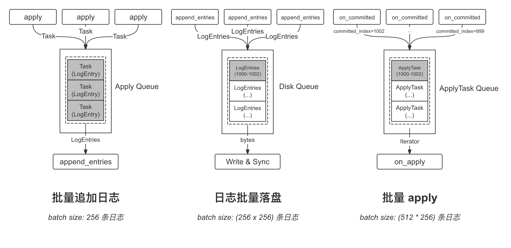
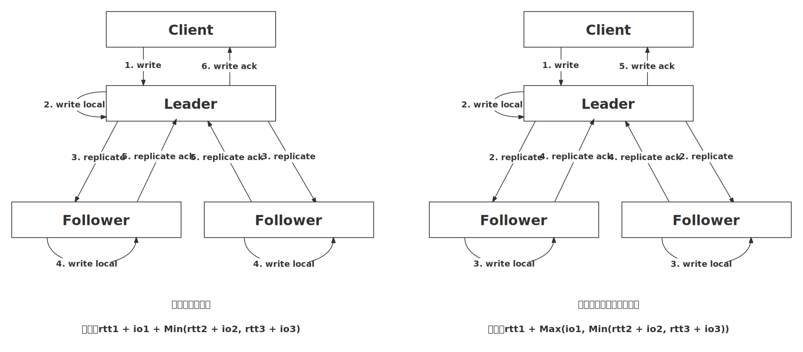
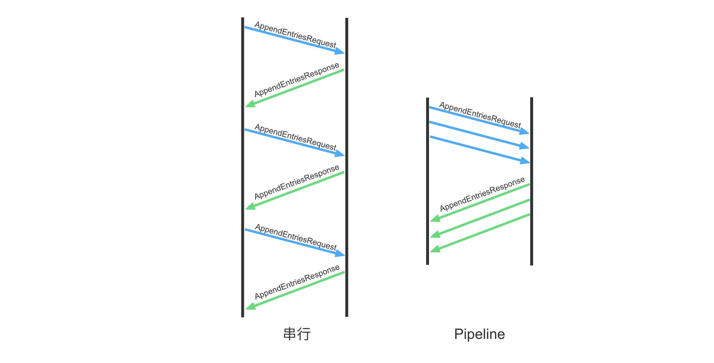

优化 0：nextIndex 的探测

优化 1：Batch
===

介绍
---



从客户端调用 `apply` 接口提交 Task 到日志成功复制，并回调用户状态机的 `on_apply` 接口，日志依次经过了 `Apply Queue`、`Disk Queue`、`Apply Task Queue` 这 3 个队列。这些队列都是 brpc 的 [ExecutionQueue][ExecutionQueue] 实现，其消费函数都做了 `batch` 优化：

* **Apply Queue**: 用户提交的 Task 会进入该队列，在该队列的消费函数中会将这些 Task 对应的日志进行打包，并调用 `LogManager` 的 `append_entries` 函数进行追加日志。默认一次最多打包 256 条日志。
* **Disk Queue**: `LogManager` 在接收到这批日志后，需对其进行持久化处理，故会往该队列中提交一个持久化任务（一个任务对应一批日志）；在该队列的消费函数中会将这些任务进行打包，将这批任务对应的所有日志写入磁盘，并在全部写入成功后会做一次 `sync` 操作。默认一次最多打包 256 个持久化任务，而每个任务最多包含 256 条日志，所以其一次 Bacth Write 最多会写入 `256 * 256` 条日志对应的数据。
* **Apply Task Queue**：当日志的复制数（包含持久化）达到 Quorum 后，会调用 `on_committed` 往 `Apply Task Queue` 中提交一个 ApplyTask（每个任务对应一批已提交的日志）；在该队列的消费函数中会将这些 ApplyTask 打包成 `Iterator`，并作为参数回调用户状态机的 `on_apply` 函数。 默认一次最多打包 512 个 ApplyTask，而每个 ApplyTask 最多包含 256 条日志，所以每一次 `on_apply` 参数中的 `Iterator` 最多包含 `512 * 256` 条日志。

[ExecutionQueue]: https://brpc.apache.org/docs/bthread/execution-queue

> **Follower 的 Batch**
>
> 以上讨论的是节点作为 Leader 时的 Batch 优化，当节点为 Follower 时，其优化也是一样的，因为其用的是相同的代码逻辑，唯一的区别在于：
> * **Apply Queue**: Follower 不会接受用户提交的 Task，其日志来源于 Leader 的复制
> * **Disk Queue**: 日志批量落盘的逻辑是一样的，Follower 在接收到 Leader 的一批日志之后也是直接调用 `LogManager` 的 `append_entries` 函数
> * **Apply Task Queue**: 批量 apply 的逻辑是一样的，区别在于调用 `on_committed` 的时机来源于 Leader 在 RPC 中携带的 `committed_index`，并不通过自身的 Quorum 计算

具体实现
---

`ApplyQueue` 消费函数：
```cpp
int NodeImpl::execute_applying_tasks(
        void* meta, bthread::TaskIterator<LogEntryAndClosure>& iter) {
    ...
    // TODO: the batch size should limited by both task size and the total log
    // size
    // 定义一个 tasks 数组，数组大小 = min(batch_size, 256)
    const size_t batch_size = FLAGS_raft_apply_batch;
    DEFINE_SMALL_ARRAY(LogEntryAndClosure, tasks, batch_size, 256);
    size_t cur_size = 0;
    NodeImpl* m = (NodeImpl*)meta;
    for (; iter; ++iter) {
        if (cur_size == batch_size) {
            m->apply(tasks, cur_size);
            cur_size = 0;
        }
        tasks[cur_size++] = *iter;
    }
    if (cur_size > 0) {
        m->apply(tasks, cur_size);
    }
    return 0;
}
```

`DiskQueue` 消费函数：

```cpp
int LogManager::disk_thread(void* meta,
                            bthread::TaskIterator<StableClosure*>& iter) {
    ...
    LogManager* log_manager = static_cast<LogManager*>(meta);
    // FIXME(chenzhangyi01): it's buggy
    LogId last_id = log_manager->_disk_id;
    StableClosure* storage[256];
    AppendBatcher ab(storage, ARRAY_SIZE(storage), &last_id, log_manager);

    for (; iter; ++iter) {
                // ^^^ Must iterate to the end to release to corresponding
                //     even if some error has occurred
        StableClosure* done = *iter;
        ...
        if (!done->_entries.empty()) {
            ab.append(done);
        } else {
            ab.flush();
            ...
        }
    }
    ...
    ab.flush();
    ...
    return 0;
}

class AppendBatcher {
public:
    ...
    void flush() {
        if (_size > 0) {
            // 写入持久化存储
            _lm->append_to_storage(&_to_append, _last_id, &metric);
            ...
        }
        ...
    }

    void append(LogManager::StableClosure* done) {
        if (_size == _cap ||
                _buffer_size >= (size_t)FLAGS_raft_max_append_buffer_size) {
            flush();
        }
        _storage[_size++] = done;
        _to_append.insert(_to_append.end(),
                         done->_entries.begin(), done->_entries.end());
        for (size_t i = 0; i < done->_entries.size(); ++i) {
            _buffer_size += done->_entries[i]->data.length();
        }
    }
}
```

`ApplyTaskQueue` 消费函数：

```cpp
int FSMCaller::run(void* meta, bthread::TaskIterator<ApplyTask>& iter) {
    FSMCaller* caller = (FSMCaller*)meta;
    ...
    int64_t max_committed_index = -1;
    int64_t counter = 0;
    size_t  batch_size = FLAGS_raft_fsm_caller_commit_batch;
    for (; iter; ++iter) {
        if (iter->type == COMMITTED && counter < batch_size) {
            if (iter->committed_index > max_committed_index) {
                max_committed_index = iter->committed_index;
                counter++;
            }
        } else {
            if (max_committed_index >= 0) {
                caller->_cur_task = COMMITTED;
                caller->do_committed(max_committed_index);
                max_committed_index = -1;
                counter = 0;
                batch_size = FLAGS_raft_fsm_caller_commit_batch;
            }
            switch (iter->type) {
            case COMMITTED:
                if (iter->committed_index > max_committed_index) {
                    max_committed_index = iter->committed_index;
                    counter++;
                }
                break;
            ...
            }
        }
    }
    if (max_committed_index >= 0) {
        caller->_cur_task = COMMITTED;
        caller->do_committed(max_committed_index);
        g_commit_tasks_batch_counter << counter;
        counter = 0;
    }
    caller->_cur_task = IDLE;
    return 0;
}

void FSMCaller::do_committed(int64_t committed_index) {
    ...
    IteratorImpl iter_impl(_fsm, _log_manager, &closure, first_closure_index,
                 last_applied_index, committed_index, &_applying_index);
    for (; iter_impl.is_good();) {
        ...
        Iterator iter(&iter_impl);
        _fsm->on_apply(iter);
        ...
        // Try move to next in case that we pass the same log twice.
        iter.next();
    }
    ...
}
```


优化 2：并行持久化日志
===

本地持久化与复制
---



在 Raft 的实现中，Leader 需要先在本地持久化日志，再向所有的 Follower 复制日志，显然这样的实现具有较高的时延。特别地客户端的写都要经过 Leader，导致 Leader 的压力会变大，从而导致 IO 延迟变高成为慢节点，而本地持久化会阻塞后续的 Follower 复制。所以在 braft 中，Leader 本地持久化和 Follower 复制是并行的，即 Leader 会先将日志写入内存，同时异步地进行持久化和 Follower 复制。

具体实现
---

详见[阶段二：持久化日志]() 和 [阶段三：复制日志]()。

优化 3：流水线复制
===

复制的串行与并行
---



Raft 默认是串行的复制日志，显然这样是比较低下的；可以采用 `Pipeline` 的优化方式，即 Leader 发送完  `AppendEntries` 完不必等待其响应，立马发送一下批日志。当然，这样的实现对于 Follower 端来说，会带来乱序、空洞等问题，为此，braft 在 Follower 端引入了日志缓存，将不是顺序的日志先缓冲起来，待其前面的日志都接受到后再写入该日志，以达到顺序写入磁盘的目的。
特别需要注意的是，该优化 braft 默认是关闭的，需要用户通过以下 2 个配置项开启：
```cpp
DEFINE_bool(raft_enable_append_entries_cache, false,
            "enable cache for out-of-order append entries requests, should used when "
            "pipeline replication is enabled (raft_max_parallel_append_entries_rpc_num > 1).");

DEFINE_int32(raft_max_parallel_append_entries_rpc_num, 1,
             "The max number of parallel AppendEntries requests");
```

具体实现
---

Leader 发送 `AppendEntries`：

```cpp
void Replicator::_send_entries() {
    ...
    // 发送 AppendEntries
    google::protobuf::Closure* done = brpc::NewCallback(
                _on_rpc_returned, _id.value, cntl.get(),
                request.get(), response.get(), butil::monotonic_time_ms());
    RaftService_Stub stub(&_sending_channel);
    stub.append_entries(cntl.release(), request.release(),
                        response.release(), done);
    // 注册 waiter 等待新日志的到来，如果目前还有日志未发送，会立马唤醒 waiter 继续发送日志
    _wait_more_entries();
}

// waiter 被唤醒会调用 _continue_sending 继续发送日志
int Replicator::_continue_sending(void* arg, int error_code) {
    ...
    r->_send_entries();
    ...
}
```

Follower 处理 `AppendEntries` 请求：

* 对于到来的日志，如果其前面的日志没有接受到，先将其缓存起来，并要求客户端重发前面的日志
* 待前面的日志都达到后，再写入缓存中在其之后的日志

```cpp
void NodeImpl::handle_append_entries_request(brpc::Controller* cntl,
                                             const AppendEntriesRequest* request,
                                             AppendEntriesResponse* response,
                                             google::protobuf::Closure* done,
                                             bool from_append_entries_cache) {
    // 当到来的日志的前面的日志没有接受到时，将其缓存起来
    if (local_prev_log_term != prev_log_term) {
        int64_t last_index = _log_manager->last_log_index();
        int64_t saved_term = request->term();
        int     saved_entries_size = request->entries_size();
        std::string rpc_server_id = request->server_id();
        if (!from_append_entries_cache &&
            handle_out_of_order_append_entries(
                    cntl, request, response, done, last_index)) {
            // It's not safe to touch cntl/request/response/done after this point,
            // since the ownership is tranfered to the cache.
            ...
            return;
        }

        // 设为 false, 要求 Leader 重发前面的日志
        response->set_success(false);
        response->set_term(_current_term);
        response->set_last_log_index(last_index);  // 响应当前 follower 的最后一条日志的 index
        ...
        return;
    }

    // (2) 当前的日志前面的日志都已达到，可以追加，这时候查看缓存中是否还有之后的日志，如果是顺序的，将以缓存的内容调用 handle_append_entries_request，将这些日志一并写入磁盘
    // check out-of-order cache
    check_append_entries_cache(index);

    FollowerStableClosure* c = new FollowerStableClosure(
            cntl, request, response, done_guard.release(),
            this, _current_term);
    _log_manager->append_entries(&entries, c);
}
```

优化 4：raft sync
===

控制日志的落盘行为
---

braft 在每次 Bacth Write 后都会进行一次 `sync`，显然这会增加时延，所以其提供了一些配置项来控制日志的落盘行为。用户可以根据业务数据丢失的容忍度高低，灵活调整这些配置以达到性能和可靠性之间的权衡。例如对于数据丢失容忍度较高的业务，可以选择将配置项 `raft_sync` 设置为 `flase`这将有助于提升性能。

以下是控制日志 `sync` 的相关参数，前三项针对的是每次的 Batch Write，最后一项针对的是 `Segment`

| 配置项                  | 说明                                                                                                         | 默认值                |
|:------------------------|:-------------------------------------------------------------------------------------------------------------|:----------------------|
| `raft_sync`             | 每次 Batch Write 后是否需要 `sync`                                                                           | `true`                |
| `raft_sync_policy`      | 对于每次 Batch Write 的 sync 策略，有立即 sync （RAFT_SYNC_IMMEDIATELY）和按字节数 sync (RAFT_SYNC_BY_BYTES) | RAFT_SYNC_IMMEDIATELY |
| `raft_sync_per_bytes`   | 在 RAFT_SYNC_BY_BYTES 的同步策略下，满足多少字节需要 sync 一次                                               |
| `raft_sync_segments`    | 每当日志写满一个 `Segment` 需要切换时是否需要 `sync`，每个 Segment 默认存储 8MB 的日志                       | `false`               |
| `raft_max_segment_size` | 单个日志 Segment 大小                                                                                        | 8MB                   |


具体实现
---

Batch Write 落盘逻辑：

```cpp
int Segment::sync(bool will_sync, bool has_conf) {
    if (_last_index < _first_index) {
        return 0;
    }
    //CHECK(_is_open);
    if (will_sync) {
        if (!FLAGS_raft_sync) {
            return 0;
        }
        if (FLAGS_raft_sync_policy == RaftSyncPolicy::RAFT_SYNC_BY_BYTES
            && FLAGS_raft_sync_per_bytes > _unsynced_bytes
            && !has_conf) {
            return 0;
        }
        _unsynced_bytes = 0;
        return raft_fsync(_fd);
    }
    return 0;
}
```

```cpp
int Segment::close(bool will_sync) {
    ...
    if (_last_index > _first_index) {
        if (FLAGS_raft_sync_segments && will_sync) {
            ret = raft_fsync(_fd);
        }
    }
    ...
}
```

优化 5：异步 Apply
===


参考
===

* [braft docs: 性能优化](https://github.com/baidu/braft/blob/master/docs/cn/raft_protocol.md#%E6%80%A7%E8%83%BD%E4%BC%98%E5%8C%96)
* [braft docs: 复制模型](https://github.com/baidu/braft/blob/master/docs/cn/replication.md)
* [TiKV 功能介绍 – Raft 的优化](https://cn.pingcap.com/blog/optimizing-raft-in-tikv/)
* [Raft 必备的优化手段（二）：Log Replication & others](https://zhuanlan.zhihu.com/p/668511529)
* [持久化策略](https://github.com/baidu/braft/issues?q=is%3Aissue+sync)
