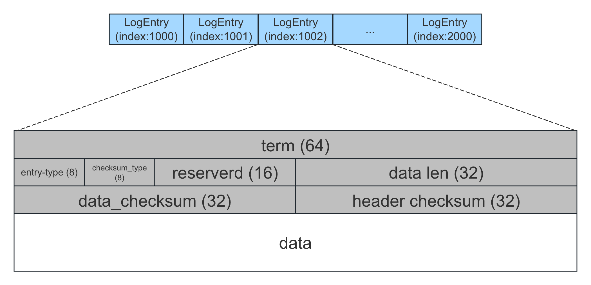

概览
===

`SegmentLogStorage` 是 braft 默认的日志存储，其以 `Segment` 的方式存储日志，每一个 `Segment` 文件存储一段连续的日志，当单个文件大小达到上限（默认 `8MB`）后，会将其关闭，并创建一个新的 Segment 文件用于写入。

由于日志的顺序特性以及在内存中构建索引的方式，其具有较好的读写性能：

* 写入：追加写。一批日志先写入 `Page Cache`，再调用一次 `sync` 落盘
* 读取：在内存中构建了 `logIndex` 到文件 `offset` 的索引，读取一条日志只需一次 `IO`

此外，为了保证日志的完整性，写入的时候会在 `Header` 中写入 `CRC` 校验值，并在读取的时候进行校验。

组织形式
===

目录结构
---


`SegmentLogStorage` 管理的目录下将会拥有以下这些文件：

* 一个元数据文件：记录 `firstLogIndex`
* 多个 `closed segment`：已经写满并关闭的 `Segment` 文件
* 一个 `open segment`：正在写入的 `Segment` 文件

`closed segment` 和 `open segment` 都有各自的命名规则：
* `closed segment`：文件名格式为 `log_{first_index}-{last_index}`，例如 `log_000001-0001000`，表示该文件保存的日志的索引范围为 `[1, 1000]`
* `open segment`：文件名格式为 `log_inprogress_{first_index}`，例如 `log_inprogress_0003001`，表示该文件保存的日志的索引范围为 `[3001, ∞)`


```cpp
// LogStorage use segmented append-only file, all data in disk, all index in memory.
// append one log entry, only cause one disk write, every disk write will call fsync().
//
// SegmentLog layout:
//      log_meta: record start_log
//      log_000001-0001000: closed segment
//      log_inprogress_0001001: open segment
```


Segment 文件
---



每个 `Segment` 文件保存一段连续的日志（`LogEntry`），每条日志由 24 字节的 `Header` 和实际的数据组成。

`Header` 字段：

| 字段            | 占用位数 | 说明                                       |
|:----------------|:---------|:-------------------------------------------|
| term            | 64       | 日志的 `term`                              |
| entry-type      | 8        | 日志的类型：`no_op`/`data`/`configuration` |
| checksum_type   | 8        | 校验类型：`CRC32`/`MurMurHash32`           |
| reserved        | 16       | 保留字段                                   |
| data len        | 32       | 日志实际数据的长度                         |
| data_checksum   | 32       | 日志实际数据的校验值                       |
| header checksum | 32       | `Header`（前 20 字节） 的校验值            |


内存索引
---

为了快速读取日志，`SegmentLogStorage` 在内存中构建 2 层索引：

**1. 文件索引**

由于每个 `Segment` 文件保存的是一段连续的日志，可以构建每个 `Segment` 的 `firstIndex` 到 `Segment` 文件的映射。这样就可以根据日志的 `logIndex` 可以快速定位到其属于哪个 `Segment` 文件：

| firstIndex | Segment 指针                   |
|:-----------|:-------------------------------|
| 1          | `fd=10`, `offset_and_term`... |
| 1001       | `fd=11`, `offset_and_term`... |
| 2001       | `fd=12`, `offset_and_term`... |
| 3001       | `fd=13`, `offset_and_term`... |

**2. offset 索引**

找到指定的 `Segment` 文件后，需要知道日志在该文件的 `offset` 以及 `length`，才可以一次性读取出来。为此为每个 `Segment` 文件构建了 `logIndex` 到文件 `offset` 的映射（即 `offset_and_term`），而日志的 `length` 可以通过 `logIndex+1` 日志的 `offset` 减去当前的 `offset` 算出来。

举个例子，下表为某个 `Segment` 的 `offset_and_term` 映射表。从表中可以得知 `logIndex=1001` 这条日志的 `offset` 是 `1100`，而其 `length` 可通过计算得到，为 `1200-1100=100`。

| logIndex | offset |
|:---------|:-------|
| 1001     | 1100   |
| 1002     | 1200   |

有了这 2 层索引，我们就可以快速定位到某一条日志属于哪个文件，并且也可以迅速获得其在该文件中的 `offset` 和 `length`。

> **获取日志的 term**
>
> 特别需要注意的是，在算法的执行过程中经常要获取日志的 `term`，如 Follower 在接收到 `AppendEntries` 请求时需要获取自身最后一条日志的 `term`，与请求中携带的 Leader 的 `term` 进行对比，以此来判断日志是否连续。如果每次都从文件中读取，显然是低效的，为此将日志的 `term` 也保存到了内存中，就是我们上述提到的 `offset_and_term` 映射表，其实该表映射的值不是 `offset`，而是 `<offset,term>` 的 `pair。

具体实现
===

日志写入
---

`LogManager` 在接收到用户的日志后，会调用 `SegmentLogStorage::append_entries` 进行追加日志，该函数主要做以下几个工作：

```cpp
int SegmentLogStorage::append_entries(const std::vector<LogEntry*>& entries, IOMetric* metric) {
    ...
    // (1) 如果日志不连续，则返回失败
    if (_last_log_index.load(butil::memory_order_relaxed) + 1
            != entries.front()->id.index) {
        ...
        return -1;
    }
    ...
    for (size_t i = 0; i < entries.size(); i++) {
        ...
        LogEntry* entry = entries[i];
        ...
        // (2) 获取 open segment，如果不存在或已经写满则重新创建一个
        scoped_refptr<Segment> segment = open_segment();
        ...
        // (3) 将每一个 LogEntry 追加到 open segment
        int ret = segment->append(entry);
        ...
        // (4) 每成功写入一个 LogEntry，则将 lastLogIndex+1
        _last_log_index.fetch_add(1, butil::memory_order_release);
        last_segment = segment;
    }
    ...
    // (5) 最后调用 fsync 将数据落盘
    last_segment->sync(_enable_sync, has_conf);
    ..
    return entries.size();
}
```

`Segment::append` 会将日志写入到 `Segment` 文件，其流程如下：
```cpp
// serialize entry, and append to open segment
int Segment::append(const LogEntry* entry) {
    ...
    // (1) 准备一个 IOBuf
    butil::IOBuf data;
    ...
    // (2) 追加日志实际数据
    data.append(entry->data);
    ...
    // (3) 准备 Header
    char header_buf[ENTRY_HEADER_SIZE];
    const uint32_t meta_field = (entry->type << 24 ) | (_checksum_type << 16);
    RawPacker packer(header_buf);
    packer.pack64(entry->id.term)
          .pack32(meta_field)
          .pack32((uint32_t)data.length())
          .pack32(get_checksum(_checksum_type, data));
    packer.pack32(get_checksum(
                  _checksum_type, header_buf, ENTRY_HEADER_SIZE - 4));

    // (4) 追加 Header
    butil::IOBuf header;
    header.append(header_buf, ENTRY_HEADER_SIZE);

    // (5) 将数据写入 Segment 文件
    const size_t to_write = header.length() + data.length();
    butil::IOBuf* pieces[2] = { &header, &data };
    size_t start = 0;
    ssize_t written = 0;
    while (written < (ssize_t)to_write) {
        const ssize_t n = butil::IOBuf::cut_multiple_into_file_descriptor(
                _fd, pieces + start, ARRAY_SIZE(pieces) - start);
        ...
        written += n;
        for (;start < ARRAY_SIZE(pieces) && pieces[start]->empty(); ++start) {}
    }

    // (6) 插入 offset 索引，便于读取
    _offset_and_term.push_back(std::make_pair(_bytes, entry->id.term));
    ...
    // (7) 累加未 sync 的字节数
    _unsynced_bytes += to_write;
    return 0;
}
```

`sync` 操作根据相关配置来判断是不是需要执行：
```cpp
int Segment::sync(bool will_sync, bool has_conf) {
    //CHECK(_is_open);
    if (will_sync) {
        if (!FLAGS_raft_sync) {
            return 0;
        }
        if (FLAGS_raft_sync_policy == RaftSyncPolicy::RAFT_SYNC_BY_BYTES
            && FLAGS_raft_sync_per_bytes > _unsynced_bytes
            && !has_conf) {
            return 0;
        }
        _unsynced_bytes = 0;
        // 调用 fsync(fd)
        return raft_fsync(_fd);
    }
    return 0;
}
```

获取 term
---

获取日志的 `term` 直接从我们上述提到的 `offset_and_term` 映射表中获取即可：

```cpp
int64_t Segment::get_term(const int64_t index) const {
    /*
     * struct LogMeta {
     *   off_t offset;
     *   size_t length;
     *   int64_t term;
     * };
     */
    LogMeta meta;
    if (_get_meta(index, &meta) != 0) {
        return 0;
    }
    return meta.term;
}

int Segment::_get_meta(int64_t index, LogMeta* meta) const {
    ...
    /*
     * offset_and_term 映射表是用 vector 存储的
     * _first_index 是该 Segment 存储的第一条日志 index
     */
    int64_t meta_index = index - _first_index;
    int64_t entry_cursor = _offset_and_term[meta_index].first;
    int64_t next_cursor = (index < _last_index.load(butil::memory_order_relaxed))
                          ? _offset_and_term[meta_index + 1].first : _bytes;
    meta->offset = entry_cursor;
    meta->term = _offset_and_term[meta_index].second;
    meta->length = next_cursor - entry_cursor;
    return 0;
}
```

日志读取
---

当 `LogManager` 需要读取日志时，会优先从内存中读取，如果内存中不存在，则调用 `SegmentLogStorage::get_entry` 从磁盘读取日志。特别地，当节点重启回放日志时，需要从磁盘读取日志。

`get_entry` 会先根据日志的 `index` 找到对应的 `Segment`，在调用 `Segment::get` 读取对应的日志：

```cpp
LogEntry* SegmentLogStorage::get_entry(const int64_t index) {
    scoped_refptr<Segment> ptr;
    if (get_segment(index, &ptr) != 0) {
        return NULL;
    }
    return ptr->get(index);
}
```

获取对应的 `Segment`：

```cpp
int SegmentLogStorage::get_segment(int64_t index, scoped_refptr<Segment>* ptr) {
    ...
    // (1) 优先判断是不是属于 open segment
    if (_open_segment && index >= _open_segment->first_index()) {
        *ptr = _open_segment;
    } else {  // (2) 再在 closed segment 中查找
        SegmentMap::iterator it = _segments.upper_bound(index);
        SegmentMap::iterator saved_it = it;
        --it;
        ...
        *ptr = it->second;
    }
    return 0;
}

```

`Segment::get` 会现在我们上述提到的 `offset_and_term` 表中找到日志对应的 `offset` 和 `length`，之后再调用 `_load_entry` 读取日志，并对日志的 `Header` 和 `data` 做 `CRC` 校验：

```cpp
LogEntry* Segment::get(const int64_t index) const {
    // (1) 获取日志的 `offset` 和 `length`
    /*
     * struct LogMeta {
     *   off_t offset;
     *   size_t length;
     *   int64_t term;
     * };
     */
    LogMeta meta;
    _get_meta(index, &meta);

    do {
        // (2) 读取日志并校验
        ConfigurationPBMeta configuration_meta;
        EntryHeader header;
        butil::IOBuf data;
        _load_entry(meta.offset, &header, &data, meta.length);

        // (3) 返回日志
        ...
        entry->data.swap(data);
        ...
        entry->id.index = index;
        entry->id.term = header.term;
        entry->type = (EntryType)header.type;
    } while (0);
}

int Segment::_get_meta(int64_t index, LogMeta* meta) const {
    ...
        ...
    /*
     * offset_and_term 映射表是用 vector 存储的
     * _first_index 是该 Segment 存储的第一条日志 index
     */
    int64_t meta_index = index - _first_index;
    int64_t entry_cursor = _offset_and_term[meta_index].first;
    int64_t next_cursor = (index < _last_index.load(butil::memory_order_relaxed))
                          ? _offset_and_term[meta_index + 1].first : _bytes;
    meta->offset = entry_cursor;
    meta->term = _offset_and_term[meta_index].second;
    meta->length = next_cursor - entry_cursor;  // LogEntry 的长度，包括 Header 和 Data
    return 0;
}

int Segment::_load_entry(off_t offset, EntryHeader* head, butil::IOBuf* data, size_t size_hint) const {
    // (1) 一次性读取完整日志，包括 Header 和 data
    size_t to_read = std::max(size_hint, ENTRY_HEADER_SIZE);
    const ssize_t n = file_pread(&buf, _fd, offset, to_read);

    // (2) 对 Header 做 CRC 校验
    char header_buf[ENTRY_HEADER_SIZE];
    const char *p = (const char *)buf.fetch(header_buf, ENTRY_HEADER_SIZE);
    if (!verify_checksum(tmp.checksum_type, p, ENTRY_HEADER_SIZE - 4, header_checksum)) {
        return -1;
    }

    // (3) 对 data 做 CRC 校验
    if (data != NULL) {
        ...
        if (!verify_checksum(tmp.checksum_type, buf, tmp.data_checksum)) {
            return -1;
        }
        data->swap(buf);
    }
}
```

日志删除
---

日志删除主要有以下 2 个接口:
* `truncate_prefix`：用于节点在打完快照后删除前缀日志
* `truncate_suffix`：用于 Follower 在接收到 `AppendEntries` 请求后，如果发现和 Leader 的不匹配，需要裁剪掉不匹配的日志：

```cpp
int SegmentLogStorage::truncate_prefix(const int64_t first_index_kept)
int SegmentLogStorage::truncate_suffix(const int64_t last_index_kept)
```

`truncate_prefix` 会先将 `firstLogIndex` 保存到元数据文件中，然后删除所有小于 `firstLogIndex` 的 `Segment` 文件。需要注意的是，先保存 `firstLogIndex` 再删除文件主要是为了保证原子性，即使删除到一半 Crash 了，在节点重启的时候也会根据 `firstLogIndex` 继续删除剩余的文件：

```cpp
int SegmentLogStorage::truncate_prefix(const int64_t first_index_kept) {
    ...
    // NOTE: truncate_prefix is not important, as it has nothing to do with
    // consensus. We try to save meta on the disk first to make sure even if
    // the deleting fails or the process crashes (which is unlikely to happen).
    // The new process would see the latest `first_log_index'
    if (save_meta(first_index_kept) != 0) { // NOTE
    ...
        return -1;
    }

    std::vector<scoped_refptr<Segment> > popped;
    pop_segments(first_index_kept, &popped);
    for (size_t i = 0; i < popped.size(); ++i) {
        popped[i]->unlink();
        ...
    }
    return 0;
}

// (1) 先保存元数据
int SegmentLogStorage::save_meta(const int64_t log_index) {
    ...
    std::string meta_path(_path);
    meta_path.append("/" BRAFT_SEGMENT_META_FILE);  // /log_meta
    ...
    LogPBMeta meta;
    meta.set_first_log_index(log_index);
    ProtoBufFile pb_file(meta_path);
    int ret = pb_file.save(&meta, raft_sync_meta());
    ...
    return ret;
}

// (2) 再获取需要删除的 Segment 文件
void SegmentLogStorage::pop_segments(
        const int64_t first_index_kept,
        std::vector<scoped_refptr<Segment> >* popped) {
    _first_log_index.store(first_index_kept, butil::memory_order_release);
    // (2.1) 先删除 closed segment
    for (SegmentMap::iterator it = _segments.begin(); it != _segments.end();) {
        scoped_refptr<Segment>& segment = it->second;
        if (segment->last_index() < first_index_kept) {
            popped->push_back(segment);
            _segments.erase(it++);
        } else {
            return;
        }
    }
    // (2.2) 再删除 open segment
    if (_open_segment) {
        if (_open_segment->last_index() < first_index_kept) {
            popped->push_back(_open_segment);
            ...
        }
        ...
    }
    ...
}
```

`truncate_suffix` 的实现和 `truncate_prefix` 类似，都是先找到需要删除的 `Segment` 文件，然后将其删除：

```cpp
int SegmentLogStorage::truncate_suffix(const int64_t last_index_kept) {
    // segment files
    // (1) 获取需要删除的 Segment 文件
    std::vector<scoped_refptr<Segment> > popped;
    scoped_refptr<Segment> last_segment;
    pop_segments_from_back(last_index_kept, &popped, &last_segment);
    ...

    // (2) 调用 `unlink` 将其删除
    // The truncate suffix order is crucial to satisfy log matching property of raft
    // log must be truncated from back to front.
    for (size_t i = 0; i < popped.size(); ++i) {
        ret = popped[i]->unlink();
        if (ret != 0) {
            return ret;
        }
        popped[i] = NULL;
    }
    ...
    return ret;
}
```

日志恢复
---

节点在启动时会重建日志存储，其主要为了完成以下 2 件事：

* 重建我们上述提到的内存索引，包括文件索引和 `offset` 索引（即 `offset_and_term` 映射表）
* 加载日志元数据（即 `firstLogIndex`），删除 `firstLogIndex` 之前的 `Segment` 文件

```cpp
int SegmentLogStorage::init(ConfigurationManager* configuration_manager) {
    butil::FilePath dir_path(_path);
    butil::CreateDirectoryAndGetError(dir_path, ...);
    ...
    do {
        // (1) 加载快照
        ret = load_meta();
        ...
        // (2) 遍历目录，获取所有的 `Segment` 文件，并构建文件索引
        ret = list_segments(is_empty);
        ...
        // (3) 加载 `Segment` 文件，遍历其中的日志，
        //     读取每条日志的 Header（24）字节用来构建 offset 索引
        ret = load_segments(configuration_manager);
        ...
    } while (0);
    ...
}
```

调用 `load_meta` 读取 `firstLogIndex`：
```cpp
int SegmentLogStorage::load_meta() {
    std::string meta_path(_path);
    meta_path.append("/" BRAFT_SEGMENT_META_FILE);  // "/log_meta"

    /*
     * message LogPBMeta {
     *     required int64 first_log_index = 1;
 .   * };
     */
    ProtoBufFile pb_file(meta_path);
    LogPBMeta meta;
    pb_file.load(&meta));

    _first_log_index.store(meta.first_log_index());
}
```

调用 `list_segments` 遍历目录，获取所有的 `Segment` 文件，并构建文件索引：

```cpp
int SegmentLogStorage::list_segments(bool is_empty) {
    butil::DirReaderPosix dir_reader(_path.c_str());

    // (1) 遍历日志目录
    // restore segment meta
    while (dir_reader.Next()) {
        ...
        // (2) closed segment, e.g.log_000001-0001000
        match = sscanf(dir_reader.name(), BRAFT_SEGMENT_CLOSED_PATTERN,
                       &first_index, &last_index);
        if (match == 2) {
            Segment* segment = new Segment(_path, first_index, last_index, _checksum_type);
            _segments[first_index] = segment;
            continue;
        }

        // (3) open segment, e.g. log_inprogress_0001001
        match = sscanf(dir_reader.name(), BRAFT_SEGMENT_OPEN_PATTERN, &first_index);
        if (match == 1) {
            if (!_open_segment) {
                _open_segment = new Segment(_path, first_index, _checksum_type);
                continue;
            }
        }
    }
    ...
}
```

调用 `load_segments` 来加载 `Segment` 文件，遍历其中的日志，读取每条日志的 `Header`（24 字节）用来构建 offset 索引：

```cpp
int SegmentLogStorage::load_segments(ConfigurationManager* configuration_manager) {
    // (1) 加载 closed segments
    SegmentMap::iterator it;
    for (it = _segments.begin(); it != _segments.end(); ++it) {
         Segment* segment = it->second.get();
         ret = segment->load(configuration_manager);
         ...
    }

    // (2) 加载 open segment
    if (_open_segment) {
        ret = _open_segment->load(configuration_manager);
        ..
    }
}

int Segment::load(ConfigurationManager* configuration_manager) {
    // (1) 打开 segment 文件
    _fd = ::open(path.c_str(), O_RDWR);

    // (2) 读取每个 LogEntry 的 Header，构建o ffset_and_term
    int64_t entry_off = 0;
    for (int64_t i = _first_index; entry_off < file_size; i++) {
        // (2.1) 读取 Header
        EntryHeader header;
        const int rc = _load_entry(entry_off, &header, NULL, ENTRY_HEADER_SIZE);
        ...
        const int64_t skip_len = ENTRY_HEADER_SIZE + header.data_len;
        ...
        // (2.2) 创建对应的索引
        _offset_and_term.push_back(std::make_pair(entry_off, header.term));
        // (2.3) 通过 offset 和 Header 中的 data_len 计算下一条日志的 offset
        entry_off += skip_len;
    }
}
```

参考
===

* [Braft详解](https://github.com/kasshu/braft-docs)
