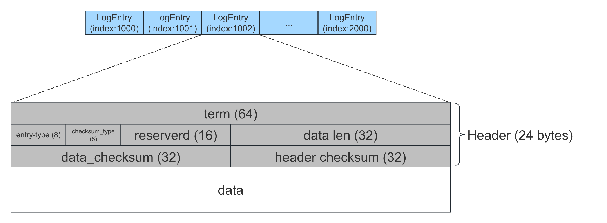

概览
===

`SegmentLogStorage` 是 braft 默认的日志存储，其以 `Segment` 的方式存储日志，每一个 `Segment` 文件存储一段连续的日志，当单个文件大小达到上限（默认 `8MB`）后，会将其关闭，并创建一个新的 Segment 文件用于写入。

由于日志的顺序特性以及在内存中构建索引的方式，其具有较好的读写性能：

* 写入：追加写。一批日志先写入 `Page Cache`，再调用一次 `sync` 落盘
* 读取：在内存中构建了 `logIndex` 到文件 `offset` 的索引，读取一条日志只需一次 `IO`

此外，为了保证日志的完整性，写入的时候会在 `Header` 中写入 `CRC` 校验值，并在读取的时候进行校验。

组织形式
===

目录结构
---


`SegmentLogStorage` 管理的目录下将会拥有以下这些文件：

* 一个元数据文件：记录 `firstLogIndex`
* 多个 `closed segment`：已经写满并关闭的 `Segment` 文件
* 一个 `open segment`：正在写入的 `Segment` 文件

`closed segment` 和 `open segment` 都有各自的命名规则：
* `closed segment`：文件名格式为 `log_{first_index}-{last_index}`，例如 `log_000001-0001000`，表示该文件保存的日志的索引范围为 `[1, 1000]`
* `open segment`：文件名格式为 `log_inprogress_{first_index}`，例如 `log_inprogress_0003001`，表示该文件保存的日志的索引范围为 `[3001, ∞)`


```cpp
// LogStorage use segmented append-only file, all data in disk, all index in memory.
// append one log entry, only cause one disk write, every disk write will call fsync().
//
// SegmentLog layout:
//      log_meta: record start_log
//      log_000001-0001000: closed segment
//      log_inprogress_0001001: open segment
```


Segment 文件
---



每个 `Segment` 文件保存一段连续的日志（`LogEntry`），每条日志由 24 字节的 `Header` 和实际的数据组成。

`Header` 字段：

| 字段            | 占用位数 | 说明                                       |
|:----------------|:---------|:-------------------------------------------|
| term            | 64       | 日志的 `term`                              |
| entry-type      | 8        | 日志的类型：`no_op`/`data`/`configuration` |
| checksum_type   | 8        | 校验类型：`CRC32`/`MurMurHash32`           |
| reserved        | 16       | 保留字段                                   |
| data len        | 32       | 日志实际数据的长度                         |
| data_checksum   | 32       | 日志实际数据的校验值                       |
| header checksum | 32       | `Header`（前 20 字节） 的校验值            |


内存索引
---

为了快速读取日志，`SegmentLogStorage` 在内存中构建 2 层索引：

**1. 文件索引**

由于每个 `Segment` 文件保存的是一段连续的日志，可以构建每个 `Segment` 的 `firstIndex` 到 `Segment` 文件的映射。这样就可以根据日志的 `logIndex` 可以快速定位到其属于哪个 `Segment` 文件：

| firstIndex | Segment 指针                   |
|:-----------|:-------------------------------|
| 1          | `fd=10`, `offset_and_term`... |
| 1001       | `fd=11`, `offset_and_term`... |
| 2001       | `fd=12`, `offset_and_term`... |
| 3001       | `fd=13`, `offset_and_term`... |

**2. offset 索引**

找到指定的 `Segment` 文件后，需要知道日志在该文件的 `offset` 以及 `length`，才可以一次性读取出来。为此为每个 `Segment` 文件构建了 `logIndex` 到文件 `offset` 的映射（即 `offset_and_term`），而日志的 `length` 可以通过 `logIndex+1` 日志的 `offset` 减去当前的 `offset` 算出来。

举个例子，下表为某个 `Segment` 的 `offset_and_term` 映射表。从表中可以得知 `logIndex=1001` 这条日志的 `offset` 是 `1100`，而其 `length` 可通过计算得到，为 `1200-1100=100`。

| logIndex | offset |
|:---------|:-------|
| 1001     | 1100   |
| 1002     | 1200   |

有了这 2 层索引，我们就可以快速定位到某一条日志属于哪个文件，并且也可以迅速获得其在该文件中的 `offset` 和 `length`。

具体实现
===

日志写入
---

```cpp
int SegmentLogStorage::append_entry(const LogEntry* entry)
```

```cpp
// serialize entry, and append to open segment
int Segment::append(const LogEntry* entry)
```


日志读取
---


```cpp
LogEntry* SegmentLogStorage::get_entry(const int64_t index) {
    scoped_refptr<Segment> ptr;
    if (get_segment(index, &ptr) != 0) {
        return NULL;
    }
    return ptr->get(index);
}
```

```cpp
int SegmentLogStorage::get_segment(int64_t index, scoped_refptr<Segment>* ptr) {

}
```

```cpp
LogEntry* Segment::get(const int64_t index) const {
    /*
     * struct LogMeta {
     *   off_t offset;
     *   size_t length;
     *   int64_t term;
     * };
     */
    LogMeta meta;
    _get_meta(index, &meta);

    do {
        ConfigurationPBMeta configuration_meta;
        EntryHeader header;
        butil::IOBuf data;
        _load_entry(meta.offset, &header, &data, meta.length);

    } while (0);
}
```

```cpp
int Segment::_load_entry(off_t offset, EntryHeader* head, butil::IOBuf* data, size_t size_hint) const {
    size_t to_read = std::max(size_hint, ENTRY_HEADER_SIZE);
    const ssize_t n = file_pread(&buf, _fd, offset, to_read);

    char header_buf[ENTRY_HEADER_SIZE];
    const char *p = (const char *)buf.fetch(header_buf, ENTRY_HEADER_SIZE);
    if (!verify_checksum(tmp.checksum_type, p, ENTRY_HEADER_SIZE - 4, header_checksum)) {
        return -1;
    }

    if (data != NULL) {
        ...
        if (!verify_checksum(tmp.checksum_type, buf, tmp.data_checksum)) {
            return -1;
        }
        data->swap(buf);
    }
}
```

日志删除
---

```cpp
int SegmentLogStorage::truncate_prefix(const int64_t first_index_kept)
int SegmentLogStorage::truncate_suffix(const int64_t last_index_kept)
```


日志恢复
---

```cpp
int SegmentLogStorage::init(ConfigurationManager* configuration_manager) {
    butil::FilePath dir_path(_path);
    butil::CreateDirectoryAndGetError(dir_path, ...);

    ...

    do {
        ret = load_meta();
        ...
        ret = list_segments(is_empty);
        ...
        ret = load_segments(configuration_manager);
        ...
    } while (0);
    ...
}
```


```cpp
// 在snapshot之后，last_idx小于这个值的log file都可以被丢弃了。而包含这个index的log file，index前面的数据都是多余的，LogManager只处理index之后的
int SegmentLogStorage::load_meta() {
    std::string meta_path(_path);
    meta_path.append("/" BRAFT_SEGMENT_META_FILE);  // "/log_meta"

    /*
     * message LogPBMeta {
     *     required int64 first_log_index = 1;
 .   * };
     */
    ProtoBufFile pb_file(meta_path);
    LogPBMeta meta;
    pb_file.load(&meta));

    _first_log_index.store(meta.first_log_index());
}
```

这一步主要是构建索引：

```cpp
int SegmentLogStorage::list_segments(bool is_empty) {
    butil::DirReaderPosix dir_reader(_path.c_str());

    // restore segment meta
    while (dir_reader.Next()) {
        ...
        // closed segment, e.g.log_000001-0001000
        match = sscanf(dir_reader.name(), BRAFT_SEGMENT_CLOSED_PATTERN,
                       &first_index, &last_index);
        if (match == 2) {
            Segment* segment = new Segment(_path, first_index, last_index, _checksum_type);
            _segments[first_index] = segment;
            continue;
        }

        // open segment, e.g. log_inprogress_0001001
        match = sscanf(dir_reader.name(), BRAFT_SEGMENT_OPEN_PATTERN, &first_index);
        if (match == 1) {
            if (!_open_segment) {
                _open_segment = new Segment(_path, first_index, _checksum_type);
                continue;
            }
        }
    }

    ...

    // 按 `first_index` 从小到大遍历所有 closed segments
    int64_t last_log_index = -1;
    SegmentMap::iterator it;
    for (it = _segments.begin(); it != _segments.end(); ) {

    }
}
```

```cpp
int SegmentLogStorage::load_segments(ConfigurationManager* configuration_manager) {
    // closed segments
    SegmentMap::iterator it;
    for (it = _segments.begin(); it != _segments.end(); ++it) {
         Segment* segment = it->second.get();
         ret = segment->load(configuration_manager);
         _last_log_index.store(segment->last_index(), ...);
    }

    // open segment
    if (_open_segment) {
        ret = _open_segment->load(configuration_manager);
        _last_log_index.store(_open_segment->last_index(), ...);
    }
}
```

对于每个 `LogEntry` 只需要读对应的 *Header* 即可，因为 *Header* 里记录了日志的长度，通过计算就可以找到下一个 `LogEntry` 在文件中的 *offset*，这样就可以构建每个 LogEntry 在，保存在 `_offset_and_term`，对于每一个 LogEntry 来说：
* offset: 记录在 _offset_and_term
* length: 拿下一个 `LogEntry` 减去当前的 offset 就是长度

```cpp
int Segment::load(ConfigurationManager* configuration_manager) {
    _fd = ::open(path.c_str(), O_RDWR);  // 打开 segment 对应的文件

    int64_t entry_off = 0;  // 每个 LogEntry 在文件中的起始 offset
    for (int64_t i = _first_index; entry_off < file_size; i++) {
        EntryHeader header;
        const int rc = _load_entry(entry_off, &header, NULL, ENTRY_HEADER_SIZE);

        const int64_t skip_len = ENTRY_HEADER_SIZE + header.data_len;
        if (header.type == ENTRY_TYPE_CONFIGURATION) {
            scoped_refptr<LogEntry> entry = new LogEntry();
            entry->id.index = i;
            entry->id.term = header.term;

            parse_configuration_meta(data, entry);
            ConfigurationEntry conf_entry(*entry);
            configuration_manager->add(conf_entry);
        }

        _offset_and_term.push_back(std::make_pair(entry_off, header.term));
        entry_off += skip_len;
    }

}
```

参考
===

* [Braft详解](https://github.com/kasshu/braft-docs)
