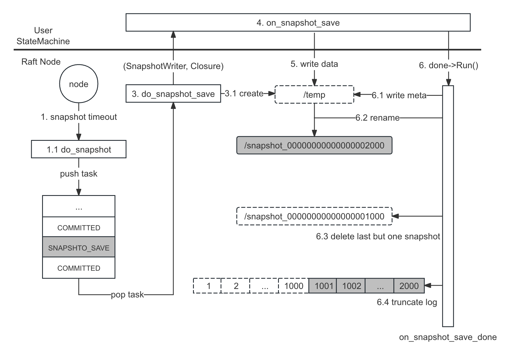

流程详解
===

流程概览
---

快照有压缩日志和加速启动的作用，其创建流程如下：

1. 当快照定时器超时或用户手动调用接口，会触发节点执行创建快照的任务
2. 节点会将任务放进 [ApplyTaskQueue][ApplyTaskQueue]，等待其被执行
3. 当任务执行时，会创建一个 `temp` 目录来保存临时快照，并返回一个 `SnapshotWriter`
4. 以 `SnapshotWriter` 和 `Closure` 做为参数回调用户状态机的 `on_snapshot_save`
5. 用户需通过 `SnapshotWriter` 将状态数据写入到临时快照中
6. 待数据写入完成，用户需回调 `Closure` 将其转换为正式快照：
    * 6.1 将快照元数据写入文件
    * 6.2 通过 `rename()` 将临时快照转换为正式快照
    * 6.3 删除上一个快照
    * 6.4 删除上一个快照对应的日志
7. 至此，快照创建完成

流程整体分为以下 3 个阶段：创建临时快照（1-2），用户写入数据（3-4），转为正式快照（5-6）



流程注解
---

* 1：Leader 和 Follower 各自执行快照任务
* 5.2 正式的快照目录名以当时创建快照时的 `ApplyIndex` 命名，例如 `snapshot_00000000000000001000`

<!--
异步快照
---

如以下图 5.1 所示，快照任务是进入 [ApplyTaskQueue][ApplyTaskQueue]，如果快照是同步执行的话会阻塞后续日志的 `on_apply`，所以一般快照都是异步 + COW 执行：

这样就会导致同一条日志在状态机中应用两次，所以需要状态机保证幂等性。

```cpp
on_snapshot_save() {
    // 1.  new bthread
    bthread.run(do_real_snapshot)
    // 2. return
}

do_real_snapshot() {
    // 3. do real snapshot
}
```
-->


快照元数据
---

```proto
message SnapshotMeta {
    required int64 last_included_index = 1;
    required int64 last_included_term = 2;
    repeated string peers = 3;
    repeated string old_peers = 4;
}

message LocalFileMeta {
    optional bytes user_meta   = 1;
    optional FileSource source = 2;
    optional string checksum   = 3;
}

message LocalSnapshotPbMeta {
    message File {
        required string name = 1;
        optional LocalFileMeta meta = 2;
    };
    optional SnapshotMeta meta = 1;
    repeated File files = 2;
}
```

相关接口
---

```cpp
class Node {
public:
    // Start a snapshot immediately if possible. done->Run() would be invoked
    // when the snapshot finishes, describing the detailed result.
    void snapshot(Closure* done);
};
```

```cpp
class StateMachine {
public:
    // user defined snapshot generate function, this method will block on_apply.
    // user can make snapshot async when fsm can be cow(copy-on-write).
    // call done->Run() when snapshot finished.
    // success return 0, fail return errno
    // Default: Save nothing and returns error.
    virtual void on_snapshot_save(::braft::SnapshotWriter* writer,
                                               ::braft::Closure* done);
};
```

```cpp
class SnapshotWriter : public Snapshot {
public:
    // Add a file to the snapshot.
    // |file_meta| is an implmentation-defined protobuf message
    // All the implementation must handle the case that |file_meta| is NULL and
    // no error can be raised.
    // Note that whether the file will be created onto the backing storage is
    // implementation-defined.
    virtual int add_file(const std::string& filename);

    // Remove a file from the snapshot
    // Note that whether the file will be removed from the backing storage is
    // implementation-defined.
    virtual int remove_file(const std::string& filename) = 0;
};
```

阶段一：创建临时快照
===

触发快照任务
---

节点有以下 2 种方式触发快照任务，其最终都是调用 `NodeImpl::do_snapshot` 执行快照任务

* 快照定时器超时：

```cpp
void SnapshotTimer::run() {
    _node->handle_snapshot_timeout();
}

void NodeImpl::handle_snapshot_timeout() {
    ...
    do_snapshot(NULL);
}
```

* 用户手动触发：
```cpp
void Node::snapshot(Closure* done) {
    _impl->snapshot(done);
}

void NodeImpl::snapshot(Closure* done) {
    do_snapshot(done);
}
```

执行快照任务
---

在正式创建快照前会做一些判断，决定是否要创建快照；若确定要创建快照，则：
* 创建 `temp` 目录用于保存临时快照
* 将创建快照任务放入 [ApplyTaskQueue][ApplyTaskQueue] 中等待被执行

执行快照任务：
```cpp
void NodeImpl::do_snapshot(Closure* done) {
    ...
    if (_snapshot_executor) {
        _snapshot_executor->do_snapshot(done);
    }
    ...
}
```

```cpp
void SnapshotExecutor::do_snapshot(Closure* done) {
    ...
    // (1) 判断 1：正在从 Leader 下载快照
    // check snapshot install/load
    if (_downloading_snapshot.load(butil::memory_order_relaxed)) {
        ...
        return;
    }

    // (2) 判断 2：已经有创建快照任务在运行了
    // check snapshot saving?
    if (_saving_snapshot) {
        ...
        return;
    }

    // (3) 判断 3：如果上次创建快照到目前为止被应用的日志极少，则放弃本次任务
    //     FLAGS_raft_do_snapshot_min_index_gap 默认是 1
    int64_t saved_fsm_applied_index = _fsm_caller->last_applied_index();
    if (saved_fsm_applied_index - _last_snapshot_index <
                                        FLAGS_raft_do_snapshot_min_index_gap) {
        // There might be false positive as the last_applied_index() is being
        // updated. But it's fine since we will do next snapshot saving in a
        // predictable time.
        ...
        _log_manager->clear_bufferred_logs();  // TODO(@Wine93)
        ...
        return;
    }

    // (4) 创建 temp 目录用于保存临时快照，并返回 SnapshotWriter
    SnapshotWriter* writer = _snapshot_storage->create();
    ...
    _saving_snapshot = true;

    // 当用户保存完快照后，将回调这个 Closure，见阶段三
    SaveSnapshotDone* snapshot_save_done = new SaveSnapshotDone(this, writer, done);

    // (5) 将创建快照任务放入 ApplyTaskQueue 中等待被执行
    if (_fsm_caller->on_snapshot_save(snapshot_save_done) != 0) {
        ...
        return;
    }
}
```

创建临时目录
---

创建 `temp` 目录，若已存在则先将其删除，并返回 `SnapshotWriter`：

```cpp
SnapshotWriter* LocalSnapshotStorage::create() {
    return create(true);
}

SnapshotWriter* LocalSnapshotStorage::create(bool from_empty) {
    LocalSnapshotWriter* writer = NULL;

    do {
        std::string snapshot_path(_path);  // _path 为用户配置的快照目录
        snapshot_path.append("/");
        snapshot_path.append(_s_temp_path);  // e.g. data/temp

        // (1) 删除 temp 目录
        // delete temp
        // TODO: Notify watcher before deleting
        if (_fs->path_exists(snapshot_path) && from_empty) {
            if (destroy_snapshot(snapshot_path) != 0) {
                break;
            }
        }

        writer = new LocalSnapshotWriter(snapshot_path, _fs.get());
        if (writer->init() != 0) {  // (2) 创建 temp 目录
            ...
            break;
        }
    } while (0);

    return writer;
}
```

回调 on_snapshot_save
---

将创建快照任务放入 `ApplyTaskQueue`，待其被执行时：
* 准备好元数据，将其保存在 `Closure` 中
* 将 `Closure` 和 上述创建的 `SnapshotWriter` 作为参数回调用户状态机的 `on_snapshot_save`。

将任务放入队列：
```cpp
int FSMCaller::on_snapshot_save(SaveSnapshotClosure* done) {
    ApplyTask task;
    task.type = SNAPSHOT_SAVE;
    task.done = done;
    return bthread::execution_queue_execute(_queue_id, task);
}
```

队列消费函数：
```cpp
int FSMCaller::run(void* meta, bthread::TaskIterator<ApplyTask>& iter) {
    ...
    for (; iter; ++iter) {
        switch (iter->type) {
        ...
        case SNAPSHOT_SAVE:
            caller->_cur_task = SNAPSHOT_SAVE;
            if (caller->pass_by_status(iter->done)) {
                caller->do_snapshot_save((SaveSnapshotClosure*)iter->done);
            }
            break;
        ...
        }
    }
    ...
}
```

回调状态机 `on_snapshot_save`:
```cpp
void FSMCaller::do_snapshot_save(SaveSnapshotClosure* done) {
    //（1）准备快照元数据
    int64_t last_applied_index = _last_applied_index.load(butil::memory_order_relaxed);

    SnapshotMeta meta;
    meta.set_last_included_index(last_applied_index);  // (1.1) 最后一条应用日志的 Index
    meta.set_last_included_term(_last_applied_term);   // (1.2) 最后一条应用日志的 Term

    // (1.3) 当前集群的配置
    //       若 old_peers 不为空，则为配置变更的 C{old,new}
    //       否则为当前集群的配置，即 C{new}
    ConfigurationEntry conf_entry;
    _log_manager->get_configuration(last_applied_index, &conf_entry);
    for (Configuration::const_iterator
            iter = conf_entry.conf.begin();
            iter != conf_entry.conf.end(); ++iter) {
        *meta.add_peers() = iter->to_string();
    }
    for (Configuration::const_iterator
            iter = conf_entry.old_conf.begin();
            iter != conf_entry.old_conf.end(); ++iter) {
        *meta.add_old_peers() = iter->to_string();
    }

    // (2) 回调 on_snapshot_save
    SnapshotWriter* writer = done->start(meta);
    ...
    _fsm->on_snapshot_save(writer, done);
    return;
}
```

阶段二：用户写入数据
===

写入数据
---

用户需要实现 `on_snapshot_save`，在该函数中需要执行实际的创建快照任务，并通过 `add_file` 将所有文件逐一加入到快照中，待全部完成后，调用 `done->Run()` 将其转换为正式快照：


```cpp
class StateMachine {
public:
    // user defined snapshot generate function, this method will block on_apply.
    // user can make snapshot async when fsm can be cow(copy-on-write).
    // call done->Run() when snapshot finished.
    // success return 0, fail return errno
    // Default: Save nothing and returns error.
    virtual void on_snapshot_save(::braft::SnapshotWriter* writer,
                                               ::braft::Closure* done);
};
```

```cpp
class SnapshotWriter : public Snapshot {
public:
    // Add a file to the snapshot.
    // |file_meta| is an implmentation-defined protobuf message
    // All the implementation must handle the case that |file_meta| is NULL and
    // no error can be raised.
    // Note that whether the file will be created onto the backing storage is
    // implementation-defined.
    virtual int add_file(const std::string& filename);

    // Remove a file from the snapshot
    // Note that whether the file will be removed from the backing storage is
    // implementation-defined.
    virtual int remove_file(const std::string& filename) = 0;
};
```

阶段三：转为正式快照
===

用户完成快照的创建后，会回调 `SaveSnapshotDone::Run()`，而该函数会将临时快照 `rename` 成正式快照，并删除上一个快照，以及删除上一个快照对应的日志。

用户回调的 `done->Run()`：
```cpp
void SaveSnapshotDone::Run() {
    // Avoid blocking FSMCaller
    // This continuation of snapshot saving is likely running inplace where the
    // on_snapshot_save is called (in the FSMCaller thread) and blocks all the
    // following on_apply. As blocking is not necessary and the continuation is
    // not important, so we start a bthread to do this.
    bthread_t tid;
    if (bthread_start_urgent(&tid, NULL, continue_run, this) != 0) {
        ...
    }
}

void* SaveSnapshotDone::continue_run(void* arg) {
    SaveSnapshotDone* self = (SaveSnapshotDone*)arg;
    ...
    // Must call on_snapshot_save_done to clear _saving_snapshot
    // (1)
    int ret = self->_se->on_snapshot_save_done(
        self->status(), self->_meta, self->_writer);
    }

    // (2) self->_done：用户手动调用 snapshot 传入的 Closure
    if (self->_done) {
        run_closure_in_bthread(self->_done, true);
    }
    return NULL;
}
```

```cpp
int SnapshotExecutor::on_snapshot_save_done(
    const butil::Status& st, const SnapshotMeta& meta, SnapshotWriter* writer) {
    std::unique_lock<raft_mutex_t> lck(_mutex);
    int ret = st.error_code();
    // InstallSnapshot can break SaveSnapshot, check InstallSnapshot when SaveSnapshot
    // because upstream Snapshot maybe newer than local Snapshot.
    if (st.ok()) {
        if (meta.last_included_index() <= _last_snapshot_index) {
            ret = ESTALE;
            LOG_IF(WARNING, _node != NULL) << "node " << _node->node_id()
                << " discards an stale snapshot "
                << " last_included_index " << meta.last_included_index()
                << " last_snapshot_index " << _last_snapshot_index;
            writer->set_error(ESTALE, "Installing snapshot is older than local snapshot");
        }
    }
    lck.unlock();

    if (ret == 0) {
        if (writer->save_meta(meta)) {
            LOG(WARNING) << "node " << _node->node_id() << " fail to save snapshot";
            ret = EIO;
        }
    } else {
        if (writer->ok()) {
            writer->set_error(ret, "Fail to do snapshot");
        }
    }

    if (_snapshot_storage->close(writer) != 0) {
        ret = EIO;
        LOG(WARNING) << "node " << _node->node_id() << " fail to close writer";
    }


    if (ret == 0) {
        _last_snapshot_index = meta.last_included_index();
        _last_snapshot_term = meta.last_included_term();
        lck.unlock();
        ss << "snapshot_save_done, last_included_index=" << meta.last_included_index()
           << " last_included_term=" << meta.last_included_term();
        LOG(INFO) << ss.str();
        _log_manager->set_snapshot(&meta);
        lck.lock();
    }

    _saving_snapshot = false;
    return ret;
}
```

写入元数据
---
删除上一个快照
---

在 `close` 函数中主要以下做三件事：
* (1) 将元数据写入到文件
* (2) 删除上一个快照
* (2) 调用 `LogManager::set_snapshot` 删除上一个快照对应的日志

```cpp
int LocalSnapshotStorage::close(SnapshotWriter* writer_base,
                                bool keep_data_on_error) {
    LocalSnapshotWriter* writer = dynamic_cast<LocalSnapshotWriter*>(writer_base);
    do {
        ...
        // (1) 将快照元数据写入文件
        ret = writer->sync();
        ...
        //
        int old_index = _last_snapshot_index;
        int64_t new_index = writer->snapshot_index();


        // rename temp to new
        std::string temp_path(_path);
        temp_path.append("/");
        temp_path.append(_s_temp_path);
        std::string new_path(_path);
        butil::string_appendf(&new_path, "/" BRAFT_SNAPSHOT_PATTERN, new_index);
        if (!_fs->delete_file(new_path, true)) {
            ...
            break;
        }
        ...
        if (!_fs->rename(temp_path, new_path)) {
            ...
            break;
        }

        ref(new_index);
        {
            BAIDU_SCOPED_LOCK(_mutex);
            CHECK_EQ(old_index, _last_snapshot_index);
            _last_snapshot_index = new_index;
        }
        // unref old_index, ref new_index

        // (2) 删除上一个快照。特别需要注意的时，这里有一个引用
        //     特别需要注意的时，当前节点可能是 Leader，而该快照可能正用于同步给其他 Follower
        unref(old_index);
    } while (0);
    ...
}
```

将元数据写入 `__raft_snapshot_meta` 文件：
```cpp
int LocalSnapshotWriter::sync() {
    const int rc = _meta_table.save_to_file(_fs, _path + "/" BRAFT_SNAPSHOT_META_FILE);
    ...
    return rc;
}
```

删除上一个快照对应日志
---

为了避免有些 Follower

考虑到仍有 Follower 可能需要

* 删除倒数第二个快照（即当前快照的前一个快照）对应的日志。考虑到仍有 *Follower* 可能仍需要，避免为了几条日志而发送快照，*braft* 并不会立即删除当前快照对应的日志，而是等到下一次快照生成时，再删除本次快照对应的日志：

```cpp
void LogManager::set_snapshot(const SnapshotMeta* meta) {
    BRAFT_VLOG << "Set snapshot last_included_index="
              << meta->last_included_index()
              << " last_included_term=" <<  meta->last_included_term();
    std::unique_lock<raft_mutex_t> lck(_mutex);
    if (meta->last_included_index() <= _last_snapshot_id.index) {
        return;
    }
    Configuration conf;
    for (int i = 0; i < meta->peers_size(); ++i) {
        conf.add_peer(meta->peers(i));
    }
    Configuration old_conf;
    for (int i = 0; i < meta->old_peers_size(); ++i) {
        old_conf.add_peer(meta->old_peers(i));
    }
    ConfigurationEntry entry;
    entry.id = LogId(meta->last_included_index(), meta->last_included_term());
    entry.conf = conf;
    entry.old_conf = old_conf;
    _config_manager->set_snapshot(entry);
    int64_t term = unsafe_get_term(meta->last_included_index());

    const LogId last_but_one_snapshot_id = _last_snapshot_id;
    _last_snapshot_id.index = meta->last_included_index();
    _last_snapshot_id.term = meta->last_included_term();
    if (_last_snapshot_id > _applied_id) {  // 从 leader 下载 snapshot 可能会出现
        _applied_id = _last_snapshot_id;
    }
    // NOTICE: not to update disk_id here as we are not sure if this node really
    // has these logs on disk storage. Just leave disk_id as it was, which can keep
    // these logs in memory all the time until they are flushed to disk. By this
    // way we can avoid some corner cases which failed to get logs.

    // last_included_index > last_index
    // 快照包含的日志长度比当前节点日志长度大，这种情况只可能发生在从 leader 下载过来的 snapshot
    if (term == 0) {
        // last_included_index is larger than last_index
        // FIXME: what if last_included_index is less than first_index?
        _virtual_first_log_id = _last_snapshot_id;
        truncate_prefix(meta->last_included_index() + 1, lck);
        return;
    } else if (term == meta->last_included_term()) {  // last_index >= last_included_index
        // Truncating log to the index of the last snapshot.
        // We don't truncate log before the latest snapshot immediately since
        // some log around last_snapshot_index is probably needed by some
        // followers
        if (last_but_one_snapshot_id.index > 0) {
            // We have last snapshot index
            _virtual_first_log_id = last_but_one_snapshot_id;
            truncate_prefix(last_but_one_snapshot_id.index + 1, lck);
        }
        return;
    } else {
        // TODO: check the result of reset.
        _virtual_first_log_id = _last_snapshot_id;
        reset(meta->last_included_index() + 1, lck);
        return;
    }
    CHECK(false) << "Cannot reach here";
}

```


其他：创建快照失败
===

用户可以在 `on_snapshot_save` 中返回失败

[ApplyTaskQueue]: /ch02/2.1/initialization.md#applytaskqueue