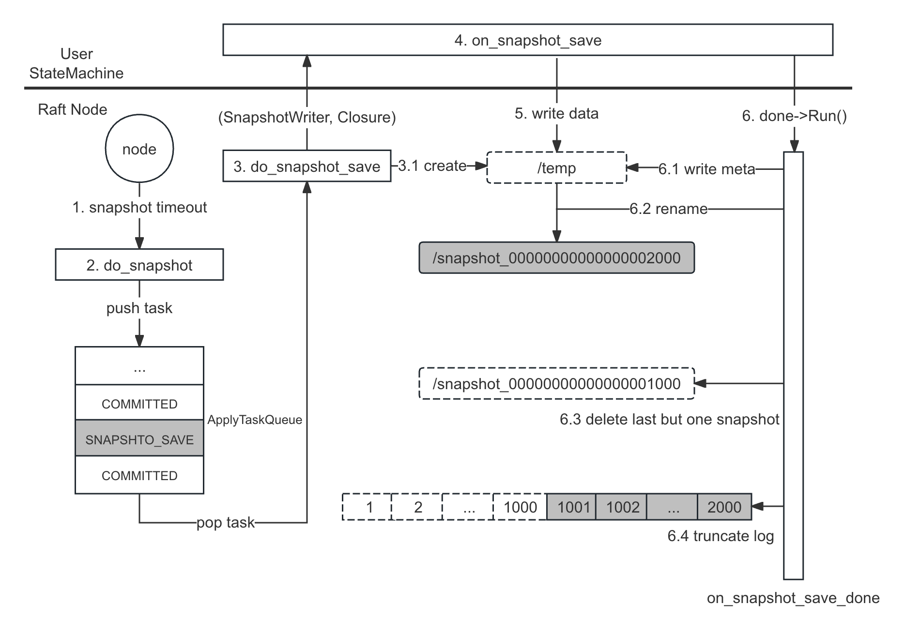

流程详解
===

流程概览
---

快照有压缩日志和加速启动的作用，其创建流程如下：

1. 当快照定时器超时或用户手动调用接口，会触发节点执行创建快照的任务
2. 节点会将任务放进 [ApplyTaskQueue][ApplyTaskQueue]，等待其被执行
3. 当任务被执行时，会创建一个 `temp` 目录用来保存临时快照，并返回一个 `SnapshotWriter`
4. 以 `SnapshotWriter` 和 `Closure` 做为参数调用用户状态机的 `on_snapshot_save`
5. 用户需通过 `SnapshotWriter` 将状态数据写入到临时快照中
    * 5.1 调用 `SnapshotWriter::get_path` 获得快照目录绝对路径，并将快照文件写入该目录
    * 5.2 调用 `SnapshotWriter::add_file` 将快照文件相对路径添加至快照元数据中
6. 待数据写入完成，用户需回调 `Closure` 将其转换为正式快照：
    * 6.1 将快照元数据持久化到文件
    * 6.2 通过 `rename()` 将临时快照转换为正式快照
    * 6.3 删除上一个快照
    * 6.4 删除上一个快照对应的日志
7. 至此，快照创建完成

流程整体分为以下 3 个阶段：创建临时快照（1-3），用户写入数据（4-5），转为正式快照（6-7）

[ApplyTaskQueue]: /ch02/2.1/init.md#applytaskqueue



<!--
异步快照
---

如以下图 5.1 所示，快照任务是进入 [ApplyTaskQueue][ApplyTaskQueue]，如果快照是同步执行的话会阻塞后续日志的 `on_apply`，所以一般快照都是异步 + COW 执行：

这样就会导致同一条日志在状态机中应用两次，所以需要状态机保证幂等性。

```cpp
on_snapshot_save() {
    // 1.  new bthread
    bthread.run(do_real_snapshot)
    // 2. return
}

do_real_snapshot() {
    // 3. do real snapshot
}
```
-->

快照结构
---


正常情况下用户指定的快照存储目录下只会有一个快照目录。当创建快照时，会创建一个 `temp` 目录来保存临时快照，待创建完成后，通过 `rename` 将其转换为正式快照。

正式快照目录以当时创建快照时的 `applyIndex` 命名，如 `snapshot_00000000000000002000`。

快照目录下除了用户写入的快照文件集外，还有一个框架写入的元数据文件 `__raft_snapshot_meta`，元数据主要保存以下 2 部分信息：

* 快照中每一个文件的相对路径
* 快照中包含的最后日志的 `index` 和 `term`，以及集群配置

参见以下元数据 `proto`：

```proto
enum FileSource {
    FILE_SOURCE_LOCAL = 0;
    FILE_SOURCE_REFERENCE = 1;
}

message LocalFileMeta {
    optional bytes user_meta   = 1;
    optional FileSource source = 2;
    optional string checksum   = 3;
}

message SnapshotMeta {
    required int64 last_included_index = 1;
    required int64 last_included_term = 2;
    repeated string peers = 3;
    repeated string old_peers = 4;
}

message LocalSnapshotPbMeta {
    message File {
        required string name = 1;
        optional LocalFileMeta meta = 2;
    };
    optional SnapshotMeta meta = 1;  // (1) 快照元数据
    repeated File files = 2;  // (2) 用户快照文件列表
}
```

相关接口
---

用户手动触发快照：

```cpp
class Node {
public:
    // Start a snapshot immediately if possible. done->Run() would be invoked
    // when the snapshot finishes, describing the detailed result.
    void snapshot(Closure* done);
};
```

用户需要实现的快照函数：

```cpp
class StateMachine {
public:
    // user defined snapshot generate function, this method will block on_apply.
    // user can make snapshot async when fsm can be cow(copy-on-write).
    // call done->Run() when snapshot finished.
    // success return 0, fail return errno
    // Default: Save nothing and returns error.
    virtual void on_snapshot_save(::braft::SnapshotWriter* writer,
                                               ::braft::Closure* done);
};
```

`SnapshotWriter` 相关接口：

```cpp
class SnapshotWriter : public Snapshot {
public:
    // Add a file to the snapshot.
    // |file_meta| is an implmentation-defined protobuf message
    // All the implementation must handle the case that |file_meta| is NULL and
    // no error can be raised.
    // Note that whether the file will be created onto the backing storage is
    // implementation-defined.
    virtual int add_file(const std::string& filename);

    // Remove a file from the snapshot
    // Note that whether the file will be removed from the backing storage is
    // implementation-defined.
    virtual int remove_file(const std::string& filename) = 0;
};

class Snapshot : public butil::Status {
public:
    Snapshot() {}
    virtual ~Snapshot() {}

    // Get the path of the Snapshot
    virtual std::string get_path() = 0;

    // List all the existing files in the Snapshot currently
    virtual void list_files(std::vector<std::string> *files) = 0;

    // Get the implementation-defined file_meta
    virtual int get_file_meta(const std::string& filename,
                              ::google::protobuf::Message* file_meta) {
        (void)filename;
        if (file_meta != NULL) {
            file_meta->Clear();
        }
        return 0;
    }
};
```

阶段一：创建临时快照
===

触发快照任务
---

节点有以下 2 种方式触发快照任务，其最终都是调用 `NodeImpl::do_snapshot` 执行快照任务

* 快照定时器超时：

```cpp
void SnapshotTimer::run() {
    _node->handle_snapshot_timeout();
}

void NodeImpl::handle_snapshot_timeout() {
    ...
    do_snapshot(NULL);
}
```

* 用户手动触发：
```cpp
void Node::snapshot(Closure* done) {
    _impl->snapshot(done);
}

void NodeImpl::snapshot(Closure* done) {
    do_snapshot(done);
}
```

执行快照任务
---

`NodeImpl::do_snapshot` 会调用 `SnapshotExecutor::do_snapshot` 执行快照任务。在正式创建快照前会做一些判断，决定是否要创建快照；若确定要创建快照，则：
* 创建 `temp` 目录用于保存临时快照
* 将创建快照任务放入 [ApplyTaskQueue][ApplyTaskQueue] 中等待被执行

```cpp
void NodeImpl::do_snapshot(Closure* done) {
    ...
    if (_snapshot_executor) {
        _snapshot_executor->do_snapshot(done);
    }
    ...
}

void SnapshotExecutor::do_snapshot(Closure* done) {
    ...
    // (1) 判断 1：正在从 Leader 下载快照
    // check snapshot install/load
    if (_downloading_snapshot.load(butil::memory_order_relaxed)) {
        ...
        return;
    }

    // (2) 判断 2：已经有创建快照任务在运行了
    // check snapshot saving?
    if (_saving_snapshot) {
        ...
        return;
    }

    // (3) 判断 3：如果上次创建快照到目前为止被应用的日志极少，则放弃本次任务
    //     FLAGS_raft_do_snapshot_min_index_gap 默认是 1
    int64_t saved_fsm_applied_index = _fsm_caller->last_applied_index();
    if (saved_fsm_applied_index - _last_snapshot_index <
                                        FLAGS_raft_do_snapshot_min_index_gap) {
        // There might be false positive as the last_applied_index() is being
        // updated. But it's fine since we will do next snapshot saving in a
        // predictable time.
        ...
        _log_manager->clear_bufferred_logs();  // TODO(Wine93)
        ...
        return;
    }

    // (4) 调用 `LocalSnapshotStorage::create` 创建 temp 目录用于保存临时快照
    //     并返回 SnapshotWriter
    SnapshotWriter* writer = _snapshot_storage->create();
    ...
    _saving_snapshot = true;

    // 当用户保存完快照后，将回调这个 Closure，见阶段三
    SaveSnapshotDone* snapshot_save_done = new SaveSnapshotDone(this, writer, done);

    // (5) 将创建快照任务放入 ApplyTaskQueue 中等待被执行
    if (_fsm_caller->on_snapshot_save(snapshot_save_done) != 0) {
        ...
        return;
    }
}
```

创建临时目录
---

`LocalSnapshotStorage::create` 会创建 `temp` 目录，若事先已存在 `temp` 目录，则先将其删除后再创建，并返回 `SnapshotWriter`：

```cpp
SnapshotWriter* LocalSnapshotStorage::create() {
    return create(true);
}

SnapshotWriter* LocalSnapshotStorage::create(bool from_empty) {
    LocalSnapshotWriter* writer = NULL;

    do {
        std::string snapshot_path(_path);  // _path 为用户配置的快照存储目录
        snapshot_path.append("/");
        snapshot_path.append(_s_temp_path);  // e.g. data/temp

        // (1) 删除 temp 目录
        // delete temp
        // TODO: Notify watcher before deleting
        if (_fs->path_exists(snapshot_path) && from_empty) {
            if (destroy_snapshot(snapshot_path) != 0) {
                break;
            }
        }

        // (2) 调用 `LocalSnapshotWriter::init` 创建 temp 目录
        writer = new LocalSnapshotWriter(snapshot_path, _fs.get());
        if (writer->init() != 0) {
            ...
            break;
        }
    } while (0);

    return writer;
}

int LocalSnapshotWriter::init() {
    butil::File::Error e;
    // (3) 创建 temp 目录
    if (!_fs->create_directory(_path, &e, false)) {
        return EIO;
    }
    ...
}
```

调用 `on_snapshot_save`
---

创建好 `temp` 目录后，会调用 `FSMCaller::on_snapshot_save` 将快照任务放入 [ApplyTaskQueue][applytaskqueue]，等待其被执行：

```cpp
int FSMCaller::on_snapshot_save(SaveSnapshotClosure* done) {
    ApplyTask task;
    task.type = SNAPSHOT_SAVE;
    task.done = done;
    return bthread::execution_queue_execute(_queue_id, task);
}
```

队列消费函数会调用 `FSMCaller::do_snapshot_save` 执行快照任务：

```cpp
int FSMCaller::run(void* meta, bthread::TaskIterator<ApplyTask>& iter) {
    ...
    for (; iter; ++iter) {
        switch (iter->type) {
        ...
        case SNAPSHOT_SAVE:
            caller->_cur_task = SNAPSHOT_SAVE;
            if (caller->pass_by_status(iter->done)) {
                caller->do_snapshot_save((SaveSnapshotClosure*)iter->done);
            }
            break;
        ...
        }
    }
    ...
}
```

在 `FSMCaller::do_snapshot_save` 函数中主要做以下 2 件事：
* 准备好元数据，将其保存在 `Closure` 中
* 将上述创建的 `SnapshotWriter` 和 `Closure` 作为参数调用用户状态机的 `on_snapshot_save`

```cpp
void FSMCaller::do_snapshot_save(SaveSnapshotClosure* done) {
    //（1）准备快照元数据
    int64_t last_applied_index = _last_applied_index.load(butil::memory_order_relaxed);  // applyIndex

    SnapshotMeta meta;
    // (1.1) 最后一条应用日志的 index
    meta.set_last_included_index(last_applied_index);
    // (1.2) 最后一条应用日志的 term
    meta.set_last_included_term(_last_applied_term);

    // (1.3) 当前节点的配置
    //       若 old_peers 不为空，则为配置变更的 C{old,new}
    //       否则为当前集群的配置，即 C{new}
    ConfigurationEntry conf_entry;
    _log_manager->get_configuration(last_applied_index, &conf_entry);
    for (Configuration::const_iterator
            iter = conf_entry.conf.begin();
            iter != conf_entry.conf.end(); ++iter) {
        *meta.add_peers() = iter->to_string();
    }
    for (Configuration::const_iterator
            iter = conf_entry.old_conf.begin();
            iter != conf_entry.old_conf.end(); ++iter) {
        *meta.add_old_peers() = iter->to_string();
    }

    // (1.4) 将元数据保存在 `Closure` 中
    SnapshotWriter* writer = done->start(meta);
    ...
    // (2) 调用用户状态机 on_snapshot_save
    _fsm->on_snapshot_save(writer, done);
    return;
}
```

阶段二：用户写入数据
===

用户需要实现状态机的 `on_snapshot_save` 函数，在该函数中用户需要做以下 3 件事：
* 调用 `writer->get_path` 获取临时快照的目录路径，并将快照文件写入到该目录下
* 调用 `write->add` 将快照中每一个文件的相对路径加入到快照元数据中
* 待以上全部完成后，调用 `done->Run` 将临时快照转换为正式快照

```cpp
class StateMachine {
public:
    // user defined snapshot generate function, this method will block on_apply.
    // user can make snapshot async when fsm can be cow(copy-on-write).
    // call done->Run() when snapshot finished.
    // success return 0, fail return errno
    // Default: Save nothing and returns error.
    virtual void on_snapshot_save(::braft::SnapshotWriter* writer,
                                               ::braft::Closure* done);
};
```

写入数据
---

`get_path` 接口会返回临时快照（`temp`）目录 的绝对路径，用户需要在该目录中写入快照文件：

```cpp
class LocalSnapshotWriter : public SnapshotWriter {
public:
    ...
    virtual std::string get_path() { return _path; }
    ...
private:
    // Users shouldn't create LocalSnapshotWriter Directly
    LocalSnapshotWriter(const std::string& path,
                        FileSystemAdaptor* fs);
    ...
    std::string _path;
    ...
};
```

add_file
---

```cpp
class SnapshotWriter : public Snapshot {
public:
    // Add a file to the snapshot.
    // |file_meta| is an implmentation-defined protobuf message
    // All the implementation must handle the case that |file_meta| is NULL and
    // no error can be raised.
    // Note that whether the file will be created onto the backing storage is
    // implementation-defined.
    virtual int add_file(const std::string& filename);
};
```

`add_file` 接口只是将文件路径添加到元数据中而已：

```cpp
int LocalSnapshotWriter::add_file(
        const std::string& filename,
        const ::google::protobuf::Message* file_meta) {
    ...
    return _meta_table.add_file(filename, meta);
}

int LocalSnapshotMetaTable::add_file(const std::string& filename,
                                const LocalFileMeta& meta) {
    Map::value_type value(filename, meta);
    std::pair<Map::iterator, bool> ret = _file_map.insert(value);
    ...
    return ret.second ? 0 : -1;
}
```

阶段三：转为正式快照
===

调用 `Closure`
---

用户完成快照的创建后，会调用 `Closure` 即 `SaveSnapshotDone::Run()`，而该函数会将临时快照 `rename` 成正式快照，并删除上一个快照，以及删除上一个快照对应的日志。

用户调用 `SaveSnapshotDone::Run`，该函数主要执行以下 2 件事：

```cpp
void SaveSnapshotDone::Run() {
    ...
    bthread_t tid;
    if (bthread_start_urgent(&tid, NULL, continue_run, this) != 0) {
        ...
    }
}

void* SaveSnapshotDone::continue_run(void* arg) {
    SaveSnapshotDone* self = (SaveSnapshotDone*)arg;
    ...
    // Must call on_snapshot_save_done to clear _saving_snapshot
    // (1) 调用 `SnapshotExecutor::on_snapshot_save_done` 执行实际的收尾动作
    int ret = self->_se->on_snapshot_save_done(
        self->status(), self->_meta, self->_writer);
    }

    // (2) self->_done：用户手动调用 snapshot 传入的 Closure
    if (self->_done) {
        run_closure_in_bthread(self->_done, true);
    }
    return NULL;
}
```

`on_snapshot_save_done` 会完成以下几项工作：

```cpp
int SnapshotExecutor::on_snapshot_save_done(
    const butil::Status& st, const SnapshotMeta& meta, SnapshotWriter* writer) {
    ...
    // (1) 将快照元数据保存到 `LocalSnapshotMetaTable`，等待持久化
    if (writer->save_meta(meta)) {
        LOG(WARNING) << "node " << _node->node_id() << " fail to save snapshot";
        ret = EIO;
    }

    // (2) 调用 LocalSnapshotStorage::close 写入元数据和将快照转换成正式快照等工作
    if (_snapshot_storage->close(writer) != 0) {
        ...
    }

    // (3) 调用 LogManager::set_snapshot 删除上一个快照对应的日志
    if (ret == 0) {
        _last_snapshot_index = meta.last_included_index();
        _last_snapshot_term = meta.last_included_term();
        ...
        _log_manager->set_snapshot(&meta);
    }
    ...
    _saving_snapshot = false;
    return ret;
}
```

`save_meta` 将元数据保存到 `LocalSnapshotMetaTable` 中：

```cpp
int LocalSnapshotWriter::save_meta(const SnapshotMeta& meta) {
    _meta_table.set_meta(meta);
    return 0;
}

class LocalSnapshotMetaTable {
public:
    ...
    void set_meta(const SnapshotMeta& meta) { _meta = meta; }
    ...
private:
    ...
    SnapshotMeta _meta;
};
```

写入元数据
---

在 `close` 函数中主要以下做三件事：
* (1) 将元数据持久化到文件
* (2) 删除上一个快照
* (3) 调用 `LogManager::set_snapshot` 删除上一个快照对应的日志

```cpp
int LocalSnapshotStorage::close(SnapshotWriter* writer_base,
                                bool keep_data_on_error) {
    LocalSnapshotWriter* writer = dynamic_cast<LocalSnapshotWriter*>(writer_base);
    do {
        ...
        // (1) 将快照元数据写入文件
        ret = writer->sync();
        ...
        //
        int old_index = _last_snapshot_index;
        int64_t new_index = writer->snapshot_index();

        // (2) 将临时快照 rename 成正式快照
        // rename temp to new
        std::string temp_path(_path);
        temp_path.append("/");
        temp_path.append(_s_temp_path);
        std::string new_path(_path);
        butil::string_appendf(&new_path, "/" BRAFT_SNAPSHOT_PATTERN, new_index);
        if (!_fs->delete_file(new_path, true)) {
            ...
            break;
        }
        ...
        if (!_fs->rename(temp_path, new_path)) {
            ...
            break;
        }

        ref(new_index);
        {
            BAIDU_SCOPED_LOCK(_mutex);
            CHECK_EQ(old_index, _last_snapshot_index);
            _last_snapshot_index = new_index;
        }
        // unref old_index, ref new_index

        // (3) 删除上一个快照。特别需要注意的时，这里有一个引用
        //     需要注意的是，当前节点可能是 Leader，而该快照可能正用于下载给 Follower
        unref(old_index);
    } while (0);
    ...
}
```

`sync` 会调用 `save_to_file` 将元数据填充到 `proto`（`LocalSnapshotPbMeta`）中，并将其序列化，最终持久化到文件：

```cpp
int LocalSnapshotWriter::sync() {
    // BRAFT_SNAPSHOT_META_FILE: __raft_snapshot_meta
    const int rc = _meta_table.save_to_file(_fs, _path + "/" BRAFT_SNAPSHOT_META_FILE);
    ...
    return rc;
}

int LocalSnapshotMetaTable::save_to_file(FileSystemAdaptor* fs, const std::string& path) const {
    // (1) _meta 中保存的是 lastIncludeIndex，lastIncludedTerm 以及集群配置
    LocalSnapshotPbMeta pb_meta;
    if (_meta.IsInitialized()) {
        *pb_meta.mutable_meta() = _meta;
    }

    // (2) 将所有文件列表加入到 proto
    for (Map::const_iterator
            iter = _file_map.begin(); iter != _file_map.end(); ++iter) {
        LocalSnapshotPbMeta::File *f = pb_meta.add_files();
        f->set_name(iter->first);
        *f->mutable_meta() = iter->second;
    }

    // (3) 序列化并持久化到文件
    ProtoBufFile pb_file(path, fs);
    int ret = pb_file.save(&pb_meta, raft_sync_meta());
    ...
    return ret;
}
```

删除上一个快照
---

调用 `unref` 删除上一个快照。需要注意的是，当前节点可能是 Leader，而该快照可能正用于下载给其他 Follower，所以需要判断其引用计数，若引用计数为 0，则删除其目录：

```cpp
// (1) index 为上一个快照的 lastIncludeIndex
void LocalSnapshotStorage::unref(const int64_t index) {
    std::unique_lock<raft_mutex_t> lck(_mutex);
    std::map<int64_t, int>::iterator it = _ref_map.find(index);
    // (2) 找到上一个快照
    if (it != _ref_map.end()) {
        // (3) 将其引用计数减一
        it->second--;
        // (4) 如果减到 0，则将其删除
        if (it->second == 0) {
            _ref_map.erase(it);
            std::string old_path(_path);
            butil::string_appendf(&old_path, "/" BRAFT_SNAPSHOT_PATTERN, index);
            destroy_snapshot(old_path);
        }
    }
}

// (5) 删除上一个快照的目录
int LocalSnapshotStorage::destroy_snapshot(const std::string& path) {
    if (!_fs->delete_file(path, true)) {
        ...
        return -1;
    }
    return 0;
}
```

删除上一个快照对应日志
---

调用 `set_snapshot` 删除上一个快照的日志，之所以只删除上一个快照的日志，而不立马删除快照的日志，主要考虑到有些 Follower 还没有同步完日志，如果删除了当前的日志，只能发送快照进行同步，见以下注释：

```cpp
void LogManager::set_snapshot(const SnapshotMeta* meta) {
    ...
    // (1) last_but_one_snapshot_id 是上一个快照的 Id
    const LogId last_but_one_snapshot_id = _last_snapshot_id;

    // Truncating log to the index of the last snapshot.
    // We don't truncate log before the latest snapshot immediately since
    // some log around last_snapshot_index is probably needed by some
    // followers
    if (last_but_one_snapshot_id.index > 0) {
        // We have last snapshot index
        _virtual_first_log_id = last_but_one_snapshot_id;
        // (2) 删除上一个快照对应的日志
        truncate_prefix(last_but_one_snapshot_id.index + 1, lck);
    }
    return;
    ...
}
```

<!--
其他：创建快照失败
===
用户可以在 `on_snapshot_save` 中返回失败
-->
