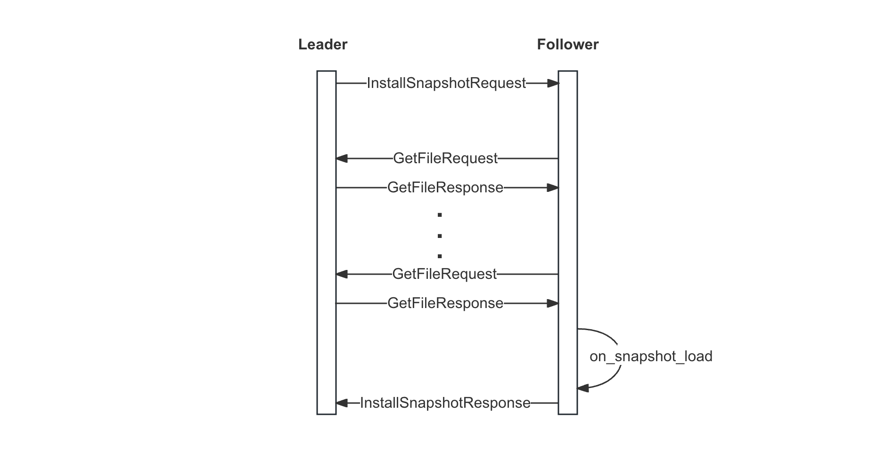
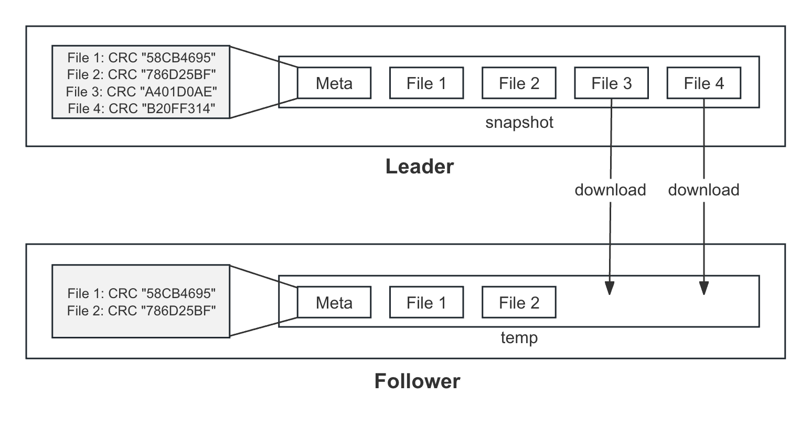
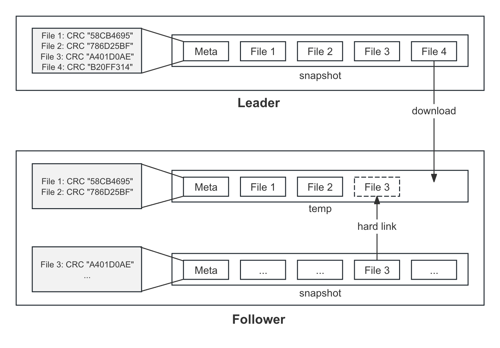

流程详解
===

流程概览
---

当 Follower 落后太多或新节点加入集群时，就会触发安装快照，其流程如下：
1. Leader 向 Follower 发送 `InstallSnapshot` 请求，并停止向 Follower 同步日志
2. Follower 根据请求中的 `URI` 逐一向 Leader 下载快照对应的文件集：
   * 2.1 创建连接 Leader 的客户端
   * 2.2 发送 `GetFileRequest` 请求获取 Leader 快照的元数据
   * 2.3 创建 `temp` 目录保存用于保存下载的临时快照
   * 2.3 根据元数据中的文件列表对比本地快照与远程快照的差异，获得下载文件列表
   * 2.4 根据文件列表，逐一发送 `GetFileRequest` 请求获得文件保存至临时快照中
   * 2.5 待快照下载完成后，删除本地快照，并将临时快照 `rename()` 成正式快照
3. Follower 回调用户状态机的 `on_snapshot_load` 加载快照
4. 等待快照加载完毕后：
    * 4.1 更新 `applyIndex` 为快照的 `lastIncludedIndex`
    * 4.2 删除 `index` 小于 `lastIncludedIndex` 的日志（即全部日志）
5. Follower 向 Leader 发送成功的 `InstallSnapshot` 响应
6. Leader 收到成功响应后更新 Follower 的 `nextIndex` 为快照的 `lastIncludedIndex` + 1
7. Leader 从 `nextIndex` 开始继续向 Follower 发送日志



快照属性
---

当安装快照遇到本地创建快照时，会产生一些混淆，下面将介绍本地创建快照和安装快照的一些属性：

* Leader 和 Follower 都是各自创建本地快照
* 当 Follower 落后太多时，就需要安装快照
  * 安装快照时，Leader 会停止向其同步日志
  * 安装快照的流程包括从 Leader 下载快照以及加载快照
  * 安装快照成功后，会删除本地的快照和所有的日志，此时 Follower 只有一个来自 Leader 的快照
* 本地快照的创建与安装快照是互斥的，其自身之间也是互斥的：
  * 当触发创建快照时，发现有快照正在安装，则返回失败；反之亦然
  * 当触发创建快照时，如果有快照正在创建，则返回失败；安装快照亦是如此（安装由 Leader 控制，此情况一般不会发生）
* 对于 Leader 来说，当其的快照正在供 Leader 下载时（即其已经下发安装快照指令，但未收到响应），其依旧可以创建本地快照。只不过在创建完本地快照后，因为上一个快照仍在供 Follower 下载，不会立即删除，直到 Follower 安装完毕。

大文件下载
---

```proto
message GetFileRequest {
    required int64 reader_id = 1;
    required string filename = 2;
    required int64 count = 3;   // 分片下载 length
    required int64 offset = 4;  // 分片下载 offset
    optional bool read_partly = 5;
}
```

Follower 通过发送 `GetFileRequest` 从 Leader 下载文件，而当快照的文件较大时，这时候就会开启分片下载。每次通过设置 `GetFileRequest` 中的 `count` 和 `offset` 来实现分片下载，默认每个分片为 `128KB`，其受配置项 `raft_max_byte_count_per_rpc` 控制：

```cpp
DEFINE_int32(raft_max_byte_count_per_rpc, 1024 * 128 /*128K*/,
             "Maximum of block size per RPC");
BRPC_VALIDATE_GFLAG(raft_max_byte_count_per_rpc, brpc::PositiveInteger);
```

断点续传
---

Follwer 从 Leader 下载的快照文件会保存在临时快照 `temp` 目录中，如果 Follower 下载了一部分后挂掉，在其重启后重新接收 `InstallSnapshot` 开始下载快照时，其不会删除 `temp` 目录，而是对比本地临时快照和远程快照的元数据，对于那些本地已经存在且 `CRC` 一样的文件，则无需重复下载:



进一步地，对于本地正式快照已经存在的文件也无需重复下载。之所以要对比本地正式快照，是因为该快照可能来自于 Leader 之前的快照：



总的来说，为了减少网络的传输，只要本地存在的文件，其文件名和 CRC 和 Leader 的一样就无需重复下载，详见以下<过滤下载列表>。

快照限流
---

当一个 Raft 进程挂掉一段时间后重启，其可能会从 Leader 下载快照。特别地，当一个进程上跑着大量的 `Raft Group`，而每一个 `Node` 都需要从 Leader 下载快照，这时候下载的数据量将是庞大的，可能会占满 Leader 和 Follower 的网卡和磁盘带宽，影响正常的 `IO`。为此，braft 提供了相应的快照限流特性。

限流作用于以下两个维度：
* 任务个数：节点每开启一个安装快照任务，任务计数将加一（该限制仅作用于 Follower)
* 带宽：Leader 读取本地快照或 Follower 从 Leader 下载文件写入临时快照，带宽计数将增加对应的字节数。总的来说，其作用的是磁盘带宽和网络带宽

快照限流默认是关闭的，用户需要实现 [SnapshotThrottle](https://github.com/baidu/braft/blob/master/src/braft/snapshot_throttle.h#L26)，并在构建 `Node` 时将其通过 `NodeOptions` 传递给 braft：

```cpp
struct NodeOptions {
    ...
    // If non-null, we will pass this snapshot_throttle to SnapshotExecutor
    // Default: NULL
    scoped_refptr<SnapshotThrottle>* snapshot_throttle;
    ...
};
```

当然了，框架也提供了默认的 `SnapshotThrottle` 实现，即 [ThroughputSnapshotThrottle][ThroughputSnapshotThrottle]，具体算法实现见[限流算法][限流算法]，用户构建时可控制带宽大小：

```cpp
class ThroughputSnapshotThrottle : public SnapshotThrottle {
public:
    ThroughputSnapshotThrottle(int64_t throttle_throughput_bytes, int64_t check_cycle);
    ...
private:
    // user defined throughput threshold for raft, bytes per second
    int64_t _throttle_throughput_bytes;
    // user defined check cycles of throughput per second
    int64_t _check_cycle;
    ...
};
```

此外，[ThroughputSnapshotThrottle][ThroughputSnapshotThrottle] 还提供了一些动态配置项来控制并发任务个数以及带宽大小：
```cpp
// used to increase throttle threshold dynamically when user-defined
// threshold is too small in extreme cases.
// notice that this flag does not distinguish disk types(sata or ssd, and so on)
DEFINE_bool(raft_enable_throttle_when_install_snapshot, true,
            "enable throttle when install snapshot, for both leader and follower");
                    ::brpc::PassValidate);
DEFINE_int64(raft_minimal_throttle_threshold_mb, 0,
            "minimal throttle throughput threshold per second");
                    brpc::NonNegativeInteger);
DEFINE_int32(raft_max_install_snapshot_tasks_num, 1000,
             "Max num of install_snapshot tasks per disk at the same time");
                    brpc::PositiveInteger);
```

由于传递的限流对象是一个指针，用户可以指定哪些 `Node` 共用同一个限流对象，来实现各个级别的限流策略，如针对每块盘或每个 `Raft Group`。

相关 RPC
---

`InstallSnapshot`：

```proto
message SnapshotMeta {
    required int64 last_included_index = 1;
    required int64 last_included_term = 2;
    repeated string peers = 3;
    repeated string old_peers = 4;
}

message InstallSnapshotRequest {
    required string group_id = 1;
    required string server_id = 2;
    required string peer_id = 3;
    required int64 term = 4;
    required SnapshotMeta meta = 5;
    required string uri = 6;
};

message InstallSnapshotResponse {
    required int64 term = 1;
    required bool success = 2;
};

service RaftService {
    rpc install_snapshot(InstallSnapshotRequest) returns (InstallSnapshotResponse);
};
```

下载文件：
```proto
message GetFileRequest {
    required int64 reader_id = 1;
    required string filename = 2;
    required int64 count = 3;
    required int64 offset = 4;
    optional bool read_partly = 5;
}

message GetFileResponse {
    // Data is in attachment
    required bool eof = 1;
    optional int64 read_size = 2;
}

service FileService {
    rpc get_file(GetFileRequest) returns (GetFileResponse);
}
```

相关接口
---

```cpp
class StateMachine {
public:
    // user defined snapshot load function
    // get and load snapshot
    // success return 0, fail return errno
    // Default: Load nothing and returns error.
    virtual int on_snapshot_load(::braft::SnapshotReader* reader);

    // Invoked when a configuration has been committed to the group
    virtual void on_configuration_committed(const ::braft::Configuration& conf);
    virtual void on_configuration_committed(const ::braft::Configuration& conf, int64_t index);
};
```

```cpp
class SnapshotReader : public Snapshot {
public:
    // Load meta from
    virtual int load_meta(SnapshotMeta* meta) = 0;

    // Generate uri for other peers to copy this snapshot.
    // Return an empty string if some error has occcured
    virtual std::string generate_uri_for_copy() = 0;
};

class Snapshot : public butil::Status {
public:
    // Get the path of the Snapshot
    virtual std::string get_path() = 0;

    // List all the existing files in the Snapshot currently
    virtual void list_files(std::vector<std::string> *files) = 0;

    // Get the implementation-defined file_meta
    virtual int get_file_meta(const std::string& filename,
                              ::google::protobuf::Message* file_meta) {
        (void)filename;
        if (file_meta != NULL) {
            file_meta->Clear();
        }
        return 0;
    }
};
```

阶段一：Leader 下发指令
===

触发安装快照
---

Leader 在给 Follower 同步日志时，发现 Follower 需要的日志已经被压缩掉了，就会调用 `_install_snapshot` 向 Follower 下发安装快照的指令：

```cpp
// (1) 正常同步日志会调用 `_send_entries`
void Replicator::_send_entries() {
    // (2) 调用  _fill_common_fields 判断 Follower 需要的日志是否还存在
    //     `_next_index` 为下一条需要同步给 Follower 的日志
    if (_fill_common_fields(request.get(), _next_index - 1, false) != 0) {
        ...
        // (4) 调用 `_install_snapshot` 下发安装快照指令
        return _install_snapshot();
    }
    ...
}

int Replicator::_fill_common_fields(AppendEntriesRequest* request,
                                    int64_t prev_log_index,
                                    bool is_heartbeat) {
    // (3) 获取 index 日志对应的 term
    const int64_t prev_log_term = _options.log_manager->get_term(prev_log_index);
    // (4) 如果 term 不存在则代表该日志已经被压缩，返回 -1
    if (prev_log_term == 0 && prev_log_index != 0) {
        if (!is_heartbeat) {
            ...
            return -1;
        } else {
        }
    }
    ...
    return 0;
}
```

发送请求
---

`_install_snapshot` 会向 Follower 发送 `InstallSnapshot` 请求，详见以下注释：

```cpp
void Replicator::_install_snapshot() {
    ...
    // (1) 打开本地最新快照，并获得快照元数据
    _reader = _options.snapshot_storage->open();
    ...
    std::string uri = _reader->generate_uri_for_copy();
    ...
    SnapshotMeta meta;
    // report error on failure
    if (_reader->load_meta(&meta) != 0) {
        ...
    }

    // (2) 设置 `InstallSnapshot` 中的 meta 和 URI 等字段
    brpc::Controller* cntl = new brpc::Controller;
    InstallSnapshotRequest* request = new InstallSnapshotRequest();
    InstallSnapshotResponse* response = new InstallSnapshotResponse();
    ...
    request->mutable_meta()->CopyFrom(meta);
    request->set_uri(uri);

    // (3) 发送 `InstallSnapshot` 请求
    RaftService_Stub stub(&_sending_channel);
    stub.install_snapshot(cntl, request, response, done);
    CHECK_EQ(0, bthread_id_unlock(_id)) << "Fail to unlock " << _id;
}
```

`generate_uri_for_copy` 会返回下载的 `URI`，其格式为 `remote://ip:port/reader_id`：
```cpp
std::string LocalSnapshotReader::generate_uri_for_copy() {
    if (_addr == butil::EndPoint()) {
        LOG(ERROR) << "Address is not specified, path:" << _path;
        return std::string();
    }
    if (_reader_id == 0) {
        // TODO: handler referenced files
        scoped_refptr<SnapshotFileReader> reader(
                new SnapshotFileReader(_fs.get(), _path, _snapshot_throttle.get()));
        reader->set_meta_table(_meta_table);
        if (!reader->open()) {
            ...
            return std::string();
        }
        if (file_service_add(reader.get(), &_reader_id) != 0) {
            ...
            return std::string();
        }
    }
    oss << "remote://" << _addr << "/" << _reader_id;
    return oss.str();
}
```

处理请求
---

Follower 在接收到 `InstallSnapshot` 请求后，会调用 `handle_install_snapshot_request` 处理，而该处理函数最终会调用 `SnapshotExecutor::install_snapshot` 来安装快照：

```cpp
void NodeImpl::handle_install_snapshot_request(brpc::Controller* cntl,
                                    const InstallSnapshotRequest* request,
                                    InstallSnapshotResponse* response,
                                    google::protobuf::Closure* done) {
    ...
    return _snapshot_executor->install_snapshot(
            cntl, request, response, done_guard.release());
}
```

`install_snapshot` 主要执行以下几件事：

```cpp
void SnapshotExecutor::install_snapshot(brpc::Controller* cntl,
                                        const InstallSnapshotRequest* request,
                                        InstallSnapshotResponse* response,
                                        google::protobuf::Closure* done) {
    ...
    std::unique_ptr<DownloadingSnapshot> ds(new DownloadingSnapshot);
    ...
    // (1) 调用 register_downloading_snapshot 从 Leader 下载快照
    ret = register_downloading_snapshot(ds.get());
    ...
    // (2) 等待快照下载完成；下载快照为单独的 bthread
    _cur_copier->join();
    ...
    // (3) 调用 load_downloading_snapshot 加载快照
    return load_downloading_snapshot(ds.release(), meta);
}
```

阶段二：Follower 下载快照
===

准备下载快照
---

`register_downloading_snapshot` 会创建客户端，并启动客户端来下载快照：

```cpp
int SnapshotExecutor::register_downloading_snapshot(DownloadingSnapshot* ds) {
    ...
    // (1) 如果当前正在创建快照，返回 `EBUSY`
    if (_saving_snapshot) {
        ...
        ds->cntl->SetFailed(EBUSY, "Is saving snapshot");
        return -1;
    }
    ...
    DownloadingSnapshot* m = _downloading_snapshot.load(
            butil::memory_order_relaxed);
    if (!m) {
        _downloading_snapshot.store(ds, butil::memory_order_relaxed);
        // (2) 调用 `LocalSnapshotStorage::start_to_copy_from` 开始下载快照
        // _cur_copier: LocalSnapshotCopier
        _cur_copier = _snapshot_storage->start_to_copy_from(ds->request->uri());
    }
}

SnapshotCopier* LocalSnapshotStorage::start_to_copy_from(const std::string& uri) {
    // (3) 调用 LocalSnapshotCopier::init 初始化客户端
    LocalSnapshotCopier* copier = new LocalSnapshotCopier(_copy_file);
    if (copier->init(uri) != 0) {  // copier: LocalSnapshotCopier
    }
    ...
    // (4) 调用 `LocalSnapshotCopier::start` 启动客户端，开始下载
    copier->start();
    return copier;
}
```

初始化客户端
---

`LocalSnapshotCopier::init` 会初始化一个 RPC Client 用于下载快照：

```cpp
int LocalSnapshotCopier::init(const std::string& uri) {
    return _copier.init(uri, _fs, _throttle);  // _copier: RemoteFileCopier
}

int RemoteFileCopier::init(const std::string& uri, FileSystemAdaptor* fs,
        SnapshotThrottle* throttle) {
    // (1) 根据 InstallSnapshotRequest 中 uri，解析出 Leader 的 RPC 服务地址
    // Parse uri format: remote://ip:port/reader_id
    static const size_t prefix_size = strlen("remote://");
    butil::StringPiece uri_str(uri);
    ... // 这里忽略解析过程
    butil::StringPiece ip_and_port = uri_str.substr(0, slash_pos);
    ...

    // (2) 根据解析出来的 Leader 的 RPC 服务地址，初始化连接其的 `channel`
    //     该 channel 用于从 Leader 下载快照文件
    brpc::ChannelOptions channel_opt;
    ...
    if (_channel.Init(ip_and_port.as_string().c_str(), &channel_opt) != 0) {
        ...
        return -1;
    }
    ...
    return 0;
}
```

启动客户端
---

`LocalSnapshotCopier::start` 会创建单独的 `bthread` 来运行 `LocalSnapshotCopier::copy`，而该函数就正式开始下载快照：

```cpp
void LocalSnapshotCopier::start() {
    if (bthread_start_background(
                &_tid, NULL, start_copy, this) != 0) {
        ...
    }
}

void *LocalSnapshotCopier::start_copy(void* arg) {
    LocalSnapshotCopier* c = (LocalSnapshotCopier*)arg;
    c->copy();
    return NULL;
}
```

下载快照流程
---

`copy` 函数中描述的是整个下载流程，待全部下载完毕后，会调用 `LocalSnapshotStorage::close` 将临时快照转为正式快照，其中的每一个步骤，我们都将在下面一一介绍：

```cpp
void LocalSnapshotCopier::copy() {
    // (1) 下载步骤
    do {
        // (1.1) 首先下载快照元数据，保存在 _remote_snapshot
        load_meta_table();
        ...
        // (1.2) 过滤掉没必要下载的文件
        filter();
        ...
        // (1.3) 根据元数据中的文件列表，调用 `copy_file` 逐一下载保存至本地临时快照
        std::vector<std::string> files;
        _remote_snapshot.list_files(&files);
        for (size_t i = 0; i < files.size() && ok(); ++i) {
            copy_file(files[i]);
        }
    } while (0);
    ...
    // (2) 下载完成后，调用 `LocalSnapshotStorage::close` 将临时快照转为正式快照
    //     详见以下 <阶段三：转为正式快照>
    if (_writer) {
        if (_storage->close(_writer, _filter_before_copy_remote) != 0 && ok()) {
            ...
        }
    }
    ...
}
```

下载快照元数据
---

调用 `RemoteFileCopier::start_to_copy_to_iobuf` 下载快照元数据，等待其下载完成后，保存至 `_remote_snapshot`：

```cpp
void LocalSnapshotCopier::load_meta_table() {
    butil::IOBuf meta_buf;
    ...
    // (1) 开始下载快照元数据
    //     BRAFT_SNAPSHOT_META_FILE: __raft_snapshot_meta
    scoped_refptr<RemoteFileCopier::Session> session
            = _copier.start_to_copy_to_iobuf(BRAFT_SNAPSHOT_META_FILE,
                                            &meta_buf, NULL);
    ...
    // (2) 等待下载完成
    _cur_session = session.get();
    session->join();
    _cur_session = NULL;

    // (3) 将元数据保存在 `_remote_snapshot`
    if (_remote_snapshot._meta_table.load_from_iobuf_as_remote(meta_buf) != 0) {
        ..
        ..
        return;
    }
}
```

安装快照流程中的所有下载操作都会调用 `start_to_copy_to_iobuf`，该函数接受一个 `source`，向 Leader 发送 `GetFile` 请求，将下载的内容保存在 `dest_buf` 中。特别地，针对大文件，会采用分片的方式进行传输：

```cpp
scoped_refptr<RemoteFileCopier::Session>
RemoteFileCopier::start_to_copy_to_iobuf(
                      const std::string& source,
                      butil::IOBuf* dest_buf,
                      const CopyOptions* options) {
    ...
    // (1) 准备好请求
    scoped_refptr<Session> session(new Session());
    ...
    session->_buf = dest_buf;
    session->_request.set_filename(source);
    ...
    session->_channel = &_channel;
    ...

    // (2) 发送 `GetFile` 请求
    session->send_next_rpc();
    return session;
}

/*
 * message GetFileRequest {
 *   required int64 reader_id = 1;
 *   required string filename = 2;
 *   required int64 count = 3;
 *   required int64 offset = 4;
 *   optional bool read_partly = 5;
 * }
 */
void RemoteFileCopier::Session::send_next_rpc() {
    // (3) 设置 offset
    //     _request.offset() 是上一次发送的 offset
    // Not clear request as we need some fields of the previous RPC
    off_t offset = _request.offset() + _request.count();

    // (4) FLAGS_raft_max_byte_count_per_rpc 默认是 128KB
    //     如果文件大小超过 128KB，则重新计算 count
    const size_t max_count =
            (!_buf) ? FLAGS_raft_max_byte_count_per_rpc : UINT_MAX;
    _cntl.set_timeout_ms(_options.timeout_ms);
    _request.set_offset(offset);

    ...
    size_t new_max_count = max_count;
    ...
    _request.set_count(new_max_count);

    // (5) 发送 `GetFile` 请求
    _rpc_call = _cntl.call_id();
    FileService_Stub stub(_channel);
    AddRef();  // Release in on_rpc_returned
    return stub.get_file(&_cntl, &_request, &_response, &_done);
}
```

过滤下载列表
---

在正式下载文件前，我们会过滤掉本地拥有的文件，具体规则详见以上[断点续传](#断点续传)。

```cpp
void LocalSnapshotCopier::filter() {
    _writer = (LocalSnapshotWriter*)_storage->create(!_filter_before_copy_remote);
    ...

    if (_filter_before_copy_remote) {  // true
        SnapshotReader* reader = _storage->open();
        if (filter_before_copy(_writer, reader) != 0) {
            ...
        }
        ...
    }
    _writer->save_meta(_remote_snapshot._meta_table.meta());
    if (_writer->sync() != 0) {
        ...
        return;
    }
}
```

```cpp
int LocalSnapshotCopier::filter_before_copy(LocalSnapshotWriter* writer,
                                            SnapshotReader* last_snapshot) {
    // (1) 首先获取本地临时快照 temp 目录中的文件列表
    std::vector<std::string> existing_files;
    writer->list_files(&existing_files);
    std::vector<std::string> to_remove;

    for (size_t i = 0; i < existing_files.size(); ++i) {
        // (2) 如果远程（Leader）快照不存在该文件，则将该文件从 temp 目录中移除
        if (_remote_snapshot.get_file_meta(existing_files[i], NULL) != 0) {
            to_remove.push_back(existing_files[i]);
            writer->remove_file(existing_files[i]);  // 将文件名从元数据表中移除
        }
    }

    // (3) 从元数据中获取远程快照的文件列表
    std::vector<std::string> remote_files;
    _remote_snapshot.list_files(&remote_files);
    for (size_t i = 0; i < remote_files.size(); ++i) {
        const std::string& filename = remote_files[i];
        LocalFileMeta remote_meta;
        if (!remote_meta.has_checksum()) {
            // Redownload file if this file doen't have checksum
            writer->remove_file(filename);
            to_remove.push_back(filename);
            continue;
        }

        // (3.2) temp 目录已经存在
        LocalFileMeta local_meta;
        if (writer->get_file_meta(filename, &local_meta) == 0) {  // temp 目录有
            if (local_meta.has_checksum() &&
                local_meta.checksum() == remote_meta.checksum()) {
                ...
                continue;
            }
            // Remove files from writer so that the file is to be copied from
            // remote_snapshot or last_snapshot
            writer->remove_file(filename);
            to_remove.push_back(filename);
        }

        // (3.3) 再在本地的上一个快照中找
        // Try find files in last_snapshot
        if (!last_snapshot) {
            continue;
        }
        if (last_snapshot->get_file_meta(filename, &local_meta) != 0) {
            continue;
        }
        if (!local_meta.has_checksum() || local_meta.checksum() != remote_meta.checksum()) {
            continue;
        }
        ...
        if (local_meta.source() == braft::FILE_SOURCE_LOCAL) {
            std::string source_path = last_snapshot->get_path() + '/'
                                      + filename;
            std::string dest_path = writer->get_path() + '/'
                                      + filename;
            _fs->delete_file(dest_path, false);
            if (!_fs->link(source_path, dest_path)) {
                continue;
            }
            // Don't delete linked file
            if (!to_remove.empty() && to_remove.back() == filename) {
                to_remove.pop_back();
            }
        }
        // Copy file from last_snapshot
        writer->add_file(filename, &local_meta);
    }

    if (writer->sync() != 0) {
        LOG(ERROR) << "Fail to sync writer on path=" << writer->get_path();
        return -1;
    }

    // 删除临时快照中需要删除的文件
    for (size_t i = 0; i < to_remove.size(); ++i) {
        std::string file_path = writer->get_path() + "/" + to_remove[i];
        _fs->delete_file(file_path, false);
    }
    return 0;
}
```

创建临时目录
---

首先会调用 `LocalSnapshotStorage::create` 创建一个 `temp` 目录用来保存下载的临时快照，并返回 `SnapshotWriter`。注意，我们在创建本地快照时，也有一样的创建流程。唯一的区别在于用于保存下载快照的 `temp` 目录即使事先存在也不会删除，主要是为了实现我们上面提到的断点续传功能：

```cpp
SnapshotWriter* LocalSnapshotStorage::create(bool from_empty) {
    LocalSnapshotWriter* writer = NULL;

    do {
        std::string snapshot_path(_path);  // _path 为用户配置的快照存储目录
        snapshot_path.append("/");
        snapshot_path.append(_s_temp_path);  // e.g. data/temp

        // (1) 因为 `from_empty` 为 False，所以有 `temp` 目录的话
        //    将不会删除，而是直接返回 `SnapshotWriter`
        // delete temp
        // TODO: Notify watcher before deleting
        if (_fs->path_exists(snapshot_path) && from_empty) {
            if (destroy_snapshot(snapshot_path) != 0) {
                break;
            }
        }

        // (2) 如果不存在的话，则调用 `LocalSnapshotWriter::init` 创建 temp 目录
        writer = new LocalSnapshotWriter(snapshot_path, _fs.get());
        if (writer->init() != 0) {
            ...
            break;
        }
    } while (0);

    return writer;
}
```

遍历用户指定的快照目录，保存最近的一个快照，删除其余全部快照：

```cpp
int LocalSnapshotWriter::init() {
    butil::File::Error e;
    // (3) 创建 temp 目录
    if (!_fs->create_directory(_path, &e, false)) {
        ...
        return EIO;
    }
    ...
    return 0;
}
```

逐一下载文件
---

在上面的下载快照流程 `copy` 函数中，我们已经介绍过，会根据快照元数据中的文件列表，逐一从 Leader 下载快照文件：

```cpp
void LocalSnapshotCopier::copy() {
    do {
        ...
        // (1) 获取文件列表
        std::vector<std::string> files;
        _remote_snapshot.list_files(&files);
        // (2) 逐一下载
        for (size_t i = 0; i < files.size() && ok(); ++i) {
            copy_file(files[i]);
        }
    } while (0);
    ...
}
```

调用 `list_files` 获取快照元数据中的文件列表：

```cpp
void LocalSnapshot::list_files(std::vector<std::string> *files) {
    return _meta_table.list_files(files);  // _meta_table: LocalSnapshotMetaTable
}

void LocalSnapshotMetaTable::list_files(std::vector<std::string>* files) const {
    ...
    for (Map::const_iterator
            iter = _file_map.begin(); iter != _file_map.end(); ++iter) {
        files->push_back(iter->first);
    }
}
```

调用 `copy_file` 下载指定文件，参见以下详情注释：

```cpp
void LocalSnapshotCopier::copy_file(const std::string& filename) {
    ...
    // (1) 如果路径中还有目录，则在本地创建子目录
    std::string file_path = _writer->get_path() + '/' + filename;
    butil::FilePath sub_path(filename);
    if (sub_path != sub_path.DirName() && sub_path.DirName().value() != ".") {
        ...
        if (FLAGS_raft_create_parent_directories) {
            butil::FilePath sub_dir =
                    butil::FilePath(_writer->get_path()).Append(sub_path.DirName());
            rc = _fs->create_directory(sub_dir.value(), &e, true);
        }
        ...
    }

    // (2) 调用 `RemoteFileCopier::start_to_copy_to_file` 从 Leader 下载文件存至临时快照
    scoped_refptr<RemoteFileCopier::Session> session
        = _copier.start_to_copy_to_file(filename, file_path, NULL);
    ...
    _cur_session = session.get();
    ..
    session->join();
    ...

    // (3) 每成功下载一个文件，则将其添加至临时快照元数据中
    if (_writer->add_file(filename, &meta) != 0) {
        ...
        return;
    }

    // (4) 每成功下载一个文件，则将临时快照元数据中持久化，
    //     也就是说每次都会覆盖快照元数据，这么做主要是为了不重复下载文件
    if (_writer->sync() != 0) {
        ...
        return;
    }
}
```

阶段三：转为正式快照
===

在上面的下载快照流程 `copy` 函数中，我们已经介绍过，当快照中的所有文件都下载完毕后，就会调用 `LocalSnapshotStorage::close` 将下载的临时快照转为正式快照：

```cpp
void LocalSnapshotCopier::copy() {
    // (1) 各种下载流程
    ...
    // (2) 调用 `LocalSnapshotStorage::close`
    if (_writer) {
        // set_error for copier only when failed to close writer and copier was
        // ok before this moment
        if (_storage->close(_writer, _filter_before_copy_remote) != 0 && ok()) {
            ...
        }
        ...
    }
    ...
}
```

写入元数据
---

rename 成正式快照
---

在 `close` 函数中主要以下做四件事：
* (1) 将元数据持久化到文件
* (2) 通过 `rename()` 将临时快照变为正式快照
* (3) 删除上一个快照

```cpp
int LocalSnapshotStorage::close(SnapshotWriter* writer_base,
                                bool keep_data_on_error) {
    LocalSnapshotWriter* writer = dynamic_cast<LocalSnapshotWriter*>(writer_base);
    do {
        ...
        // (1) 将快照元数据写入文件
        ret = writer->sync();
        ...
        //
        int old_index = _last_snapshot_index;
        int64_t new_index = writer->snapshot_index();

        // (2) 将临时快照 rename 成正式快照
        // rename temp to new
        std::string temp_path(_path);
        temp_path.append("/");
        temp_path.append(_s_temp_path);
        std::string new_path(_path);
        butil::string_appendf(&new_path, "/" BRAFT_SNAPSHOT_PATTERN, new_index);
        if (!_fs->delete_file(new_path, true)) {
            ...
        }
        ...
        if (!_fs->rename(temp_path, new_path)) {
            ...
        }

        ref(new_index);
        {
            BAIDU_SCOPED_LOCK(_mutex);
            CHECK_EQ(old_index, _last_snapshot_index);
            _last_snapshot_index = new_index;
        }
        // unref old_index, ref new_index

        // (3) 删除上一个快照。
        //     需要注意的是，这里有一个引用判断
        //     因为当前节点可能是 Leader，而该快照可能正用于下载给 Follower
        unref(old_index);
    } while (0);
    ...
}
```

`sync` 会调用 `save_to_file` 将元数据填充到 `proto`（`LocalSnapshotPbMeta`）中，并将其序列化，最终持久化到文件：

```cpp
int LocalSnapshotWriter::sync() {
    // BRAFT_SNAPSHOT_META_FILE: __raft_snapshot_meta
    const int rc = _meta_table.save_to_file(_fs, _path + "/" BRAFT_SNAPSHOT_META_FILE);
    ...
    return rc;
}

int LocalSnapshotMetaTable::save_to_file(FileSystemAdaptor* fs, const std::string& path) const {
    // (1) _meta 中保存的是 lastIncludeIndex，lastIncludedTerm 以及集群配置
    LocalSnapshotPbMeta pb_meta;
    if (_meta.IsInitialized()) {
        *pb_meta.mutable_meta() = _meta;
    }

    // (2) 将所有文件列表加入到 proto
    for (Map::const_iterator
            iter = _file_map.begin(); iter != _file_map.end(); ++iter) {
        LocalSnapshotPbMeta::File *f = pb_meta.add_files();
        f->set_name(iter->first);
        *f->mutable_meta() = iter->second;
    }

    // (3) 序列化并持久化到文件
    ProtoBufFile pb_file(path, fs);
    int ret = pb_file.save(&pb_meta, raft_sync_meta());
    ...
    return ret;
}
```

删除上一个快照
---

调用 `unref` 删除上一个快照。需要注意的是，当前节点可能是 Leader，而该快照可能正用于下载给其他 Follower，所以需要判断其引用计数，若引用计数为 0，则删除其目录：

```cpp
// (1) index 为上一个快照的 lastIncludeIndex
void LocalSnapshotStorage::unref(const int64_t index) {
    std::unique_lock<raft_mutex_t> lck(_mutex);
    std::map<int64_t, int>::iterator it = _ref_map.find(index);
    // (2) 找到上一个快照
    if (it != _ref_map.end()) {
        // (3) 将其引用计数减一
        it->second--;
        // (4) 如果减到 0，则将其删除
        if (it->second == 0) {
            _ref_map.erase(it);
            std::string old_path(_path);
            butil::string_appendf(&old_path, "/" BRAFT_SNAPSHOT_PATTERN, index);
            destroy_snapshot(old_path);
        }
    }
}

// (5) 删除上一个快照的目录
int LocalSnapshotStorage::destroy_snapshot(const std::string& path) {
    if (!_fs->delete_file(path, true)) {
        ...
        return -1;
    }
    return 0;
}
```

阶段四：Follower 加载快照
===

在将下载来的临时快照转为正式快照后，节点就开始加载快照。加载快照的流程我们在[<5.3 加载快照>](/ch05/5.3/load.md)已有详细介绍，在这里就不重复介绍了。

当快照加载完毕后，运行 `Closure` 时会发送 `InstallSnapshot` 响应给 Leader。

阶段五：Leader 处理响应
===

Leader 在收到 `InstallSnapshot` 响应后，会调用 `_on_install_snapshot_returned` 进行处理。在该函数中会根据响应的结果，做出不同的决策：

```cpp
void Replicator::_on_install_snapshot_returned(
            ReplicatorId id, brpc::Controller* cntl,
            InstallSnapshotRequest* request,
            InstallSnapshotResponse* response) {
    ...
    do {
        if (cntl->Failed()) {
            ...
            succ = false;
            break;
        }
        if (!response->success()) {
            succ = false;
            ...
            break;
        }
        // (1) 如果安装快照成功，则将 Follower 的 nextIndex 设置为快照的 lastIncludedIndex + 1
        // Success
        r->_next_index = request->meta().last_included_index() + 1;
        ...
    } while (0);

    // (2) 如果失败，则先阻塞当前 Replicator 一会儿，最终仍会再次安装快照
    // We don't retry installing the snapshot explicitly.
    // dummy_id is unlock in _send_entries
    if (!succ) {
        return r->_block(butil::gettimeofday_us(), cntl->ErrorCode());
    }

    // (1.1) 如果成功的话，则继续向 Follower 同步日志
    // dummy_id is unlock in _send_entries
    return r->_send_entries();
}
```

[ApplyTaskQueue]: /ch02/2.1/init.md#applytaskqueue
[ThroughputSnapshotThrottle]: https://github.com/baidu/braft/blob/master/src/braft/snapshot_throttle.h#L53
[限流算法]: https://github.com/baidu/braft/blob/master/src/braft/snapshot_throttle.cpp#L49

<!--
TODO
===

其他：安装快照失败
===

> 加载的时候是不是不再接受 Leader 的日志? 或者 Leader 不再发送日志
> 保存快照：
>
> 安装快照：*Follower*
>
> 加载快照：
>
> 对于任一节点来说，这 3 类任务是互斥的，当有
>
> 安装快照时，不再复制日志吗？
> nextIndex 怎么更新
> 快照对应的日志会不会重放？ // 应该没有被删除? 应该是被删除了？

-->