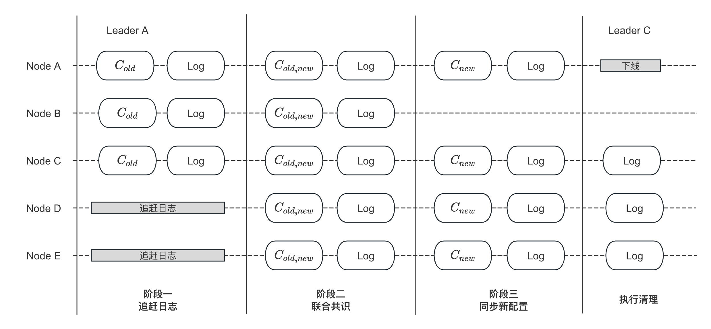
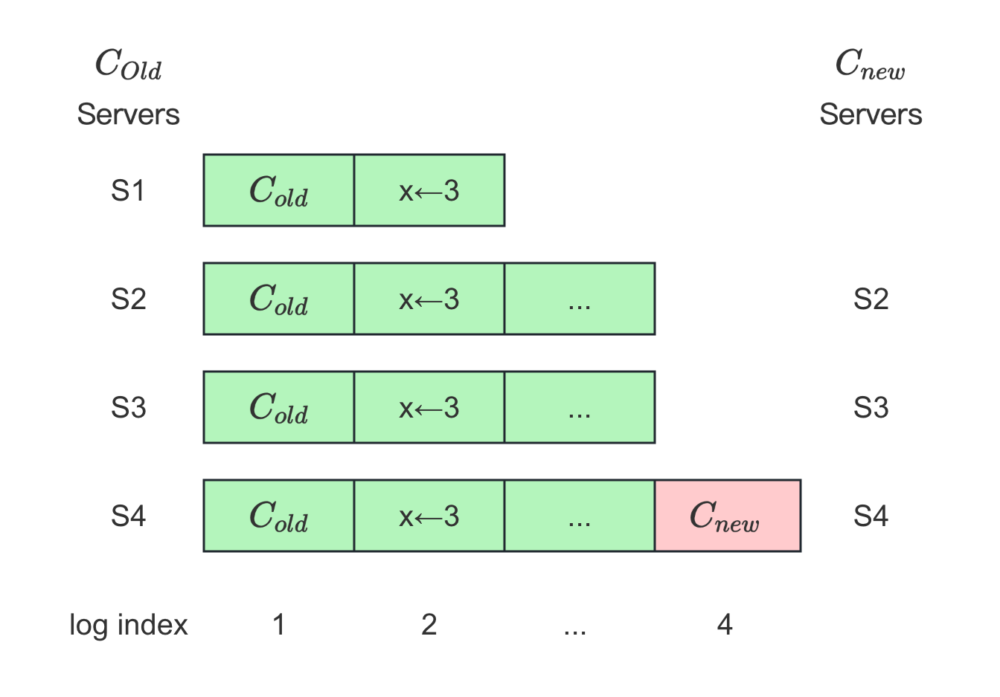

流程详解
===

流程概览
---

1. 用户通过 `add_peer`/`remove_peer`/`change_peer` 接口向 Leader 提交配置变更
2. 若当前 Leader 有配置变更正在进行，则返回 `EBUSY`；若新老配置相同，则直接返回成功
3. 进入日志追赶（`CaughtUp`）阶段：
   * 3.1 将新老配置做 `diff` 获得新加入的节点列表；若没有新增节点，则直接进入下一阶段
   * 3.2 为每个新节点创建 `Replicator`，并对所有新节点定期广播心跳
   * 3.3 为每个新节点安装最新的快照，每当一个节点完成快照的安装，则进行步骤 3.4 的判断
   * 3.4 判断该节点日志与当前 Leader 之间的差距：
     * 3.4.1 若小于一定值（默认 1000 条日志），则将其从追赶列表中移除
     * 3.4.2 若追赶列表为空，即所有新节点都追赶上了 Leader 的日志，则进入下一阶段
   * 3.5 向每个新节点同步日志，每当一个节点成功同步一部分日志，重复步骤 3.4
   * 3.6 若追赶阶段任意节点失败，则本次配置变更标记为失败
4. 进入联合共识（`Joint-Consensus`）阶段：
    * 4.1 Leader 应用联合配置（即 `C{old,new}`）为当前配置，以该配置视角进行选举和日志复制：
        * 4.1.1 在该阶段，选举需要同时在新老集群**都**达到 `Qourum`
        * 4.1.2 在该阶段，日志复制需要同时在新老集群**都**达到 `Qourum` 才能提交
    * 4.2 Leader 将联合配置日志（即 `C{old,new}`）同时复制给新老集群；当然也复制其他日志
    * 4.3 待联合配置日志在新老集群都达到 `Qourum`，则提交并应用该日志：
        * 4.3.1 调用该日志的 `Closure`，进入下一阶段
5. 进入同步新配置（`Stable`）阶段：
    * 5.1 Leader 应用新配置（即 `C{new}`）为当前配置，以该配置视角进行选举和日志复制：
        * 5.1.1 在该阶段，选举**只需**在新集群达到 `Qourum`
        * 5.1.2 在该阶段，日志**只需**在新集群达到 `Qourum` 即可提交
        * 5.1.3 在该阶段，日志仍会被复制给老集群，因为老集群节点的 `Replicator` 还未停止
    * 5.2 Leader 将新配置日志（即 `C{new}`）同时复制给新老集群；当然也复制其他日志
    * 5.3 待新配置日志在新集群中达到 `Qourum`，则提交并应用该日志：
        * 5.3.1 以新配置作为参数，调用用户状态机的 `on_configuration_committed`
        * 5.3.2 调用该配置的 `Closure`，进入下一阶段
6. 进行清理工作：
    * 6.1 Leader 移除不在集群中的 `Replicator`，不再向它们发送心跳和日志
    * 6.2 回调接口传入的 `Closure`
    * 6.3 若当前 Leader 不在新配置中，则 `step_down` 变为 Follower：
      * 6.3.1 调用用户状态机的 `on_leader_stop`
      * 6.3.2 向拥有最长日志的节点发送 `TimeoutNow` 请求，让其立马进行选举



故障恢复
---

当执行变更的 Leader Crash 了，新的 Leader 可能会继续推进变更直至变更成功，也可能恢复至变更前的状态，也就是说配置变更是具有原子性的，原有集群要么拥有新配置，要么仍旧是老配置，不存在中间状态。

当 Leader Crash 后，首先会重新进行选举；新 Leader 可能处于以下中的一种状态：

* 若先前配置还停留在日志追赶阶段，则所有集群仍旧使用老配置
* 若进入了联合共识阶段，则取决于 `C{old,new}` 是否已复制达到 `Quorum`
    * 如果是，则新 Leader 必定拥有 `C{old,new}`，当成为 Leader 后会立马继续推进后使用新配置
    * 如果不是，新 Leader 可能拥有 `C{old,new}`，也可能没有，如果拥有则如以上，如果没有则依旧使用来配置
* 若进入同步新配置阶段，则新 Leader 必定拥有 `C{old,new}`，此时继续推进变更，直至使用新集群配置

从上面可以看出，一旦 `C{old,new}` 已达到 `Quorum` 被提交，则可以立马应用 `C{new}`，因为即使此时 Leader 此时挂掉，新 Leader 也将继续推进变更从而使用  `C{new}`，等同于处于事务的隐式提交（implicit commit）一样。详见以下<其他：故障恢复>。

<!--

TODO(Wine93,P0)
新节点配置
---
* https://github.com/baidu/braft/issues/204
新节点启动的时候需要为空节点，否则可能需要脑裂
参考 https://github.com/baidu/braft/issues/303
新加入集群节点的配置必须为空，否则可能会导致脑裂；新节点的配置应由 Leader 同步给它。考虑下图中的场景：
{1,2,3} {1,2,4}
-->

干扰集群
---



上图来自 Raft 作者的博士论文 `4.2.3  Disruptive servers`，描述的是一个被移除的节点干扰集群，造成集群重新选举的场景：

* 在 `S1,S2,S3,S4` 组成的集群中执行配置变更，调用 `remove_peer` 将节点 `S1` 移除集群
*

在[<3.2 选举优化>](/ch03/3.2/optimization.md)中提到过，这种场景 `PreVote` 无法阻止，但是可以利用 `Check Quorum` 解决。但是其实在目前 braft 的实现中，这种场景是不会出现的，因为 Leader 是将新配置（即 `C{new}`）复制到新集群的大多数集群后，才开始移除不在新集群中的 `Replicator`（）停止广播心跳，将新配置 ``。而不是在节点将新配置达到 ``， 来说，，

相关接口
---

```cpp
class Node {
public:
    // list peers of this raft group, only leader retruns ok
    // [NOTE] when list_peers concurrency with add_peer/remove_peer, maybe return peers is staled.
    // because add_peer/remove_peer immediately modify configuration in memory
    butil::Status list_peers(std::vector<PeerId>* peers);

    // Add a new peer to the raft group. done->Run() would be invoked after this
    // operation finishes, describing the detailed result.
    void add_peer(const PeerId& peer, Closure* done);

    // Remove the peer from the raft group. done->Run() would be invoked after
    // this operation finishes, describing the detailed result.
    void remove_peer(const PeerId& peer, Closure* done);

    // Change the configuration of the raft group to |new_peers| , done->Run()
    // would be invoked after this operation finishes, describing the detailed
    // result.
    void change_peers(const Configuration& new_peers, Closure* done);
};
```

阶段一：追赶日志
===

调用接口
---

用户调用各接口要求 Leader 进行配置变更。在这些接口中，会生成新配置和老配置，最终都会调用 `on_configuration_committed` 执行变更：

```cpp
void NodeImpl::add_peer(const PeerId& peer, Closure* done) {
    ...
    Configuration new_conf = _conf.conf;
    new_conf.add_peer(peer);
    return unsafe_register_conf_change(_conf.conf, new_conf, done);
}

void NodeImpl::remove_peer(const PeerId& peer, Closure* done) {
    ...
    Configuration new_conf = _conf.conf;
    new_conf.remove_peer(peer);
    return unsafe_register_conf_change(_conf.conf, new_conf, done);
}

void NodeImpl::change_peers(const Configuration& new_peers, Closure* done) {
    ...
    return unsafe_register_conf_change(_conf.conf, new_peers, done);
}
```

开始变更
---

而在 `unsafe_register_conf_change` 函数中首先做进行一些判断，决定是否要执行变更。若要进行变更，则调用 `ConfigurationCtx::start` 正式开始变更：

```cpp
void NodeImpl::unsafe_register_conf_change(const Configuration& old_conf,
                                           const Configuration& new_conf,
                                           Closure* done) {
    ...
    // (1) 如果当前 Leader 已经有配置变更在进行，则返回 EBUSY
    if (_conf_ctx.is_busy()) {
        ...
        if (done) {
            done->status().set_error(EBUSY, "Doing another configuration change");
            run_closure_in_bthread(done);
        }
        return;
    }
    ...
    // (2) 如果新老配置一样，则直接返回
    if (_conf.conf.equals(new_conf)) {
        run_closure_in_bthread(done);
        return;
    }
    ...
    // (3) 调用 ConfigurationCtx::start 开始变更
    return _conf_ctx.start(old_conf, new_conf, done);
}
```

`ConfigurationCtx::start` 的主要流程详见以下注释：

```cpp
void NodeImpl::ConfigurationCtx::start(const Configuration& old_conf,
                                       const Configuration& new_conf,
                                       Closure* done) {
    // (1) 保存接口的 Closure，将当前阶段设为 `STAGE_CATCHING_UP`
    _done = done;
    _stage = STAGE_CATCHING_UP;

    // (2) 将新老配置做 diff，获得新增节点列表
    old_conf.list_peers(&_old_peers);
    new_conf.list_peers(&_new_peers);
    Configuration adding;
    Configuration removing;
    new_conf.diffs(old_conf, &adding, &removing);
    _nchanges = adding.size() + removing.size();

    // (3) 如果没有新增节点，则直接进入下一阶段（联合共识）
    if (adding.empty()) {
        ...
        return next_stage();
    }

    adding.list_peers(&_adding_peers);
    for (std::set<PeerId>::const_iterator iter
            = _adding_peers.begin(); iter != _adding_peers.end(); ++iter) {
        // (4) 为每个新增节点创建 Replicator，详见以下 <创建 Replicator>
        if (_node->_replicator_group.add_replicator(*iter) != 0) {
            ...
            return on_caughtup(_version, *iter, false);
        }

        // (5) 为每个新增节点保存 CatchupClosure 用来判断追赶进度，详见以下 <保存 Closure>
        OnCaughtUp* caught_up = new OnCaughtUp(
                _node, _node->_current_term, *iter, _version);
        ...
        if (_node->_replicator_group.wait_caughtup(
            *iter, _node->_options.catchup_margin, &due_time, caught_up) != 0) {
            ...
        }
    }
```

创建 Replicator
---

`ReplicatorGroup::add_replicator` 会为每个节点创建 `Replicator`，并将其启动，`Replicator` 负责发送心跳和同步日志。

关于 `Replicator` 的创建，我们已经在<3.1 选举流程>中详细介绍过了，见[创建 Replicator](/ch03/3.1/election.md#chuang-jian-replicator)：

```cpp
int ReplicatorGroup::add_replicator(const PeerId& peer) {
    ...
    options.replicator_status = new ReplicatorStatus;
    ...
    if (Replicator::start(options, &rid) != 0) {
        ...
        return -1;
    }
    _rmap[peer] = { rid, options.replicator_status };
    return 0;
}
```

保存 Closure
---

在<开始变更>的主干函数中会调用 `ReplicatorGroup::wait_caughtup` 为每个新增节点保存 `OnCaughtUp`，其会在安装快照或同步日志后被调用，来判断追赶进度是否可以进入下一阶段。具体流程见以下注释：

```cpp
int ReplicatorGroup::wait_caughtup(const PeerId& peer,
                                   int64_t max_margin, const timespec* due_time,
                                   CatchupClosure* done) {
    ...
    Replicator::wait_for_caught_up(rid, max_margin, due_time, done);
    return;
}

void Replicator::wait_for_caught_up(ReplicatorId id,
                                    int64_t max_margin,
                                    const timespec* due_time,
                                    CatchupClosure* done) {
    ...
    // 保存 CatchupClosure 为 `OnCaughtUp`
    r->_catchup_closure = done;
}
```

安装快照
---

当 `Replicator` 被创建后，其就会调用 `_send_entries` 开始复制日志。由于新加入的节点需要的日志很大概率已经被快照压缩了，所以需要向其安装快照。安装快照的流程我们已经在[<5.2 安装快照>](/ch05/5.2/install_snapshot.md)中详细介绍过来，这里只阐述相关流程：

```cpp
void Replicator::_send_entries() {
    ...
    // (1) 如果日志已经被压缩了，则安装快照
    if (_fill_common_fields(request.get(), _next_index - 1, false) != 0) {
        ...
        // (2) 开始安装快照
        return _install_snapshot();
    }
    ...
}

// (3) 待快照安装完成，收到节点的 `InstallSnapshot` 响应后，
//     会调用 _on_install_snapshot_returned
void Replicator::_on_install_snapshot_returned(
            ReplicatorId id, brpc::Controller* cntl,
            InstallSnapshotRequest* request,
            InstallSnapshotResponse* response) {
    ...
    r->_has_succeeded = true;
    // (4) 调用 Replicator::_notify_on_caught_up 判断日志差距
    //     来决定继续同步日志，还是进入下一阶段，
    //     详见以下<判断日志差距>
    r->_notify_on_caught_up(0, false);
    ...
    return r->_send_entries();
}
```

同步日志
---

如果日志差距仍大于配置值，则先继续调用 `_send_entries` 同步日志：

```cpp
void Replicator::_send_entries() {
    ...
    // (1) 发送 AppendEntries 请求同步日志，并设置回调函数为 `_on_rpc_returned`
    google::protobuf::Closure* done = brpc::NewCallback(
                _on_rpc_returned, _id.value, cntl.get(),
                request.get(), response.get(), butil::monotonic_time_ms());
    RaftService_Stub stub(&_sending_channel);
    stub.append_entries(cntl.release(), request.release(),
                        response.release(), done);
    ...
}

// (2) 收到 AppendEntries 响应，会调用 _on_rpc_returned
void Replicator::_on_rpc_returned(ReplicatorId id, brpc::Controller* cntl,
                     AppendEntriesRequest* request,
                     AppendEntriesResponse* response,
                     int64_t rpc_send_time) {
    ...
    r->_has_succeeded = true;
    r->_notify_on_caught_up(0, false);
    ...
    // (4) 调用 Replicator::_notify_on_caught_up 判断日志差距
    //     来决定继续同步日志，还是进入下一阶段，
    //     详见以下<判断日志差距>
    r->_send_entries();
    return;
}
```

判断日志差距
---

成功安装快照或每次成功同步一批日之后，都会调用 `_notify_on_caught_up` 判断新加入节点日志与当前 Leader 的差距。若差距小于一定值（默认为 1000），

```cpp
// (1) 调用 _notify_on_caught_up 判断日志差距
void Replicator::_notify_on_caught_up(int error_code, bool before_destroy) {
    // (2) 判断新节点日志与当前 Leader 的差距是否小于一定值（默认为 1000，用户可通过 NodeOption 配置）
    //     若不满足条件，则继续同步日志
    if (!_is_catchup(_catchup_closure->_max_margin)) {
        return;
    }
    ...
    // (3) 否则，调用 之前保存的 CatchupClosure，即 OnCaughtUp
    Closure* saved_catchup_closure = _catchup_closure;
    ...
    return run_closure_in_bthread(saved_catchup_closure);
}

class OnCaughtUp : public CatchupClosure {
public:
    ...
    virtual void Run() {
        // (4) 调用 NodeImpl::on_caughtup
        _node->on_caughtup(_peer, _term, _version, status());
        ...
    };
    ...
};

void NodeImpl::on_caughtup(const PeerId& peer, int64_t term,
                           int64_t version, const butil::Status& st) {
    ...
    if (st.ok()) {  // Caught up successfully
        // (5) 调用 NodeImpl::ConfigurationCtx::on_caughtup
        _conf_ctx.on_caughtup(version, peer, true);
        return;
    }
    ...
}

void NodeImpl::ConfigurationCtx::on_caughtup(
        int64_t version, const PeerId& peer_id, bool succ) {

    ...
    // (6) 将已经满足条件的节点从 _adding_peers 中移除
    //     如果所有节点均已追赶成功，则调用 next_stage 进入下一阶段（联合共识）
    if (succ) {
        _adding_peers.erase(peer_id);
        if (_adding_peers.empty()) {
            return next_stage();
        }
        return;
    }
    ...
}
```

阶段二：联合共识
===

进入新阶段
---

当所有新增节点都追赶上了 Leader 的日志，则调用 `next_stage` 进入下一阶段，详见以下注释：

```cpp
void NodeImpl::ConfigurationCtx::next_stage() {
    CHECK(is_busy());
    switch (_stage) {
    case STAGE_CATCHING_UP:  // (1) 执行该分支
        if (_nchanges > 1) {
            _stage = STAGE_JOINT;  // (2) 进入联合共识阶段
            Configuration old_conf(_old_peers);
            return _node->unsafe_apply_configuration(  // (3) 调用 unsafe_apply_configuration 开始变更
                    Configuration(_new_peers), &old_conf, false);
        }
        // Skip joint consensus since only one peer has been changed here. Make
        // it a one-stage change to be compitible with the legacy
        // implementation.
    case STAGE_JOINT:
        _stage = STAGE_STABLE;
        return _node->unsafe_apply_configuration(
                    Configuration(_new_peers), NULL, false);
    case STAGE_STABLE:
        {
            bool should_step_down =
                _new_peers.find(_node->_server_id) == _new_peers.end();
            butil::Status st = butil::Status::OK();
            reset(&st);
            if (should_step_down) {
                _node->step_down(_node->_current_term, true,
                        butil::Status(ELEADERREMOVED, "This node was removed"));
            }
            return;
        }
    case STAGE_NONE:
        CHECK(false) << "Can't reach here";
        return;
    }
}
```

开始变更
---

`unsafe_apply_configuration` 具体会执行以下这些工作，详见以下注释，其中的每一项工作我们将在之后逐一介绍：

```cpp
void NodeImpl::unsafe_apply_configuration(const Configuration& new_conf,
                                          const Configuration* old_conf,
                                          bool leader_start) {
    // (1) 生产配置日志，根据 new_conf 和 old_conf 生成联合配置日志或是新配置日志
    LogEntry* entry = new LogEntry();
    entry->AddRef();
    entry->id.term = _current_term;
    entry->type = ENTRY_TYPE_CONFIGURATION;
    entry->peers = new std::vector<PeerId>;
    new_conf.list_peers(entry->peers);
    if (old_conf) {
        entry->old_peers = new std::vector<PeerId>;
        old_conf->list_peers(entry->old_peers);
    }

    // (2) 设置日志应用后的回调函数，
    //     即该配置日志被复制并成功应用后，就会调用该回调函数
    ConfigurationChangeDone* configuration_change_done =
        new ConfigurationChangeDone(this, _current_term, leader_start, _leader_lease.lease_epoch());

    // (3) 为这个配置日志初始化投票规则，这是实现在新老集群同时达到 Quorum 才能提交
    //     还是只需要在新集群达到 Quorum 就可以提交的关键
    // Use the new_conf to deal the quorum of this very log
    _ballot_box->append_pending_task(new_conf, old_conf, configuration_change_done);
    ...
    // (4) 将配置日志追加到 LogManager，其会唤醒 Replicator 向 Follower 同步日志
    _log_manager->append_entries(&entries,
                                 new LeaderStableClosure(
                                        NodeId(_group_id, _server_id),
                                        1u, _ballot_box));
    // (5) 将配置（联合配置或新配置）设为当前节点配置
    _log_manager->check_and_set_configuration(&_conf);
}
```

初始化投票规则
---

```cpp
int BallotBox::append_pending_task(const Configuration& conf, const Configuration* old_conf,
                                   Closure* closure) {
    // (1) 调用 Ballot::init
    Ballot bl;
    if (bl.init(conf, old_conf) != 0) {
        return -1;
    }
    ...
}

int Ballot::init(const Configuration& conf, const Configuration* old_conf) {
    _peers.clear();
    _old_peers.clear();
    // （1）初始化 quorum 和 old_quorum 为 0
    _quorum = 0;
    _old_quorum = 0;

    // (2) 如果是新配置，只设置 _quorum
    _peers.reserve(conf.size());
    for (Configuration::const_iterator
            iter = conf.begin(); iter != conf.end(); ++iter) {
        _peers.push_back(*iter);
    }
    _quorum = _peers.size() / 2 + 1;

    // (3) 如果是联合配置，_old_quorum 也将被设置
    if (!old_conf) {
        return 0;
    }
    _old_peers.reserve(old_conf->size());
    for (Configuration::const_iterator
            iter = old_conf->begin(); iter != old_conf->end(); ++iter) {
        _old_peers.push_back(*iter);
    }
    _old_quorum = _old_peers.size() / 2 + 1;
    return 0;
}
```

应用联合配置
---

Leader 调用 `check_and_set_configuration` 将当前配置变为联合配置，即 `C{old,new}`：

```cpp
bool LogManager::check_and_set_configuration(ConfigurationEntry* current) {
    ...
    // (1) 从 _config_manager 中获取最新的配置
    const ConfigurationEntry& last_conf = _config_manager->last_configuration();
    // (2) 将其变为当前节点配置
    if (current->id != last_conf.id) {
        *current = last_conf;
        return true;
    }
    return false;
}

// (3) 而 _config_manager 的配置是在之前往 LogManager 追加配置日志时，保存在 _config_manager 中的
void LogManager::append_entries(
            std::vector<LogEntry*> *entries, StableClosure* done) {
    ...
    for (size_t i = 0; i < entries->size(); ++i) {
        ...
        if ((*entries)[i]->type == ENTRY_TYPE_CONFIGURATION) {
            ConfigurationEntry conf_entry(*((*entries)[i]));
            _config_manager->add(conf_entry);
        }
    }
    ...
}
```

复制日志
---

调用 `LogManager::append_entries` 追加配置日志（即 `C{old,new}`） 后，`Replicator` 就会被唤醒向 Follower 同步日志。

Leader 会将普通日志和配置日志（即 `C{old,new}`）复制给新老集群，每收到一个节点的成功响应，都会调用 `BallotBox::commit_at` 将对应日志的计算加一，如果其达到了 `Quorum` 则提交并应用该日志。具体的日志复制流程我们在之前的章节都详细介绍过了，详见[<4.1 复制流程>](/ch04/4.1/replicate.md)。

提交日志
---

Leader 本地持久化成功或每成功复制日志给一个 Follower，都会调用 BallotBox::commit_at 将对应日志的复制计数加一，如果达到 Quorum，则更新 commitIndex，并将其应用:

```cpp
int BallotBox::commit_at(
        int64_t first_log_index, int64_t last_log_index, const PeerId& peer) {
    ...
    // (1) 将 index 在 [first_log_index, last_log_index] 之间的日志计数加一
    int64_t last_committed_index = 0;
    const int64_t start_at = std::max(_pending_index, first_log_index);
    Ballot::PosHint pos_hint;
    for (int64_t log_index = start_at; log_index <= last_log_index; ++log_index) {
        Ballot& bl = _pending_meta_queue[log_index - _pending_index];
        pos_hint = bl.grant(peer, pos_hint);
        if (bl.granted()) {  // (2) 该日志在新老集群都达到 Quorum，则提交该日志，见以下的 granted 函数
            last_committed_index = log_index;
        }
    }

    if (last_committed_index == 0) {
        return 0;
    }
    ...
    _pending_index = last_committed_index + 1;
    // (3) 更新 commitIndex
    _last_committed_index.store(last_committed_index, butil::memory_order_relaxed);
    // (4) 调用 FSMCaller::on_committed 开始应用日志
    // The order doesn't matter
    _waiter->on_committed(last_committed_index);
    return 0;
}
```

`granted` 中的 `_quorum` 和 `_old_quorum` 都在以上的<初始化投票规则>中设为相应的值了：

```cpp
class Ballot {
public:
...
    bool granted() const { return _quorum <= 0 && _old_quorum <= 0; }
...
}
```

应用日志
---

`FSMCaller::on_committed` 最终会调用 `FSMCaller::do_committed` 开始应用日志，具体见以下注释：

```cpp
void FSMCaller::do_committed(int64_t committed_index) {
    ...
    IteratorImpl iter_impl(_fsm, _log_manager, &closure, first_closure_index,
                 last_applied_index, committed_index, &_applying_index);
    for (; iter_impl.is_good();) {
            ...
            // (1) 如果是新配置日志（即 C{new}）被提交，则会调用状态机的 on_configuration_committed
            //     如果是联合配置日志，则不会
            if (iter_impl.entry()->type == ENTRY_TYPE_CONFIGURATION) {
                if (iter_impl.entry()->old_peers == NULL) {
                    // Joint stage is not supposed to be noticeable by end users.
                    _fsm->on_configuration_committed(
                            Configuration(*iter_impl.entry()->peers),
                            iter_impl.entry()->id.index);
                }
            ...
            // (2) 不管是那种配置日志被提交，都会调用 Closure
            //     即 ConfigurationChangeDone
            if (iter_impl.done()) {
                iter_impl.done()->Run();
            }
            iter_impl.next();
            continue;
        }
        Iterator iter(&iter_impl);
        _fsm->on_apply(iter);
        ...
        iter.next();
    }
    ...
}
```

回调 Closure
---

当配置日志被应用后，其会调用 `ConfigurationChangeDone::Run`，而该函数最终会调用 `ConfigurationCtx::next_stage` 进入下一阶段：

```cpp
class ConfigurationChangeDone : public Closure {
public:
    void Run() {
        if (status().ok()) {
            _node->on_configuration_change_done(_term);
            ...
        }
        ...
    }
    ...
};

void NodeImpl::on_configuration_change_done(int64_t term) {
    ...
    _conf_ctx.next_stage();
}
```

阶段三：同步新配置
===

进入新阶段
---

```cpp
void NodeImpl::ConfigurationCtx::next_stage() {
    CHECK(is_busy());
    switch (_stage) {
    case STAGE_CATCHING_UP:
        if (_nchanges > 1) {
            _stage = STAGE_JOINT;
            Configuration old_conf(_old_peers);
            return _node->unsafe_apply_configuration(
                    Configuration(_new_peers), &old_conf, false);
        }
        // Skip joint consensus since only one peer has been changed here. Make
        // it a one-stage change to be compitible with the legacy
        // implementation.
    case STAGE_JOINT:  // (1) 执行该分支
        _stage = STAGE_STABLE;  // (2) 进入 Stable 阶段
        return _node->unsafe_apply_configuration(  // (3) 同样调用 unsafe_apply_configuration 开始变更
                    Configuration(_new_peers), NULL, false);
    case STAGE_STABLE:
        {
            bool should_step_down =
                _new_peers.find(_node->_server_id) == _new_peers.end();
            butil::Status st = butil::Status::OK();
            reset(&st);
            if (should_step_down) {
                _node->step_down(_node->_current_term, true,
                        butil::Status(ELEADERREMOVED, "This node was removed"));
            }
            return;
        }
    case STAGE_NONE:
        CHECK(false) << "Can't reach here";
        return;
    }
}
```

开始变更
---
应用新配置
---
复制日志
---
提交日志
---
应用日志
---
回调 Closure
---

以上这些步骤跟<阶段二：联合共识>的步骤是一样的，你可以从[<开始变更>](#kai-shi-bian-geng)开始重走一遍逻辑。

阶段四：清理工作
===

进入新阶段
---

待新配置被提交后，会调用 `next_stage` 进入清理阶段：

```cpp
void NodeImpl::ConfigurationCtx::next_stage() {
    CHECK(is_busy());
    switch (_stage) {
    case STAGE_CATCHING_UP:
        if (_nchanges > 1) {
            _stage = STAGE_JOINT;
            Configuration old_conf(_old_peers);
            return _node->unsafe_apply_configuration(
                    Configuration(_new_peers), &old_conf, false);
        }
        // Skip joint consensus since only one peer has been changed here. Make
        // it a one-stage change to be compitible with the legacy
        // implementation.
    case STAGE_JOINT:
        _stage = STAGE_STABLE;
        return _node->unsafe_apply_configuration(
                    Configuration(_new_peers), NULL, false);
    case STAGE_STABLE:  // (1) 执行该分支
        {
            bool should_step_down =
                _new_peers.find(_node->_server_id) == _new_peers.end();
            // (2) 以成功状态码调用 reset 进行一些清理工作，
            //     以及回调用户通过接口传递的 Closure
            butil::Status st = butil::Status::OK();
            reset(&st);
            // (3) 如果当前 Leader 不在新配置中，则调用 step_down
            if (should_step_down) {
                _node->step_down(_node->_current_term, true,
                        butil::Status(ELEADERREMOVED, "This node was removed"));
            }
            return;
        }
    case STAGE_NONE:
        CHECK(false) << "Can't reach here";
        return;
    }
}
```

停止 Replicator
---
回调 Closure
---

`reset` 函数会执行一些清理工作以及回调接口的 `Closure`，详见以下注释：

```cpp
void NodeImpl::ConfigurationCtx::reset(butil::Status* st) {
    // (1) 调用 NodeImpl::stop_replicator 停止不在新配置中的 Replicator
    if (st && st->ok()) {
        _node->stop_replicator(_new_peers, _old_peers);
    } else {
        ...
    }
    // (2) 清空一些状态
    _new_peers.clear();
    _old_peers.clear();
    _adding_peers.clear();
    ++_version;
    _stage = STAGE_NONE;
    _nchanges = 0;
    ...
    // (3) 若用户在调用接口（[add|remove|change]_peers）时有传入 Closure，
    //     则以成功状态回调 Closure
    if (_done) {
        ...
        _done->status() = *st;
        ...
        run_closure_in_bthread(_done);
        ...
    }
}
```

`stop_replicator` 函数会清理不在新配置中 Follower 对应的 `Replicator`，具体流程见以下注释：

```cpp
void NodeImpl::stop_replicator(const std::set<PeerId>& keep,
                               const std::set<PeerId>& drop) {
    for (std::set<PeerId>::const_iterator
            iter = drop.begin(); iter != drop.end(); ++iter) {
        if (keep.find(*iter) == keep.end() && *iter != _server_id) {
            // (1) 如果节点不在新配置中，则调用 `ReplicatorGroup::stop_replicator` 停止其 Replicator
            _replicator_group.stop_replicator(*iter);
        }
    }
}

int ReplicatorGroup::stop_replicator(const PeerId &peer) {
    // (2) 找到节点最用的 Replicator
    std::map<PeerId, ReplicatorIdAndStatus>::iterator iter = _rmap.find(peer);
    ...
    ReplicatorId rid = iter->second.id;
    // Calling ReplicatorId::stop might lead to calling stop_replicator again,
    // erase iter first to avoid race condition
    _rmap.erase(iter);  // (3) 将其从 ReplicatorGroup 中删除
    return Replicator::stop(rid);  // (4) 调用 Replicator::stop
}

int Replicator::stop(ReplicatorId id) {
    bthread_id_t dummy_id = { id };
    ...
    // (5) 向 Replicator 对应的 bthread 发送 ESTOP 状态码
    return bthread_id_error(dummy_id, ESTOP);
}

int Replicator::_on_error(bthread_id_t id, void* arg, int error_code) {
    Replicator* r = (Replicator*)arg;
    // (6) 接受到状态码后，会调用 _on_error 处理
    if (error_code == ESTOP) {
        ...
        bthread_timer_del(r->_heartbeat_timer);  // (6.1) 停止向其发送心跳
        r->_options.log_manager->remove_waiter(r->_wait_id);  // (6.2) 停止向其复制日志
        ...
        r->_wait_id = 0;
        ...
        return 0;
    }
    ...
}
```

step_down
---

在 `step_down` 函数中会向一个日志最长的节点发送一个 `TimeoutNow` 请求，让其立马进行选举，该优化我们曾在[<3.2 选举优化>](/ch03/3.2/optimization.md)中提到过。`step_down` 的具体流程见以下注释：

```cpp
void NodeImpl::step_down(const int64_t term, bool wakeup_a_candidate,
                         const butil::Status& status) {
    ...
    // (1) 调用用户状态机的 on_leader_stop
    if (_state == STATE_LEADER) {
        _fsm_caller->on_leader_stop(status);
    }
    ...
    // (2) 将自身转变为 Follower
    // soft state in memory
    _state = STATE_FOLLOWER;
    // (3) 向日志最长的节点发送 `TimeoutNow` 请求，让其立马进行选举
    // stop stagging new node
    if (wakeup_a_candidate) {
        _replicator_group.stop_all_and_find_the_next_candidate(
                                            &_waking_candidate, _conf);
        // FIXME: We issue the RPC in the critical section, which is fine now
        // since the Node is going to quit when reaching the branch
        Replicator::send_timeout_now_and_stop(
                _waking_candidate, _options.election_timeout_ms);
    } else {
        ...
    }
    ...
    // (4) 启动选举超时定时器，待其超时后会触发该节点进行选举
    _election_timer.start();
}
```

其他：故障恢复
===

当执行配置变更的 Leader 中途 Crash 了，新当选的 Leader 继续执行配置变更：

```cpp
// (1) 节点当选为 Leader
void NodeImpl::become_leader() {
    ...
    // (2) 调用  ConfigurationCtx::flush
    _conf_ctx.flush(_conf.conf, _conf.old_conf);
    ...
}

void NodeImpl::ConfigurationCtx::flush(const Configuration& conf,
                                       const Configuration& old_conf) {
    ...
    conf.list_peers(&_new_peers);
    if (old_conf.empty()) {
        _stage = STAGE_STABLE;
        _old_peers = _new_peers;
    } else {
        _stage = STAGE_JOINT;
        old_conf.list_peers(&_old_peers);
    }
    // (3) 依旧是调用 unsafe_apply_configuration 开始变更，详见以上 <开始变更>
    _node->unsafe_apply_configuration(conf, old_conf.empty() ? NULL : &old_conf,
                                      true);
}
```

<!--
其他：变更失败
===

TODO
---

* 重复下发有什么问题？

* 讲一下 replicator 的作用
* 讲一下 replicator 的启动流程
* 每条日志会带一个 bollot 还是 boolt box?
* 什么时候往 new_

* 新节点以什么配置生效，会不会成为主？

```cpp
{1,2,3} => {1,4,5} 2 是主?
```

有 leader 的心跳，不会选主？

* 2PC 怎么保证原子性, 负责变更的 leader 挂掉了?

* 假如新节点错误，会不会阻塞后续的变更？不会，在 catchup 阶段就行不通了

-->