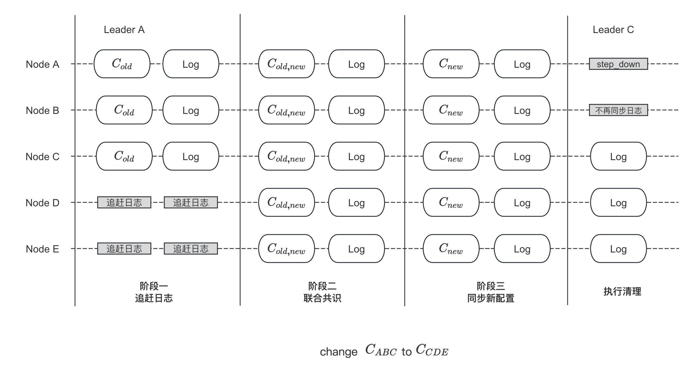
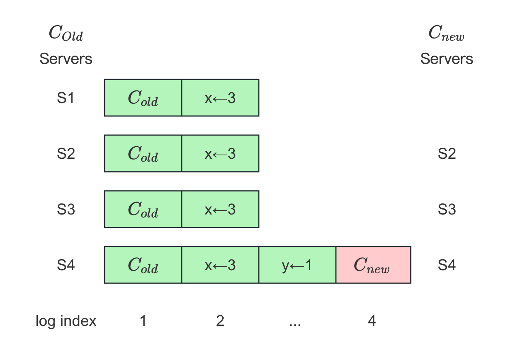

流程详解
===

流程概览
---

1. 用户通过 `add_peer`/`remove_peer`/`change_peer` 接口向 Leader 提交配置变更
2. 若当前 Leader 有配置变更正在进行，则返回 `EBUSY`；若新老配置相等，则直接返回成功
3. 进入日志追赶（`CaughtUp`）阶段：
   * 3.1 将新老配置做 `diff` 获得新加入的节点列表；若新增列表为空，则直接进入下一阶段
   * 3.2 为每个新节点创建 `Replicator`，并对所有新节点定期广播心跳
   * 3.3 为每个新节点安装最新的快照，每当一个节点完成快照的安装，则进行步骤 3.4 的判断
   * 3.4 判断该节点日志与 Leader 之间的差距
     * 3.4.1 若小于一定值（默认 1000 条日志），则将其从追赶节点列表中移除
     * 3.4.2 若追赶列表为空，即所有节点都追赶上 Leader 的日志后，则进入下一阶段
   * 3.5 向新节点同步日志，每成功同步一部分日志，重复步骤 3.4
   * 3.6 若追赶阶段任意节点失败，则本次配置变更标记为失败
4. 进入联合共识（`Joint-Consensus`）阶段：
    * 4.1 应用联合配置（即 `C{old,new}`）为当前节点配置，以该配置视角进行选举和日志复制：
        * 4.1.1 在该阶段，选举需要同时在新老集群都达到 `Qourum`
        * 4.1.2 在该阶段，日志复制需要同时在新老集群都达到 `Qourum` 才能提交
    * 4.2 Leader 将联合配置日志（即 `C{old,new}`）同时复制给新老集群；同时也复制其他日志
    * 4.3 待联合配置在新老集群都达到 `Qourum`，则提交并应用该日志：
        * 4.3.1 调用该配置的 `Closure`，进入下一阶段
5. 进入同步新配置（`Stable`）阶段：
    * 5.1 应用新配置（即 `C{new}`）为当前节点配置，以该配置视角进行选举和日志复制：
        * 5.1.1 在该阶段，选举只需在新集群达到 `Qourum`
        * 5.1.2 在该阶段，日志仍会复制给新老集群，只需在新集群达到 `Qourum` 即可提交
    * 5.2 Leader 将新配置日志（即 `C{new}`）同时复制给新老集群；同时也复制其他日志
    * 5.3 待新配置在新集群中达到 `Qourum`，则提交并应用该日志：
        * 5.3.1 以新配置作为参数，调用用户状态机的 `on_configuration_committed`
        * 5.3.2 调用该配置的 `Closure`，进入下一阶段
6. 进行清理工作：
    * 6.1 Leader 移除不在集群中的 `Replicator`，不再向它们发送心跳和日志
    * 6.2 回调接入传口的 `Closure`
    * 6.3 若当前 Leader 不在新配置中，则 `step_down` 变为 Follower：
      * 6.3.1 调用用户状态机的 `on_leader_stop`
      * 6.3.2 向拥有最长日志的节点发送 `TimeoutNow` 请求，让其立马进行选举



故障恢复
---

当执行变更的 Leader Crash 了，新的 Leader 可能会继续推进变更直至变更成功，也可能恢复至变更前的状态，也就是说配置变更是具有原子性的，原有集群要么拥有新配置，要么仍旧是老配置，不存在中间状态。

当 Leader Crash 后，首先会重新进行选举；新 Leader 可能处于以下中的一种状态：

* 若先前配置还停留在日志追赶阶段，则所有集群仍旧使用老配置
* 若进入了联合共识阶段，则取决于 `C{old,new}` 是否已复制达到 `Quorum`
    * 如果是，则新 Leader 必定拥有 `C{old,new}`，当成为 Leader 后会立马继续推进后使用新配置
    * 如果不是，新 Leader 可能拥有 `C{old,new}`，也可能没有，如果拥有则如以上，如果没有则依旧使用来配置
* 若进入同步新配置阶段，则新 Leader 必定拥有 `C{old,new}`，此时继续推进变更，直至使用新集群配置

从上面可以看出，一旦 `C{old,new}` 已达到 `Quorum` 被提交，则可以立马应用 `C{new}`，因为即使此时 Leader 此时挂掉，新 Leader 也将继续推进变更从而使用  `C{new}`，等同于处于事务的隐式提交（implicit commit）一样。详见以下[故障恢复](#其他故障恢复)。

新节点配置
---

{1,2,3} {1,2,4}

干扰集群
---



<!---
TODO:
* https://github.com/baidu/braft/issues/204
--->

<!--
新节点配置
---

新加入集群节点的配置必须为空，否则可能会导致脑裂；新节点的配置应由 Leader 同步给它。考虑下图中的场景：


```cpp
{1,2,3} => {1,4,5} 2 是主?
```

新节点启动的时候需要为空节点，否则可能需要脑裂
参考 https://github.com/baidu/braft/issues/303
-->

相关接口
---

```cpp
class Node {
public:
    // list peers of this raft group, only leader retruns ok
    // [NOTE] when list_peers concurrency with add_peer/remove_peer, maybe return peers is staled.
    // because add_peer/remove_peer immediately modify configuration in memory
    butil::Status list_peers(std::vector<PeerId>* peers);

    // Add a new peer to the raft group. done->Run() would be invoked after this
    // operation finishes, describing the detailed result.
    void add_peer(const PeerId& peer, Closure* done);

    // Remove the peer from the raft group. done->Run() would be invoked after
    // this operation finishes, describing the detailed result.
    void remove_peer(const PeerId& peer, Closure* done);

    // Change the configuration of the raft group to |new_peers| , done->Run()
    // would be invoked after this operation finishes, describing the detailed
    // result.
    void change_peers(const Configuration& new_peers, Closure* done);
};
```

阶段一：追赶日志
===

调用接口
---

调用调用各节点进行配置变更，在这些接口中，会生成新配置和老配置，并调用 `on_configuration_committed` 执行变更：

```cpp
void NodeImpl::add_peer(const PeerId& peer, Closure* done) {
    ...
    Configuration new_conf = _conf.conf;
    new_conf.add_peer(peer);
    return unsafe_register_conf_change(_conf.conf, new_conf, done);
}

void NodeImpl::remove_peer(const PeerId& peer, Closure* done) {
    ...
    Configuration new_conf = _conf.conf;
    new_conf.remove_peer(peer);
    return unsafe_register_conf_change(_conf.conf, new_conf, done);
}

void NodeImpl::change_peers(const Configuration& new_peers, Closure* done) {
    ...
    return unsafe_register_conf_change(_conf.conf, new_peers, done);
}
```

而在 `unsafe_register_conf_change` 函数中首先会进行一些判断，决定是否要执行变更。如要进行变更，则调用 `ConfigurationCtx::start` 正式开始变更：

```cpp
void NodeImpl::unsafe_register_conf_change(const Configuration& old_conf,
                                           const Configuration& new_conf,
                                           Closure* done) {
    ...
    // (1) 如果当前 Leader 已经有配置变更在进行，则返回 EBUSY
    if (_conf_ctx.is_busy()) {
        ...
        if (done) {
            done->status().set_error(EBUSY, "Doing another configuration change");
            run_closure_in_bthread(done);
        }
        return;
    }
    ...
    // (2) 如果新老配置一样，则理解返回
    if (_conf.conf.equals(new_conf)) {
        run_closure_in_bthread(done);
        return;
    }
    ...
    // (3) 调用 ConfigurationCtx::start 开始变更
    return _conf_ctx.start(old_conf, new_conf, done);
}
```

开始变更
---
创建 Replicator
---

详见 [创建 Replicator](/ch03/3.1/election.d#chuang-jian-replicator)

```cpp
void NodeImpl::ConfigurationCtx::start(const Configuration& old_conf,
                                       const Configuration& new_conf,
                                       Closure* done) {
    _done = done;
    _stage = STAGE_CATCHING_UP;

    old_conf.list_peers(&_old_peers);
    new_conf.list_peers(&_new_peers);
    Configuration adding;
    Configuration removing;
    new_conf.diffs(old_conf, &adding, &removing);
    _nchanges = adding.size() + removing.size();

    if (adding.empty()) {
        ...
        return next_stage();
    }

    LOG(INFO) << ss.str();
    adding.list_peers(&_adding_peers);
    for (std::set<PeerId>::const_iterator iter
            = _adding_peers.begin(); iter != _adding_peers.end(); ++iter) {
        if (_node->_replicator_group.add_replicator(*iter) != 0) {
            ...
            return on_caughtup(_version, *iter, false);
        }
        OnCaughtUp* caught_up = new OnCaughtUp(
                _node, _node->_current_term, *iter, _version);
        timespec due_time = butil::milliseconds_from_now(
                _node->_options.get_catchup_timeout_ms());
        if (_node->_replicator_group.wait_caughtup(
            *iter, _node->_options.catchup_margin, &due_time, caught_up) != 0) {
            ...
        }
    }
```

注册 Closure
---

```cpp
int ReplicatorGroup::wait_caughtup(const PeerId& peer,
                                   int64_t max_margin, const timespec* due_time,
                                   CatchupClosure* done) {
    ...
    Replicator::wait_for_caught_up(rid, max_margin, due_time, done);
    return;
}

void Replicator::wait_for_caught_up(ReplicatorId id,
                                    int64_t max_margin,
                                    const timespec* due_time,
                                    CatchupClosure* done) {
    r->_catchup_closure = done;
}
```

```cpp
class OnCaughtUp : public CatchupClosure {
public:
    ...
    virtual void Run() {
        _node->on_caughtup(_peer, _term, _version, status());
        delete this;
    };
    ...
};
```

安装快照
---

```cpp
void Replicator::_send_entries() {
    if (_flying_append_entries_size >= FLAGS_raft_max_entries_size ||
        _append_entries_in_fly.size() >= (size_t)FLAGS_raft_max_parallel_append_entries_rpc_num ||
        _st.st == BLOCKING) {
        BRAFT_VLOG << "node " << _options.group_id << ":" << _options.server_id
            << " skip sending AppendEntriesRequest to " << _options.peer_id
            << ", too many requests in flying, or the replicator is in block,"
            << " next_index " << _next_index << " flying_size " << _flying_append_entries_size;
        CHECK_EQ(0, bthread_id_unlock(_id)) << "Fail to unlock " << _id;
        return;
    }

    std::unique_ptr<brpc::Controller> cntl(new brpc::Controller);
    std::unique_ptr<AppendEntriesRequest> request(new AppendEntriesRequest);
    std::unique_ptr<AppendEntriesResponse> response(new AppendEntriesResponse);
    // 情况 1：已经发送给 Follower 的最后一条日志已经被压缩了
    if (_fill_common_fields(request.get(), _next_index - 1, false) != 0) {
        _reset_next_index();
        return _install_snapshot();
    }
    EntryMeta em;
    const int max_entries_size = FLAGS_raft_max_entries_size - _flying_append_entries_size;
    int prepare_entry_rc = 0;
    CHECK_GT(max_entries_size, 0);
    for (int i = 0; i < max_entries_size; ++i) {
        // 生成每一个 LogEntry，在 _prepare_entry 中通过判断 Log Index 对应的 Term 在没在
        // 从而找到最后的 Log
        prepare_entry_rc = _prepare_entry(i, &em, &cntl->request_attachment());
        if (prepare_entry_rc != 0) {
            break;
        }
        request->add_entries()->Swap(&em);
    }
    if (request->entries_size() == 0) {
        // _id is unlock in _wait_more
        // 情况 2：follower 需要的第一条日志已经被压缩了
        if (_next_index < _options.log_manager->first_log_index()) {
            _reset_next_index();
            return _install_snapshot();  // 为什么这里还会触发安装快照，
        }
        // NOTICE: a follower's readonly mode does not prevent install_snapshot
        // as we need followers to commit conf log(like add_node) when
        // leader reaches readonly as well
        if (prepare_entry_rc == EREADONLY) {
            if (_flying_append_entries_size == 0) {
                _st.st = IDLE;
            }
            CHECK_EQ(0, bthread_id_unlock(_id)) << "Fail to unlock " << _id;
            return;
        }
        return _wait_more_entries();
    }

    _append_entries_in_fly.push_back(FlyingAppendEntriesRpc(_next_index,
                                     request->entries_size(), cntl->call_id()));
    _append_entries_counter++;
    _next_index += request->entries_size();
    _flying_append_entries_size += request->entries_size();

    g_send_entries_batch_counter << request->entries_size();

    BRAFT_VLOG << "node " << _options.group_id << ":" << _options.server_id
        << " send AppendEntriesRequest to " << _options.peer_id << " term " << _options.term
        << " last_committed_index " << request->committed_index()
        << " prev_log_index " << request->prev_log_index()
        << " prev_log_term " << request->prev_log_term()
        << " next_index " << _next_index << " count " << request->entries_size();
    _st.st = APPENDING_ENTRIES;
    _st.first_log_index = _min_flying_index();
    _st.last_log_index = _next_index - 1;
    google::protobuf::Closure* done = brpc::NewCallback(
                _on_rpc_returned, _id.value, cntl.get(),
                request.get(), response.get(), butil::monotonic_time_ms());
    RaftService_Stub stub(&_sending_channel);
    stub.append_entries(cntl.release(), request.release(),
                        response.release(), done);
    _wait_more_entries();
}
```

```cpp
void Replicator::_on_install_snapshot_returned(
            ReplicatorId id, brpc::Controller* cntl,
            InstallSnapshotRequest* request,
            InstallSnapshotResponse* response) {
    std::unique_ptr<brpc::Controller> cntl_guard(cntl);
    std::unique_ptr<InstallSnapshotRequest> request_guard(request);
    std::unique_ptr<InstallSnapshotResponse> response_guard(response);
    Replicator *r = NULL;
    bthread_id_t dummy_id = { id };
    bool succ = true;
    if (bthread_id_lock(dummy_id, (void**)&r) != 0) {
        return;
    }
    if (r->_reader) {
        r->_options.snapshot_storage->close(r->_reader);
        r->_reader = NULL;
        if (r->_options.snapshot_throttle) {
            r->_options.snapshot_throttle->finish_one_task(true);
        }
    }
    std::stringstream ss;
    ss << "received InstallSnapshotResponse from "
       << r->_options.group_id << ":" << r->_options.peer_id
       << " last_included_index " << request->meta().last_included_index()
       << " last_included_term " << request->meta().last_included_term();
    do {
        if (cntl->Failed()) {
            ss << " error: " << cntl->ErrorText();
            LOG(INFO) << ss.str();

            LOG_IF(WARNING, (r->_consecutive_error_times++) % 10 == 0)
                            << "Group " << r->_options.group_id
                            << " Fail to install snapshot at peer="
                            << r->_options.peer_id
                            <<", " << cntl->ErrorText();
            succ = false;
            break;
        }
        if (!response->success()) {
            succ = false;
            ss << " fail.";
            LOG(INFO) << ss.str();
            // Let heartbeat do step down
            break;
        }
        // Success
        r->_next_index = request->meta().last_included_index() + 1;
        ss << " success.";
        LOG(INFO) << ss.str();
    } while (0);

    // We don't retry installing the snapshot explicitly.
    // dummy_id is unlock in _send_entries
    if (!succ) {
        return r->_block(butil::gettimeofday_us(), cntl->ErrorCode());
    }
    r->_has_succeeded = true;
    r->_notify_on_caught_up(0, false);
    if (r->_timeout_now_index > 0 && r->_timeout_now_index < r->_min_flying_index()) {
        r->_send_timeout_now(false, false);
    }
    // dummy_id is unlock in _send_entries
    return r->_send_entries();
}
```

同步日志
---

```cpp
void Replicator::_send_entries() {
    if (_flying_append_entries_size >= FLAGS_raft_max_entries_size ||
        _append_entries_in_fly.size() >= (size_t)FLAGS_raft_max_parallel_append_entries_rpc_num ||
        _st.st == BLOCKING) {
        BRAFT_VLOG << "node " << _options.group_id << ":" << _options.server_id
            << " skip sending AppendEntriesRequest to " << _options.peer_id
            << ", too many requests in flying, or the replicator is in block,"
            << " next_index " << _next_index << " flying_size " << _flying_append_entries_size;
        CHECK_EQ(0, bthread_id_unlock(_id)) << "Fail to unlock " << _id;
        return;
    }

    std::unique_ptr<brpc::Controller> cntl(new brpc::Controller);
    std::unique_ptr<AppendEntriesRequest> request(new AppendEntriesRequest);
    std::unique_ptr<AppendEntriesResponse> response(new AppendEntriesResponse);
    // 情况 1：已经发送给 Follower 的最后一条日志已经被压缩了
    if (_fill_common_fields(request.get(), _next_index - 1, false) != 0) {
        _reset_next_index();
        return _install_snapshot();
    }
    EntryMeta em;
    const int max_entries_size = FLAGS_raft_max_entries_size - _flying_append_entries_size;
    int prepare_entry_rc = 0;
    CHECK_GT(max_entries_size, 0);
    for (int i = 0; i < max_entries_size; ++i) {
        // 生成每一个 LogEntry，在 _prepare_entry 中通过判断 Log Index 对应的 Term 在没在
        // 从而找到最后的 Log
        prepare_entry_rc = _prepare_entry(i, &em, &cntl->request_attachment());
        if (prepare_entry_rc != 0) {
            break;
        }
        request->add_entries()->Swap(&em);
    }
    if (request->entries_size() == 0) {
        // _id is unlock in _wait_more
        // 情况 2：follower 需要的第一条日志已经被压缩了
        if (_next_index < _options.log_manager->first_log_index()) {
            _reset_next_index();
            return _install_snapshot();  // 为什么这里还会触发安装快照，
        }
        // NOTICE: a follower's readonly mode does not prevent install_snapshot
        // as we need followers to commit conf log(like add_node) when
        // leader reaches readonly as well
        if (prepare_entry_rc == EREADONLY) {
            if (_flying_append_entries_size == 0) {
                _st.st = IDLE;
            }
            CHECK_EQ(0, bthread_id_unlock(_id)) << "Fail to unlock " << _id;
            return;
        }
        return _wait_more_entries();
    }

    _append_entries_in_fly.push_back(FlyingAppendEntriesRpc(_next_index,
                                     request->entries_size(), cntl->call_id()));
    _append_entries_counter++;
    _next_index += request->entries_size();
    _flying_append_entries_size += request->entries_size();

    g_send_entries_batch_counter << request->entries_size();

    BRAFT_VLOG << "node " << _options.group_id << ":" << _options.server_id
        << " send AppendEntriesRequest to " << _options.peer_id << " term " << _options.term
        << " last_committed_index " << request->committed_index()
        << " prev_log_index " << request->prev_log_index()
        << " prev_log_term " << request->prev_log_term()
        << " next_index " << _next_index << " count " << request->entries_size();
    _st.st = APPENDING_ENTRIES;
    _st.first_log_index = _min_flying_index();
    _st.last_log_index = _next_index - 1;
    google::protobuf::Closure* done = brpc::NewCallback(
                _on_rpc_returned, _id.value, cntl.get(),
                request.get(), response.get(), butil::monotonic_time_ms());
    RaftService_Stub stub(&_sending_channel);
    stub.append_entries(cntl.release(), request.release(),
                        response.release(), done);
    _wait_more_entries();
}
```

```cpp
void Replicator::_on_rpc_returned(ReplicatorId id, brpc::Controller* cntl,
                     AppendEntriesRequest* request,
                     AppendEntriesResponse* response,
                     int64_t rpc_send_time) {
    std::unique_ptr<brpc::Controller> cntl_guard(cntl);
    std::unique_ptr<AppendEntriesRequest>  req_guard(request);
    std::unique_ptr<AppendEntriesResponse> res_guard(response);
    Replicator *r = NULL;
    bthread_id_t dummy_id = { id };
    const long start_time_us = butil::gettimeofday_us();
    if (bthread_id_lock(dummy_id, (void**)&r) != 0) {
        return;
    }

    std::stringstream ss;
    ss << "node " << r->_options.group_id << ":" << r->_options.server_id
       << " received AppendEntriesResponse from "
       << r->_options.peer_id << " prev_log_index " << request->prev_log_index()
       << " prev_log_term " << request->prev_log_term() << " count " << request->entries_size();

    bool valid_rpc = false;
    int64_t rpc_first_index = request->prev_log_index() + 1;
    int64_t min_flying_index = r->_min_flying_index();  // _next_index - _flying_append_entries_size
    CHECK_GT(min_flying_index, 0);

    for (std::deque<FlyingAppendEntriesRpc>::iterator rpc_it = r->_append_entries_in_fly.begin();
        rpc_it != r->_append_entries_in_fly.end(); ++rpc_it) {
        if (rpc_it->log_index > rpc_first_index) {
            break;
        }
        if (rpc_it->call_id == cntl->call_id()) {
            valid_rpc = true;
        }
    }
    if (!valid_rpc) {
        ss << " ignore invalid rpc";
        BRAFT_VLOG << ss.str();
        CHECK_EQ(0, bthread_id_unlock(r->_id)) << "Fail to unlock " << r->_id;
        return;
    }

    if (cntl->Failed()) {
        ss << " fail, sleep.";
        BRAFT_VLOG << ss.str();

        // TODO: Should it be VLOG?
        LOG_IF(WARNING, (r->_consecutive_error_times++) % 10 == 0)
                        << "Group " << r->_options.group_id
                        << " fail to issue RPC to " << r->_options.peer_id
                        << " _consecutive_error_times=" << r->_consecutive_error_times
                        << ", " << cntl->ErrorText();
        // If the follower crashes, any RPC to the follower fails immediately,
        // so we need to block the follower for a while instead of looping until
        // it comes back or be removed
        // dummy_id is unlock in block
        r->_reset_next_index();
        return r->_block(start_time_us, cntl->ErrorCode());
    }
    r->_consecutive_error_times = 0;
    if (!response->success()) {
        if (response->term() > r->_options.term) {
            BRAFT_VLOG << " fail, greater term " << response->term()
                       << " expect term " << r->_options.term;
            r->_reset_next_index();

            NodeImpl *node_impl = r->_options.node;
            // Acquire a reference of Node here in case that Node is destroyed
            // after _notify_on_caught_up.
            node_impl->AddRef();
            r->_notify_on_caught_up(EPERM, true);
            butil::Status status;
            status.set_error(EHIGHERTERMRESPONSE, "Leader receives higher term "
                    "%s from peer:%s", response->GetTypeName().c_str(), r->_options.peer_id.to_string().c_str());
            r->_destroy();
            node_impl->increase_term_to(response->term(), status);
            node_impl->Release();
            return;
        }
        ss << " fail, find next_index remote last_log_index " << response->last_log_index()
           << " local next_index " << r->_next_index
           << " rpc prev_log_index " << request->prev_log_index();
        BRAFT_VLOG << ss.str();
        r->_update_last_rpc_send_timestamp(rpc_send_time);
        // prev_log_index and prev_log_term doesn't match
        r->_reset_next_index();
        if (response->last_log_index() + 1 < r->_next_index) {
            BRAFT_VLOG << "Group " << r->_options.group_id
                       << " last_log_index at peer=" << r->_options.peer_id
                       << " is " << response->last_log_index();
            // The peer contains less logs than leader
            r->_next_index = response->last_log_index() + 1;
        } else {
            // The peer contains logs from old term which should be truncated,
            // decrease _last_log_at_peer by one to test the right index to keep
            if (BAIDU_LIKELY(r->_next_index > 1)) {
                BRAFT_VLOG << "Group " << r->_options.group_id
                           << " log_index=" << r->_next_index << " mismatch";
                --r->_next_index;
            } else {
                LOG(ERROR) << "Group " << r->_options.group_id
                           << " peer=" << r->_options.peer_id
                           << " declares that log at index=0 doesn't match,"
                              " which is not supposed to happen";
            }
        }
        // dummy_id is unlock in _send_heartbeat
        r->_send_empty_entries(false);
        return;
    }

    ss << " success";
    BRAFT_VLOG << ss.str();

    if (response->term() != r->_options.term) {
        LOG(ERROR) << "Group " << r->_options.group_id
                   << " fail, response term " << response->term()
                   << " mismatch, expect term " << r->_options.term;
        r->_reset_next_index();
        CHECK_EQ(0, bthread_id_unlock(r->_id)) << "Fail to unlock " << r->_id;
        return;
    }
    r->_update_last_rpc_send_timestamp(rpc_send_time);
    const int entries_size = request->entries_size();
    const int64_t rpc_last_log_index = request->prev_log_index() + entries_size;
    BRAFT_VLOG_IF(entries_size > 0) << "Group " << r->_options.group_id
                                    << " replicated logs in ["
                                    << min_flying_index << ", "
                                    << rpc_last_log_index
                                    << "] to peer " << r->_options.peer_id;
    if (entries_size > 0) {
        r->_options.ballot_box->commit_at(
                min_flying_index, rpc_last_log_index,
                r->_options.peer_id);
        int64_t rpc_latency_us = cntl->latency_us();
        if (FLAGS_raft_trace_append_entry_latency &&
            rpc_latency_us > FLAGS_raft_append_entry_high_lat_us) {
            LOG(WARNING) << "append entry rpc latency us " << rpc_latency_us
                         << " greater than "
                         << FLAGS_raft_append_entry_high_lat_us
                         << " Group " << r->_options.group_id
                         << " to peer  " << r->_options.peer_id
                         << " request entry size " << entries_size
                         << " request data size "
                         <<  cntl->request_attachment().size();
        }
        g_send_entries_latency << cntl->latency_us();
        if (cntl->request_attachment().size() > 0) {
            g_normalized_send_entries_latency <<
                cntl->latency_us() * 1024 / cntl->request_attachment().size();
        }
    }
    // A rpc is marked as success, means all request before it are success,
    // erase them sequentially.
    while (!r->_append_entries_in_fly.empty() &&
           r->_append_entries_in_fly.front().log_index <= rpc_first_index) {
        r->_flying_append_entries_size -= r->_append_entries_in_fly.front().entries_size;
        r->_append_entries_in_fly.pop_front();
    }
    r->_has_succeeded = true;
    r->_notify_on_caught_up(0, false);
    ...
    r->_send_entries();
    return;
}
```

判断差距
---

成功安装快照或每次成功同步一批日之后，都会调用 `_notify_on_caught_up` 判断新加入节点日志与当前 Leader 的差距。若差距小于一定值（默认为 1000），

```cpp
void Replicator::_notify_on_caught_up(int error_code, bool before_destroy) {
    if (!_is_catchup(_catchup_closure->_max_margin)) {
        return;
    }
    ...
    Closure* saved_catchup_closure = _catchup_closure;
    _catchup_closure = NULL;
    return run_closure_in_bthread(saved_catchup_closure);
}
```

```cpp
void NodeImpl::on_caughtup(const PeerId& peer, int64_t term,
                           int64_t version, const butil::Status& st) {
    ...
    if (st.ok()) {  // Caught up successfully
        _conf_ctx.on_caughtup(version, peer, true);
        return;
    }
    ...
}

void NodeImpl::ConfigurationCtx::on_caughtup(
        int64_t version, const PeerId& peer_id, bool succ) {

    ...
    if (succ) {
        _adding_peers.erase(peer_id);
        if (_adding_peers.empty()) {
            return next_stage();
        }
        return;
    }
    ...
}
```

阶段二：联合共识
===

进入新阶段
---

```cpp
void NodeImpl::ConfigurationCtx::next_stage() {
    CHECK(is_busy());
    switch (_stage) {
    case STAGE_CATCHING_UP:  // (1) 执行该分支
        if (_nchanges > 1) {
            _stage = STAGE_JOINT;  // (2) 进入联合共识阶段
            Configuration old_conf(_old_peers);
            return _node->unsafe_apply_configuration(
                    Configuration(_new_peers), &old_conf, false);
        }
        // Skip joint consensus since only one peer has been changed here. Make
        // it a one-stage change to be compitible with the legacy
        // implementation.
    case STAGE_JOINT:
        _stage = STAGE_STABLE;
        return _node->unsafe_apply_configuration(
                    Configuration(_new_peers), NULL, false);
    case STAGE_STABLE:
        {
            bool should_step_down =
                _new_peers.find(_node->_server_id) == _new_peers.end();
            butil::Status st = butil::Status::OK();
            reset(&st);
            if (should_step_down) {
                _node->step_down(_node->_current_term, true,
                        butil::Status(ELEADERREMOVED, "This node was removed"));
            }
            return;
        }
    case STAGE_NONE:
        CHECK(false) << "Can't reach here";
        return;
    }
}
```

应用 `C{old,new}`
---
复制日志
---

```cpp
void NodeImpl::unsafe_apply_configuration(const Configuration& new_conf,
                                          const Configuration* old_conf,
                                          bool leader_start) {
    LogEntry* entry = new LogEntry();
    entry->AddRef();
    entry->id.term = _current_term;
    entry->type = ENTRY_TYPE_CONFIGURATION;
    entry->peers = new std::vector<PeerId>;
    new_conf.list_peers(entry->peers);
    if (old_conf) {
        entry->old_peers = new std::vector<PeerId>;
        old_conf->list_peers(entry->old_peers);
    }

    ConfigurationChangeDone* configuration_change_done =
        new ConfigurationChangeDone(this, _current_term, leader_start, _leader_lease.lease_epoch());
    // Use the new_conf to deal the quorum of this very log
    _ballot_box->append_pending_task(new_conf, old_conf, configuration_change_done);
    ...
    _log_manager->append_entries(&entries,
                                 new LeaderStableClosure(
                                        NodeId(_group_id, _server_id),
                                        1u, _ballot_box));
    _log_manager->check_and_set_configuration(&_conf);
}
```

```cpp
int BallotBox::append_pending_task(const Configuration& conf, const Configuration* old_conf,
                                   Closure* closure) {
    Ballot bl;
    if (bl.init(conf, old_conf) != 0) {
        CHECK(false) << "Fail to init ballot";
        return -1;
    }

    BAIDU_SCOPED_LOCK(_mutex);
    CHECK(_pending_index > 0);
    _pending_meta_queue.push_back(Ballot());
    _pending_meta_queue.back().swap(bl);
    _closure_queue->append_pending_closure(closure);
    return 0;
}
```

提交日志
---

```cpp
int Ballot::init(const Configuration& conf, const Configuration* old_conf) {
    _peers.clear();
    _old_peers.clear();
    _quorum = 0;
    _old_quorum = 0;

    _peers.reserve(conf.size());
    for (Configuration::const_iterator
            iter = conf.begin(); iter != conf.end(); ++iter) {
        _peers.push_back(*iter);
    }
    _quorum = _peers.size() / 2 + 1;
    if (!old_conf) {
        return 0;
    }
    _old_peers.reserve(old_conf->size());
    for (Configuration::const_iterator
            iter = old_conf->begin(); iter != old_conf->end(); ++iter) {
        _old_peers.push_back(*iter);
    }
    _old_quorum = _old_peers.size() / 2 + 1;
    return 0;
}
```

```cpp
// 将 index 在 [fist_log_index, last_log_index] 之间的日志的投票数加一
int BallotBox::commit_at(
        int64_t first_log_index, int64_t last_log_index, const PeerId& peer) {
    // FIXME(chenzhangyi01): The cricital section is unacceptable because it
    // blocks all the other Replicators and LogManagers
    std::unique_lock<raft_mutex_t> lck(_mutex);
    if (_pending_index == 0) {
        return EINVAL;
    }
    if (last_log_index < _pending_index) {
        return 0;
    }
    if (last_log_index >= _pending_index + (int64_t)_pending_meta_queue.size()) {
        return ERANGE;
    }

    int64_t last_committed_index = 0;
    const int64_t start_at = std::max(_pending_index, first_log_index);
    Ballot::PosHint pos_hint;
    for (int64_t log_index = start_at; log_index <= last_log_index; ++log_index) {
        Ballot& bl = _pending_meta_queue[log_index - _pending_index];
        pos_hint = bl.grant(peer, pos_hint);
        if (bl.granted()) {
            last_committed_index = log_index;
        }
    }

    if (last_committed_index == 0) {
        return 0;
    }

    // When removing a peer off the raft group which contains even number of
    // peers, the quorum would decrease by 1, e.g. 3 of 4 changes to 2 of 3. In
    // this case, the log after removal may be committed before some previous
    // logs, since we use the new configuration to deal the quorum of the
    // removal request, we think it's safe to commit all the uncommitted
    // previous logs, which is not well proved right now
    // TODO: add vlog when committing previous logs
    for (int64_t index = _pending_index; index <= last_committed_index; ++index) {
        _pending_meta_queue.pop_front();
    }

    _pending_index = last_committed_index + 1;
    _last_committed_index.store(last_committed_index, butil::memory_order_relaxed);
    lck.unlock();
    // The order doesn't matter
    _waiter->on_committed(last_committed_index);
    return 0;
}
```

```cpp
bool LogManager::check_and_set_configuration(ConfigurationEntry* current) {
    if (current == NULL) {
        CHECK(false) << "current should not be NULL";
        return false;
    }
    BAIDU_SCOPED_LOCK(_mutex);

    const ConfigurationEntry& last_conf = _config_manager->last_configuration();
    if (current->id != last_conf.id) {
        *current = last_conf;
        return true;
    }
    return false;
}
```

应用日志
---

```cpp
void FSMCaller::do_committed(int64_t committed_index) {
    if (!_error.status().ok()) {
        return;
    }
    int64_t last_applied_index = _last_applied_index.load(
                                        butil::memory_order_relaxed);

    // We can tolerate the disorder of committed_index
    if (last_applied_index >= committed_index) {
        return;
    }
    std::vector<Closure*> closure;
    int64_t first_closure_index = 0;
    CHECK_EQ(0, _closure_queue->pop_closure_until(committed_index, &closure,
                                                  &first_closure_index));

    IteratorImpl iter_impl(_fsm, _log_manager, &closure, first_closure_index,
                 last_applied_index, committed_index, &_applying_index);
    for (; iter_impl.is_good();) {
        if (iter_impl.entry()->type != ENTRY_TYPE_DATA) {
            if (iter_impl.entry()->type == ENTRY_TYPE_CONFIGURATION) {
                if (iter_impl.entry()->old_peers == NULL) {
                    // Joint stage is not supposed to be noticeable by end users.
                    _fsm->on_configuration_committed(
                            Configuration(*iter_impl.entry()->peers),
                            iter_impl.entry()->id.index);
                }
            }
            // For other entries, we have nothing to do besides flush the
            // pending tasks and run this closure to notify the caller that the
            // entries before this one were successfully committed and applied.
            if (iter_impl.done()) {
                iter_impl.done()->Run();
            }
            iter_impl.next();
            continue;
        }
        Iterator iter(&iter_impl);
        _fsm->on_apply(iter);
        LOG_IF(ERROR, iter.valid())
                << "Node " << _node->node_id()
                << " Iterator is still valid, did you return before iterator "
                   " reached the end?";
        // Try move to next in case that we pass the same log twice.
        iter.next();
    }
    if (iter_impl.has_error()) {
        set_error(iter_impl.error());
        iter_impl.run_the_rest_closure_with_error();
    }
    const int64_t last_index = iter_impl.index() - 1;
    const int64_t last_term = _log_manager->get_term(last_index);
    LogId last_applied_id(last_index, last_term);
    _last_applied_index.store(committed_index, butil::memory_order_release);
    _last_applied_term = last_term;
    _log_manager->set_applied_id(last_applied_id);
}
```

回调 Closure
---

```cpp
class ConfigurationChangeDone : public Closure {
public:
    void Run() {
        if (status().ok()) {
            _node->on_configuration_change_done(_term);
            if (_leader_start) {
                _node->leader_lease_start(_lease_epoch);
                _node->_options.fsm->on_leader_start(_term);
            }
        }
        delete this;
    }
private:
    ConfigurationChangeDone(
            NodeImpl* node, int64_t term, bool leader_start, int64_t lease_epoch)
        : _node(node)
        , _term(term)
        , _leader_start(leader_start)
        , _lease_epoch(lease_epoch)
    {
        _node->AddRef();
    }
    ~ConfigurationChangeDone() {
        _node->Release();
        _node = NULL;
    }
friend class NodeImpl;
    NodeImpl* _node;
    int64_t _term;
    bool _leader_start;
    int64_t _lease_epoch;
};
```

```cpp
void NodeImpl::on_configuration_change_done(int64_t term) {
    BAIDU_SCOPED_LOCK(_mutex);
    if (_state > STATE_TRANSFERRING || term != _current_term) {
        LOG(WARNING) << "node " << node_id()
                     << " process on_configuration_change_done "
                     << " at term=" << term
                     << " while state=" << state2str(_state)
                     << " and current_term=" << _current_term;
        // Callback from older version
        return;
    }
    _conf_ctx.next_stage();
}
```


阶段三：同步新配置
===

进入新阶段
---

```cpp
void NodeImpl::ConfigurationCtx::next_stage() {
    CHECK(is_busy());
    switch (_stage) {
    case STAGE_CATCHING_UP:
        if (_nchanges > 1) {
            _stage = STAGE_JOINT;
            Configuration old_conf(_old_peers);
            return _node->unsafe_apply_configuration(
                    Configuration(_new_peers), &old_conf, false);
        }
        // Skip joint consensus since only one peer has been changed here. Make
        // it a one-stage change to be compitible with the legacy
        // implementation.
    case STAGE_JOINT:  // (1) 执行该分支
        _stage = STAGE_STABLE;  // (2) 进入 Stable 阶段
        return _node->unsafe_apply_configuration(
                    Configuration(_new_peers), NULL, false);
    case STAGE_STABLE:
        {
            bool should_step_down =
                _new_peers.find(_node->_server_id) == _new_peers.end();
            butil::Status st = butil::Status::OK();
            reset(&st);
            if (should_step_down) {
                _node->step_down(_node->_current_term, true,
                        butil::Status(ELEADERREMOVED, "This node was removed"));
            }
            return;
        }
    case STAGE_NONE:
        CHECK(false) << "Can't reach here";
        return;
    }
}
```

应用 `C{new}`
---

```cpp
void NodeImpl::unsafe_apply_configuration(const Configuration& new_conf,
                                          const Configuration* old_conf,
                                          bool leader_start) {
    CHECK(_conf_ctx.is_busy());
    LogEntry* entry = new LogEntry();
    entry->AddRef();
    entry->id.term = _current_term;
    entry->type = ENTRY_TYPE_CONFIGURATION;
    entry->peers = new std::vector<PeerId>;
    new_conf.list_peers(entry->peers);
    if (old_conf) {
        entry->old_peers = new std::vector<PeerId>;
        old_conf->list_peers(entry->old_peers);
    }
    ConfigurationChangeDone* configuration_change_done =
            new ConfigurationChangeDone(this, _current_term, leader_start, _leader_lease.lease_epoch());
    // Use the new_conf to deal the quorum of this very log
    _ballot_box->append_pending_task(new_conf, old_conf, configuration_change_done);

    std::vector<LogEntry*> entries;
    entries.push_back(entry);
    _log_manager->append_entries(&entries,
                                 new LeaderStableClosure(
                                        NodeId(_group_id, _server_id),
                                        1u, _ballot_box));
    _log_manager->check_and_set_configuration(&_conf);
}
```

复制日志
---

提交日志
---

应用日志
---

回调 Closure
---

```cpp
class ConfigurationChangeDone : public Closure {
public:
    void Run() {
        if (status().ok()) {
            _node->on_configuration_change_done(_term);
            ...
        }
        ...
    }
    ...
};

void NodeImpl::on_configuration_change_done(int64_t term) {
    ...
    _conf_ctx.next_stage();
}
```


阶段四：清理工作
===

进入新阶段
---

调用 `next_stage` 进入清理阶段：

```cpp
void NodeImpl::ConfigurationCtx::next_stage() {
    CHECK(is_busy());
    switch (_stage) {
    case STAGE_CATCHING_UP:
        if (_nchanges > 1) {
            _stage = STAGE_JOINT;
            Configuration old_conf(_old_peers);
            return _node->unsafe_apply_configuration(
                    Configuration(_new_peers), &old_conf, false);
        }
        // Skip joint consensus since only one peer has been changed here. Make
        // it a one-stage change to be compitible with the legacy
        // implementation.
    case STAGE_JOINT:
        _stage = STAGE_STABLE;
        return _node->unsafe_apply_configuration(
                    Configuration(_new_peers), NULL, false);
    case STAGE_STABLE:  // (1) 执行该分支
        {
            bool should_step_down =
                _new_peers.find(_node->_server_id) == _new_peers.end();
            // (2) 以成功状态码调用 reset 进行一些清理工作，
            //     以及回调用户通过接口传递的 Closure
            butil::Status st = butil::Status::OK();
            reset(&st);
            // (3) 如果当前 Leader 不在新配置中，则调用 step_down
            if (should_step_down) {
                _node->step_down(_node->_current_term, true,
                        butil::Status(ELEADERREMOVED, "This node was removed"));
            }
            return;
        }
    case STAGE_NONE:
        CHECK(false) << "Can't reach here";
        return;
    }
}
```

停止 Replicator
---
回调 Closure
---

`reset` 函数会执行一些清理工作以及回调接口的 `Closure`，详见以下注释：

```cpp
void NodeImpl::ConfigurationCtx::reset(butil::Status* st) {
    // (1) 调用 NodeImpl::stop_replicator 停止不在新配置中的 Replicator
    if (st && st->ok()) {
        _node->stop_replicator(_new_peers, _old_peers);
    } else {
        ...
    }
    // (2) 清空一些状态
    _new_peers.clear();
    _old_peers.clear();
    _adding_peers.clear();
    ++_version;
    _stage = STAGE_NONE;
    _nchanges = 0;
    ...
    // (3) 若用户在调用接口（[add|remove|change]_peers）时有传入 Closure，
    //     则以成功状态回调 Closure
    if (_done) {
        ...
        _done->status() = *st;
        ...
        run_closure_in_bthread(_done);
        ...
    }
}
```

`stop_replicator` 函数会清理不在新配置中 Follower 对应的 `Replicator`，具体流程见以下注释：

```cpp
void NodeImpl::stop_replicator(const std::set<PeerId>& keep,
                               const std::set<PeerId>& drop) {
    for (std::set<PeerId>::const_iterator
            iter = drop.begin(); iter != drop.end(); ++iter) {
        if (keep.find(*iter) == keep.end() && *iter != _server_id) {
            // (1) 如果节点不在新配置中，则调用 `ReplicatorGroup::stop_replicator` 停止其 Replicator
            _replicator_group.stop_replicator(*iter);
        }
    }
}

int ReplicatorGroup::stop_replicator(const PeerId &peer) {
    // (2) 找到节点最用的 Replicator
    std::map<PeerId, ReplicatorIdAndStatus>::iterator iter = _rmap.find(peer);
    ...
    ReplicatorId rid = iter->second.id;
    // Calling ReplicatorId::stop might lead to calling stop_replicator again,
    // erase iter first to avoid race condition
    _rmap.erase(iter);  // (3) 将其从 ReplicatorGroup 中删除
    return Replicator::stop(rid);  // (4) 调用 Replicator::stop
}

int Replicator::stop(ReplicatorId id) {
    bthread_id_t dummy_id = { id };
    ...
    // (5) 向 Replicator 对应的 bthread 发送 ESTOP 状态码
    return bthread_id_error(dummy_id, ESTOP);
}

int Replicator::_on_error(bthread_id_t id, void* arg, int error_code) {
    Replicator* r = (Replicator*)arg;
    // (6) 接受到状态码后，会调用 _on_error 处理
    if (error_code == ESTOP) {
        ...
        bthread_timer_del(r->_heartbeat_timer);  // (6.1) 停止向其发送心跳
        r->_options.log_manager->remove_waiter(r->_wait_id);  // (6.2) 停止向其复制日志
        ...
        r->_wait_id = 0;
        ...
        return 0;
    }
    ...
}
```

step_down
---

在 `step_down` 函数中会向一个日志最长的节点发送一个 `TimeoutNow` 请求，让其立马进行选举，该优化我们曾在[<3.2 选举优化>](/ch03/3.2/optimization.md)中提到过。`step_down` 的具体流程见以下注释：

```cpp
void NodeImpl::step_down(const int64_t term, bool wakeup_a_candidate,
                         const butil::Status& status) {
    ...
    // (1) 调用用户状态机的 on_leader_stop
    if (_state == STATE_LEADER) {
        _fsm_caller->on_leader_stop(status);
    }
    ...
    // (2) 将自身转变为 Follower
    // soft state in memory
    _state = STATE_FOLLOWER;
    // (3) 向日志最长的节点发送 `TimeoutNow` 请求，让其立马进行选举
    // stop stagging new node
    if (wakeup_a_candidate) {
        _replicator_group.stop_all_and_find_the_next_candidate(
                                            &_waking_candidate, _conf);
        // FIXME: We issue the RPC in the critical section, which is fine now
        // since the Node is going to quit when reaching the branch
        Replicator::send_timeout_now_and_stop(
                _waking_candidate, _options.election_timeout_ms);
    } else {
        ...
    }
    ...
    // (4) 启动选举超时定时器，待其超时后会触发该节点进行选举
    _election_timer.start();
}
```

其他：故障恢复
===

```cpp
// in lock
void NodeImpl::become_leader() {
    ...
    // cancel candidate vote timer
    _vote_timer.stop();  // (1) 停止投票计时器
    ...
    _state = STATE_LEADER;  // (2) 将自身角色转变为 Leader
    _leader_id = _server_id;  // (3) 记录当前 leaderId 为自身的 PeerId
    ...
    // (3) 为所有 Follower 创建 Replicator，Replicator 主要负责向 Follower 发送心跳、日志等
    std::set<PeerId> peers;
    _conf.list_peers(&peers);
    for (std::set<PeerId>::const_iterator
            iter = peers.begin(); iter != peers.end(); ++iter) {
        ...
        _replicator_group.add_replicator(*iter);
    }

    // (4) 设置最小可以提交的 logIndex，在这之前的日志就算复制达到了 Quorum，也不会更新 commitIndex
    //     注意：这是实现只复制但不提交上一任期日志的关键
    // init commit manager
    _ballot_box->reset_pending_index(_log_manager->last_log_index() + 1);

    // (5) 复制并提交本一条任期的配置日志
    // Register _conf_ctx to reject configuration changing before the first log
    // is committed.
    _conf_ctx.flush(_conf.conf, _conf.old_conf);

    // (6) 启动 StepdownTimer，用于实现 Check Quorum 优化
    //     详见 <3.2 选举优化> 小节
    _stepdown_timer.start();
}
```

```cpp
void NodeImpl::ConfigurationCtx::flush(const Configuration& conf,
                                       const Configuration& old_conf) {
    CHECK(!is_busy());
    conf.list_peers(&_new_peers);
    if (old_conf.empty()) {
        _stage = STAGE_STABLE;
        _old_peers = _new_peers;
    } else {
        _stage = STAGE_JOINT;
        old_conf.list_peers(&_old_peers);
    }
    _node->unsafe_apply_configuration(conf, old_conf.empty() ? NULL : &old_conf,
                                      true);

}
```

其他：变更失败
===

TODO
---

* 重复下发有什么问题？

* 讲一下 replicator 的作用
* 讲一下 replicator 的启动流程
* 每条日志会带一个 bollot 还是 boolt box?
* 什么时候往 new_

* 新节点以什么配置生效，会不会成为主？

```cpp
{1,2,3} => {1,4,5} 2 是主?
```

有 leader 的心跳，不会选主？

* 2PC 怎么保证原子性, 负责变更的 leader 挂掉了?

* 假如新节点错误，会不会阻塞后续的变更？不会，在 catchup 阶段就行不通了
