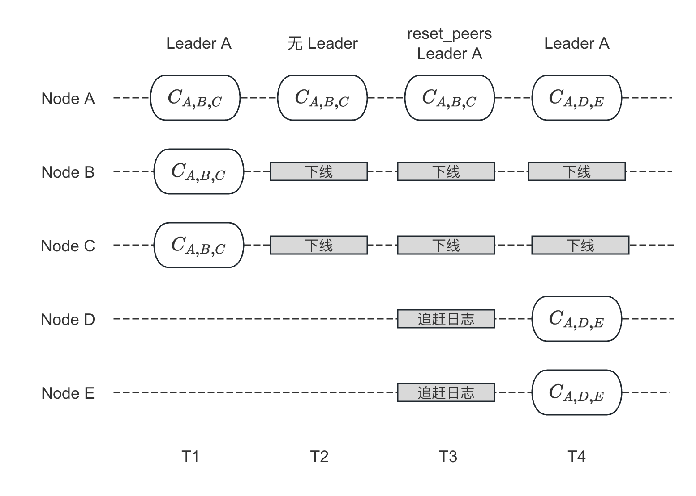

流程详解
===

流程概览
---

当集群中大多数节点不可用时，不能通过 `add_peer`/`remove_peer`/`change_peer` 等接口进行配置变更，则可以使用 `reset_peer` 重置节点配置：

1. 客户端调用 `reset_peers` 进行重置节点配置
2. 若当前有配置变更正在进行中，则返回 `EBUSY`
3. 将最新配置保存在内存中，并直接应用该配置进行选举
4. 转变为 Follower，重新进行选举
5. 此时接口返回成功，但并不意味着重置成功
6. 若 Leader 选举成功，并写入新配置的日志到本地，`reset_peers` 才算成功；如果在此之间发生失败的话，客户端需要重新发起 `reset_peers`，因为新的配置是写在内存中的。



流程注解
---

脑裂问题
---
**不建议使用reset_peers**，reset_peers会破坏raft对数据一致性的保证，而且可能会造成脑裂。例如，{A B C D E}组成的复制组G，其中{C D E}故障，将{A B} set_peer成功恢复复制组G'，{C D E}又重新启动它们也会形成一个复制组G''，这样复制组G中会存在两个Leader，且{A B}这两个复制组中都存在，其中的follower会接收两个leader的AppendEntries，当前只检测term和index，可能会导致其上数据错乱。


相关 RPC
---

具体实现
===

```cpp
butil::Status NodeImpl::reset_peers(const Configuration& new_peers) {
    BAIDU_SCOPED_LOCK(_mutex);

    if (new_peers.empty()) {
        LOG(WARNING) << "node " << _group_id << ":" << _server_id << " set empty peers";
        return butil::Status(EINVAL, "new_peers is empty");
    }
    // check state
    if (!is_active_state(_state)) {
        LOG(WARNING) << "node " << _group_id << ":" << _server_id
                     << " is in state " << state2str(_state) << ", can't reset_peer";
        return butil::Status(EPERM, "Bad state %s", state2str(_state));
    }
    // check bootstrap
    if (_conf.conf.empty()) {
        LOG(INFO) << "node " << _group_id << ":" << _server_id
                  << " reset_peers to " << new_peers << " from empty";
        _conf.conf = new_peers;
        butil::Status status;
        status.set_error(ESETPEER, "Set peer from empty configuration");
        step_down(_current_term + 1, false, status);
        return butil::Status::OK();
    }

    // check concurrent conf change
    if (_state == STATE_LEADER && _conf_ctx.is_busy()) {
        LOG(WARNING) << "node " << _group_id << ":" << _server_id
                     << " reset_peer need wait current conf change";
        return butil::Status(EBUSY, "Changing to another configuration");
    }

    // check equal, maybe retry direct return
    if (_conf.conf.equals(new_peers)) {
        return butil::Status::OK();
    }

    Configuration new_conf(new_peers);
    LOG(WARNING) << "node " << _group_id << ":" << _server_id
                 << " set_peer from "
                 << _conf.conf << " to " << new_conf;
    // change conf and step_down
    _conf.conf = new_conf;
    _conf.old_conf.reset();
    butil::Status status;
    status.set_error(ESETPEER, "Raft node set peer normally");
    step_down(_current_term + 1, false, status);
    return butil::Status::OK();
```

```cpp
void NodeImpl::step_down(const int64_t term, bool wakeup_a_candidate,
                         const butil::Status& status) {
    BRAFT_VLOG << "node " << _group_id << ":" << _server_id
              << " term " << _current_term
              << " stepdown from " << state2str(_state)
              << " new_term " << term
              << " wakeup_a_candidate=" << wakeup_a_candidate;

    if (!is_active_state(_state)) {
        return;
    }
    // delete timer and something else
    if (_state == STATE_CANDIDATE) {
        _vote_timer.stop();
        _vote_ctx.reset(this);
    } else if (_state == STATE_FOLLOWER) {
        _pre_vote_ctx.reset(this);
    } else if (_state <= STATE_TRANSFERRING) {
        _stepdown_timer.stop();
        _ballot_box->clear_pending_tasks();

        // signal fsm leader stop immediately
        if (_state == STATE_LEADER) {
            _leader_lease.on_leader_stop();
            _fsm_caller->on_leader_stop(status);
        }
    }

    // reset leader_id
    PeerId empty_id;
    reset_leader_id(empty_id, status);

    // soft state in memory
    _state = STATE_FOLLOWER;
    // _conf_ctx.reset() will stop replicators of catching up nodes
    _conf_ctx.reset();
    _majority_nodes_readonly = false;

    clear_append_entries_cache();

    if (_snapshot_executor) {
        _snapshot_executor->interrupt_downloading_snapshot(term);
    }

    // meta state
    if (term > _current_term) {
        _current_term = term;
        _voted_id.reset();
        //TODO: outof lock
        butil::Status status = _meta_storage->
                    set_term_and_votedfor(term, _voted_id, _v_group_id);
        if (!status.ok()) {
            LOG(ERROR) << "node " << _group_id << ":" << _server_id
                       << " fail to set_term_and_votedfor when step_down, error: "
                       << status;
            // TODO report error
        }
    }

    // stop stagging new node
    if (wakeup_a_candidate) {
        _replicator_group.stop_all_and_find_the_next_candidate(
                                            &_waking_candidate, _conf);
        // FIXME: We issue the RPC in the critical section, which is fine now
        // since the Node is going to quit when reaching the branch
        Replicator::send_timeout_now_and_stop(
                _waking_candidate, _options.election_timeout_ms);
    } else {
        _replicator_group.stop_all();
    }
    if (_stop_transfer_arg != NULL) {
        const int rc = bthread_timer_del(_transfer_timer);
        if (rc == 0) {
            // Get the right to delete _stop_transfer_arg.
            delete _stop_transfer_arg;
        }  // else on_transfer_timeout will delete _stop_transfer_arg

        // There is at most one StopTransferTimer at the same term, it's safe to
        // mark _stop_transfer_arg to NULL
        _stop_transfer_arg = NULL;
    }
    _election_timer.start();
}
```

参考选举流程中的[提交 no-op][]
```cpp
// in lock
void NodeImpl::become_leader() {
    CHECK(_state == STATE_CANDIDATE);
    LOG(INFO) << "node " << _group_id << ":" << _server_id
              << " term " << _current_term
              << " become leader of group " << _conf.conf
              << " " << _conf.old_conf;
    // cancel candidate vote timer
    _vote_timer.stop();
    _vote_ctx.reset(this);

    _state = STATE_LEADER;
    _leader_id = _server_id;

    _replicator_group.reset_term(_current_term);
    _follower_lease.reset();
    _leader_lease.on_leader_start(_current_term);

    std::set<PeerId> peers;
    _conf.list_peers(&peers);
    for (std::set<PeerId>::const_iterator
            iter = peers.begin(); iter != peers.end(); ++iter) {
        if (*iter == _server_id) {
            continue;
        }

        BRAFT_VLOG << "node " << _group_id << ":" << _server_id
                   << " term " << _current_term
                   << " add replicator " << *iter;
        //TODO: check return code
        _replicator_group.add_replicator(*iter);
    }

    // init commit manager
    _ballot_box->reset_pending_index(_log_manager->last_log_index() + 1);

    // Register _conf_ctx to reject configuration changing before the first log
    // is committed.
    CHECK(!_conf_ctx.is_busy());
    _conf_ctx.flush(_conf.conf, _conf.old_conf);
    _stepdown_timer.start();
}
```

