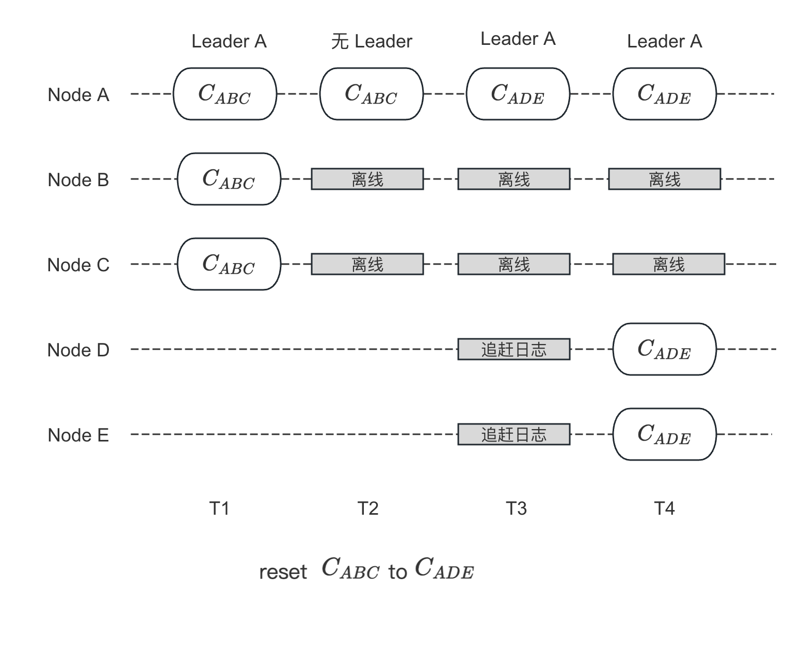
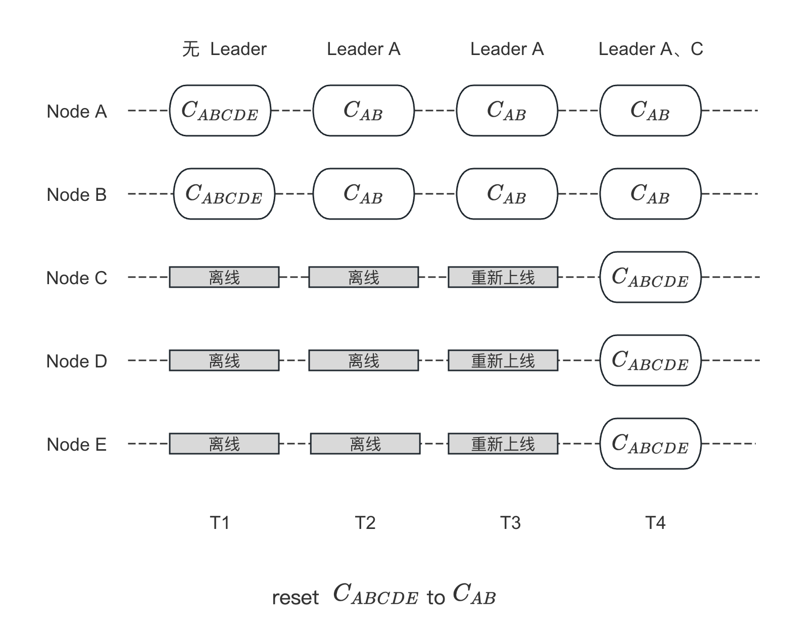

流程详解
===

流程概览
---

当集群中大多数节点不可用时，不能通过 `add_peer`/`remove_peer`/`change_peer` 等接口进行配置变更，则可以使用 `reset_peer` 重置节点配置：

1. 用户调用 `reset_peers` 重置某个节点的配置
2. 若当前节点有配置变更正在进行，则返回 `EBUSY`
3. 将当前节点的内存配置设为新配置，并调用 `step_down` 准备重新选举；在此之后，重置接口返回成功，但变更仍在继续。
4. 超过 `election_timeout_ms` 时间后，集群进行重新选举，并且当前节点一定会被当选为 Leader，原因如下：
    * 选举是以节点配置为选举视角，而老集群中只有重置的节点拥有新集群配置
    * 新加入的节点没有任何日志
5. 待其当选 Leader 后，会将新配置日志进行持久化，并复制给所有新集群中的成员：
    * 5.1 若配置日志持久化成功，则重置成功
    * 5.2 若在此之前 Leader Crash 了，则重置失败，用户需要重新调用 `reset_peers`
6. 其他节点在接收到新配置后，则立即应用新配置

从上可以看出，`reset_peer` 是通过先将一个节点内存中的配置设为新配置，使其以新配置的视角进行重新选举，这样可以确保该节点能成为 Leader。待其成为 Leader 后，将新配置持久化，并且通过日志分发新配置，使新集群中的所有节点都使用新配置。



脑裂问题
---



不建议使用 `reset_peers`，因为其会破坏数据的一致性，而且可能会造成脑裂，下图这个列子将会说明这个问题：

* T1：由 `ABCDE` 5 个节点组成的集群中，`CDE` 宕机导致集群没有 Leader
* T2：将 `A` 节点通过 `reset_peer` 重置为 `AB`，其成功选举成 Leader，并将配置同步给 `B`
* T3：节点 `CDE` 重新上线
* T4：由于不再收到 Leader `A` 的心跳，`CDE` 重新选举并选出 Leader `C`，此时集群中将同时存在 2 个 Leader

此时 Leader `A` 和 `C` 的 `term` 是一样的，其中的 `B` 节点会接收到这 2 个 Leader 的日志复制请求，而当前接受日志只检测日志的 `term` 和 `index`，这可能会导致数据错乱，也就是说 `B` 中的连续日志可能一部分来自 `A`，一部分来自 `C`。

相关接口
---

```cpp
class Node {
public:
    // Reset the configuration of this node individually, without any repliation
    // to other peers before this node beomes the leader. This function is
    // supposed to be inovoked when the majority of the replication group are
    // dead and you'd like to revive the service in the consideration of
    // availability.
    // Notice that neither consistency nor consensus are guaranteed in this
    // case, BE CAREFULE when dealing with this method.
    butil::Status reset_peers(const Configuration& new_peers);
};
```

阶段一：重置节点列表
===

用户调用 `reset_peers` 重置节点配置，其流程详见以下注释：

```cpp
butil::Status NodeImpl::reset_peers(const Configuration& new_peers) {
    ...
    // (1) 如果当前节点还是 Leader 并且有配置变更正在进行，则返回 EBUSY
    // check concurrent conf change
    if (_state == STATE_LEADER && _conf_ctx.is_busy()) {
        ...
        return butil::Status(EBUSY, "Changing to another configuration");
    }

    // (2) 如果当前配置等于新配置，就返回成功
    //     这个判断可以保证重复重置
    // check equal, maybe retry direct return
    if (_conf.conf.equals(new_peers)) {
        return butil::Status::OK();
    }

    // (3) 将当前节点的内存配置设为新配置
    Configuration new_conf(new_peers);
    ...
    _conf.conf = new_conf;
    _conf.old_conf.reset();
    ...
    // (4) 调用 step_down 触发选举
    step_down(_current_term + 1, false, status);
    return butil::Status::OK();
}

void NodeImpl::step_down(const int64_t term, bool wakeup_a_candidate,
                         const butil::Status& status) {
    ...
    // (5) 增加自身的 term、将 votedFor 设为空，并将其持久化
    // meta state
    if (term > _current_term) {
        _current_term = term;
        _voted_id.reset();
        //TODO: outof lock
        butil::Status status = _meta_storage->
                    set_term_and_votedfor(term, _voted_id, _v_group_id);
        ...
    }
    ...
    // (6) 启动选举定时器，该定时器超时后就会触发选举
    //     先 PreVote 再 RequestVote
    _election_timer.start();
}
```

阶段二：重新选举
===

该阶段就是集群进行选举，选举是以当前节点配置作为视角进行选举，所以只有执行重置的节点的配置是新集群配置，能选举成功。选举流程详见[<3.1 选举流程>](/ch03/3.1/election.md)。

阶段三：同步新配置
===

在节点成为 Leader 后，就会持久化新配置日志，并且通过复制将新配置日志同步给所有节点。所有节点接收到新配置日志后，就会立马应用该配置。具体的流程我们在[<3.1 选举流程>](/ch03/3.1/election.md)中都已经介绍过了，详见：

* [成为 Leader](/ch03/3.1/election.md#cheng-wei-leader)
* [复制本任期配置日志](/ch03/3.1/election.md#ti-jiao-noop-ri-zhi)
