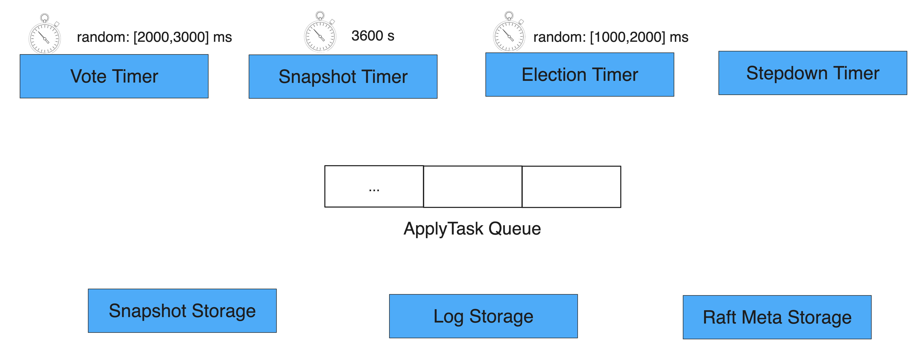

目录
===

* [简介](#简介)
* [整体流程](#整体流程)
* [具体实现](#具体实现)

简介
---

这里设计到节点的初始化，同时也是节点重启的入口（包括快照的加载，日志的回放）。

整体流程
---



主要做以下几件事：
* 各类 timer 的初始化
* 日志存储的初始化
* 状态的初始化

*Raft* 初始化流程主要为以下 6 个步骤：
* (1)
* (2)

> **日志回放**
>
> 并没有看到日志回放的逻辑，
>

具体实现
---

### 步骤二：增加 *Raft* 相关的 *Service* 至 *BRPC Server*

`braft::add_service` 会增加以下 4 个 *Service*：
* `FileService`：用于 *Follower* 安装快照时，向 *Leader* 下载对应文件
* `RaftService`：核心服务，处理 *Raft* 的核心逻辑
* `RaftStat`: 客观性的一部分
* `CliService`：控制节点，如配置变更、重置节点列表、转移 *Leader*

```cpp
namespace braft {

// 全局共享的 NodeManager
#define global_node_manager NodeManager::GetInstance()

int add_service(brpc::Server* server,
                const butil::EndPoint& listen_addr) {
    global_init_once_or_die();
    return global_node_manager->add_service(server, listen_addr);
}

}  // namespace braft
```

```cpp
int NodeManager::add_service(brpc::Server* server, const butil::EndPoint& listen_address) {
    ...

    // FileService
    server->AddService(file_service(), brpc::SERVER_DOESNT_OWN_SERVICE);

    // RaftService
    server->AddService(new RaftServiceImpl(listen_address), brpc::SERVER_OWNS_SERVICE);

    // RaftStat
    server->AddService(new RaftStatImpl, brpc::SERVER_OWNS_SERVICE);

    // CliService
    server->AddService(new CliServiceImpl, brpc::SERVER_OWNS_SERVICE);

    ...
}
```

### 步骤三：初始化 *Raft Node*，并加入 *Raft Group*

`NodeImpl::init` 主要完成以下几项工作（详情见以下代码注释）：
* (1) 初始化各类
* (2)
* (3) 初始化节点配置：优先从日志或快照中获取，若其为空则使用用户配置的集群列表 `initial_conf`
* (8) 将节点状态置为 *Follower*
* (9) 启动快照定时器 `_snapshot_timer`
* (10) 如果集群列表**不为空**，则调用 `step_down` 启动选举定时器 `_election_timer`
* (11) 将当前节点加入打对应的复制组中
* (12) 若配置中的集群列表只有当前节点一个，则直接跳过定时器，直接进行选举

归纳来说，主要做以下几类工作：

```cpp
int NodeImpl::init(const NodeOptions& options) {
    ...
    // (1) 初始化以下 4 个定时器
    //    `_election_timer`：选举定时器
    //    `_vote_timer`：投票定时器
    //    `_stepdown_timer`：降级定时器
    //    `_snapshot_timer`：快照定时器
    CHECK_EQ(0, _election_timer.init(this, options.election_timeout_ms));
    CHECK_EQ(0, _vote_timer.init(this, options.election_timeout_ms + options.max_clock_drift_ms));
    CHECK_EQ(0, _stepdown_timer.init(this, options.election_timeout_ms));
    CHECK_EQ(0, _snapshot_timer.init(this, options.snapshot_interval_s * 1000));

    // (2) 启动任务执行对垒
    if (bthread::execution_queue_start(&_apply_queue_id, NULL,
                                       execute_applying_tasks, this) != 0) {
        ...
        return -1;
    }

    _apply_queue = execution_queue_address(_apply_queue_id);


    // (3)
    // Create _fsm_caller first as log_manager needs it to report error
    _fsm_caller = new FSMCaller();

    // (4) 初始化
    _leader_lease.init(options.election_timeout_ms);
    _follower_lease.init(options.election_timeout_ms, options.max_clock_drift_ms);

    // (5)
    // log storage and log manager init
    if (init_log_storage() != 0) {
        ...
        return -1;
    }

    // (6) 初始化
    if (init_fsm_caller(LogId(0, 0)) != 0) {
        ...
        return -1;
    }

    // (7)
    // commitment manager init
    _ballot_box = new BallotBox();
    BallotBoxOptions ballot_box_options;
    ballot_box_options.waiter = _fsm_caller;
    ballot_box_options.closure_queue = _closure_queue;
    if (_ballot_box->init(ballot_box_options) != 0) {
        LOG(ERROR) << "node " << _group_id << ":" << _server_id
                   << " init _ballot_box failed";
        return -1;
    }

    // (8)
    // snapshot storage init and load
    // NOTE: snapshot maybe discard entries when snapshot saved but not discard entries.
    //      init log storage before snapshot storage, snapshot storage will update configration
    if (init_snapshot_storage() != 0) {
        LOG(ERROR) << "node " << _group_id << ":" << _server_id
                   << " init_snapshot_storage failed";
        return -1;
    }

    // (8)
    butil::Status st = _log_manager->check_consistency();
    if (!st.ok()) {
        ...
        return -1;
    }

    // (9)
    _conf.id = LogId();
    // if have log using conf in log, else using conf in options
    if (_log_manager->last_log_index() > 0) {
        _log_manager->check_and_set_configuration(&_conf);
    } else {
        _conf.conf = _options.initial_conf;
    }

    // (10)
    // init meta and check term
    if (init_meta_storage() != 0) {
        LOG(ERROR) << "node " << _group_id << ":" << _server_id
                   << " init_meta_storage failed";
        return -1;
    }

    // first start, we can vote directly
    if (_current_term == 1 && _voted_id.is_empty()) {
        _follower_lease.reset();
    }

    // (11)
    // init replicator
    ReplicatorGroupOptions rg_options;
    rg_options.heartbeat_timeout_ms = heartbeat_timeout(_options.election_timeout_ms);
    rg_options.election_timeout_ms = _options.election_timeout_ms;
    rg_options.log_manager = _log_manager;
    rg_options.ballot_box = _ballot_box;
    rg_options.node = this;
    rg_options.snapshot_throttle = _options.snapshot_throttle
        ? _options.snapshot_throttle->get()
        : NULL;
    rg_options.snapshot_storage = _snapshot_executor
        ? _snapshot_executor->snapshot_storage()
        : NULL;
    _replicator_group.init(NodeId(_group_id, _server_id), rg_options);

    // set state to follower
    _state = STATE_FOLLOWER;

    LOG(INFO) << "node " << _group_id << ":" << _server_id << " init,"
              << " term: " << _current_term
              << " last_log_id: " << _log_manager->last_log_id()
              << " conf: " << _conf.conf
              << " old_conf: " << _conf.old_conf;

    // start snapshot timer
    if (_snapshot_executor && _options.snapshot_interval_s > 0) {
        BRAFT_VLOG << "node " << _group_id << ":" << _server_id
                   << " term " << _current_term << " start snapshot_timer";
        _snapshot_timer.start();
    }

    if (!_conf.empty()) {
        step_down(_current_term, false, butil::Status::OK());
    }

    // add node to NodeManager
    if (!global_node_manager->add(this)) {
        LOG(ERROR) << "NodeManager add " << _group_id
                   << ":" << _server_id << " failed";
        return -1;
    }

    // Now the raft node is started , have to acquire the lock to avoid race
    // conditions
    std::unique_lock<raft_mutex_t> lck(_mutex);
    if (_conf.stable() && _conf.conf.size() == 1u
            && _conf.conf.contains(_server_id)) {
        // The group contains only this server which must be the LEADER, trigger
        // the timer immediately.
        elect_self(&lck);
    }

    return 0;
}
```

```cpp
int NodeImpl::init(const NodeOptions& options)
    ...

    // (1) 初始化以下 4 个定时器
    //    `_election_timer`：选举定时器
    //    `_vote_timer`：投票定时器
    //    `_stepdown_timer`：降级定时器
    //    `_snapshot_timer`：快照定时器
    CHECK_EQ(0, _election_timer.init(this, options.election_timeout_ms));
        CHECK_EQ(0, _vote_timer.init(this, options.election_timeout_ms + options.max_clock_drift_ms));
    CHECK_EQ(0, _stepdown_timer.init(this, options.election_timeout_ms));
    CHECK_EQ(0, _snapshot_timer.init(this, options.snapshot_interval_s * 1000));

    // RaftMetaStorage, 用来存放一些RAFT算法自身的状态数据， 比如term, vote_for等信息.
    // LogStorage, 用来存放用户提交的WAL
    // SnapshotStorage, 用来存放用户的Snapshot以及元信息.

    _conf.id = LogId();
    // if have log using conf in log, else using conf in options
    if (_log_manager->last_log_index() > 0) {
        _log_manager->check_and_set_configuration(&_conf);
    } else {
        _conf.conf = _options.initial_conf;
    }

    if (!global_node_manager->add(this)) {
        ...
        return -1;
    }

    init_fsm_caller(LogId(0, 0));

    ...
```

```cpp
typedef std::string GroupId;  // 表示复制组的 ID
typedef std::multimap<GroupId, NodeImpl* > GroupMap;
```

* vote timeout 啥作用啊？