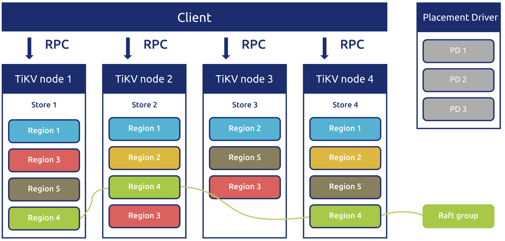
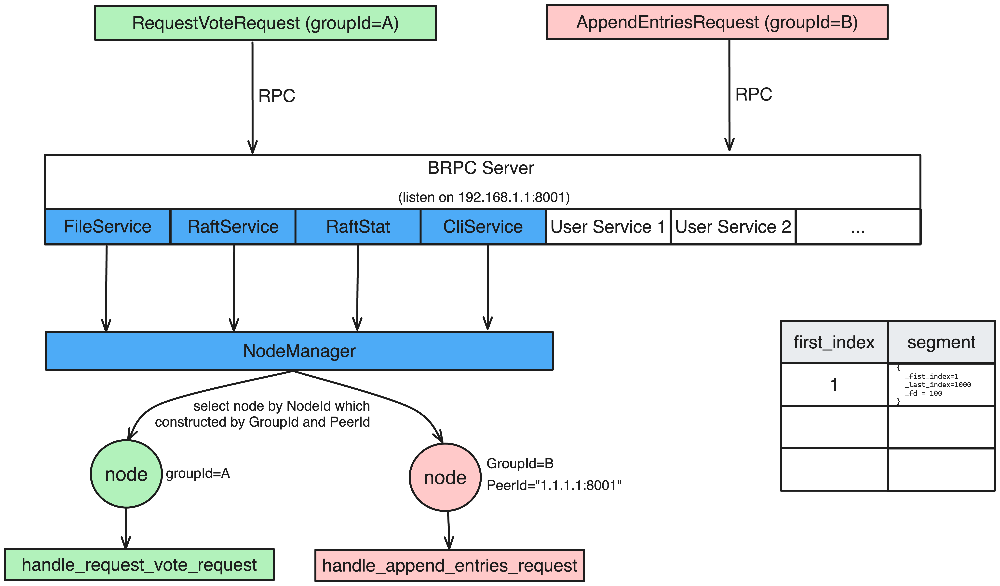

multi-raft
===

作用是啥





GroupId
---

PeerId
---
如果要将三副本放在同一个进程内，需要将 index 作为 PeerId 的一部分，这样才能保证每个副本的唯一性。

```cpp
void RaftServiceImpl::append_entries(google::protobuf::RpcController* cntl_base,
                            const AppendEntriesRequest* request,
                            AppendEntriesResponse* response,
                            google::protobuf::Closure* done) {
    brpc::ClosureGuard done_guard(done);
    brpc::Controller* cntl =
        static_cast<brpc::Controller*>(cntl_base);

    PeerId peer_id;
    if (0 != peer_id.parse(request->peer_id())) {
        cntl->SetFailed(EINVAL, "peer_id invalid");
        return;
    }

    scoped_refptr<NodeImpl> node_ptr =
                        global_node_manager->get(request->group_id(), peer_id);
    NodeImpl* node = node_ptr.get();
    if (!node) {
        cntl->SetFailed(ENOENT, "peer_id not exist");
        return;
    }

    return node->handle_append_entries_request(cntl, request, response,
                                               done_guard.release());
}
```

* 每个 Node 有用独立的配置，包括 Log 等等

