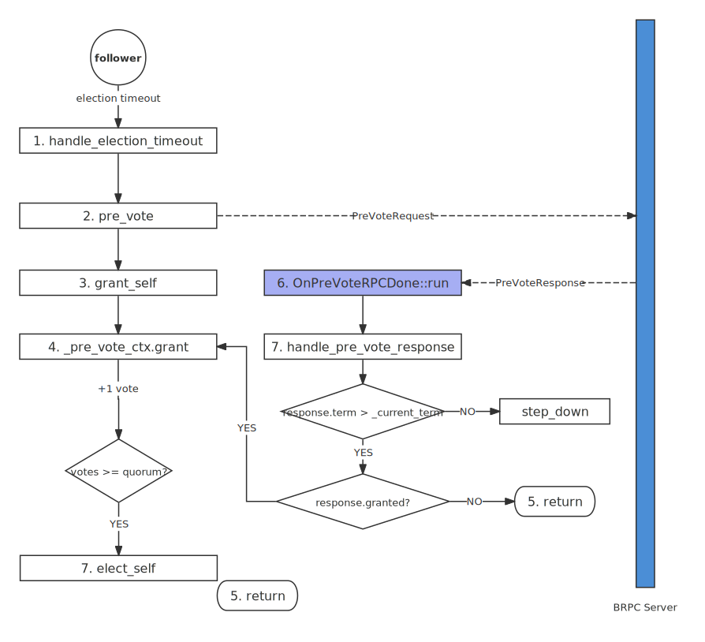
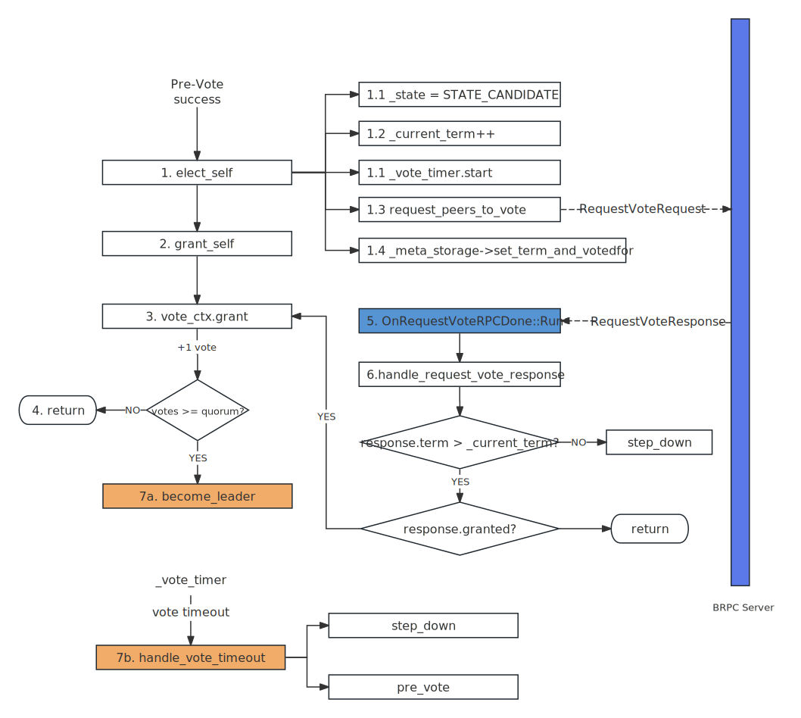

整体概览
===

选举流程
---

1. 节点在选举超时（`election_timeout`）时间内未收到任何心跳而触发选举
2. 向所有节点广播 `PreVote` 请求，若收到大多数赞成票则进行正式选举，否则重新等待选举超时
3. 将自身角色转变为 `Candidate`, 并将自身 `Term` 加一，向所有节点广播 `RequestVote` 请求
4. 在投票超时（`vote_timeout`）时间内若收到足够多的选票则成为 `Leader`，若有收到更高 `Term` 的响应则转变为  `Follower` 并重复步骤 1；否则等待投票超时后转变为 `Follower` 并重复步骤 2
5. 成为 Leader
    * 5.1 将自身角色转变为 `Leader`
    * 5.2 对所有 `Follower` 定期广播心跳
    * 5.3 通过提交一条本任期的配置日志来提交上一任期的日志，并回放这些日志来恢复状态机
    * 5.4 回调用户状态机的 `on_leader_start`
6. 至此，Leader 可以正式对外服务

上述流程可分为 PreVote (1-2)、RequestVote (3-4)、成为 Leader（5-6）这三个阶段

投票规则
---

在同一任期内，节点发出的 `PreVote` 和 `RequestVote` 的请求是一样的，区别在于`PreVote` 中的 `Term` 自身的 `Term+1`，而

节点对于 `RequestVote` 请求投赞成票需要同时满足以下 3 个条件：

* Term: 请求中的 `Term` 要大于或等于当前节点的 `Term`
* LastLogId: 请求中的 `LastLogId` 要大于或等于当前节点的 `LastLogId`<sup>[1]</sup>
* votedFor:

唯一的区别在于：

* 节点可以对多个

* `RequestVote` 会记录 `votedFor`，确保在同一个任期内只会给一个候选人投票，而 `PreVote` 则可以同时投票给多个候选人，只要其满足以上 2 个条件 // 补充不会投给其他人
* `RequestVote` 若发现请求中的 `Term` 比自身的大，会 `step_down` 成 Follower，而 `PreVote` 则不会，这点可以确保不会在 Pre-Vote 打断当前 Leader

从以上差异可以看出，`PreVote` 更像是一次预检，检测其连通性和合法性，并没有实际的动作。

> [1] LogId 的比较
>
> LogId 由 Log 的 Term 和 Index 组成，对于 2 个 LogId 来说：
> * 若 `a.Term == b.Term`，则 `a == b`
> * 若 `(a.Term > b.Term) || (a.Term == b.Term && a.Index > b.Index)`，则 `a > b`

一些关键点
---

* `PreVote` 请求中的 Term
* `<currentTerm, votedFor>` 会持久化，这是确保在同一个 Term 内只会产生一个 Leader 的关键
* braft 中成为 Leader 后提交本任期内的第一条日志是配置日志，并非 `NO-OP`
* `CommitIndex` 并不会持久化，Leader 在上述流程中的 5.3 中确认，Follower 则在之后的心跳中由 Leader 传递，只有确认了 `CommitIndex` 后才能开始回放日志

相关 RPC
---

```proto
message RequestVoteRequest {
    required string group_id = 1;
    required string server_id = 2;
    required string peer_id = 3;
    required int64 term = 4;
    required int64 last_log_term = 5;
    required int64 last_log_index = 6;
    optional TermLeader disrupted_leader = 7;
};

message RequestVoteResponse {
    required int64 term = 1;
    required bool granted = 2;
    optional bool disrupted = 3;
    optional int64 previous_term = 4;
    optional bool rejected_by_lease = 5;
};

service RaftService {
    rpc pre_vote(RequestVoteRequest) returns (RequestVoteResponse);
    rpc request_vote(RequestVoteRequest) returns (RequestVoteResponse);
    ...
}
```


阶段一：PreVote
===



触发投票
---

节点在初始化就会启动选举定时器：

```cpp
int NodeImpl::init(const NodeOptions& options) {
    ...
    // 只有当前节点的集群列表不为空，才会调用 step_down 启动选举定时器
    if (!_conf.empty()) {
        step_down(_current_term, false, butil::Status::OK());
    }
    ...
}

void NodeImpl::step_down(const int64_t term, bool wakeup_a_candidate,
                         const butil::Status& status) {
    ...
    _election_timer.start();
}
```

待定时器超时后就会调用 `pre_vote` 进行预投票：

```cpp
// 定时器超时的 handler
void ElectionTimer::run() {
    _node->handle_election_timeout();
}

void NodeImpl::handle_election_timeout() {
    ...
    reset_leader_id(empty_id, status);

    return pre_vote(&lck, triggered);
    // Don't touch any thing of *this ever after
}
```

发送 `PreVote` 请求
---

在 `pre_vote` 函数中会对所有节点发送 `PreVote` 请求，并设置 RPC 响应的回调函数为 `OnPreVoteRPCDone`， 最后 调用 `grant_slef` 给自己投一票，之后就进入等待：

```cpp
void NodeImpl::pre_vote(std::unique_lock<raft_mutex_t>* lck, bool triggered) {

    const LogId last_log_id = _log_manager->last_log_id(true);

    _pre_vote_ctx.init(this, triggered);
    std::set<PeerId> peers;
    _conf.list_peers(&peers);

    for (std::set<PeerId>::const_iterator
            iter = peers.begin(); iter != peers.end(); ++iter) {
        ...
        OnPreVoteRPCDone* done = new OnPreVoteRPCDone(
                *iter, _current_term, _pre_vote_ctx.version(), this);
        ...
        done->request.set_term(_current_term + 1); // next term
        done->request.set_last_log_index(last_log_id.index);
        done->request.set_last_log_term(last_log_id.term);

        RaftService_Stub stub(&channel);
        stub.pre_vote(&done->cntl, &done->request, &done->response, done);
    }
    grant_self(&_pre_vote_ctx, lck);
}
```

处理 `PreVote` 请求
---

其他节点在收到 `PreVote` 请求后会调用 `handle_pre_vote_request` 处理请求：

```cpp
int NodeImpl::handle_pre_vote_request(const RequestVoteRequest* request,
                                      RequestVoteResponse* response) {
    ...
    do {
        // (1) 判断 Term
        if (request->term() < _current_term) {
            ...
            break;
        }

        // (2) 判断 LastLogId
        ...
        LogId last_log_id = _log_manager->last_log_id(true);
        ...
        bool grantable = (LogId(request->last_log_index(), request->last_log_term())
                        >= last_log_id);
        if (grantable) {
            granted = (votable_time == 0);
        }
        ...
    } while (0);

    // (3) 设置响应
    ...
    response->set_term(_current_term);
    response->set_granted(granted);  //
    ...

    return 0;
}

```

处理 `PreVote` 响应
---

在收到其他节点的 `PreVote` 响应后，会回调之前设置的 callback `OnPreVoteRPCDone->Run()`，在 callback 中会调用 `handle_pre_vote_response` 处理 `PreVote` 响应：

```cpp
struct OnPreVoteRPCDone : public google::protobuf::Closure {
    ...
    void Run() {
            if (cntl.ErrorCode() != 0) {
                ...
                break;
            }
            node->handle_pre_vote_response(peer, term, ctx_version, response);
    }
    ...
};
```

处理 `PreVote` 响应：
```cpp

```

`Pre-Vote` 阶段失败
---


阶段二：`RequestVote`
===



发送 RequestVote 请求
---

当 PreVote 阶段获得大多数节点的支持后，将调用 `elect_self` 正式进 *RequestVote* 阶段。在 `elect_self` 会将角色转变为 Candidte，并加自身的 Term + 1，向所有的节点发送 `RequestVote` 请求，最后给自己投一票后，等待其他节点的 `RequestVote` 响应：

```cpp
void NodeImpl::elect_self(std::unique_lock<raft_mutex_t>* lck,
                          bool old_leader_stepped_down) {
    ...

    _state = STATE_CANDIDATE;  //
    _current_term++;           // 将自身的 Term+1
    _voted_id = _server_id;    // 记录 votedFor 投给自己

    ...
    // 启动投票超时器：如果在 vote_timeout 未得到足够多的选票，则变为 Follower 重新进行 PreVote
    _vote_timer.start();

    const LogId last_log_id = _log_manager->last_log_id(true);

    _vote_ctx.set_last_log_id(last_log_id);

    std::set<PeerId> peers;
    _conf.list_peers(&peers);
    request_peers_to_vote(peers, _vote_ctx.disrupted_leader());

    // 持久化 votedFor
    status = _meta_storage->
                    set_term_and_votedfor(_current_term, _server_id, _v_group_id);
    grant_self(&_vote_ctx, lck);
}
```

处理 RequestVote 请求
---

处理 RequestVote 响应
---

投票超时
---

如果在投票超时时间内，  ``

```cpp
```

阶段三：成为 *Leader*
===
