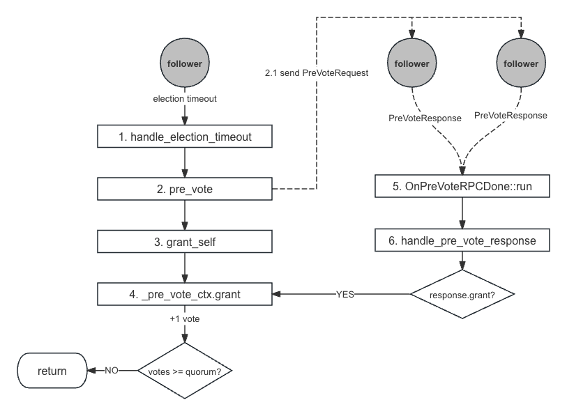

TODO

同一个节点在一个 term 内只能投票给一个人？ 会不会出现瓜分选票的情况？

整体流程
===


节点在收到 *Pre-Vote* 和 *Vote* 请求后，判断是否要投赞成票的逻辑是一样的，需要同时满足以下 2 个条件：

* **Term**: `request.term >= currentTerm`
* **Log**: `request.lastLogTerm > lastLogTerm` 或者 `request.lastLogTerm == lastLogTerm && request.lastLogIndex >= lastLogIndex`

唯一的区别在于：

* *Vote* 会记录当前任期，确保在同一个任期内只会给一个候选人投票，而 `Pre-Vote` 则可以同时投票给多个候选人，只要其满足以上 2 个条件
* `step_down`

从差异可以看出，*Pre-Vote* 更像是一次预检，检测其连通性和合法性，并没有实际的动作。


*p*
看代码画一张流程图，leader 和 follower 分别（上下）



在成为 *Leader* 后，主要做这几件事：

* 通过发送空的 *AppendEntries* 请求来确定各个 *Follower* 的 *next_index*；
* 啥时候可以服务?
* next_index 和 committed_index 是这么确认的？

阶段一：预投票
===


发起投票
---

Follower
---

处理响应
---

阶段二：请求投票
===

当 *Pre-Vote* 阶段获得大多数节点的支持后，将调用 `elect_self` 正式进 *Vote* 阶段：
* (1) 在 *elect_self* 函数中主要做以下几件事：
    * (1.1): 将自己的状态设置为 *Candidate*；
    * (1.2): 将当前的 *term* 加一；
    * (1.3): 启动 *vote* 定时器：如果在指定时间内没有收到大多数节点的投票，则重新发起投票；
    * (1.4): 对集群中的其他节点发送 *RPC* 请求 *RequestVoteRequest*
    * (1.5): 这可以保证，确保每一个节点在一个 *term* 中只能投票给；

> ***raft meta* 的持久化**
> *raft meta* 主要用来保存 `voteFor` 等数据，作用：
>
>  * 重启后不会投票给其他候选人，确保在同一个任期内只有一个主
>
> *Follower* 在
>


阶段三：成为 *Leader*
===

> **`is_leader` 与 `on_leader_start`**
>
> 仅仅依靠 `on_leader_start` 并不能完全避免 *stale read*，详见 [选主优化：leader lease]()
> applied_index


> **关于 Replicator**
> 作用有 2 个：
>
> * 做为 RPC 客户端给所有的 follower 发送各类 RPC 请求，如 `AppendEntries`、`InstallSnapshot`
>
> * 记录 *Follower* 的状态，如该 *Follower* 的 `next_index`、`last` 等

阶段四：稳定的 *Leader*
===

心跳


### 阶段三: 等待投票结果


分辨
===

* https://zhuanlan.zhihu.com/p/366661148

```
原集群commit了更多的日志，或Term增加。A重新加入集群后，由于没有足够新的日志或Term较小，它的选举请求将会被绝大多数节点拒绝。A将会在Leader节点控制下，重新成为Follower。
// 会成为 follower 吗？term 比它大？

原集群没有commit更多的日志且Term没有增加。A重新加入集群后，将可能引发集群中新一轮的选举，并产生一个新的Leader。
```

## Leader Lease

```cpp
int64_t NodeImpl::last_leader_active_timestamp(const Configuration& conf) {

}
```

> 关于 replicator
> 1. 作为客户端
> 2.


TODO
---
* lease 的作用? 如何利用其实现 follower 读？ // follower lease 吧?
* leader lease 与 follower lease 的区别？
// https://cn.pingcap.com/blog/lease-read/
* raft_enable_leader_lease
* https://github.com/baidu/braft/issues/154#issuecomment-517727551


# prevote，怎么触发选举，leader 这么降为 follower?
* leader 向心跳
* 广播？

# vote timeoout 作用

`tradeoff`

failure 的时间和

https://infocenter.sybase.com/help/index.jsp?topic=/com.sybase.infocenter.dc31654.1570/html/sag1/sag1148.htm


```cpp
int NodeImpl::init(const NodeOptions& options)
    CHECK_EQ(0, _election_timer.init(this, options.election_timeout_ms * 2));
    CHECK_EQ(0, _vote_timer.init(this, options.election_timeout_ms * 2 + options.max_clock_drift_ms));
    CHECK_EQ(0, _stepdown_timer.init(this, options.election_timeout_ms));
    CHECK_EQ(0, _snapshot_timer.init(this, options.snapshot_interval_s * 1000));
```

```cpp
void ElectionTimer::run()
    _node->handle_election_timeout();
```

```cpp
void NodeImpl::handle_election_timeout()
    return pre_vote(&lck, triggered);
```

```cpp
void NodeImpl::pre_vote(std::unique_lock<raft_mutex_t>* lck, bool triggered)
    for (std::set<PeerId>::const_iterator iter = peers.begin();
         iter != peers.end(); ++iter) {

        RaftService_Stub stub(&channel);
        stub.pre_vote(&done->cntl, &done->request, &done->response, done);
    }

    grant_self(&_pre_vote_ctx, lck);
```

```cpp
void NodeImpl::grant_self(VoteBallotCtx* vote_ctx, std::unique_lock<raft_mutex_t>* lck)
        if (vote_ctx == &_pre_vote_ctx) {
            elect_self(lck);
        } else {
            become_leader();
        }
```


```cpp
void NodeImpl::elect_self(std::unique_lock<raft_mutex_t>* lck, bool old_leader_stepped_down)

    request_peers_to_vote(peers, _vote_ctx.disrupted_leader());

```

```cpp
void NodeImpl::request_peers_to_vote(const std::set<PeerId>& peers,
                                     const DisruptedLeader& disrupted_leader)
    for (std::set<PeerId>::const_iterator
        iter = peers.begin(); iter != peers.end(); ++iter) {

        OnRequestVoteRPCDone* done =
            new OnRequestVoteRPCDone(*iter, _current_term, _vote_ctx.version(), this);

        RaftService_Stub stub(&channel);
        stub.request_vote(&done->cntl, &done->request, &done->response, done);
    }
```

```cpp
struct OnRequestVoteRPCDone : public google::protobuf::Closure {
    void Run() {
        node->handle_request_vote_response(peer, term, ctx_version, response);
    }
}
```

```cpp
void NodeImpl::handle_request_vote_response(const PeerId& peer_id, const int64_t term,
                                            const int64_t ctx_version,
                                            const RequestVoteResponse& response)
    if (response.granted()) {
        if (_vote_ctx.granted()) {
            return become_leader();
        }
    }
```


```cpp
void NodeImpl::become_leader()

    for (std::set<PeerId>::const_iterator iter = peers.begin();
         iter != peers.end(); ++iter) {

        _replicator_group.add_replicator(*iter);
    }
```

```
int ReplicatorGroup::add_replicator(const PeerId& peer)
    Replicator::start(options, &rid);

    _rmap[peer] = { rid, options.replicator_status };
```

