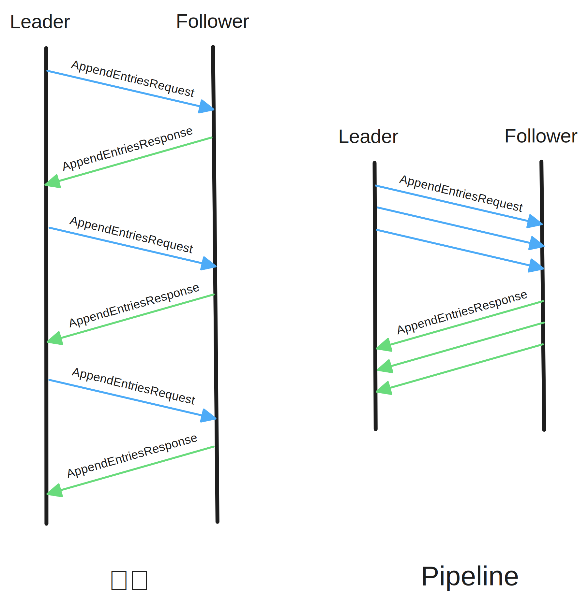

Batch
===

Pipeline
===

Append Log Parallelly
===

针对慢节点

Asynchronous Apply
===

参考
===

* [braft 性能优化](https://github.com/baidu/braft/blob/master/docs/cn/raft_protocol.md#%E6%80%A7%E8%83%BD%E4%BC%98%E5%8C%96)
* [braft 复制模型](https://github.com/baidu/braft/blob/master/docs/cn/replication.md)
* [TiKV 功能介绍 – Raft 的优化](https://cn.pingcap.com/blog/optimizing-raft-in-tikv/)
* [Raft 必备的优化手段（二）：Log Replication & others](https://zhuanlan.zhihu.com/p/668511529)
