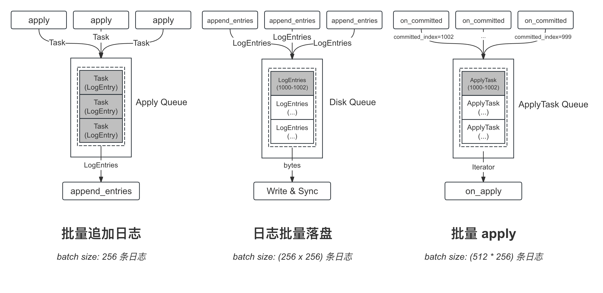

优化 1：Batch
===

介绍
---



从客户端调用 `apply` 接口提交 Task 到日志成功复制，并回调用户状态机的 `on_apply` 接口，日志依次经过了 `Apply Queue`、`Disk Queue`、`Apply Task Queue` 这 3 个队列。这些队列都是 brpc 的 [ExecutionQueue][ExecutionQueue] 实现，其消费函数都做了 `batch` 优化：

* **Apply Queue**: 用户提交的 Task 会进入该队列，在该队列的消费函数中会将这些 Task 对应的日志进行打包，并调用 `LogManager` 的 `append_entries` 函数进行追加日志。默认一次最多打包 256 条日志。
* **Disk Queue**: `LogManager` 在接收到这批日志后，需对其进行持久化处理，故会往该队列中提交一个持久化任务（一个任务对应一批日志）；在该队列的消费函数中会将这些任务进行打包，将这批任务对应的所有日志写入磁盘，并在全部写入成功后会做一次 `sync` 操作。默认一次最多打包 256 个持久化任务，而每个任务最多包含 256 条日志，所以其一次 Bacth Write 最多会写入 `256 * 256` 条日志对应的数据。
* **Apply Task Queue**：当日志的复制数（包含持久化）达到 Quorum 后，会调用 `on_committed` 往 `Apply Task Queue` 中提交一个 ApplyTask（每个任务对应一批已提交的日志）；在该队列的消费函数中会将这些 ApplyTask 打包成 `Iterator`，并作为参数回调用户状态机的 `on_apply` 函数。 默认一次最多打包 512 个 ApplyTask，而每个 ApplyTask 最多包含 256 条日志，所以每一次 `on_apply` 参数中的 `Iterator` 最多包含 `512 * 256` 条日志。

[ExecutionQueue]: https://brpc.apache.org/docs/bthread/execution-queue

> **Follower 的 Batch**
>
> 以上讨论的是节点作为 Leader 时的 Batch 优化，当节点为 Follower 时，其优化也是一样的，因为其用的是相同的代码逻辑，唯一的区别在于：
> * **Apply Queue**: Follower 不会接受用户提交的 Task，其日志来源于 Leader 的复制
> * **Disk Queue**: 日志批量落盘的逻辑是一样的，Follower 在接收到 Leader 的一批日志之后也是直接调用 `LogManager` 的 `append_entries` 函数
> * **Apply Task Queue**: 批量 apply 的逻辑是一样的，区别在于调用 `on_committed` 的时机来源于 Leader 在 RPC 中携带的 `committed_index`，并不通过自身的 Quorum 计算

实现
---

优化 2：并行 Append 日志
===


在 Raft 的实现中，

针对慢节点


优化 3：流水线复制
===


Append Log Parallelly
===


优化 4：异步 Apply
===

优化 5：raft sync
===

braft 对于每次日志落盘都会进行 `sync`，如果业务对于数据丢失的容忍度比较高，可以选择将配置项 `raft_sync` 设置为 `Flase`，这将有助于。另外值得一提的是，影响日志可靠性

控制日志，

```cpp
int Segment::sync(bool will_sync, bool has_conf) {
    if (_last_index < _first_index) {
        return 0;
    }
    //CHECK(_is_open);
    if (will_sync) {
        if (!FLAGS_raft_sync) {
            return 0;
        }
        if (FLAGS_raft_sync_policy == RaftSyncPolicy::RAFT_SYNC_BY_BYTES
            && FLAGS_raft_sync_per_bytes > _unsynced_bytes
            && !has_conf) {
            return 0;
        }
        _unsynced_bytes = 0;
        return raft_fsync(_fd);
    }
    return 0;
}
```

https://github.com/baidu/braft/issues?q=is%3Aissue+sync

参考
===

* [braft docs: 性能优化](https://github.com/baidu/braft/blob/master/docs/cn/raft_protocol.md#%E6%80%A7%E8%83%BD%E4%BC%98%E5%8C%96)
* [braft docs: 复制模型](https://github.com/baidu/braft/blob/master/docs/cn/replication.md)
* [TiKV 功能介绍 – Raft 的优化](https://cn.pingcap.com/blog/optimizing-raft-in-tikv/)
* [Raft 必备的优化手段（二）：Log Replication & others](https://zhuanlan.zhihu.com/p/668511529)
