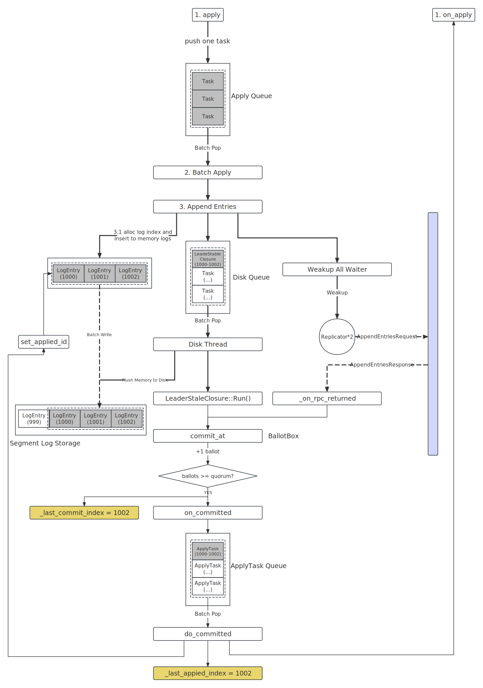

replication

简介
===

介绍下 3 大队列，`ApplyTask`

整体流程
===

Leader 侧流程
---


Follower 侧流程
---

*Follower* 接受到 *AppendEntries* 请求后，将直接调用 *LogManager* 的 `AppendEntries` 接口追加日志，除了几下几点差异，其处理流程和上图中的 *Leader* 侧流程基本一致：

*
* *Leader* 在往内存中插入日志会，后唤醒所有的 `Replicator` 给其对应的 *Follower* 发送 *AppendEntries* 请求，而 *Follower* 没有任何 *Replicator*

日志复制失败
---

```cpp
void function(op, callback) {
    braft::Task task;
    ...
    task.done = make_closure(callback);
    ...
    return _node->apply(task);
}
```

用户在构建 *task* 的时候需要指定对应的 *callback*
* 如果日志复制成功，需要用户在 `on_apply` 接口中回调 *callback*
* 如果日志复制失败，将由 *braft* 回调 *callback*，并将 *error* 信息传递给 *callback*

*braft* 在以下

客户端在调用 *apply* 的时候，如果该操作对应的日志被成功被复制并回调 `on_apply`，需要用户在 `on_apply` 接口中主动

具体实现
===

步骤一：用户提交任务
---
```cpp
#include <braft/raft.h>

...
void function(op, callback) {
    butil::IOBuf data;
    serialize(op, &data);
    braft::Task task;
    // The data applied to StateMachine
    task.data = &data;
    // Continuation when the data is applied to StateMachine or error occurs.
    task.done = make_closure(callback);
    // Reject this task if expected_term doesn't match the current term of
    // this Node if the value is not -1
    task.expected_term = expected_term;
    return _node->apply(task);
}
```

客户端需要将操作序列化成 [IOBuf][IOBuf]，并构建一个 *Task* 向 *braft::Node* 提交。

[IOBuf]: https://github.com/apache/brpc/blob/master/src/butil/iobuf.h

步骤二: 任务批处理
---

```cpp
void NodeImpl::apply(const Task& task) {
    // 构建 LogEntry
    LogEntry* entry = new LogEntry;
    entry->AddRef();
    entry->data.swap(*task.data);
    // 构建 LogEntryAndClosure
    LogEntryAndClosure m;
    m.entry = entry;
    m.done = task.done;
    m.expected_term = task.expected_term;
    if (_apply_queue->execute(m, &bthread::TASK_OPTIONS_INPLACE, NULL) != 0) {
        ...
    }
}
```

```cpp
int NodeImpl::execute_applying_tasks(void* meta,  bthread::TaskIterator<LogEntryAndClosure>& iter) {
    NodeImpl* m = (NodeImpl*)meta;
    for (; iter; ++iter) {
        if (cur_size == batch_size) {
            m->apply(tasks, cur_size);
            cur_size = 0;
        }
        tasks[cur_size++] = *iter;
    }
    ...
}
```

```cpp
void NodeImpl::apply(LogEntryAndClosure tasks[], size_t size) {
}
```

步骤三: Leader 追加日志
---

步骤四: Leader 持久化日志
---

步骤五: Leader 发送 AE
---

步骤六: Follower 处理 AE
---

步骤七: Leader 处理 AE 响应
---

步骤八: 回调 `on_apply`
---

步骤九: 收尾工作
---

其他：日志复制失败
---

```cpp
LogManager::set_applied_id()
```

* 清理内存中的日志

done 是合适被调用的， 这么判断成功和失败

具体实现
===
