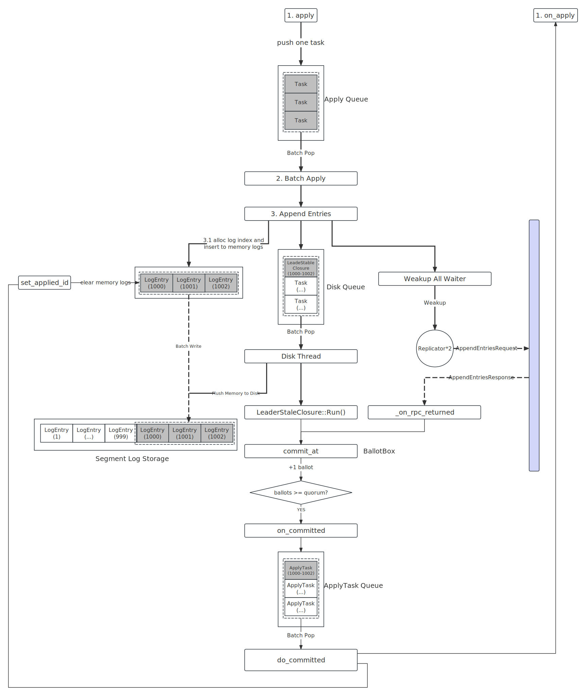

replication

简介
===

介绍下 3 大队列，`ApplyTask`

整理流程
===




步骤一：用户向 Leader 提交任务
---

步骤二: Leader 追加日志
---

步骤三: Leader 持久化日志
---

步骤四: Leader 向所有 Follower 发送 `AppendEntries` 请求
---

步骤五: Follower 处理 `AppendEntries` 请求并响应
---

步骤六: Leader 处理 `AppendEntries` 响应
---

步骤七: 回调用户状态机 `on_apply`
---

步骤八: 收尾工作
---

其他：日志复制失败
---

```cpp
LogManager::set_applied_id()
```

* 清理内存中的日志

done 是合适被调用的， 这么判断成功和失败

具体实现
===
