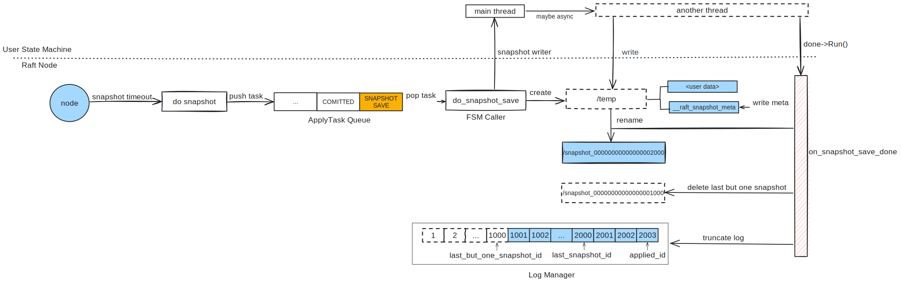

简介
===

每个节点都单独打快照（*Follower*、*Leader*）， 快照主要有 2 个作用：

* 压缩日志：
* 加速启动时间

触发条件有 2 个：
* 定时器
* 用户手动触发

整体流程
===



创建快照主要分为以下 3 个步骤：

步骤一：触发快照任务
---

节点在初始化时就已经启动了快照的 *timer*，当 *timer timeout* 时就会触发快照任务。节点会往任务队列 *ApplyQueue* 中加入一个创建快照（*SNAPSHOT_SAVE*）的任务，待队列，其主要执行以下动作：

* 首先会在用户指定的快照目录下创建一个临时目录用于保存快照数据
* 打开临时目录，生成一个 `SnapshotWriter`，并将其作为参数来回调用户实现的 `on_snapshot_save`

步骤二：用户保存快照
---

用户需要在

步骤三：收尾工作
---

`on_snapshot_save_done` 主要做以下几件事情：

* 保存 *snapshot meta* 到 `__raft_snapshot_meta` 文件中，其通过将 *proto* 文件序列化后，包括快照中所有文件的列表以及每个每个文件的 *checksum*
```proto
message SnapshotMeta {
    required int64 last_included_index = 1;  // 快照对应最后一条日志的 index
    required int64 last_included_term = 2;  // 快照对应最后一条日志的 index
    repeated string peers = 3;  // 当前集群的 peer 列表
    repeated string old_peers = 4;  // 默认为空。配置更变时，即 C{old,new}
}

enum FileSource {
    FILE_SOURCE_LOCAL = 0;
    FILE_SOURCE_REFERENCE = 1;
}

message LocalFileMeta {
    optional bytes user_meta   = 1;
    optional FileSource source = 2;
    optional string checksum   = 3;
}

message SnapshotMeta {
    required int64 last_included_index = 1;
    required int64 last_included_term = 2;
    repeated string peers = 3;
    repeated string old_peers = 4;
}

message LocalSnapshotPbMeta {
    message File {
        required string name = 1;
        optional LocalFileMeta meta = 2;
    };
    optional SnapshotMeta meta = 1;
    repeated File files = 2;
}
```

* rename
* 删除上一个快照，特别需要注意的时，每一个快照都有一个 referer，代表还有 follower 在下载这个快照
* 删除倒数第二个快照（即当前快照的前一个快照）对应的日志。考虑到仍有 *Follower* 可能仍需要，避免为了几条日志而发送快照，*braft* 并不会立即删除当前快照对应的日志，而是等到下一次快照生成时，再删除本次快照对应的日志：

```cpp
```

> **互斥的快照任务**
>
> * 当有一个创建快照任务在执行时，即使快照超时
> * 快照任务本身没有超时时间，用户的快照任务可能一直卡在那里，而不知道的情况
>

> **快照的命名**
>

具体实现
===

步骤一：触发快照任务
---

```cpp
void SnapshotTimer::run() {
    _node->handle_snapshot_timeout();
}
```

```cpp
void NodeImpl::handle_snapshot_timeout() {
}
```

```cpp
void NodeImpl::do_snapshot(Closure* done) {
    LOG(INFO) << "node " << _group_id << ":" << _server_id
              << " starts to do snapshot";
    if (_snapshot_executor) {
        _snapshot_executor->do_snapshot(done);
    } else {
        if (done) {
            done->status().set_error(EINVAL, "Snapshot is not supported");
            run_closure_in_bthread(done);
        }
    }
}
```

```cpp
void SnapshotExecutor::do_snapshot(Closure* done) {
    // check snapshot install/load
    if (_downloading_snapshot.load(butil::memory_order_relaxed)) {
        ...
        return;
    }

    // check snapshot saving?
    if (_saving_snapshot) {
        ...
        return;
    }
    _saving_snapshot = true;

    SaveSnapshotDone* snapshot_save_done = new SaveSnapshotDone(this, writer, done);
    if (_fsm_caller->on_snapshot_save(snapshot_save_done) != 0) {
    }
}
```

步骤三：收尾工作
---
```cpp
int SnapshotExecutor::on_snapshot_save_done(
    const butil::Status& st, const SnapshotMeta& meta, SnapshotWriter* writer) {

}
```

