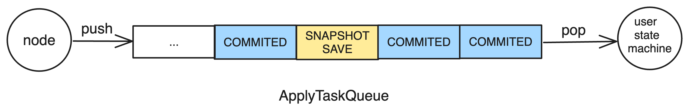

状态机调用器
===

* [整体概览](#整体概览)
* [初始化](#)

整体概览
---
功能：
    * 入队：事件触发
    * 队列消费: 调用用户实现的状态机

性能：
    * 用户在实现状态机时不要有阻塞操作
    * 串行 // batch




初始化
---

```cpp
int FSMCaller::init(const FSMCallerOptions &options) {
    ...
     _fsm = options.fsm;  // 用户自定义的状态机
    ...
    bthread::execution_queue_start(&_queue_id,
                                   &execq_opt,
                                   FSMCaller::run,
                                   this);
    ...
}
```

* (1) 保存用户自定义的状态机
* (2) 启动执行队列，执行队列的回调函数是`FSMCaller::run`

```cpp
enum TaskType {
    IDLE,
    COMMITTED,
    SNAPSHOT_SAVE,
    SNAPSHOT_LOAD,
    LEADER_STOP,
    LEADER_START,
    START_FOLLOWING,
    STOP_FOLLOWING,
    ERROR,
};
```

```cpp
int FSMCaller::run(void* meta, bthread::TaskIterator<ApplyTask>& iter) {
    FSMCaller* caller = (FSMCaller*)meta;

    for (; iter; ++iter) {
        if (iter->type == COMMITTED && counter < batch_size) {
            ...
        } else {
            switch (iter->type) {
            case COMMITTED:
                ...
            case SNAPSHOT_SAVE:
                caller->_cur_task = SNAPSHOT_SAVE;
                if (caller->pass_by_status(iter->done)) {
                    caller->do_snapshot_save((SaveSnapshotClosure*)iter->done);
                }
                break;
            case SNAPSHOT_LOAD:
                ...
    }

    if (max_committed_index >= 0) {
        caller->_cur_task = COMMITTED;
        caller->do_committed(max_committed_index);
        ...
    }
}
```

```cpp
void FSMCaller::do_committed(int64_t committed_index) {

    for (; iter_impl.is_good();) {
        Iterator iter(&iter_impl);
        _fsm->on_apply(iter);  // 调用用户实现的状态机
    }

    _log_manager->set_applied_id(last_applied_id);
}
```