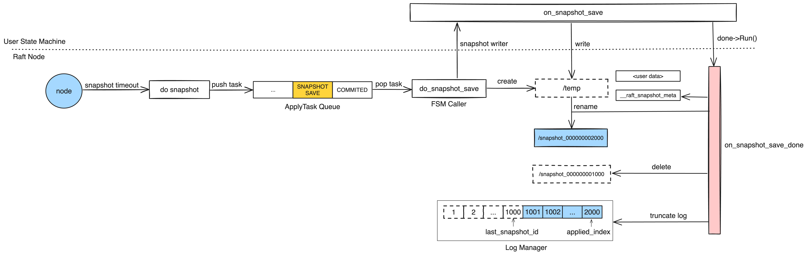

快照
===

* 简介
* 整体设计
* 整体实现
* 实现细节

### 必看：https://www.zhihu.com/people/yang-zhi-hu-65-47/posts

*

* 快照异步是不是有问题？会不会导致日志丢失？比如说快照没打成功，就把对应的日志给删除了???
* 各个 follower 各自打快照有啥问题吗？ // 选择什么时机打？如果打的时候 leader 向 follower 发送快照呢？
* raft meta 的作用
* 定时器什么时候启动的
* 快照的加载与保存流程？
* 接受 leader 的快照，本地的快照这么办？删除吗？ // 现在看是指保存一个，以 snapshot_00000000012345 命名? 为什么需要这个后缀
* 快照是否保存两份

* 什么时候会触发安装快照？
    * 一个是 leader 发现 follower 落后太多
    * 重启的时候
* follower 在接受快照的时候是不是得停止其它任务
* 是否
* raft_do_snapshot_min_index_gap // 这玩意官方文档好像没有？可以提个 PR 补充下



* `do_snapshot_save` 和其他 task 任务不同的是?
    * clouser 的调用交给用户了，不会等待 done->run 完成，允许你做异步操作

## 快照元数据信息
* 文件列表，以及每个文件对应的校验值
```proto
enum FileSource {
    FILE_SOURCE_LOCAL = 0;
    FILE_SOURCE_REFERENCE = 1;
}

message LocalFileMeta {
    optional bytes user_meta   = 1;
    optional FileSource source = 2;
    optional string checksum   = 3;
}

message SnapshotMeta {
    required int64 last_included_index = 1;
    required int64 last_included_term = 2;
    repeated string peers = 3;
    repeated string old_peers = 4;
}

message LocalSnapshotPbMeta {
    message File {
        required string name = 1;
        optional LocalFileMeta meta = 2;
    };
    optional SnapshotMeta meta = 1;
    repeated File files = 2;
}
```


# 打快照

```cpp
void SnapshotTimer::run() {
    _node->handle_snapshot_timeout();
}
```

```cpp
void NodeImpl::handle_snapshot_timeout() {
}
```

```cpp
void NodeImpl::do_snapshot(Closure* done) {
    LOG(INFO) << "node " << _group_id << ":" << _server_id
              << " starts to do snapshot";
    if (_snapshot_executor) {
        _snapshot_executor->do_snapshot(done);
    } else {
        if (done) {
            done->status().set_error(EINVAL, "Snapshot is not supported");
            run_closure_in_bthread(done);
        }
    }
}
```

```cpp
void SnapshotExecutor::do_snapshot(Closure* done) {
    // check snapshot install/load
    if (_downloading_snapshot.load(butil::memory_order_relaxed)) {
        ...
        return;
    }

    // check snapshot saving?
    if (_saving_snapshot) {
        ...
        return;
    }
    _saving_snapshot = true;

    SaveSnapshotDone* snapshot_save_done = new SaveSnapshotDone(this, writer, done);
    if (_fsm_caller->on_snapshot_save(snapshot_save_done) != 0) {
    }
}
```

```cpp
int SnapshotExecutor::on_snapshot_save_done(
    const butil::Status& st, const SnapshotMeta& meta, SnapshotWriter* writer) {

}
```

安装快照
---

```proto
message SnapshotMeta {
    required int64 last_included_index = 1;
    required int64 last_included_term = 2;
    repeated string peers = 3;
    repeated string old_peers = 4;
}

message InstallSnapshotRequest {
    required string group_id = 1;
    required string server_id = 2;
    required string peer_id = 3;
    required int64 term = 4;
    required SnapshotMeta meta = 5;
    required string uri = 6;  // remote://ip:port/reader_id
};

message InstallSnapshotResponse {
    required int64 term = 1;
    required bool success = 2;
};
```

```cpp
void RaftServiceImpl::install_snapshot(google::protobuf::RpcController* cntl_base,
                              const InstallSnapshotRequest* request,
                              InstallSnapshotResponse* response,
                              google::protobuf::Closure* done) {
    ...
    node->handle_install_snapshot_request(cntl, request, response, done);
}
```

```cpp
void NodeImpl::handle_install_snapshot_request(brpc::Controller* cntl,
                                    const InstallSnapshotRequest* request,
                                    InstallSnapshotResponse* response,
                                    google::protobuf::Closure* done) {
    ...
    clear_append_entries_cache();
    ...
    return _snapshot_executor->install_snapshot(
            cntl, request, response, done_guard.release());
}
```

```cpp
void SnapshotExecutor::install_snapshot(brpc::Controller* cntl,
                                        const InstallSnapshotRequest* request,
                                        InstallSnapshotResponse* response,
                                        google::protobuf::Closure* done) {
    ...
    return load_downloading_snapshot(ds.release(), meta);
}
```

```cpp
int SnapshotExecutor::register_downloading_snapshot(DownloadingSnapshot* ds) {
    ...
    if (_saving_snapshot) {
        LOG(WARNING) << "Register failed: is saving snapshot.";
        ds->cntl->SetFailed(EBUSY, "Is saving snapshot");
        return -1;
    }

    ...

    DownloadingSnapshot* m = _downloading_snapshot.load(
            butil::memory_order_relaxed);
    if (!m) {
        _downloading_snapshot.store(ds, butil::memory_order_relaxed);
        _cur_copier = _snapshot_storage->start_to_copy_from(ds->request->uri());
    }
}
```

```cpp
SnapshotCopier* LocalSnapshotStorage::start_to_copy_from(const std::string& uri) {
    if (copier->init(uri) != 0) {  // copier: LocalSnapshotCopier
    }

    copier->start();
    return copier;
}
```

```cpp
int LocalSnapshotCopier::init(const std::string& uri) {
    return _copier.init(uri, _fs, _throttle);  // _copier: RemoteFileCopier
}
```

```cpp
int RemoteFileCopier::init(const std::string& uri, FileSystemAdaptor* fs,
        SnapshotThrottle* throttle) {
}
```

```cpp
void LocalSnapshotCopier::start() {
    if (bthread_start_background(
                &_tid, NULL, start_copy, this) != 0) {
        PLOG(ERROR) << "Fail to start bthread";
        copy();
    }
}
```

```cpp
void LocalSnapshotCopier::copy() {
    do {
        load_meta_table();
        if (!ok()) {
            break;
        }
        filter();
        if (!ok()) {
            break;
        }
        if (!_copy_file) {
            break;
        }
        std::vector<std::string> files;
        _remote_snapshot.list_files(&files);
        for (size_t i = 0; i < files.size() && ok(); ++i) {
            copy_file(files[i]);
        }
    } while (0);
    if (!ok() && _writer && _writer->ok()) {
        LOG(WARNING) << "Fail to copy, error_code " << error_code()
                     << " error_msg " << error_cstr()
                     << " writer path " << _writer->get_path();
        _writer->set_error(error_code(), error_cstr());
    }
    if (_writer) {
        // set_error for copier only when failed to close writer and copier was
        // ok before this moment
        if (_storage->close(_writer, _filter_before_copy_remote) != 0 && ok()) {
            set_error(EIO, "Fail to close writer");
        }
        _writer = NULL;
    }
    if (ok()) {
        _reader = _storage->open();
    }
}
```

# 加载快照

```cpp
void SnapshotExecutor::load_downloading_snapshot(DownloadingSnapshot* ds,
                                                 const SnapshotMeta& meta) {
    _snapshot_storage->close(_cur_copier);
    ...
    InstallSnapshotDone* install_snapshot_done =
            new InstallSnapshotDone(this, reader);
    int ret = _fsm_caller->on_snapshot_load(install_snapshot_done);
}
```

## 收尾工作

```cpp
void InstallSnapshotDone::Run() {
    _se->on_snapshot_load_done(status());
    delete this;
}

void SnapshotExecutor::on_snapshot_load_done(const butil::Status& st) {
    if (st.ok()) {
        _last_snapshot_index = _loading_snapshot_meta.last_included_index();
        _last_snapshot_term = _loading_snapshot_meta.last_included_term();
        _log_manager->set_snapshot(&_loading_snapshot_meta);
    }

    ...
    if (m) {
        // Respond RPC
        if (!st.ok()) {
            m->cntl->SetFailed(st.error_code(), "%s", st.error_cstr());
        } else {
            m->response->set_success(true);
        }
        m->done->Run();
        delete m;
    }
}
```

```cpp
void LogManager::set_snapshot(const SnapshotMeta* meta) {
    ...
    _last_snapshot_id.index = meta->last_included_index();
    _last_snapshot_id.term = meta->last_included_term();
    if (_last_snapshot_id > _applied_id) {
        _applied_id = _last_snapshot_id;
    }
}
```

```cpp
int LocalSnapshotStorage::close(SnapshotWriter* writer_base,
                                bool keep_data_on_error) {

     do {
        ret = writer->sync();

        ...

        // rename temp to new
        std::string temp_path(_path);
        temp_path.append("/");
        temp_path.append(_s_temp_path);
        std::string new_path(_path);
        butil::string_appendf(&new_path, "/" BRAFT_SNAPSHOT_PATTERN, new_index);

        if (!_fs->delete_file(new_path, true)) {
            ...
        }

        if (!_fs->rename(temp_path, new_path)) {
            ...
        }

        ...
        ref(new_index);
        {
            BAIDU_SCOPED_LOCK(_mutex);
            CHECK_EQ(old_index, _last_snapshot_index);
            _last_snapshot_index = new_index;
        }
        // unref old_index, ref new_index
        unref(old_index);
    } while (0);
}
```

```cpp
void LocalSnapshotStorage::unref(const int64_t index) {
    std::unique_lock<raft_mutex_t> lck(_mutex);
    std::map<int64_t, int>::iterator it = _ref_map.find(index);
    if (it != _ref_map.end()) {
        it->second--;

        if (it->second == 0) {
            _ref_map.erase(it);
            lck.unlock();
            std::string old_path(_path);
            butil::string_appendf(&old_path, "/" BRAFT_SNAPSHOT_PATTERN, index);
            destroy_snapshot(old_path);
        }
    }
}
```

```cpp
int LocalSnapshotStorage::destroy_snapshot(const std::string& path) {
    LOG(INFO) << "Deleting "  << path;
    if (!_fs->delete_file(path, true)) {
        LOG(WARNING) << "delete old snapshot path failed, path " << path;
        return -1;
    }
    return 0;
}
```
