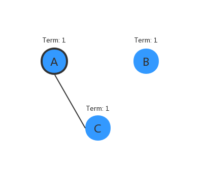
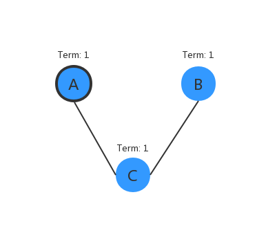
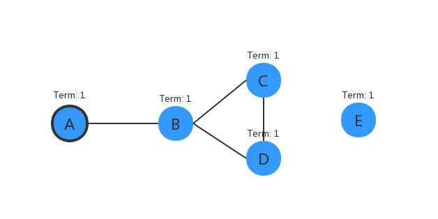

# 百问 raft

Raft 算法中一些需要琢磨思考的问题, 希望通过思考这些问题能加深对 raft 的理解

参考
====
[Raft 笔记(四) – Leader election](https://youjiali1995.github.io/raft/etcd-raft-leader-election/)

问题
====

|     | #   | Question                                       | Tag  |
| --- | --- | ---------------------------------------------- | ---- |
|     | 3   | [阐述 raft 日志的提交流程?][20191003b]         |      |
|     | 2   | [选主成功后为什么会添加一条空日志?][20191003a] |      |
|     | 1   | [三问 raft 选主?][20190927a]                   | 选主 |

[20190927a]: #1-三问-raft-选主?
[20191003a]: #2-选主成功后为什么会添加一条空日志?
[20191003b]: #3-


---

#### 1. 三问 raft 选主?

以下是关于在网络分区、脑裂等情况下, raft 选取 leader 所面临的一些问题, 以及相关论文给出的解决方案

> 以下图示中, 任意两个节点之间有连线表示这两个节点之间网络互相连通, 否则为互不连通 <br>
> 我们假设在选举期间不存在 append 日志的操作, 包括空内容日志 </br>
> 我们简称节点 A 为 A, 节点 B 为 B, 以此类推

#### 情况 1:

* (一) 如下图所示, A 成为 leader 后, 并与 B、C (follower) 完整同步完日志之后, B 与 A、C 的网络不再连通, 形成网络分区
* (二) B 由于无法收到 A 的心跳, 选举时间超时后, 则增加自己的 Term (Term 加一) 变成 candidate 参加选举, 由于无法获得一半以上的选票, 致使 B 竞选失败, 从而又转变为 follower
* (三) B 不断重复步骤二, 致使自己的 Term 不断增大
* (四) 当网络恢复后 (即 B 与 A、C 的网络重新连通), 由于 B 的 Term 过大, 导致当 A(leader) 发送心跳或者日志后, 收到 B 的回复时, 发现 B 的 Term 比自己的 Term 大, 致使 A 转变为 follower, 从而导致 leader 的重新选举, 而 leader 的重新选举则会造成一段时间的数据不可用



**Q**: 针对这种网络分区导致分区中的节点 Term 不断增加, 而当网络恢复后, 分区中的节点重新加入原有集群, 由于 Term 过大造成原有集群重新选举, 从而造成一段时间的数据不可用, raft 如果优化?

**A**:

#### 情况 2:

* (一) 如下图所示, A 成为 leader 后, 并与 B、C (follower) 完整同步完日志之后, B 与 A 的网络不再连通 (但与 C 的网络仍保持连通), 即 (A、C) (B、C) 网络连通
* (二) B 由于无法收到 A 的心跳, 选举时间超时后, 则增加自己的 Term (Term 加一) 变成 candidate 参加选举, 由于 B 仍与 C 连通, 所以 B 可以获得一半以上的选票, 从而竞选成功, 转变为 leader
* (三) 而 A 由于无法收到 B 的心跳, 此时仍是 leader, 而当 A 发送心跳或者日志给 C 后, 收到 C 的回复时, 发现 C 的 Term 比自己的 Term 大 (C 由于在步骤二中成为 B 的 follower, Term 已等于 B 的 Term), 致使 A 转变为 follower (A 成为 follower 后, Term 则等同于 B 的 Term), 而成为 follower 的 A 由于在选举超时时间内一直无法收到 B 的心跳, 则增加自己的 Term (Term 加一) 变成 candidate, 而 A 仍与步骤二中的 B 一样, 依旧能竞选成为, 转变为 leader
* (四) 网络的特殊性导致步骤二与步骤三不断交替执行, A 与 B 不断交替成为 leader, 甚至会出现在短时间存在两个 leader 的情况



**Q**: 针对以上描述的情况,

**A**:

* **情况 3:**



---

#### 2. 选主成功后为什么会添加一条空日志?

3. 如果没有 propose 处理, follower 如何更新 commit?
比如得靠 heartbeat 吗？heartbeat 我认为时间太长了

4. 投票时的提交是 is_up_to_date, 为什么不是 commited?


# 源码阅读 (01): 百问 raft

目录
====

* [问题](#问题)
* [备注](#备注)

问题
====

* [raft协议应用方面的疑问？](https://www.zhihu.com/question/54997169)
* [raft 协议的一些思考](http://hexiecs.com/2018/12/02/Raft%E5%8D%8F%E8%AE%AE%E7%9A%84%E4%B8%80%E4%BA%9B%E6%80%9D%E8%80%83/)
* [Raft 笔记(四) – Leader election](https://youjiali1995.github.io/raft/etcd-raft-leader-election/)
* 关于多 leader?
* [深入浅出etcd/raft —— 0x03 Raft选举](https://blog.mrcroxx.com/posts/code-reading/etcdraft-made-simple/3-election/)

备注
====

```
pre-vote 是防止 term 不断增大, 造成不断选主,
因为 pre-vote 不会增加自己的 term (当前发送出去的 term 是 term + 1)
```


问题
====

* [ ]
*
```
leader 发送心跳时会不会收到有 follower 的 term 已经大于当前 leader 的 term 了,
此时 leader 会变成 follower 吗？
// 是会变成 follower 的，handle_message_term 对任何角色都有效

还是通过 `check_quorum` 或者 `pre_vote` 将自己降为 follower?

如果是通过配置 `check_quorum` 或者 `pre_vote` 才能感知到,
那么如果没开启呢? leader 是不是永远都不会降为 follower
```

* [ ] leader 是否拥有所有的最高权限, 比如:
  * [ ] 当 leader 发送日志给 follower 时, 尽管 follower 的日志和 leader 不同, 也要按照 leader 来, 包括裁剪原来的日志?

* [ ] 重点思考当 leader 挂机后的情况?

* [ ] 2PC 是不是指 commit/apply 2 个阶段?

备注
====

* 尝试从以下几个方面理清 raft 协议,
* 关于 prevote
```
如果一个follower因为网络的原因而导致选举超时时间内都没有收到来自leader的心跳包
以为leader挂了，于是term+1，开始新一轮选举，
而实际上其他的follower可以感知到leader的存在
此时会因为收到term大点的candidate，而导致投票选举出新的leader，原来的leader退回follower

Raft 原论文 9.6 节中提出了 Prevote 算法：在选举前可以选询问其他节点是否愿意参与选举，
如果节点能够感知到领导人的心跳，那么它就不会参与选举，否则参与选举。
只有过半的节点参与选举，才能开始下一届领导人选举。
```

每个节点拥有的东西
--------------

 * term
 * 日志 entries

每个节点要做的事情只有 3 个
-----------------------

* 发送信息 - 主动行为
    * 选举
    * leader 发送心跳
    * leader 发送日志

* 接收信息
  * 处理自己的身份 (leader、candidate、follower)

| 当前身份  | 信息来源身份 | 信息内容 | 处理 | 特别说明       |
| --------- | ------------ | -------- | ---- | -------------- |
| leader    | leader       |          |      | 该情况不会出现 |
|           | candidate    |          |      |                |
|           | follower     |          |      |                |
| candidate |              |          |      |                |
| follower  |              |          |      |                |

  * 处理日志

* 回应信息 - 被动行为

---

> Q: 为什么需要 heartbeat_tick < election_tick?

因为如果 heartbeat_tick >= election_tick, 那么 leader 还没发送心跳, follower 就开始选主了

> Q: 消息有哪几种类型?

| 消息          | 说明                             | 对应回应           |
| ------------- | -------------------------------- | ------------------ |
| MSG_HUP       | 本地消息, 用于选举               |                    |
| MSG_BEAT      | 本地消息, 用于 leader 广播心跳包 |                    |
| MSG_PROPOSE   |                                  |                    |
| MSG_APPEND    |                                  | MSG_APPEND_RESP    |
| MSG_VOTE      |                                  | MSG_VOTE_RESP      |
| MSG_PRE_VOTE  |                                  | MSG_PRE_VOTE_RESP  |
| MSG_SNAPSHOT  |                                  |                    |
| MSG_HEARTBEAT |                                  | MSG_HEARTBEAT_RESP |

    MSG_UNREACHABLE",
    MSG_SNAPSHOT_STATUS",
    MSG_CHECK_QUORUM",
    MSG_TRANSFER_LEADER",
    MSG_TIMEOUT_NOW",
    MSG_READ_INDEX",
    MSG_READ_INDEX_RESP",

> prevote 的作用

        +---+           +---+
        | A |           | B |
        +---+           +---+
                         /
                        /
                +---+  /
                | C |/
                +---+
